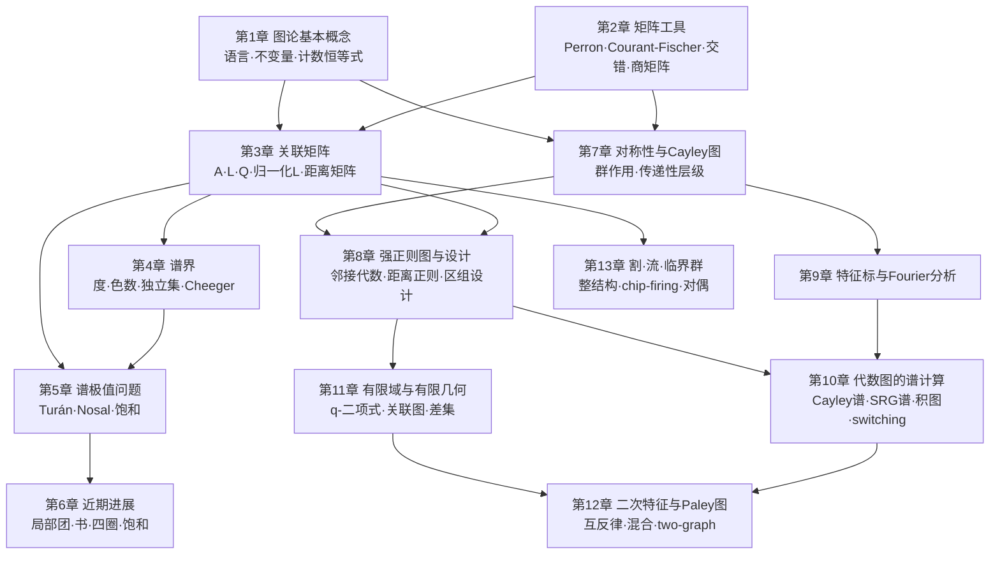

# 代数图论课程知识点梳理

> 依据讲义：Lele Liu, *Algebraic Graph Theory* (Lecture Notes), Anhui University, 2026-09-17（158 页，13 章 + 参考文献）
> 本文按章梳理知识点，说明每个定义/定理/命题的**提出动机与思考过程**，讲清它们之间以及章与章之间的**连贯性**，并在每章末给出**小结**。
> 配套文件：`第8章课程讲义_强正则图与设计.md`（第 8 章授课用详细讲义）。

---

## 0. 课程总览：一条主线，两个方向，三种语言

### 0.1 讲义的整体设计

讲义开篇就点明代数图论的研究对象与方法：

> 代数图论通过**自然附着于图上的代数对象**——矩阵、多项式恒等式、置换群、有限域、模——来研究图。这个学科特别有回报，因为信息在**两个方向**上流动：线性代数可以迫使图具有某种组合结构；而高度对称的图又可以为抽象代数现象提供具体模型。

全书据此分为两部分：

- **Part I 谱图论（第 1–6 章）**：先复习图论与矩阵工具，再依次研究邻接矩阵、Laplacian、无符号 Laplacian、归一化 Laplacian、距离矩阵；然后用**变分原理**与**交错不等式**导出关于度、染色、独立集、连通性、极值子图的界。贯穿问题是：**谱记住了图的什么？**
- **Part II 代数图论（第 7–13 章）**：转向图的对称性与代数构造。群作用 → Cayley 图 → 顶点传递图 → 强正则图 → 关联结构；有限交换群上的 Fourier 分析给出统一对角化手段；有限域与射影几何产出设计图与 Paley 图；最后与伪随机性、Seidel switching、割/流空间、生成树、临界群相接。

讲义明确说明其组织参照 Godsil–Royle《Algebraic Graph Theory》的主题（群作用、高度正则图、关联矩阵、特征标、有限几何、整割–流结构），但顺序按本课程调整，且证明自足。

### 0.2 三部分之间的耦合关系

讲义强调："两部分并非独立：第一部分的矩阵方法成为第二部分代数图族的计算工具。" 具体的耦合点在正文中反复出现：

| Part I 的工具 | 在 Part II 的兑现 |
| --- | --- |
| 等分划与商矩阵（2.6） | 群轨道划分等分（Prop 7.1.1）、Perron 向量在轨道上常值（Prop 5.2.1）、Godsil–McKay switching（Thm 10.9.1） |
| Cauchy 交错（Thm 2.3.1） | 商矩阵谱交错（Thm 2.6.1）、Wilf 界（Thm 4.1.2）、惯性界（Thm 4.6.2） |
| Perron–Frobenius（Thm 2.1.1） | 连通正则图 $d$ 是单重特征值（Thm 8.2.1）、摄动定理（Thm 4.4.1–4.4.5） |
| 二部块矩阵与奇异值（Prop 2.10.1） | 关联图谱（Cor 8.5.1）、设计图谱（Thm 10.5.1）、bi-Cayley 谱（Thm 10.2.1） |
| 谱矩与 $A^k$ 计数（Prop 1.5.2, 3.1.1） | $A^2$ = 公共邻居数 ⟹ 强正则矩阵恒等式（Thm 8.2.1） |
| 边计数/展开性（Thm 4.5.1） | Paley 混合界（Thm 12.5.1） |
| Matrix-Tree（Thm 3.9.2） | 整版本与临界群（Thm 13.3.1, Prop 13.4.1） |

### 0.3 章节依赖图

### 0.4 三种反复出现的"语言"

阅读全书时，注意同一件事被翻译成三种语言，这正是"代数图论"的方法论：

1. **组合语言**：公共邻居数、直径、围长、差集、生成树。
2. **矩阵语言**：$A^2=(d-c)I+(a-c)A+cJ$、$NN^{\top}=(r-\lambda)I+\lambda J$、$L=BB^{\top}$。
3. **谱/算术语言**：三个不同特征值、重数整性、Smith 标准形。

全书最漂亮的时刻，都是"三种语言同时对上"的时刻，例如：
- 强正则 ⟺ 恰三个不同特征值（Thm 8.2.2 与 Thm 10.3.1）；
- 重数整性 ⟹ Hoffman–Singleton 定理与友谊定理（Thm 10.4.1, 10.4.2）；
- $|\mathcal K(X)|=\det L_q=\tau(X)=\frac1n\prod_{i\ge2}\mu_i$（Prop 13.4.1 + Cor 13.3.1）。

---

# Part I 谱图论

## 第 1 章 图论基本概念

### 1.1 本章定位

这不是简单的"复习章"，而是**建立字典**：把后面所有谱论证需要的组合量（度、公共邻居、闭游走、割、体积）一次性定义好，并给出它们之间的**计数恒等式**。这些恒等式在第 3 章会被"谱化"成谱矩公式。

讲义对本章不变量的分类很有指导性：

> 前两个（色数 $\chi$、独立数 $\iota$）度量图的**自由度**，中间两个（直径、围长）度量图的**大小**，最后一个（等周常数 $\beta$）度量图的**连通性**。

### 1.2 知识点清单

**1.1 基本概念**
- 图 $G=(V,E)$，约定**有限、无向、简单**；阶 $n=|V|$，边数 $m=|E|$；邻接 $u\sim v$，度 $d(v)$，$k$-正则。
- 游走 / 路 / 圈 / 闭游走；连通、距离 $\mathrm{dist}$、直径。
- 标准图族：$K_n$（$n-1$ 正则）、$C_n$（2 正则）、$Q_n$（$2^n$ 点、$n$ 正则）、Petersen 图（5 元集的 2 元子集为顶点，**不相交**为边；3 正则 10 点，"最小的有趣图"）、星、轮、风车、路；$K_2$ 作为退化情形。
- 树 $T_{d,R}$ 与 $\tilde T_{d,R}$（根度分别为 $d-1$ 与 $d$，其余内部点度 $d$，悬挂点在半径 $R$ 的球面上）——第 4 章摄动定理的比较对象。
- 笛卡尔积 $X_1\times X_2$（讲义强调"有若干种合理的积定义，但我们只用这一种"）。
- **Prop 1.1.1**（握手定理）$\sum_v \deg(v)=2|E|$。

**1.2 二部图**
- 定义与二部划分的唯一性（连通时唯一至交换两部）。
- $Q_n$ 按**重量奇偶**二部；树按**到根距离奇偶**二部；$K_{m,n}$。
- **Thm 1.2.1** 图二部 ⟺ 不含奇圈。证明两步：(a) 每个奇闭游走都含一个奇圈（在重复的中间点处切开，保留较短的奇闭游走，迭代）；(b) 按到根距离奇偶染色。
- **二部双重**（bipartite double）：顶点为 $V^\bullet\sqcup V^\circ$，$u^\bullet\sim v^\circ \iff u\sim v$。$K_4$ 的双重 $=Q_3$；$C_n$ 的双重 $=C_{2n}$（$n$ 奇）或 $2C_n$（$n$ 偶）。
- **Prop 1.2.1** $G$ 的二部双重连通 ⟺ $G$ 连通且非二部。（证明用"游走的提升"与奇偶性。）
- 这个构造在第 7 章成为 **bi-Cayley 图**，在第 4 章 Cor 4.5.1 中用来把二部边计数推广到非二部图。

**1.3 不变量**
- 1.3.1 $\chi$ 与 $\iota$：**Prop 1.3.1** $\chi\cdot\iota\ge n$（色类都是独立集）；**Prop 1.3.2** $\chi\le\Delta+1$（删点归纳）；**Thm 1.3.1（Brooks）** 连通时 $\chi\le\Delta$，除非是完全图或奇圈。讲义给出五个标准图的 $\chi,\iota$ 对照表。
- 1.3.2 直径与围长：**Prop 1.3.3** $\gamma\le 2\,\mathrm{diam}+1$，偶围长时 $\gamma\le 2\,\mathrm{diam}$；**Thm 1.3.2** 最大度 $d\ge3$ 时 $\mathrm{diam}>\frac{\log n}{\log(d-1)}-2$，$d$-正则时 $\gamma<\frac{2\log n}{\log(d-1)}+2$。核心是**球的指数增长**：$|B_r(u)|\le 1+d+d(d-1)+\dots+d(d-1)^{r-1}<d(d-1)^r$；短程内（$2r<\gamma$）反向有 $|B_r(u)|>(d-1)^r$。
- 1.3.3 等周常数：边界 $\partial S$，$\beta=\min_{\emptyset\ne S,\,|S|\le n/2}\frac{|\partial S|}{|S|}$。讲义特别提醒：$\beta$ 是**有理数**（不像其它不变量是整数），因此"试错法"难以穷尽可能值；上界易得（选好 $S$），下界难证。
  - **Ex 1.3.1** $\beta(Q_n)=1$：用一般原则 $\beta(X\times Y)\le\min\{\beta(X),\beta(Y)\}$ 得上界；下界用"两层图"论证：$S=A^\bullet\cup B^\circ$，$|\partial S|=|\partial A|+|\partial B|+|A\triangle B|$，再分 $|A|,|B|$ 与 $|X|/2$ 的大小讨论得 $|\partial A|+|\partial B|+|A\triangle B|\ge|A|+|B|$。
  - **Thm 1.3.3** $\beta\le \frac d2\cdot\frac{n+1}{n-1}$。证明是**对所有 $s$-子集求平均**的双重计数：每条边在 $2\binom{n-2}{s-1}$ 个 $s$-子集的边界中，得 $\beta_s\le \frac{2|E|(n-s)}{n(n-1)}\le\frac{d(n-s)}{n-1}$。
  - **Ex 1.3.2** 短程指数增长 $|B_r(u)|\ge(1+\beta/d)^r$（当 $|B_{r-1}(u)|\le n/2$），从而 $\mathrm{diam}\le\frac{2\log(n/2)}{\log(1+\beta/d)}+2$。这与 Thm 1.3.2 构成**上下配对**，也是第 4 章展开性讨论的雏形。

**1.4 子图、团与图运算**
- 子图 / 生成子图 / 诱导子图。讲义在此插入一句**为谱论证服务的关键提醒**：$A(G[S])$ 是 $A(G)$ 的**主子矩阵**，而 $L(G[S])$ 通常**不是** $L(G)$ 的主子矩阵；$L(G)[S,S]$ 保留了全图的度，$L(G[S])$ 不保留。
- 团、团数 $\omega$、$F$-free（禁止子图**不必是诱导的**：$K_4$ 含 $C_4$，故不是 $C_4$-free）、$\omega\le\chi$。
- 补图 $\overline G$、不交并 $G\sqcup H$、连接 $G\vee H$、独立集 $\overline K_s$、完全多部图 $K_{n_1,\dots,n_r}$ 与边数公式 (1.1)。
- **Prop 1.4.1** 完全 $r$-部图中边数最大当且仅当各部大小相差不超过 1（平方和平衡化：$(a-1)^2+(b+1)^2-a^2-b^2=-2(a-b-1)<0$）。所得即 **Turán 图** $T_r(n)$，第 5 章将证明它在所有 $K_{r+1}$-free 图中极值。
- **Ex 1.4.1** 书 $K_2\vee\overline K_s$（$s$ 个三角形共一条边）**不要**与友谊图（共一个顶点）混淆——二者谱不同。这个区分在第 5、6 章都要用。

**1.5 公共邻居与短闭游走**（本章的"技术核心"）
- 记 $c(u,v)=|N(u)\cap N(v)|$，$t(G)$ = 三角形数，$c_4(G)$ = 4-圈数（不要求诱导，不计方向与起点）。
- **Prop 1.5.1** 三重计数恒等式：
  $$3t(G)=\sum_v e(G[N(v)])=\sum_{uv\in E}c(u,v),\qquad \sum_{\{u,v\}}c(u,v)=\sum_v\binom{d(v)}2,\qquad c_4(G)=\frac12\sum_{\{u,v\}}\binom{c(u,v)}2 .$$
- **Prop 1.5.2** $W_2=2m$，$W_3=6t(G)$，且
  $$W_4=2m+4\sum_v\binom{d(v)}2+8c_4(G)=2\sum_v d(v)^2-2m+8c_4(G)\quad(1.2)$$
  证明按闭游走用到的**不同顶点个数**（2、3、4 个）分类。
- **Ex 1.5.1** $K_{2,s}$：$c_4=\binom s2$，度平方和 $2s^2+4s$，代入 (1.2) 得 $W_4=8s^2$；后面用谱 $\pm\sqrt{2s}$ 会得到同样答案——**这是"谱矩 = 游走计数"的第一次预演**。

**1.6 体积与导纳**
- $\mathrm{vol}(S)=\sum_{v\in S}d(v)$，$\mathrm{vol}(V)=2m$；导纳 $\phi(G)=\min_{\emptyset\ne S\subsetneq V}\frac{|\partial S|}{\min\{\mathrm{vol}(S),\mathrm{vol}(V\setminus S)\}}$。
- 讲义点明动机："$\beta$ 用顶点个数度量集合，而导纳用总度数度量——**这是随机游走的自然归一化**"。
- **Prop 1.6.1** 若 $0<\delta\le d(v)\le\Delta$，则 $\beta/\Delta\le\phi\le\beta/\delta$；$d$-正则时 $\phi=\beta/d$。
- **Ex 1.6.1** 两个 $K_s$ 用一条边相连：$\beta=1/s$，$\phi=1/(s(s-1)+1)$。讲义借此警告："**高度数本身并不能保证大顶点集之间的良好连通**"——这正是第 4 章要引入代数连通度与 Cheeger 不等式的理由。

**1.7 习题**：独立集 ↔ 补图的团、森林边数 $n-c$、$C_4$-free ⟺ $c(u,v)\le1$、$t,c_4,W_4$ 的计算、$|\partial S|=d|S|-2e(G[S])$、$e(T_r(n))$ 公式、书的参数、星的导纳。

### 1.3 定义与定理的思考过程

1. **为什么要先把 $\beta$ 与 $\phi$ 分开定义？** 因为二者分别对应两类谱对象：$\beta$ 对应 Laplacian 的代数连通度（Prop 4.7.1），$\phi$ 对应归一化 Laplacian 的谱隙（Cheeger, Thm 4.8.1）。第 1 章就把"两个不同的连通性度量"摆好，第 3、4 章才有落点。
2. **为什么 Prop 1.5.1/1.5.2 放在这里而不是第 3 章？** 因为它们**纯组合**，不依赖谱。第 3 章 (3.3)(3.4) 把它们与 $\sum\lambda_i^k$ 对接，立刻得到"谱决定 $n,m,t$，但第四矩单独不决定 $c_4$（还需度平方和）"。这一步是全书第一次给出**谱的局限**。
3. **Thm 1.3.2 与 Ex 1.3.2 是一对**：一个从最大度得到直径下界/围长上界，一个从等周常数得到直径上界。二者都用"球增长"，但方向相反。这种"双向夹逼"是极值图论的标准套路，第 11 章的二部 Moore 界（Thm 11.6.1）是它的二部极值版本。
4. **Thm 1.3.3 的平均化技巧**（对所有 $s$-子集求平均而不是找一个聪明的 $S$）会在第 6 章 Lemma 6.3.2 的度平方估计中以更精细的形式重现。

### 1.4 第 1 章小结

- 建立全书的**组合词汇表**：五类不变量（$\chi,\iota$ / $\mathrm{diam},\gamma$ / $\beta,\phi$）分别度量自由度、大小、连通性。
- 三个"以后要反复用"的原型论证：**双重计数**（Prop 1.1.1, 1.5.1）、**球增长**（Thm 1.3.2, Ex 1.3.2）、**平衡化/平均化**（Prop 1.4.1, Thm 1.3.3）。
- 埋下三条伏笔：诱导子图与主子矩阵的差别（→ 交错）、闭游走计数（→ 谱矩）、$\beta$ 与 $\phi$ 的分工（→ Cheeger）。
- 二部双重是本章最重要的"构造性工具"，它在第 7 章变成 bi-Cayley 图，在第 4、10 章变成谱计算手段。

---

## 第 2 章 矩阵理论工具

### 2.1 本章定位

第 2 章是**军械库**。它不讲图，只讲后面每一章都要用的线性代数事实。理解本章的关键是：**每一个工具都对应一类图论问题**。

| 工具 | 适用对象 | 典型图论用途 |
| --- | --- | --- |
| Perron–Frobenius (Thm 2.1.1) | 非负、不可约矩阵 | 邻接矩阵、距离矩阵：唯一正特征向量、谱半径单重 |
| Courant–Fischer (Thm 2.2.1) | Hermitian 矩阵 | 一切变分论证的引擎 |
| Cauchy 交错 (Thm 2.3.1) | 主子矩阵 | 诱导子图、Wilf 界、惯性界 |
| Weyl (Thm 2.4.1) / Ky Fan (Thm 2.5.1) | Hermitian 矩阵之和 | 摄动、特征值和的界 |
| 商矩阵与等分划 (2.6) | 分块结构 | 对称性降维、switching |
| Majorization (2.7) + Schur (2.12) | 对角线 vs 特征值 | 度平方和与谱的联系 |
| 比较向量与 Rayleigh 等号 (2.8) | 非负矩阵 / 对称矩阵 | 行和界、Perron 比较、等号刻画 |
| 半定序与秩一扰动 (2.9) | 加边/删边 | Laplacian 单调、邻接谱半径需精细论证 |
| 奇异值与二部块 (2.10) | $\begin{bmatrix}0&B\\ B^\top&0\end{bmatrix}$ | 二部图、关联图、设计图 |
| Schur 补 (2.11) | 分块行列式 | 悬挂点递推、特征多项式 |

### 2.2 知识点清单

**2.1 Perron–Frobenius**
- **Def 2.1.1** 非负 $A\ge0$ / 正 $A>0$。
- **Def 2.1.2** 可约：存在置换矩阵 $P$ 使 $P^\top AP=\begin{bmatrix}B&C\\ O&D\end{bmatrix}$；否则不可约。等价于 $A$ 的**有向图强连通**——这是"矩阵概念 ↔ 图概念"的第一次翻译。
- **Thm 2.1.1** $A\ge0$ 时 $\rho(A)$ 是特征值且有非负特征向量；若 $A$ 不可约且 $A\ne[0]$，则 $\rho(A)>0$、是**单重**特征值、有**正**特征向量。
- 证明的思考过程值得单独讲：
  1. 先证**比较引理**：若 $B\ge0$, $z>0$, $Bz\ge cz$，则 $\rho(B)\ge c$。用 Neumann 级数 $(cI-B)^{-1}=\sum_{k\ge0}B^k/c^{k+1}$ 的非负性反证。这个引理是后面所有"行和界"（Lemma 4.1.1、Prop 2.8.1）的根。
  2. $A>0$ 时取 $|\lambda|=\rho(A)$ 的特征向量 $z$，令 $y=|z|$，得 $Ay\ge\rho(A)y$；若不等号严格，则用 $A$ 的正性得到严格更强的不等式，与比较引理矛盾。故 $Ay=\rho(A)y$，且 $y>0$。
  3. 一般 $A\ge0$ 用 $A+\varepsilon J$ 逼近 + 紧性（单位球面上取收敛子列）+ **特征值对矩阵元素的连续性**（多项式根对系数的连续性）。
  4. 不可约时用"**正性传播**"：若 $x_i=0$，第 $i$ 个方程迫使所有 $a_{ij}>0$ 的 $x_j=0$，沿有向路径传播得 $x\equiv0$，矛盾。
  5. 单重性：设 $Ay=\rho(A)y$，取 $t=\max_i y_i/x_i$，则 $tx-y\ge0$ 且有一个零坐标，仍是特征向量 ⟹ 传播 ⟹ $tx-y=0$。代数单重用**左 Perron 向量** $p>0$：若有非平凡 Jordan 块则存在 $(A-\rho I)z=x$，两边乘 $p^\top$ 得 $0=p^\top x>0$，矛盾。

**2.2 Courant–Fischer**
- Rayleigh 商 $R_A(x)=\frac{x^*Ax}{x^*x}$。
- **Thm 2.2.1** $\lambda_k=\max_{\dim S=k}\min_{x\in S\setminus0}R_M(x)=\min_{\dim T=n-k+1}\max_{x\in T\setminus0}R_M(x)$。
- 证明的关键是一个**维数计数**：$\dim S+\dim U_{k-1}^\perp=k+(n-k+1)=n+1>n$，故 $S\cap U_{k-1}^\perp\ne\{0\}$。这个"$n+1$ 维必相交"的想法在 Weyl、Ky Fan、交错、惯性界中反复出现。
- **Cor 2.2.1** Rayleigh–Ritz：$\lambda_1=\max R_M$，$\lambda_n=\min R_M$。

**2.3 交错不等式**
- **Thm 2.3.1（Cauchy 交错）** $M$ 为 $n$ 阶 Hermitian，$B$ 为 $m$ 阶主子矩阵，则 $\lambda_j(M)\ge\lambda_j(B)\ge\lambda_{j+n-m}(M)$。
- 证明：把 $x\in\mathbb C^m$ 零延拓为 $\tilde x\in\mathbb C^n$，则 $R_B(x)=R_M(\tilde x)$；上界直接来自 Courant–Fischer，下界对 $-M,-B$ 用同一结论。
- **Cor 2.3.1** $m=n-1$ 的经典交错链。

**2.4 Weyl 不等式**
- **Thm 2.4.1** $\max_{r+s=j+n}\{\lambda_r(A)+\lambda_s(B)\}\le\lambda_j(A+B)\le\min_{r+s=j+1}\{\lambda_r(A)+\lambda_s(B)\}$；常用推论 $\lambda_j(A)+\lambda_n(B)\le\lambda_j(A+B)\le\lambda_j(A)+\lambda_1(B)$。
- 证明用 $\dim(R\cap S)\ge r+s-n=j$。

**2.5 Ky Fan 不等式**
- **Lemma 2.5.1** $\sum_{j\le k}\lambda_j(M)=\max_{U^*U=I_k}\mathrm{tr}(U^*MU)$（及对偶的 $\min$ 版本）。证明：把 $U$ 补成酉矩阵 $W=(U,V)$，则 $U^*MU$ 是 $W^*MW$ 的主子矩阵，用 Cauchy 交错得上界；取 $U$ = 前 $k$ 个特征向量得等号。
- **Thm 2.5.1** $\sum_{j\le k}\lambda_j(A+B)\le\sum_{j\le k}\lambda_j(A)+\sum_{j\le k}\lambda_j(B)$。

**2.6 商矩阵与等分划**（Part II 的关键工具）
- 分划 $\pi=\{C_1,\dots,C_m\}$，商矩阵 $q_{ij}=\frac1{|C_i|}\sum_{k\in C_i}\sum_{l\in C_j}A_{kl}$（**平均行和**）(2.3)。
- 特征矩阵 $S$（第 $j$ 列是 $C_j$ 的特征向量），$K=\mathrm{diag}(n_1,\dots,n_m)$。
- **Prop 2.6.1** $KQ=S^\top AS$，$S^\top S=K$。
- **等分划**：$\sum_{l\in C_j}A_{kl}$ 对所有 $k\in C_i$ 相同（该常数即 $q_{ij}$）；此时 $AS=SQ$。
- **Lemma 2.6.1** 等分时，$Q$ 的特征向量 $x$ 提升为 $A$ 的特征向量 $Sx$（同一特征值）。⟹ **商矩阵的谱含于原矩阵的谱**。
- **Thm 2.6.1** 对称 $A$ 的商矩阵满足 $\lambda_i(A)\ge\lambda_i(Q)\ge\lambda_{n-m+i}(A)$。证明：令 $U=SK^{-1/2}$，$U^\top U=I_m$，补成正交阵 $W$，用 Cauchy 交错；再注意 $Q=K^{-1/2}(U^\top AU)K^{1/2}$ 与 $U^\top AU$ 同谱。
- **Ex 2.6.1** 一个**非等分**的例子：交错仍成立，但特征向量提升引理失效。这个反例非常重要，讲义特意保留。

**2.7 Majorization**
- 递减重排 $x_{[1]}\ge\dots\ge x_{[n]}$；弱控制 $x\prec_w y$（前 $k$ 项和 $\le$）；控制 $x\prec y$（再加总和相等）。
- **Ex 2.7.1** $(\frac1n,\dots,\frac1n)\prec(a_1,\dots,a_n)\prec(1,0,\dots,0)$（当 $a_i\ge0$，$\sum a_i=1$）——"均匀向量最被控制，集中向量最控制别人"。
- **Thm 2.7.1（Hardy–Littlewood–Pólya）** $x\prec y$ ⟺ 存在双随机矩阵 $A$ 使 $x=Ay$。
  - "$\Leftarrow$"：设 $t_j=\sum_{i\le k}a_{ij}$，则 $0\le t_j\le1$，$\sum t_j=k$，关键恒等式 $\sum_{j}(t_j-1)y_j=\sum_{j\le k}(t_j-1)(y_j-y_k)+\sum_{j>k}t_j(y_j-y_k)\le0$。
  - "$\Rightarrow$"：对 $n$ 归纳，用"两坐标平均 + 置换"把 $y$ 变成 $(x_1,z)^\top$，其中 $r=y_k+y_{k+1}-x_1$。

**2.8 比较向量与 Rayleigh 原理中的等号**
- **Prop 2.8.1** 若 $A\ge0$，$x>0$，则 $\min_i\frac{(Ax)_i}{x_i}\le\rho(A)\le\max_i\frac{(Ax)_i}{x_i}$；$A$ 不可约且任一端取等号 ⟹ $Ax=\rho(A)x$。证明：$X^{-1}AX$（$X=\mathrm{diag}(x_i)$）的行和正是这些比值。
- **Cor 2.8.1** $0\le B\le A\Rightarrow\rho(B)\le\rho(A)$；$A$ 不可约且 $A\ne B$ 时严格。
- **Prop 2.8.2** 单位向量 $x$ 满足 $x^\top Mx=\lambda_1(M)$ ⟺ $Mx=\lambda_1(M)x$；且 $\min_j|\theta-\lambda_j(M)|\le\|Mx-\theta x\|_2$（**残差估计**）。讲义补一句重要的限定："残差估计只能保证**附近**有特征值，不能保证附近的那个就是最大的。"

**2.9 半定序与摄动**
- $B\succeq0$、$A\preceq C$（与逐项序 $A\le C$ 不同！）。
- **Prop 2.9.1** $A\preceq C\Rightarrow\lambda_j(A)\le\lambda_j(C)$；$|\lambda_j(A+E)-\lambda_j(A)|\le\|E\|_2$。
- **Prop 2.9.2（秩一交错）** $C=A+uu^\top$ 时 $\lambda_j(C)\ge\lambda_j(A)\ge\lambda_{j+1}(C)$（$1\le j<n$），且 $\lambda_n(C)\ge\lambda_n(A)$。
- 讲义在此插入一句**贯穿后文的警告**：
  > 加一条边使图的 **Laplacian** 变化一个形如 $uu^\top$ 的矩阵（半正定，秩一）；但加一条**邻接**边则不是：它的摄动有一个正特征值和一个负特征值。这个区别在第 4 章和第 6 章会很关键。

**2.10 奇异值与二部块矩阵**
- **Prop 2.10.1** $M=\begin{bmatrix}0&B\\ B^\top&0\end{bmatrix}$ 的谱为 $\pm\sigma_1,\dots,\pm\sigma_r$ 加 $p+q-2r$ 个 0；特别地 $\rho(M)=\sigma_1$。特征向量是 $(u_i,\pm v_i)^\top$。
- **Ex 2.10.1** $B=J_{p,q}$ 时唯一正奇异值 $\sqrt{pq}$ ⟹ $\mathrm{Spec}(K_{p,q})=\{\sqrt{pq},-\sqrt{pq},0^{[p+q-2]}\}$；加权星（权 $w_1,\dots,w_q$）谱半径 $(\sum w_i^2)^{1/2}$——第 6 章 Thm 6.2.1 的取等例子。

**2.11 Schur 补**
- **Prop 2.11.1** $\det\begin{bmatrix}C&B\\ D&E\end{bmatrix}=\det C\cdot\det(E-DC^{-1}B)$。
- **Ex 2.11.1** 在 $H$ 的顶点 $v$ 上挂一个悬挂点得 $G$，则 $p_G(t)=t\,p_H(t)-p_{H-v}(t)$；特别地 $p_{P_n}(t)=t\,p_{P_{n-1}}(t)-p_{P_{n-2}}(t)$，$p_{P_0}=1$, $p_{P_1}=t$。讲义强调"两边都是多项式，故恒等式在 $t=0$ 也成立"。

**2.12 Majorization 的谱应用**
- **Thm 2.12.1（Schur）** 实对称矩阵的**对角线向量被特征值向量控制**。证明：$m_{ii}=\sum_j u_{ij}^2\lambda_j$，而 $(u_{ij}^2)$ 是双随机矩阵。
- 例：对 Laplacian，$\sum_v d(v)^2\le\sum_j\mu_j^2$，且精确差值可直接算出为 $2m$。

### 2.3 思考过程与连贯性

1. **本章的排列顺序 = 证明依赖顺序**。先非负矩阵（Perron），再对称矩阵（Courant–Fischer），因为交错、Weyl、Ky Fan 都由后者推出，而 Ky Fan 又需要交错。
2. **Perron 与 Courant–Fischer 分工明确**：Perron 管"正性与唯一性"（谱半径单重、特征向量可取正），Courant–Fischer 管"大小与比较"。第 4 章的摄动定理（Thm 4.4.1）同时用两者：Rayleigh 给出下界，Perron 的唯一正性用来排除等号。
3. **商矩阵是"对称性 → 降维"的一般机制**。第 7 章 Prop 7.1.1 证明群轨道划分总是等分的，于是 Thm 2.6.1 + Lemma 2.6.1 直接给出"对称图的一部分谱可由小矩阵算出"。第 5 章的 $S_{n,r}$、友谊图 $F_n$，第 6 章的书 $B_s$，全都靠 $2\times2$ 或 $3\times3$ 商矩阵算谱。
4. **"等号必须被追踪"是全书的证明伦理**。Prop 2.8.1、Prop 2.8.2、Lemma 2.6.1、Cor 2.8.1 都给出了等号成立的**充要条件**。第 5 章的谱 Turán 定理、第 6 章的饱和定理，其难点几乎全在等号分类，而这些分类都回溯到本章的等号判据。
5. **秩一 vs 秩二摄动的区别**（2.9 末的警告）是理解"为什么 Laplacian 极值问题比邻接极值问题容易"的钥匙：删边对 $L,Q$ 是半正定的秩一扰动（单调 + 交错），对 $A$ 则不是。

### 2.4 第 2 章小结

- 五大主线工具（Perron、Courant–Fischer、Cauchy 交错、Weyl、Ky Fan）+ 五件技术件（商矩阵、majorization、比较向量、半定序、奇异值/Schur 补）。
- 核心方法论：**变分刻画 + 维数计数 + 等号追踪**。
- 商矩阵与等分划是通往 Part II 的桥；秩一/秩二摄动之别是通往第 4、6 章的桥。
- Schur 控制不等式把"对角线"（= 度）与"特征值"联系起来，是度序列信息与谱信息互译的最基本形式。

---

## 第 3 章 图的关联矩阵

### 3.1 本章定位

第 3 章回答："**一个图应该配几个矩阵？每个矩阵回答什么问题？**" 讲义给出五个矩阵，并为每个矩阵建立"代数性质 → 图性质"的对照。章末的**矩阵参考卡**（五个矩阵的 $(Mx)_u$ 与 $x^\top Mx$）是本章的浓缩。

### 3.2 知识点清单

**3.1 邻接矩阵 $A$**
- 定义、对称性；特征方程 $\lambda x_i=\sum_{ij\in E}x_j$ (3.1)（讲义称之为"关于顶点 $i$ 的特征值–特征向量方程"，后面大量论证逐点使用它）。
- 基本事实：$\sum\lambda_i=0$；$\lambda_1=\rho$ 称谱半径；无向图特征值全实。
- **Prop 3.1.1** $(A^k)_{ij}$ = 从 $i$ 到 $j$ 的长度 $k$ 游走数（对 $k$ 归纳，按"倒数第二个顶点"分类）。
- **Thm 3.1.1** 图二部 ⟺ 邻接谱关于 0 对称。
  - "$\Rightarrow$"：$A=\begin{bmatrix}O&P\\ P^\top&O\end{bmatrix}$，若 $\binom yz$ 是 $\lambda$ 的特征向量，则 $\binom y{-z}$ 是 $-\lambda$ 的特征向量。
  - "$\Leftarrow$"：谱对称 ⟹ 奇数 $k$ 时 $\mathrm{tr}A^k=\sum\lambda_i^k=0$ ⟹ 无奇闭游走 ⟹ 二部（用第 1 章 Thm 1.2.1）。
- **Thm 3.1.2** 连通且 $n\ge2$ 时，二部 ⟺ $\lambda_1=-\lambda_n$。证明用 $A^2$ 的最大特征值重数 $\ge2$ ⟹ 由 Perron–Frobenius，$A^2$ **可约**，得到二部划分 $U\cup V$，再反证 $U,V$ 各自独立。
- **同谱概念**：adjacency-cospectral 与 Laplacian-cospectral 要**分别**定义；$d$-正则时 $L=dI-A$，二者重合；一般不重合。
- **Notes 3** 历史：Kirchhoff 1847 电网络；Fiedler 1973《Algebraic connectivity of graphs》、Anderson–Morley 1971/1985 复兴了 Laplacian 特征值研究。

**3.2 Laplacian $L=D-A$**
- **Def 3.2.1** 度矩阵 $D$；**Def 3.2.2** $L=D-A$，逐元素定义；$(Lx)_u=d(u)x_u-\sum_{v\sim u}x_v$。
- **Property 3.2.1** $L$ 对称半正定，$L\mathbf 1=0$ ⟹ 0 总是特征值。
- **Property 3.2.2（二次型）** $x^\top Lx=\sum_{ij\in E}(x_i-x_j)^2$——**全章最重要的一行**，几乎所有 Laplacian 结论都从它出发。
- 关联矩阵 $B$（0/1）与定向关联矩阵 $C$（尾 $-1$、头 $+1$）；**Prop 3.2.1** $L=CC^\top$（定向选择不影响）。
- **Prop 3.2.2** $n\ge2$ 时连通 ⟺ $\mu_{n-1}>0$。
  - "$\Leftarrow$" 反证：多分支时各分支都贡献 0 特征值 ⟹ $\mu_{n-1}=0$。
  - "$\Rightarrow$"：$Lx=0\Rightarrow C^\top x=0\Rightarrow$ 每条边两端值相等 $\Rightarrow$ 连通时 $x=c\mathbf1$。
- **Def 3.2.3** 代数连通度 / Fiedler 值 $a(G)=\mu_{n-1}$。
- **Prop 3.2.3** 0 的重数 = 连通分支数。
- **Thm 3.2.1** 连通图的不同邻接特征值个数（以及不同 Laplacian 特征值个数）$\ge\mathrm{diam}(G)+1$。
  - 证明思路极漂亮：若 $\mathrm{dist}(u,v)=r$，则 $A^j(u,v)=0$（$j<r$）而 $A^r(u,v)\ne0$；若 $M$ 只有 $s$ 个不同特征值，则 $M^s$ 是 $\{M^0,\dots,M^{s-1}\}$ 的线性组合，从而所有更高次幂也在其中 ⟹ $s>r$。
  - 讲义补充："轮图与 Andrásfai 图是直径 2 但有任意多不同特征值的两族"，并建议"看到一份特征值列表时，先心算一下是否达到 diam+1"——**这条习惯在第 8、10 章会立刻派上用场**（强正则图恰有 $3=\mathrm{diam}+1$ 个）。

**3.3 无符号 Laplacian $Q=D+A$**
- $(Qx)_u=d(u)x_u+\sum_{v\sim u}x_v$；**Property 3.3.1** $x^\top Qx=\sum_{ij\in E}(x_i+x_j)^2$；**Prop 3.3.1** $Q=NN^\top$（$N$ 为 0/1 关联矩阵）。
- **Prop 3.3.2** 连通时二部 ⟺ $q_n=0$。证明：$Qx=0\Rightarrow N^\top x=0\Rightarrow$ 每条边两端和为 0 ⟹ $x$ 必为 $U$ 上 $+1$、$V$ 上 $-1$ 的常值形式 (3.2)。
- 与 $L$ 的对照：$x^\top Lx$ 用**差**，$x^\top Qx$ 用**和**；二部性在 $L$ 中表现为"$\mu_{n-1}>0$"，在 $Q$ 中表现为"$q_n=0$"——一个检测连通，一个检测二部。

**3.4 归一化 Laplacian $\mathcal L=I-D^{-1/2}AD^{-1/2}$**
- 逐元素定义；孤立点约定 $D^{-1/2}$ 对应项取 0，从而 $\mathcal L=D^{-1/2}LD^{-1/2}$ 对任意图有定义。
- **Thm 3.4.1** $\mathcal L$ 的谱 $\subseteq[0,2]$；0 的重数 = 分支数；连通且有边时 $\nu_1=2$ ⟺ 二部。
  - 证明：令 $f_v=x_v/\sqrt{d(v)}$，则 $x^\top\mathcal Lx=\sum_{uv\in E}(f_u-f_v)^2\le2\sum_{uv\in E}(f_u^2+f_v^2)=2\sum_{d(v)>0}x_v^2\le2\|x\|_2^2$。取等要求每条边 $f_u=-f_v$，连通时给出二部划分。
- **随机游走联系**：$P=D^{-1}A$，$D^{1/2}PD^{-1/2}=I-\mathcal L$，故 $P$ 特征值 $=1-\nu_i$（全实）；平稳分布 $\pi_v=d(v)/2m$；连通时特征值 1 单重；**二部性正是产生特征值 $-1$ 的障碍**；lazy walk $(I+P)/2$ 的特征值 $1-\nu_i/2\in[0,1]$ 消除了这一障碍。
- **Ex 3.4.1** 星：$\mathrm{Spec}\,\mathcal L=\{2,1^{[n-2]},0\}$。讲义点出对比："普通邻接谱半径 $\sqrt{n-1}$ 随 $n$ 增长，而归一化谱始终在固定区间内"——这就是归一化的意义。

**3.5 距离矩阵 $\mathcal D$**
- $\mathcal D(u,v)=\mathrm{dist}(u,v)$；传递量 $\mathrm{Tr}_G(v)=\sum_u d_G(u,v)$；Wiener 指数 $W(G)=\sum_{\{u,v\}}d_G(u,v)$。
- $\mathcal D$ 非负且连通时不可约 ⟹ 行和界：$\min_v\mathrm{Tr}_G(v)\le\rho_{\mathcal D}\le\max_v\mathrm{Tr}_G(v)$；全一 Rayleigh 商给出 $\rho_{\mathcal D}\ge2W/n$，等号 ⟺ 所有传递量相等（用 Prop 2.8.2）。
- **Ex 3.5.1** $P_3$：谱 $\{-2,1\pm\sqrt3\}$，$8/3\le\rho_{\mathcal D}=1+\sqrt3<3$。
- **Prop 3.5.1** 连通图加一条非边 $uv$ 使 $\rho_{\mathcal D}$ **严格下降**（$0\le\mathcal D(G+uv)<\mathcal D(G)$ 逐项，用 Cor 2.8.1）。讲义特意对照："加边使邻接谱半径上升，却使距离谱半径下降。"

**3.6 特殊图的谱**
- $K_n$：$A=J-I$ ⟹ $\{n-1,-1^{[n-1]}\}$；$L$：$\{0,n^{[n-1]}\}$。
- $C_n$：用 $\zeta=e^{2\pi i/n}$，$\zeta^{kj}$ 是特征向量 ⟹ $\mathrm{Spec}(C_n)=\{2\cos(2\pi k/n)\}$，$\mathrm{Spec}(L(C_n))=\{2-2\cos(2\pi k/n)\}$。讲义注明"用复特征向量只是计算上的方便，矩阵与特征值都是实的"。
- **Ex 3.6.1** 补图的 Laplacian 谱；完全多部图的 Laplacian 谱。
- $K_{m,n}$：$A^2=\begin{bmatrix}nJ_m&0\\0&mJ_n\end{bmatrix}$ ⟹ $\{\sqrt{mn},-\sqrt{mn},0^{[m+n-2]}\}$；$L$ 谱 $\{m+n,m^{[n-1]},n^{[m-1]},0\}$。

**3.7 谱矩与同谱例**
- $W_k=\mathrm{tr}(A^k)=\sum_i\lambda_i^k$，结合 Prop 1.5.2 得
  $$\sum_i\lambda_i=0,\quad \sum_i\lambda_i^2=2m,\quad \sum_i\lambda_i^3=6t(G)\quad(3.3)$$
  $$\sum_i\lambda_i^4=2\sum_v d(v)^2-2m+8c_4(G)\quad(3.4)$$
- 讲义的结论句是全章的点睛之笔：
  > 邻接谱决定阶、边数和三角形数，但**第四矩单独并不决定 4-圈数**，除非同时知道度平方和。
- **Ex 3.7.1** $C_4\sqcup K_1$ 与 $K_{1,4}$ 邻接同谱（$\{2,-2,0^{[3]}\}$）但不同构；前者 $c_4=1$、度平方和 16，后者 $c_4=0$、度平方和 20，代入 (3.4) 都得 32。二者 Laplacian 谱不同（分支数不同）。⟹ "**说同谱时必须指明是哪个矩阵**"。
- $\mathrm{tr}L=\mathrm{tr}Q=2m$，$\mathrm{tr}L^2=\mathrm{tr}Q^2=\sum_v d(v)^2+2m$ ⟹ 这两种谱决定度平方和（但一般不决定每个度）。

**3.8 路的谱与图积**
- **Thm 3.8.1** $\mathrm{Spec}(A(P_n))=\{2\cos\frac{k\pi}{n+1}:1\le k\le n\}$；$\mathrm{Spec}(L(P_n))=\{2-2\cos\frac{k\pi}n:0\le k\le n-1\}$。证明用试探解 $x_j=\sin(j\theta)$（$A$）与 $y_j=\cos((j-\frac12)\theta)$（$L$），并**形式上**令 $x_0=x_{n+1}=0$、$y_0=y_1$、$y_{n+1}=y_n$，使端点方程自动成立。
- 渐近：$\lambda_1(P_n)\to2$，而 $\mu_{n-1}(P_n)=2-2\cos(\pi/n)\sim\pi^2/n^2$——**代数连通度可以极小**。
- **Prop 3.8.1** $A(G\square H)=A(G)\otimes I+I\otimes A(H)$ ⟹ $\mathrm{Spec}(G\square H)=\{\lambda_i+\theta_j\}$；Laplacian 同理。
- **Ex 3.8.1** $Q_d=\square^d K_2$ ⟹ 邻接谱 $d-2j$ 重 $\binom dj$，Laplacian 谱 $2j$ 同重数，代数连通度 $=2$（尽管阶 $2^d$ 指数增长）——与 $P_n$ 形成鲜明对照，是**展开图**的第一个例子。
- 提醒：二部双重的邻接矩阵是 $\begin{bmatrix}0&A\\A&0\end{bmatrix}$，谱为 $\pm\lambda_i$，**这与 $G\square K_2$ 是不同的运算**。

**3.9 Matrix-Tree 定理**
- **Thm 3.9.1（Cauchy–Binet）** $\det(AB)=\sum_{|S|=r}\det(A_{[:,S]})\det(B_{[S,:]})$。
- **Thm 3.9.2** 连通、$n\ge2$，删去第 $v$ 行列得 $L_v$，则 $\tau(G)=\det L_v=\frac1n\prod_{i=1}^{n-1}\mu_i(G)$。
  - 证明第一段（$\det L_v=\tau$）：$L_v=C_vC_v^\top$，Cauchy–Binet 给出 $\det L_v=\sum_{|F|=n-1}\det(C_v{}_{[:,F]})^2$；**是生成树** ⟹ 取一个 $\ne v$ 的叶子，该行只有一个 $\pm1$，按行展开归纳得 $\pm1$；**不是生成树** ⟹ 不连通，取不含 $v$ 的分支，其顶点对应行和为 0 ⟹ 行列式 0。
  - 证明第二段（谱公式）：$\mathrm{adj}\,L=\tau(G)J$（每列在 $\ker L=\mathbb R\mathbf1$ 中，对角余子式都是 $\tau$）；秩一行列式恒等式 $\det(M+uv^\top)=\det M+v^\top\mathrm{adj}(M)u$ 给出 $\det(L+J/n)=n\tau$；而 $L+J/n$ 在 $\langle\mathbf1\rangle$ 上特征值 1、在 $\mathbf1^\perp$ 上是 $L$ ⟹ 行列式 $=\prod_{i=1}^{n-1}\mu_i$。
- **Ex 3.9.1** $\tau(K_n)=n^{n-2}$（Cayley）；$\tau(K_{a,b})=a^{b-1}b^{a-1}$。

**3.10 线图与最小特征值**
- $\ell(G)$ 定义；$B$ 为 0/1 关联矩阵，则 $BB^\top=Q(G)$，$B^\top B=2I+A(\ell(G))$（对角为 2 因为一条边有两个端点；非对角为公共端点数，简单图中是 0 或 1）。
- 由 $B^\top B\succeq0$ ⟹ **任何线图的最小邻接特征值 $\ge-2$**；且 $Q$ 与 $2I+A(\ell(G))$ 的非零特征值相同。例：$\ell(K_{1,s})=K_s$，与完全图最小特征值 $-1$ 一致。

### 3.3 思考过程与连贯性

1. **"一个矩阵回答一类问题"**：
   - $A$ → 计数与结构（游走、二部性、公共邻居、团）；
   - $L$ → 连通与扩散（0 的重数 = 分支数、代数连通度、生成树）；
   - $Q$ → 二部性的对偶检测（$q_n=0$）与线图；
   - $\mathcal L$ → 随机游走混合（尺度归一，谱固定于 $[0,2]$）；
   - $\mathcal D$ → 度量几何（且加边单调性与 $A$ **相反**，形成对照）。
2. **二次型是 Laplacian 理论的"母公式"**。$x^\top Lx=\sum_{ij\in E}(x_i-x_j)^2$ 一次给出：半正定、$L\mathbf1=0$、连通性判据、Cheeger 不等式的能量项、代数连通度的变分式 (4.5)、Dirichlet 特征值 (4.7)。归一化版本的 $x^\top\mathcal Lx=\sum(x_u/\sqrt{d(u)}-x_v/\sqrt{d(v)})^2$ 是同一条公式的加权版。
3. **Thm 3.2.1（不同特征值 $\ge$ diam+1）是全书的一条暗线**。它先在第 3 章作为"最小多项式"练习出现，然后在第 8 章成为核心：强正则图直径 2 且恰有 3 个不同特征值（取等号），距离正则图直径 $D$ 且恰有 $D+1$ 个不同特征值（Thm 8.4.1 也取等号）。**"取等号"正是"高度正则"的谱签名。**
4. **谱矩是第 1 章计数恒等式的谱化**，也第一次给出"谱不足以决定图"的证据（Ex 3.7.1）。这条线在第 10 章 10.9（Godsil–McKay switching 造同谱对）达到高潮。
5. **Matrix-Tree 出现两次**：第 3 章用实数行列式 + Cauchy–Binet；第 13 章重做一遍并升级为整格（约化 Laplacian 的 Smith 标准形 ⟹ 临界群）。这种"同一定理的两次登场"是讲义刻意的结构。

### 3.4 第 3 章小结

- 五个矩阵、五张二次型、一张参考卡。
- 二部性有三种谱刻画：$A$ 谱关于 0 对称（Thm 3.1.1）、$\lambda_1=-\lambda_n$（Thm 3.1.2）、$q_n=0$（Prop 3.3.2）、$\nu_1=2$（Thm 3.4.1）——四种说法各在不同矩阵上。
- 谱矩公式 (3.3)(3.4) 明确划出"谱能记住什么、不能记住什么"的边界。
- 三个"精确可算"的谱库：$K_n$、$C_n$、$K_{m,n}$、$P_n$、$Q_d$，以及积图规则。
- Matrix-Tree 与线图最小特征值 $\ge-2$ 是本章通向 Part II 的两个接口（分别接第 13 章与第 10 章 10.8）。

---

## 第 4 章 谱界

### 4.1 本章定位

第 3 章算出了谱，第 4 章把谱**变成不等式**去约束组合量。全章记号：$\delta(G),\Delta(G)$，平均度 $d=2m/n$，$\rho(G)=\lambda_1(G)$；Perron 向量取正且单位化。

### 4.2 知识点清单

**4.1.1 基于度的邻接谱界**
- **Prop 4.1.1** $H\subseteq G\Rightarrow\lambda_1(G)\ge\lambda_1(H)$；**Cor 4.1.1** $\lambda_1\ge\sqrt\Delta$（用星 $K_{1,\Delta}$）。
- **Prop 4.1.2** $\delta\le d\le\lambda_1\le\Delta$。
- **Prop 4.1.3** $\lambda_1\ge\sqrt{\frac{d_1^2+\dots+d_n^2}{n}}$。证明一行：$\sum_i d_i^2=\|A\mathbf1\|_2^2\le\rho^2\|\mathbf1\|_2^2=n\rho^2$（$\|A\|_2=\rho$）。
- **Prop 4.1.4** 连通时 $\lambda_1\le\max_{uv\in E}\sqrt{d(u)d(v)}$。证明：取 Perron 向量最大分量 $x_s$ 与其邻居中的最大分量 $x_t$，两式相乘 $\lambda_1^2x_sx_t\le d(s)d(t)x_sx_t$。
- **Prop 4.1.5** 连通、$n\ge2$ 时 $\lambda_1\le\sqrt{2m-n+1}$ (4.1)，等号 ⟺ $K_{1,n-1}$ 或 $K_n$。
  - 证明思路：对每行用 Cauchy–Schwarz，$\lambda_1^2x_i^2=\langle A_i,x^{(i)}\rangle^2\le d_i(1-\sum_{j:a_{ij}=0}x_j^2)$，求和后关键不等式 $\sum_i d_i\sum_{j:a_{ij}=0}x_j^2\ge n-1$。等号要求每个 $d_i\in\{1,n-1\}$。
- **Cor 4.1.2** $\lambda_1\le\frac{-1+\sqrt{8m+1}}2$，等号 ⟺ 一个完全图 + 若干孤立点。（取 $\rho$ 所在分支 $H$，$h\ge\rho+1$，$\rho^2\le2e-h+1\le2m-\rho$。）
- **Lemma 4.1.1**（行和界）$M$ 对称、有非负特征向量 $x$ 对应 $\lambda$，则 $\min_i s_i(M)\le\lambda\le\max_i s_i(M)$；行和不全等且 $x>0$ 时严格。证明：归一化 $\sum x_j=1$，则 $\lambda=\sum_i x_i s_i(M)$ 是行和的**凸组合**。
- **Lemma 4.1.2** 对任意多项式 $f$，$\min_v s_v(f(A))\le f(\lambda)\le\max_v s_v(f(A))$（因为 $f(A)$ 与 $A$ 共享 Perron 向量）。
- **Thm 4.1.1** $\lambda_1\le\frac{\delta-1+\sqrt{(\delta+1)^2+4(2m-\delta n)}}2$；等号 ⟺ (a) 正则，或 (b) **双度图**（每点度为 $\delta$ 或 $n-1$）。
  - 证明：取 $f(A)=A^2-(\delta-1)A$，估计其行和 $s_v(A^2)=\sum_{v\sim u}d(u)\le2m+(\delta-1)d(v)-\delta(n-1)$，再用 Lemma 4.1.2 解二次不等式。这是"行和界 + 多项式"手法的样板。

**4.1.2 色数与独立数**
- **Thm 4.1.2（Wilf）** $\chi\le1+\lambda_1$。证明：删点得到临界子图 $H$（$\chi(H)=k$，删任一点降为 $k-1$）⟹ $\delta(H)\ge k-1$；再用交错 $\lambda_1(H)\le\lambda_1(G)$。
- 讲义立刻给出反例说明 $\chi\le1+d$ 不成立：$K_n$ 每点挂一条悬挂边，$\chi=n$ 而 $d=\frac12(n+1)$。
- **Thm 4.1.3（Hoffman）** 至少有一条边时 $\chi\ge1+\frac{\lambda_1}{-\lambda_n}$。
  - 证明的构造很值得讲：取 $\lambda_1$ 的非负特征向量 $x$，对独立集 $S$ 令 $x_S=x+a\,x\cdot\mathbf1_S$。一方面 $\langle x_S,x_S\rangle=\langle x,x\rangle+(a^2+2a)\langle x,x\mathbf1_S\rangle$；另一方面由 $S$ 独立，$\langle Ax_S,x_S\rangle=\langle Ax,x\rangle+2a\langle Ax,x\mathbf1_S\rangle=(\dots)$。对 $\chi$ 个色类求和，用 $\langle Ax_k,x_k\rangle\ge\lambda_n\langle x_k,x_k\rangle$，得 $(\chi+2a)\lambda_1\ge(\chi+a^2+2a)\lambda_n$，取 $a=-\chi$ 即得。
- **Lemma 4.1.3（Motzkin–Straus）** $\|x\|_1=1$，$x\ge0$ 时 $x^\top Ax=2\sum_{uv\in E}x_ux_v\le1-\frac1{\omega}$。
  - 证明的"权重流动"思想：若支撑图非完全，取不相邻的 $u,v$，把 $v$ 的权重全部转给 $u$（$x'_u=x_u+x_v$, $x'_v=0$），则差值 $\frac12(\langle Ax',x'\rangle-\langle Ax,x\rangle)=x_v(\sum_{w\sim u}x_w-\sum_{w\sim v}x_w)$，于是**把权重转给邻居权和更大的那个**即可不降目标值；有限步后支撑成为团，再用 Cauchy–Schwarz。
- **Thm 4.1.4（Nikiforov）** $K_{r+1}$-free ⟹ $\lambda_1\le\sqrt{2(1-\frac1r)m}$。证明：$\rho^2=4(\sum_{uv\in E}x_ux_v)^2\le4m\sum_{uv\in E}y_uy_v\le2m(1-\frac1\omega)$，其中 $y_v=x_v^2$，用 Cauchy–Schwarz + Motzkin–Straus。

**4.2 Laplacian 谱界**
- **Lemma 4.2.1** 删边 $e=uv$：$\mu_i(G)\ge\mu_i(G')\ge\mu_{i+1}(G)$，$q_i(G)\ge q_i(G')\ge q_{i+1}(G)$；且 $\mu_n,q_n$ 也单调不增。证明：$L(G)-L(G')=(e_u-e_v)(e_u-e_v)^\top$，$Q(G)-Q(G')=(e_u+e_v)(e_u+e_v)^\top$，都是半正定秩一，用 Prop 2.9.2。
- **Prop 4.2.1** $\mu_1\ge1+\Delta$；连通时等号 ⟺ $\Delta=n-1$。证明：给 $\Delta$-点赋 $\Delta$、其邻居赋 $-1$、其余 0，Rayleigh 商恰为 $\Delta+1$。

**4.3 无符号 Laplacian 谱界**
- **Prop 4.3.1** 连通、$n\ge2$：$q_1\le\max_v\{d(v)+\frac1{d(v)}\sum_{u\in N(v)}d(u)\}$ (4.2)，等号 ⟺ **半正则二部**或**正则**。证明用 $K=D^{-1}QD$ 的行和 $d(u)+m_u$，等号迫使沿路径度相等，再分有/无奇圈讨论。

**4.4 图的摄动**（本节是"用 Perron 向量指导改图"的系统理论）
- **Thm 4.4.1（边搬移）** 把边 $rs$ 搬到非边 $tu$ 得 $G'$。若 $x_tx_u\ge x_rx_s$，则 $\lambda_1(G')>\lambda_1(G)$。
  - 证明只有两行：$\lambda_1(G')-\lambda_1(G)\ge2\sum_{E(G')}x_ix_j-2\sum_{E(G)}x_ix_j=2(x_tx_u-x_rx_s)\ge0$；等号要求 $x$ 同时是 $G'$ 的特征向量，检验 $r,s,t,u$ 四点的特征方程即得矛盾。
- **Thm 4.4.2（绕 $r$ 旋转）** $u=r$ 的特例：$x_t\ge x_s\Rightarrow\lambda_1$ 严格增。
- **Thm 4.4.3** 推广：把 $s$ 的整个邻域子集 $R\subseteq N(s)\setminus(N(t)\cup\{t\})$ 搬到 $t$。
- **Thm 4.4.4（局部 switching）** 两条不相邻边 $st,uv$（$s\not\sim v$, $t\not\sim u$）换成 $sv,tu$。若 $(x_s-x_u)(x_v-x_t)\ge0$ 则 $\lambda_1(G')\ge\lambda_1(G)$，等号 ⟺ $x_s=x_u$ 且 $x_v=x_t$。**注意局部 switching 保持度序列**。
- **Thm 4.4.5** 悬挂路径平衡：$k\ge s\ge1$ 时 $\lambda_1(G(u;k,s))>\lambda_1(G(u;k+1,s-1))$。证明是对 $i$ 归纳比较 Perron 分量 $x_{u_{k-i}}>x_{v_{s-i-1}}$，每次比较都借助一次 Thm 4.4.4 型的 Rayleigh 差。
- **Thm 4.4.6** $n$ 阶树中星 $S_n$ 的谱半径最大，等号 ⟺ 星。证明：取极值树 $T^*$ 的 Perron 最大分量点 $u$，若存在 $d(u,v)\ge2$，用 Thm 4.4.3 把边搬到 $u$ 会增大谱半径，矛盾。
- **Thm 4.4.7（Smith, 1970）** 连通图 $\lambda_1<2$ ⟺ 单标 Dynkin 图 $A_n,D_n,E_6,E_7,E_8$；$\lambda_1=2$ ⟺ 仿射 Dynkin 图 $\tilde A_n,\tilde D_n,\tilde E_6,\tilde E_7,\tilde E_8$。
  - 证明是**排除法**：先验证仿射图确有 $\lambda_1=2$（存在正整值特征函数）；若 $\lambda_1<2$，则不含任何仿射图 ⟹ 无圈 ⟹ 是树；$\tilde D_n$ 的退化情形（4 条悬挂边的星）⟹ $\Delta\le3$；再用 $\tilde D_n$ ⟹ 至多一个 3 度点；用 $\tilde E_6,\tilde E_7,\tilde E_8$ 依次限制三支长度 $\le(1,2,4)$ 等 ⟹ 只剩 $E_6,E_7,E_8$。最后用严格 Perron 比较给出等号分类。
  - **Notes 4** 提醒记号陷阱：此处 $\tilde A_n=C_{n+1}$，$A_n$ 是**路图**（应记 $P_n$），不是 Andrásfai 图。

**4.5 边计数（展开性）**
- 设定：正则图中 $e(S,T)$ 表示 $S$ 到 $T$ 的边数（$S\cap T$ 内的边计两次）。目标：用"非平凡特征值的散布"控制 $e(S,T)$ 对期望值（密度 $\times|S||T|$）的偏差。
- **Thm 4.5.1** 连通二部 $d$-正则、半阶 $m\ge2$，$S,T$ 在不同色：
  $$\Big|e(S,T)-\frac dm|S||T|\Big|\le\frac{\alpha_2^2}{m}\sqrt{|S||T|(m-|S|)(m-|T|)}\quad(4.3)$$
  特别地 $\big|e(S,T)-\kappa|S||T|\big|\le\alpha_2^2\sqrt{|S||T|}$，只要 $d-\frac{\alpha_2^2}m\le\kappa\le d+\frac{\alpha_2^2}m$ (4.4)（$\kappa$ 是"取整常数"）。
  - 证明：$\langle A\mathbf1_S,\mathbf1_T\rangle=e(S,T)$；谱展开 $\mathbf1_S=\sum s_kf_k$，$\mathbf1_T=\sum t_kf_k$；分离 $\pm d$ 两项（它们恰好合成 $\frac dm|S||T|$）；中间项用 $\sum_{k=2}^{n-1}|s_k|^2=\frac1m|S|(m-|S|)$ 与 Cauchy–Schwarz。
- **Cor 4.5.1** 非二部情形：$\big|e(S,T)-\frac dn|S||T|\big|\le\frac\alpha n\sqrt{|S||T||S^c||T^c|}$，$\alpha=\max\{\alpha_2,-\alpha_n\}$。证明用**二部双重**把它化归 Thm 4.5.1。
- **Thm 4.5.2 / Cor 4.5.2** 同样的估计对长度 $\ell$ 的**游走计数** $p_\ell(S,T)$ 成立（需奇偶性匹配），误差变为 $\alpha_2^\ell$ 或 $\alpha^\ell$。⟹ 谱隙越大，混合越快。

**4.6 独立集：比率界与惯性界**
- **Thm 4.6.1（Hoffman 比率界）** $d$-正则、$d>0$、最小特征值 $\lambda_n$：$\iota\le\frac{-n\lambda_n}{d-\lambda_n}$；取等时 $S$ 外每个点恰有 $-\lambda_n$ 个 $S$ 中邻居。
  - 证明：$z=\mathbf1_S-\frac sn\mathbf1$，则 $z^\top Az=-\frac{ds^2}n$，$\|z\|_2^2=s-\frac{s^2}n$，代入 $z^\top Az\ge\lambda_n\|z\|_2^2$。
- **Thm 4.6.2（惯性界）** $\iota\le n_0+\min\{n_+,n_-\}$。证明：大小为 $s$ 的独立集给出 $s$ 阶零主子矩阵，交错得 $\lambda_s\ge0$、$\lambda_{n-s+1}\le0$。
- **Ex 4.6.1** $C_5$：惯性界给 $\iota\le2$（精确）；比率界给 $\iota\le\sqrt5$，取整也是 2。讲义评论："这些界**不需要遍历所有顶点子集**。"

**4.7 代数连通度与边割**
- 变分式 $a(G)=\min_{x\perp\mathbf1,x\ne0}\frac{\sum_{uv\in E}(x_u-x_v)^2}{\sum_v x_v^2}$ (4.5)。
- **Prop 4.7.1** $a(G)\le\frac{n|\partial S|}{s(n-s)}$；从而 $\beta(G)\ge a(G)/2$。试探向量：$S$ 上取 $n-s$，外部取 $-s$。
- 对照：两个 $K_s$ 用一条边相连时 $a(G)\le2/s$（局部密但代数连通度小）；$Q_d$ 的 $a=2$ 给出 $\beta\ge1$，与第 1 章的初等构造吻合。

**4.8 归一化 Laplacian 的 Cheeger 不等式**
- **Thm 4.8.1** 连通、$n\ge2$：$\frac{\nu_{n-1}}2\le\phi(G)\le\sqrt{2\nu_{n-1}}$。（讲义提醒：由于采用降序记号，谱隙是 $\nu_{n-1}$ 而非 $\nu_2$。）
  - 下界：换元 $x=D^{1/2}f$，取体积 $\le m$ 的 $S$，令 $f=1-\frac s{2m}$ 于 $S$、$-\frac s{2m}$ 于外部，能量为 $|\partial S|$，加权范数平方为 $s(1-\frac s{2m})$。
  - 上界：取特征函数 $f$（$\mathcal Lf=\nu Df$，$\sum d(v)f_v=0$），令 $g_v=\max\{f_v,0\}$，用逐点不等式 $(\max\{a,0\}-\max\{b,0\})^2\le(a-b)(\max\{a,0\}-\max\{b,0\})$ 得 $\sum_{uv\in E}(g_u-g_v)^2\le\nu\sum_v d(v)g_v^2$ (4.6)；再用**水平集** $S_t=\{v:g_v^2>t\}$ 与两个"积分 = 有限和"恒等式 $\int_0^\infty\mathrm{vol}(S_t)dt=\sum_v d(v)g_v^2$、$\int_0^\infty|\partial S_t|dt=\sum_{uv\in E}|g_u^2-g_v^2|$，配合 Cauchy–Schwarz 与 $\sum_{uv\in E}(g_u+g_v)^2\le2\sum_v d(v)g_v^2$。
  - 讲义强调："**证明给出的不止是不等式**：把特征函数排序并测试其水平集，就产生一个导纳不超过 $\sqrt{2\nu}$ 的割。这是基本的**谱分割算法**，但并不意味着它总能找到最优割。"

**4.9 顶点集上的 Dirichlet 特征值**
- Dirichlet Laplacian $\mathcal L_S=L(G)[S,S]$（**保留全图度数**），最小特征值 $\lambda_{\mathcal D}(S)$ 的变分式 (4.7)：分子含内部能量项**加**跨界项 $\sum_{u\in S,v\notin S,uv\in E}f_u^2$。
- 讲义强调："若把 $\mathcal L_S$ 换成 $L(G[S])$，就会去掉边界项，**问题就变了**。"（呼应第 1 章 1.4 的提醒。）
- **Prop 4.9.1** 连通时 $\lambda_{\mathcal D}(S)>0$；$S\subseteq T$ 时 $\lambda_{\mathcal D}(T)\le\lambda_{\mathcal D}(S)$。
- **Ex 4.9.1** $P_{r+2}$ 的内部 $r$ 点：Dirichlet 矩阵是 $2I-A(P_r)$，特征值 $2-2\cos\frac{k\pi}{r+1}$，故 $\lambda_{\mathcal D}=2-2\cos\frac\pi{r+1}>0$，而诱导路的 Laplacian 有 0 特征值。

**4.10 定量边摄动与特征值和**
- 非边 $uv$ 的三种摄动矩阵：邻接 $E=e_ue_v^\top+e_ve_u^\top$（非零特征值 $1,-1$）；Laplacian $(e_u-e_v)(e_u-e_v)^\top$ 与 $Q$ 的 $(e_u+e_v)(e_u+e_v)^\top$（都只有非零特征值 2）。故
  $$|\lambda_j(G+uv)-\lambda_j(G)|\le1,\quad 0\le\mu_j(G+uv)-\mu_j(G)\le2,\quad 0\le q_j(G+uv)-q_j(G)\le2 .$$
  讲义补一句限定："这些界针对**有序特征值**，并不声称对应特征向量仍然接近。"
- $S_k(G)=\sum_{i\le k}\lambda_i(G)$。**Ex 4.10.1** 关键反例：$S_2(P_4)=\sqrt5$，而把 $P_4$ 两端相连得 $C_4$，$S_2(C_4)=2$。⟹ "**加一条边可能使前两个最大特征值之和减小**；对谱半径有效的生成树归约，对这个和并不自动有效。"
- **Prop 4.10.1** $0\le S_k(G)\le\sqrt{\frac{2mk(n-k)}n}$。证明：$S_k\ge0$（前 $k$ 个平均 $\ge$ 全体平均 0）；剩余特征值和为 $-s$，对两组用 Cauchy–Schwarz，$2m=\sum\lambda_i^2\ge s^2/k+s^2/(n-k)$。

### 4.3 思考过程与连贯性

1. **本章是第 2 章工具的一次"全员上岗"**：行和界 ⟵ Perron 比较（Prop 2.8.1）；Wilf ⟵ Cauchy 交错；Hoffman ⟵ Rayleigh 下界 + 色类摄动；Nikiforov ⟵ Motzkin–Straus + Cauchy–Schwarz；删边单调 ⟵ 秩一交错；$S_k$ 的界 ⟵ Ky Fan 思想。
2. **摄动理论的统一原则**：$\lambda_1(G')-\lambda_1(G)\ge$ Rayleigh 商在旧 Perron 向量处的差。于是"该把边搬到哪里"完全由 Perron 向量的分量乘积决定。Thm 4.4.1 → 4.4.2 → 4.4.3 → 4.4.4 → 4.4.5 → 4.4.6 是一条**逐步推广**的链，最终给出"树中星极大"与 Smith 分类。
3. **两条"展开性"线索**：Thm 4.5.1（边计数偏差 $\le\alpha_2^2\cdot$ 几何因子）与 Thm 4.8.1（Cheeger）。前者用**第二特征值**，后者用**归一化谱隙**；前者是"全局混合"，后者是"存在好割"。二者共同构成第 12 章 Paley 混合界（Thm 12.5.1）的理论基础。
4. **本章最重要的"负面结果"**：Ex 4.10.1（$S_2$ 不单调）。它解释了为什么第 6 章关于 $S_2$ 的问题不能靠简单的生成树归约解决，也提醒"谱半径的直觉不能无条件搬到特征值和"。
5. **与第 1 章的呼应**：$\beta$（Prop 4.7.1）与 $\phi$（Thm 4.8.1）分别接上第 1 章 1.3.3 与 1.6；Dirichlet 特征值接上第 1 章 1.4 关于 $L(G[S])\ne L(G)[S,S]$ 的警告。

### 4.4 第 4 章小结

- 四类界：**度界**（$\sqrt\Delta\le\lambda_1\le\Delta$、$\sqrt{2m-n+1}$、$\delta$-版本）、**结构界**（Wilf、Hoffman、Nikiforov）、**摄动理论**（搬边、旋转、switching、悬挂路径、Smith 分类）、**展开性**（边计数、比率界、惯性界、Cheeger、Dirichlet）。
- 方法论：Perron 向量是"改图的指南针"，Rayleigh 商差是"改图收益的一阶近似"，交错是"子图信息的传递带"。
- 等号分类贯穿全章，且每个等号都对应一个明确的 extremal 结构（星、团、$T_r(n)$、$S_n$、A-D-E）。
- 本章为 Part II 提供的接口：Thm 4.5.1 → Paley 混合；惯性/比率界 → 强正则图的独立集；秩一摄动 → 割/流与临界群。

---

## 第 5 章 谱极值问题

### 5.1 本章定位

第 4 章给的是"不等式"，第 5 章给的是"**极值 + 等号分类**"。本章的叙事线：Turán 问题 → 谱 Turán → 换矩阵（$Q$）→ 换约束（固定边数）→ 换目标（饱和图的**最小**谱半径）。后两节直接通向第 6 章。

### 5.2 知识点清单

**5.1 谱 Turán 型问题**
- **Problem 5.1.1** 固定 $F$，$n$ 阶 $F$-free 图最多多少边？答：Turán 数 $\mathrm{ex}(n,F)$，极值族 $\mathrm{EX}(n,F)$。谱版本
  $$\mathrm{spex}(n,F)=\max\{\rho(G):|V(G)|=n,\ G\ \text{是}\ F\text{-free}\},\qquad \mathrm{SPEX}(n,F).$$
  讲义强调："两个优化问题相关，但目标函数不同。**谱半径取决于边出现在哪里，而不只是有多少条。**"
- **Ex 5.1.1（组合动机）** 设 $a_1,\dots,a_n$ 为无理数，$a_i+a_j$ 为有理数时连边。此图**无三角形**（若三对和都有理，则 $2a_i=(a_i+a_j)+(a_i+a_k)-(a_j+a_k)$ 有理）。故 Mantel 给出有理对和数 $\le\lfloor n^2/4\rfloor$，且界可达（取 $\theta+r_i$ 与 $-\theta+s_j$ 各半，$\theta$ 无理）。
- **Thm 5.1.1（Mantel）** 无三角形 ⟹ $m\le\lfloor n^2/4\rfloor$，平衡完全二部图取等。证明：$uv\in E\Rightarrow N(u),N(v)$ 不交 $\Rightarrow d(u)+d(v)\le n$ ⟹ $\sum_v d(v)^2\le mn$；再 Cauchy–Schwarz：$4m^2\le n\sum d(v)^2\le mn^2$。
- **Lemma 5.1.1（加权度支配引理）** 记 $D_G(v,x)=\sum_{w\in N_G(v)}x_w$。若 $G$ 是 $K_{r+1}$-free 且所有 $x_v>0$，则存在同顶点集、至多 $r$ 部的**完全多部图** $H$ 使 $D_H(v,x)\ge D_G(v,x)$ 对每个 $v$ 成立；若全部取等号，则 $G=H$。
  - 证明：对 $r$ 归纳。取 $u$ 使 $D_G(u,x)$ 最大，令 $U=N(u)$，$W=V\setminus U$；$G[U]$ 是 $K_r$-free，由归纳有完全多部比较图 $F$（至多 $r-1$ 部）；令 $H=F\vee\overline K_W$。对 $v\in U$ 与 $v\in W$ 分别验证不等式。等号时正权重迫使 $G=H$。
  - **这是全章的引擎**：同一个引理配 $x\equiv1$ 给出 Turán，配 Perron 向量给出谱 Turán。
- **Thm 5.1.2（Turán）** $K_{r+1}$-free ⟹ $e(G)\le e(T_r(n))$，等号 ⟺ $G\cong T_r(n)$；且 $n=kr+t$ 时 $e(T_r(n))=\frac12(1-\frac1r)n^2-\frac{t(r-t)}{2r}$。
- **Lemma 5.1.2** $K_{n_1,\dots,n_r}$ 的谱半径是方程 $\sum_{i=1}^r\frac{n_i}{\rho+n_i}=1$ (5.1) 的唯一正根；在给定阶的完全 $r$-部图中由 $T_r(n)$ 唯一极大。
  - 证明：部内置换保持正 Perron 向量（唯一性）⟹ Perron 向量在每部上常值 $a_i$；令 $s=\sum n_ia_i$，特征方程给 $(\rho+n_i)a_i=s$，乘 $n_i$ 求和得 (5.1)；左边从 $r$ 严格递减到 0 ⟹ 正根唯一。极大性用 $z/(\rho+z)$ 对 $z>0$ **严格凹** + 平衡化。
- **Thm 5.1.3（谱 Turán，Nikiforov）** $K_{r+1}$-free ⟹ $\rho(G)\le\rho(T_r(n))$，等号 ⟺ $G\cong T_r(n)$。
  - 证明：取极值图 ⟹ 必连通（否则加桥）；取单位 Perron 向量 $x>0$ 作 Lemma 5.1.1 的权重，$\rho(H)\ge x^\top A(H)x=\sum_v x_vD_H(v,x)\ge\sum_v x_vD_G(v,x)=\rho(G)$；极大性迫使全等号 ⟹ $G=H$；再证 $H$ 恰有 $r$ 部；最后 Lemma 5.1.2 给 $G=T_r(n)$。
  - 讲义特别区分："这与 Wilf 界 $\rho\le(1-\frac1\omega)n$ 不同，后者对不平衡 Turán 图不给精确值。"
- **Ex 5.1.2** $\rho(T_r(n))=\frac{n-2k-1+\sqrt{(n+1)^2-4t(k+1)}}2$；$t=0$ 时退化为 $n-k$。例：$\rho(T_3(8))=\frac{3+\sqrt{57}}2$，而平均度是 $42/8$——"两者不同因为图不正则"。

**5.2 自同构与 Perron 向量**
- 自同构 $\pi$ 的置换矩阵 $P$ 满足 $P^\top AP=A$，即 $AP=PA$ ⟹ 每个特征空间 $P$-不变；特征值单重时 $Px=\pm x$。
- **Prop 5.2.1** 连通图中，$A$ 或 $Q$ 的正单位 Perron 向量在自同构群的**每个轨道上取常值**。证明：自同构同时保持度与邻接 ⟹ $P$ 与 $A,Q$ 都交换 ⟹ 不可约非负 ⟹ 单重 ⟹ $Px=\pm x$，正性排除负号。
- 讲义评语："这就证成了**用同一个变量代替若干坐标**的做法；它比'图在画面上看起来对称'要强。"

**5.3 无符号 Laplacian 极值问题**
- 友谊图 $F_n$：$n$ 奇时 $(n-1)/2$ 个三角形共一个顶点；$n$ 偶时在 $F_{n-1}$ 中心挂一条悬挂边。
- **Lemma 5.3.1** $n$ 奇 $\ge5$：$q(F_n)=\frac{n+2+\sqrt{(n-2)^2+8}}2$，且 $\frac{n+2}{n-1}<q(F_n)<\frac{n+2}{n-2}$。$n$ 偶 $\ge4$：$q(F_n)$ 是 $x^3-(n+3)x^2+3nx-2n+4=0$ 的最大根，且 $\frac{n+2}n<q(F_n)<\frac{n+2}{n-1}$。
  - 证明：奇时用 $2\times2$ 的 $Q$-商矩阵 $\begin{bmatrix}n-1&n-1\\1&3\end{bmatrix}$；偶时用 $3\times3$ 商矩阵（中心 / 三角形上的点 / 悬挂点）。代换 $q=n+t$ 后用单调性与端点符号夹逼。
- **Thm 5.3.1（de Freitas–Nikiforov–Patuzzi）** $n\ge4$ 且 $C_4$-free ⟹ $q(G)\le q(F_n)$，等号 ⟺ $F_n$。
  - 证明分两种情况：有支配点时，其余点诱导图最大度 $\le1$（否则出现 $C_4$）⟹ $G$ 是 $F_n$ 的生成子图 ⟹ 逐项比较 $Q$；$\Delta\le n-2$ 时用 $D^{-1}QD$ 的行和界，配合"$N(u)$ 外无点与 $N(u)$ 有两个公共邻居"得 $\sum_{v\in N(u)}d(v)\le d(u)+n-1$，于是 $q\le1+d(u)+\frac{n-1}{d(u)}\le1+\max\{2+\frac{n-1}2,n-2+\frac{n-1}{n-2}\}\le\frac{n+1}{n-2}<q(F_n)$。

**5.4 固定边数、三角形与四圈**
- 讲义先厘清："固定边数 $m$ 的极值问题与固定顶点数 $n$ 的不同。**孤立点改变 $n$ 却不改变正的邻接谱半径。**"
- **Prop 5.4.1（谱三角计数界）** $t(G)\ge\frac{\rho(\rho^2-m)}3$ (5.2)。证明一行：$\lambda_i\ge-\rho\Rightarrow\lambda_i^3\ge-\rho\lambda_i^2$，故 $6t=\rho^3+\sum_{i\ge2}\lambda_i^3\ge\rho^3-\rho(2m-\rho^2)=2\rho(\rho^2-m)$。
- **Cor 5.4.1（Nosal）** 无三角形 ⟹ $\rho^2\le m$；$m>0$ 时等号 ⟺ 完全二部图 + 任意孤立点。
  - 等号证明很讲究：$\sum_{i\ge2}(\rho+\lambda_i)\lambda_i^2=0$ ⟹ 除 $\rho$ 外每个特征值是 0 或 $-\rho$；迹为 0 ⟹ $-\rho$ 出现一次 ⟹ 秩 2；谱对称 ⟹ 二部；含边的分支只能有一个（每个贡献秩 $\ge2$）；其二部块秩 1，而无零行零列的秩一 0-1 矩阵必为全 1 阵 ⟹ 完全二部。
- **Prop 5.4.2** $C_4$-free、$n$ 阶 ⟹ $\rho^2-\rho\le n-1$。证明：$(A^2)_{uv}=c(u,v)\le1$ ⟹ $A^2$ 在 $u$ 的行和 $\le d(u)+n-1$ ⟹ $A^2-A$ 每行和 $\le n-1$；取 Perron 向量 $x\ge0$，$\mathbf1^\top(A^2-A)x=((A^2-A)\mathbf1)^\top x\le(n-1)\mathbf1^\top x$，左边 $=(\rho^2-\rho)\mathbf1^\top x$。
  - 讲义注明："与逐项 Perron 比较不同，这个论证**不需要** $A^2-A$ 非负。"并给出一般下界 $c_4(G)\ge\frac{\rho^4-2\sum_v d(v)^2+2m}8$（来自 (3.4)），指出"度极不均匀时它可能很弱，第 6 章在 $\rho>\sqrt m$ 条件下给出近期改进"。

**5.5 谱饱和入门**
- 定义：$G$ 是 $F$-**饱和**的，若 $G$ 是 $F$-free 但**添加任何缺失边**都会产生 $F$ 的拷贝。讲义强调："这是边添加意义下的**极大性**条件，不是边数最多的条件。谱饱和问的是这个族中的**最小**谱半径。"
- **Prop 5.5.1** $n\ge r+1$，$r\ge2$：$S_{n,r}=K_{r-1}\vee\overline K_{n-r+1}$ 是 $K_{r+1}$-饱和，且
  $$\rho(S_{n,r})=\frac{r-2+\sqrt{(r-2)^2+4(r-1)(n-r+1)}}2\quad(5.3)$$
  证明：团至多用独立部中一个点 ⟹ 阶 $\le r$；缺失边都在独立部内，加上后与 $r-1$ 团合成 $K_{r+1}$；两部分给出等分商矩阵 $\begin{bmatrix}r-2&n-r+1\\ r-1&0\end{bmatrix}$，其正特征值即 (5.3)，正特征向量提升为 Perron 向量。
- **Prop 5.5.2** $n\ge3$ 的三角饱和图满足 $\rho(G)\ge\sqrt{n-1}$。证明：每个非邻对必有公共邻居 ⟹ 连通且直径 $\le2$ ⟹ $A^2$ 每行和 $\ge n-1$ ⟹ $\rho^2=\rho(A^2)\ge n-1$。
  - 讲义随即给出重要的**等号非唯一**警告："星取等号，但不总是唯一：$C_5$ 是三角饱和的且 $\rho(C_5)=2=\sqrt{5-1}$。在解读第 6 章 2026 年 9 月结果中 $r\ge3$ 的条件时，这个例子很重要。"

### 5.3 思考过程与连贯性

1. **"同一引理，两种权重"**：Lemma 5.1.1 用 $x\equiv1$ 给 Turán，用 Perron 向量给谱 Turán。这是讲义最漂亮的方法论示范之一，也在第 6 章被"局部化"（Lemma 6.1.1 是 Motzkin–Straus 的边权版本）。
2. **等号追踪的层次**：Mantel 的等号靠 Cauchy–Schwarz；Turán 的等号靠平衡化 + Lemma 5.1.1 的等号条件；谱 Turán 的等号还要加上"极值图连通"与"恰有 $r$ 部"两步。第 6 章的饱和定理等号分类更是要用"逐点 slack 为零"。
3. **换矩阵会换极值图**：$A$ 的 $C_4$-free 极值图是友谊图（$Q$ 版本，Thm 5.3.1），这与 $A$ 版本（Prop 5.4.2 型界）不同。讲义用整节篇幅强调这一点。
4. **自同构 → Perron 常值（Prop 5.2.1）是 Part II 的入口**：它保证了对称图可以用商矩阵算谱，第 7 章 Prop 7.1.1（轨道等分）与第 10 章的所有谱计算都建立在它之上。
5. **5.4/5.5 是第 6 章的"提问处"**：Nosal 说 $\rho>\sqrt m$ 必有三角形——那能不能说有**很多**三角形、很多书、很多四圈？（Thm 6.3.1, 6.4.1）三角饱和图的最小谱半径是 $\sqrt{n-1}$——那 $K_{r+1}$-饱和呢？（Thm 6.5.1）第 5 章末尾把这两个问题原封不动地交给第 6 章。

### 5.4 第 5 章小结

- 核心成果：**Turán**（Thm 5.1.2）与**谱 Turán**（Thm 5.1.3）的完整等号分类，均由加权度支配引理统一给出。
- 完全多部图谱半径的隐式方程 (5.1) 是后续大量商矩阵计算的原型。
- Perron 向量在自同构轨道上常值（Prop 5.2.1）是"对称性降维"的严格依据。
- $Q$-极值：$C_4$-free ⟹ $q(G)\le q(F_n)$（Thm 5.3.1）。
- 固定边数方向：Nosal（$\rho^2\le m$）、谱三角计数下界 (5.2)、$C_4$-free 的 $\rho^2-\rho\le n-1$。
- 谱饱和的新视角：从"最大"转向"极小"，$S_{n,r}$ 与 $\sqrt{n-1}$ 门槛。

---

## 第 6 章 谱图论近期进展选讲

### 6.1 本章定位

讲义对本章的性质说明得非常清楚（也值得作为研究生课程的示范）：

> 本章呈现一批**可理解**的进展，其内容已于 **2026 年 9 月 16 日**对照原始文献核对。它不是穷尽性的综述。重点放在那些可以用 **Perron 向量、Cauchy–Schwarz、小商矩阵、短游走计数**来理解的不等式上。出版日期与原始预印本日期被区分开：一篇出现在 2026 年期刊上的论文可能更早就已流传。

并且明确标注了**外部依赖**：饱和定理是从 Chen–Zhang 的一个"精确陈述的局部二游走定理"推出的，那个组合定理**不在本讲义中证明**。这种"学术规范训练"本身就是本章的教学目标之一。

### 6.2 知识点清单

**6.1 从全局团数到局部团数据**
- 出发点：第 4 章的 $\rho^2\le2m(1-\frac1\omega)$ 用**一个**数 $\omega(G)$ 控制整张图，"一条不在任何三角形中的边，也按全图最大团的比率被计费"。于是引入边参数 $c(e)$ = 包含边 $e$ 的最大团的阶（$2\le c(e)\le\omega$）。讲义特意区分它与前面章节的 $c(u,v)=|N(u)\cap N(v)|$。
- **Thm 6.1.1（Liu–Ning）** 至少有一条边时
  $$\rho(G)^2\le2\sum_{e\in E}\frac{c(e)-1}{c(e)}\quad(6.1)$$
  出处：*J. Combin. Theory Ser. B* **176** (2026) 241–253；首个预印本 2023 年 12 月。
- **Lemma 6.1.1（局部化的 Motzkin–Straus）** 若 $z_v\ge0$，$\sum z_v=1$，则
  $$\sum_{uv\in E}\frac{c(uv)}{c(uv)-1}z_uz_v\le\frac12 .$$
  证明：在紧单纯形上取极大，并在极大点中选**正坐标最少**者。若两个正坐标 $z_u,z_v$ 对应不相邻顶点，固定其余坐标、保持 $z_u+z_v$ 不变，目标函数关于 $z_u$ 是**仿射**的（没有 $z_uz_v$ 项）⟹ 移到区间端点不降值且减少一个正坐标，矛盾。故正支撑是一个团（阶 $s$）；此时每条边 $c(e)\le s$，故 $\frac{c(e)}{c(e)-1}\le\frac s{s-1}$，再用 $\sum_{u<v}z_uz_v=\frac12(1-\sum z_v^2)$ 与 Cauchy–Schwarz $\sum z_v^2\ge1/s$。
- **Thm 6.1.1 的证明**：取单位 Perron 向量 $x\ge0$，$z_v=x_v^2$，加权 Cauchy–Schwarz
  $$\rho^2=4\Big(\sum_{uv\in E}x_ux_v\Big)^2\le4\Big(\sum_e\frac{c(e)-1}{c(e)}\Big)\Big(\sum_{uv\in E}\frac{c(uv)}{c(uv)-1}x_u^2x_v^2\Big)$$
  第二个因子由 Lemma 6.1.1 控制为 $1/2$。
- 由于 $\frac{c(e)-1}{c(e)}\le\frac{\omega-1}\omega$，**局部定理立刻蕴含全局界**。
- **Ex 6.1.1** 三角形上挂 $k$ 条路：三条三角形边 $c(e)=3$，其余 $k$ 条 $c(e)=2$ ⟹ $\rho^2\le4+k=m+1$，而全局界给 $\rho^2\le4m/3$，改进量为 $k/3$，"**不需要任何特征值计算**"。
- **Cor 6.1.1** $K_4$-free 且恰有 $s$ 条边在三角形中 ⟹ $\rho^2\le m+s/3$。讲义提醒："$s$ 数的是**边**不是三角形，共享边的三角形与边不交的三角形贡献不同。"

**6.2 加权谱 Turán 不等式**
- 设定：每条边赋正实权 $w(e)$，加权邻接矩阵 $A_w$，$\rho_w$ 为其最大特征值；零权边可删去，团参数指**支撑图**。
- **Thm 6.2.1（Liu–Ning 的非负权情形）**
  $$\rho_w^2\le2\sum_{e\in E}\frac{c(e)-1}{c(e)}w(e)^2\quad(6.2)$$
  特别地，三角自由支撑时 $\rho_w^2\le\sum_e w(e)^2$。出处：arXiv:2510.26410（v1 2025-10-30，v2 2025-12-14）。
- 证明与 Thm 6.1.1 完全平行（用 $A_w$ 的 Perron 向量）。
- **Ex 6.2.1** 权为 $3,4,12$ 的加权星：$\rho_w=\sqrt{3^2+4^2+12^2}=13$（第 2 章奇异值计算），在三角自由界中取等。讲义强调："相关的量是**权平方和** 169，而不是权和 19。"
- 讲义的方法论评语："同一证明覆盖了加权图，**不需要新的矩阵定理**。实质性的点是局部加权单纯形不等式，而不是'普通边计数可以随意换成权重而公式不变'这种假设。"

**6.3 超越一个三角形：书与四圈**
- 记 $b_k(G)=\max_{uv\in E}|N(u)\cap N(v)|$（最大"书页数"）；$c_4(G)$ 数 $C_4$ 作为**子图**（不必诱导），不计旋转与反向。
- **Thm 6.3.1（Li–Liu–Zhang）** 若 $m$ 边图满足 $\rho(G)>\sqrt m$，则 $b_k(G)>\sqrt m/144$；进一步，对每个 $\varepsilon>0$ 存在 $M_\varepsilon$，当 $m\ge M_\varepsilon$ 时
  $$\rho(G)>\sqrt m\ \Longrightarrow\ c_4(G)\ge\Big(\frac18-\varepsilon\Big)m^2 .$$
  常数 $1/8$ 不可改进。出处：*JCTB* **179** (2026) 219–249；首个预印本 2025-08-20。
- **6.3.1 书的界**（用 Liu–Ning 的加权三角计数，常数更强）
  - 记 $t_v=e(G[N(v)])$（含 $v$ 的三角形数），$s_v=e(G[V\setminus N[v]])$。
  - **Lemma 6.3.1（局部三角计数）** 若 $b=b_k(G)$，则对每个 $v$：
    $$\sum_{u\in N(v)}d(u)=m+t_v-s_v,\qquad \sum_{u\in N(v)}t_u\le b(2t_v+s_v)\quad(6.3)$$
    第二个不等式的证明很精巧：固定三角形 $Q$，令 $a_Q,b_Q$ 为其落在 $N(v)$ 内与 $V\setminus N[v]$ 内的边数，验证 $|V(Q)\cap N(v)|\le2a_Q+b_Q$（对 $j=|V(Q)\cap N(v)|=0,1,2,3$ 分别得 $3,1,2,6\ge j$），再对三角形求和。
  - 证明：取 Perron 向量 $x\ge0$，$\sum x_v=1$，令 $T=\sum x_vt_v$，$S=\sum x_vs_v$。第一式乘 $x_v$ 求和，用对称性与 $Ax=\rho x$ 得 $T-S=x^\top A^2\mathbf1-m=\rho^2-m>0$；第二式给 $\rho T\le b(2T+S)<3bT$ ⟹ $b>\rho/3>\sqrt m/3$。讲义注明："此证对**不连通**图也有效，因为既未用逐点正性也未用连通性"，并诚实说明"这是用后来更短的论证证明原 $1/144$ 陈述，而不是复现其原始证明"。
- **6.3.2 度平方估计**：记 $M(G)=\sum_v d(v)^2$。**Lemma 6.3.2** $M(G)\le\Delta m+4m^{17/10}$。证明：取 $U=\{v:d(v)\ge m^{7/10}\}$，则 $|U|\le2m^{3/10}$，$e(G[U])\le2m^{3/5}$，$\sum_{v\in U}d(v)\le m+2m^{3/5}$，再分 $U$ 内外估计。
- **6.3.3 为什么一个顶点不能承担远多于一半的边**
  - **Lemma 6.3.3（渐近最大度界）** 对每个 $0<\delta<1/2$，存在 $m_0(\delta)$，使 $m\ge m_0(\delta)$ 且 $\rho(G)>\sqrt m$ 时 $\Delta(G)\le(1/2+\delta)m$。
  - 证明结构（这是全章技术上最重的一段，讲义注明"可作为选读"）：
    1. **归约到有万有点的图**：固定非负单位 Perron 向量 $x$，取最大分量点 $v$；对每条边 $uw$（$u\ne v$，$u\not\sim v$）用 $uv$ 替换，Rayleigh 商变化 $2x_u(x_v-x_w)\ge0$；每次操作增大 $d(v)$，故终止。得 $F$，$m$ 条边，$\rho(F)>\sqrt m$，$v$ 万有，且 $\Delta(F)\ge\Delta(G)$（这一步讲义用一整段仔细核对：每个 $z\ne v$ 至少保留 $d_G(z)+1$ 个存活邻居）。
    2. **反证**：设 $d_F(v)=k>(1/2+\delta)m$，$H=F-v$，$q=e(H)=m-k<(1/2-\delta)m$。定义 $a_i=\sum_{j\in N_H(i)}\sqrt{\frac{d_j+1}{d_i+1}}$，则 $a_i^2\le2q$（因为 $\sum_{j\in N_H(i)}(d_j+1)$ 是 $N_H[i]$ 上的度和，$\le2q$），并有 $\sum_{j\in N_H(i)}(d_j+1)\le q+d_i^2$ (6.4)。
    3. 由 $\rho(F)>\sqrt m$，在坐标 $y_v$ 处配方得 $2\sum_{ij\in E(H)}z_iz_j+\frac{(\sum z_i)^2}{\sqrt m}>\sqrt m\sum z_i^2$；对每条边用 $2z_iz_j\le\frac{z_i^2}{\sqrt{(d_j+1)/(d_i+1)}}+\dots$，得 $\sum_i(\sqrt m-a_i)z_i^2<(\sum z_i)^2/\sqrt m$，再 Cauchy–Schwarz 得 $\sum_i\frac1{\sqrt m-a_i}>\sqrt m$ (6.5)。
    4. 反过来，把顶点分为**高度**（$d_i\ge D$）与**低度**，用 $f(u)=\frac u{1-u}$ 在 $[0,R_\delta]$ 上的 Lipschitz 常数 $L_\delta$ 与 $\gamma_\delta=\frac{\sqrt{1/4-\delta/2}}{1-\sqrt{1/4-\delta/2}}<1$，逐类估计得 $\sum_i\frac1{\sqrt m-a_i}<\sqrt m$，与 (6.5) 矛盾。
- **6.3.4 在结构化子图中保留大部分谱半径**
  - **Lemma 6.3.4（Perron 向量分解）** 固定 $0<\eta<1/10$，$m$ 充分大时，每个 $m$ 边、$\rho>\sqrt m$ 的图有子图 $H$ 满足 $\rho(H)\ge(1-2\eta)\sqrt m$，且 $H$ **二部**或 $\Delta(H)\le\eta m$。
  - 证明：按 Perron 分量大小分层 $A_t=\{i:x_i\ge\eta^{2t}\}$、$B_t=\{i:x_i\le\eta^{-2t}/\sqrt m\}$、$C_t=V\setminus(A_t\cup B_t)$，$1\le t\le L+1$（$L=\lceil\eta^{-2}\rceil+1$）；$|A_t|\le\eta^{-4t}$，$|C_t|\le\eta^{4t}m$；某个 $t$ 的 $C_t$ 边界贡献 $\le\eta\rho$；删去边界与 $A_t,B_t$ 内部边后，剩下 $G[C_t]$ 与二部图 $G[A_t,B_t]$ 的不交并，其中一个的谱半径 $\ge(1-\eta)\rho-3\eta^{-4t}\ge(1-2\eta)\sqrt m$。若选中的是 $G[C_t]$，由 $d_{G[C_t]}(i)\cdot\eta^{-2t}/\sqrt m\le\sum_{j\in N(i)}x_j=\rho x_i\le\sqrt{2m}\,\eta^{2t}$ 得 $\Delta\le\eta m$。
- **6.3.5 完成四圈证明并检验锐利性**
  - 第四矩恒等式 (6.7)：$8c_4(J)=\sum_i\lambda_i(J)^4+2e(J)-2M(J)$。
  - 取 $\eta<\min\{1/10,\varepsilon/4\}$，由 Lemma 6.3.2、6.3.3 得 $M(G)\le(1/2+2\eta)m^2$；取 Lemma 6.3.4 的 $H$：
    - $H$ 二部：$\pm\rho(H)$ 都在谱中，$M(H)\le M(G)$ ⟹ $8c_4(G)\ge(2(1-2\eta)^4-1-4\eta)m^2\ge(1-20\eta)m^2$；
    - $\Delta(H)\le\eta m$：$M(H)\le2e(H)\Delta(H)\le2\eta m^2$ ⟹ $8c_4(G)\ge((1-2\eta)^4-4\eta)m^2\ge(1-12\eta)m^2$。
  - **锐利性**：$B_s=K_2\vee\overline K_s$，等分商矩阵 $\begin{bmatrix}1&s\\2&0\end{bmatrix}$，$m=2s+1$，$\rho(B_s)=\frac{1+\sqrt{1+8s}}2$，$\rho^2-m=\rho-1>0$ (6.8)；每个四圈必用 $K_2$ 的两点与独立集中两点 ⟹ $c_4(B_s)=\binom s2$，$\frac{c_4}{e^2}=\frac{s(s-1)}{2(2s+1)^2}\to\frac18$。
  - **Remark 1** 两条重要限定：(a) 条件不能放宽为 $\rho\ge\sqrt m$（星 $K_{1,m}$ 取等且既无三角形也无四圈）；(b) 定理是**渐近**界，不是对每个有限 $m$ 都有 $c_4\ge m^2/8$（$B_s$ 的比值对每个有限 $s$ 严格小于 $1/8$）。

**6.4 更锐的三角计数谱门槛**
- **Thm 6.4.1（Zhang–Zhai 的特例）** 对所有充分大的**奇数** $m$，$m$ 边图若 $\rho(G)\ge\frac{1+\sqrt{4m-3}}2$，则至少有 $(m-1)/2$ 个三角形。出处：arXiv:2606.08163（2026-06-06）。讲义声明："我们用直接的矩论证证明此处陈述的精确特例，这**不声称**证明了 [12] 更一般定理的每个参数范围"，并给出充分的非最优条件 $m\ge1025$。
- 证明梗概：记 $s=(m-1)/2$，$R=\frac{1+\sqrt{4m-3}}2$，$a=-\lambda_n$，$S=\sum_{i=2}^{n-1}\lambda_i^2$。注意 $R^2-R=m-1$，$R>\sqrt m$。矩恒等式
  $$6t=\sum_{i=2}^n(\rho+\lambda_i)\lambda_i^2+2\rho(\rho^2-m)\quad(6.9)$$
  由 $a^2=2m-\rho^2-S\le m-S$ 得 $S<m$，且 $\rho-a\ge\frac S{2\sqrt m}$；只用中间特征值得 $\frac{S^2}{2\sqrt m}\le(\rho-a)S\le6t<3m$ ⟹ $S<\sqrt6\,m^{3/4}$。令 $z=(R-1)^2=m-R$，$m\ge1025$ 时 $S<z$ (6.10)。
  又 $\rho>\sqrt m$ ⟹ 由 Nosal 存在三角形 ⟹ 与 $K_3$（谱 $2,-1,-1$）交错得 $\lambda_{n-1}\le-1$ ⟹ $S\ge1$。再用 $\sum_{i=2}^{n-1}\lambda_i^3\ge-S^{3/2}$ 与 $u^{3/2}$ 的严格凸性排除 $1<S<z$：
  $$6t\ge R^3-(z+1-S)^{3/2}-S^{3/2}>R^3-(R-1)^3-1=3(m-1)=6s$$
  矛盾。故 $S=1$，从而 $\lambda_{n-1}=-1$、$\lambda_2=\dots=\lambda_{n-2}=0$，$\sum\lambda_i=0$ 给 $a=\rho-1$，$2m=\rho^2+(\rho-1)^2+1$ 给 $\rho=R$，最后 $6t=R^3-1-(R-1)^3=3(m-1)$ ⟹ $t=s$。
- **Ex 6.4.1** $B_s$ 检验：$\rho(B_s)=\frac{1+\sqrt{4m-3}}2$，恰有 $s$ 个三角形 ⟹ 界锐利；$B_4$ 有 9 条边、4 个三角形、半径 $\frac{1+\sqrt{33}}2$。
- 讲义的比较评语：在书的门槛处 $\rho^2=m-1+\rho$，第 5 章的 (5.2) 只给 $t\ge(m-1)/3$；更锐的证明**额外控制了谱中部的能量** $\sum_{i=2}^{n-1}\lambda_i^2$，"这正是旧的一行矩估计所缺少的信息"。并给出渐近 $\frac{1+\sqrt{4m-3}}2=\sqrt m+\frac12+O(m^{-1/2})$。

**6.5 谱饱和的进展（2026 年 9 月）**
- **Thm 6.5.1（Chen–Zhang）** $r\ge3$，$n\ge r+1$：每个 $K_{r+1}$-饱和的 $n$ 阶图满足
  $$\rho(G)\ge\frac{r-2+\sqrt{(r-2)^2+4(r-1)(n-r+1)}}2$$
  等号恰在 $K_{r-1}\vee\overline K_{n-r+1}$ 时成立。出处：arXiv:2609.12612（2026-09-11）。
- **外部输入**（明确标注为未在讲义中证明）：对每个 $r\ge2$ 的 $K_{r+1}$-饱和图，
  $$\sum_{w\in N_G(v)}d_G(w)\ge(r-2)d_G(v)+(r-1)(n-r+1)\quad(v\in V)\quad(6.11)$$
  若 $G$ 无万有点，右端还可增加 $(r-1)(r-2)$。
- 讲义诚实说明"区别很重要"：对 $A=N(v)$、$B=V\setminus N[v]$，仅凭饱和性立刻有 $d_A(w)\ge r-1$（$w\in B$），但所需的局部不等式等价于
  $$2e(G[A])+\sum_{w\in B}(d_A(w)-(r-1))\ge2(r-2)|A|-(r-1)(r-2)\quad(6.12)$$
  而"初等的公共邻居观察本身**并不能**提供 (6.12) 中 $A$ 内部边的贡献"。故不把它当作未言明的初等引理。
- **Prop 6.5.1** 任何满足 (6.11) 的图都有 Thm 6.5.1 的数值下界；若图连通，谱界取等 ⟹ (6.11) 在**每个**顶点取等。
  - 证明：令 $C=(r-1)(n-r+1)$，局部 slack $D_{G,r}(v)=\sum_{w\in N(v)}d(w)-(r-2)d(v)-C\ge0$；由对称性
    $$(\rho^2-(r-2)\rho-C)\mathbf1^\top x=\sum_v x_vD_{G,r}(v)\ge0\quad(6.13)$$
    $\mathbf1^\top x>0$，解二次不等式（负根小于 0）即得；连通时每个 $x_v>0$，故等号迫使每个 slack 为 0。
- **Thm 6.5.1 的等号分类**：饱和图必连通（不同分支的两点不可能有 $(r-1)$-团在公共邻域中）；等号 ⟹ 所有 slack 为 0 ⟹ 强化输入给出**存在万有点**；删去万有点 $u$ 得 $H=G-u$ 是 $K_r$-饱和（$K_r$-free 且饱和），且 $D_{G,r}(v)=D_{H,r-1}(v)$ (6.14)；反复剥离 $r-2$ 次得 $G=K_{r-2}\vee H$，$h=n-r+2$，$H$ 三角饱和；由某个万有点的零 slack 算出 $e(G)=(r-1)n-\frac{r(r-1)}2$，与 $e(G)=e(H)+(r-2)h+\binom{r-2}2$ 相减得 $e(H)=h-1$；三角饱和图连通且直径 $\le2$ ⟹ $H$ 是直径 $\le2$ 的树 ⟹ 星 ⟹ $G\cong K_{r-1}\vee\overline K_{n-r+1}$。反向由 Prop 5.5.1。
- **Remark 2** $r=2$ 时 (6.11) 有初等证明（长度 2 的游走含 $d(v)$ 次返回，且对每个非邻居至少一条）；**唯一性论证需要 $r\ge3$**，因为额外 slack $(r-1)(r-2)$ 此时才为正。$C_5$ 是三角饱和且 $\rho=2=\sqrt{5-1}$ 但不是星。$r=3$ 时唯一极值图是书 $K_2\vee\overline K_{n-2}$，半径 $\frac{1+\sqrt{8n-15}}2$。

**6.6 习题与导读**：局部界 vs 全局界的比较、加权星与加权完全二部图（$w_{ij}=a_ib_j$）、$K_4$-free 时 $\rho^2\ge m+q\Rightarrow$ 至少 $3q$ 条边在三角形中、$c_4(B_s)/(2s+1)^2<1/8$、$S=1$ 时的谱形、$S_{n,r}$ 中 (6.11) 与 (6.14) 的逐点验证、从局部团不等式导出经典界、对小图数值验证并提醒"**数值检验是关于该图的证据，不是普遍定理的证明**"。

### 6.3 思考过程与连贯性

1. **四条方法线索**：
   - **局部化**：全局参数 $\omega$ → 边参数 $c(e)$；Motzkin–Straus → 边权版 Lemma 6.1.1。
   - **结构分解**：Perron 向量按分量大小分层（Lemma 6.3.4），把图切成"二部"或"最大度小"两块，再配矩恒等式 (6.7)。
   - **门槛精细化**：$\rho>\sqrt m$（Nosal）→ $b_k>\sqrt m/144$ 与 $c_4\ge(1/8-\varepsilon)m^2$ → $\rho\ge\frac{1+\sqrt{4m-3}}2$ 的三角计数 → 饱和图的极小谱半径。
   - **学术规范**：区分出版年与预印本年、标注外部依赖、区分"渐近常数"与"逐 $m$ 成立"、区分"复现原证明"与"用更短论证证明同一陈述"。
2. **与前面章节的接口**：Lemma 6.3.1 的 $\sum_{u\in N(v)}d(u)=m+t_v-s_v$ 是第 1 章 Prop 1.5.1 的局部化；(6.7) 是第 3 章 (3.4) 的改写；Lemma 6.3.4 的分层用第 2 章 Prop 2.8.1 的行和/比较思想；Prop 6.5.1 的 slack 求和与第 4 章 Thm 4.1.1 的 $s_v(A^2-(\delta-1)A)$ 估计是**同一手法**（都是"构造一个矩阵多项式，控制其行和，再用 $\mathbf1^\top(\cdot)x$"）。
3. **教学价值**：这一章最适合做"如何读前沿论文"的训练课。可以让学生分别指出：哪些步骤是自足的、哪些是外部输入、哪些常数是最优的、哪些陈述是渐近的。

### 6.4 第 6 章小结

- 四个主结果：局部团界 (6.1)、加权版 (6.2)、书与四圈界（Thm 6.3.1）、三角计数门槛（Thm 6.4.1）、谱饱和极小值（Thm 6.5.1）。
- 三件核心技术：局部化单纯形不等式（Lemma 6.1.1）、局部三角计数 + Perron 权（Lemma 6.3.1）、Perron 向量分层（Lemma 6.3.4）。
- 两条"必须记住的警告"：$\rho\ge\sqrt m$ 不能替代 $\rho>\sqrt m$；$c_4\ge m^2/8$ 只在渐近意义下成立。
- 一章关于**研究规范**的隐性课程：出处、日期、外部依赖、最优性、可复现性。

---

# Part II 代数图论

## 第 7 章 对称性与 Cayley 图

### 7.1 本章定位

Part II 的入口。核心问题：**对称性能替我们算什么？** 讲义给出三层答案：
1. 轨道划分是**等分划** ⟹ 商矩阵给出部分谱（接第 2 章 Thm 2.6.1）；
2. 若自同构群含**正则子群** ⟹ 图是 Cayley 图 ⟹ 平移不变 ⟹ 特征标对角化（接第 9、10 章）；
3. 传递性的**层级**（顶点 < 边 < 弧）给出结构定理与反例判据。

### 7.2 知识点清单

**7.1 图上的群作用**
- 轨道 $Hx=\{hx\}$、稳定子 $H_x=\{h:hx=x\}$；**传递**（$Hx=\Omega$）、**半正则**（$H_x=\{1\}$）、**正则**（既传递又半正则 ⟺ 对每对 $(x,y)$ 恰有一个 $h$ 使 $hx=y$）。
- 讲义的助记句："**传递性给出存在性，半正则性给出唯一性。**" 例：$\mathbb Z_n$ 在自身上的平移是正则的；$S_n$ 在 $\{1,\dots,n\}$ 上传递但不半正则。
- **Thm 7.1.1（轨道–稳定子）** $|Hx|=[H:H_x]$，$|H|=|Hx|\cdot|H_x|$。证明：$hH_x\mapsto hx$ 良定、单、满。
- 图上的作用 = 同态 $H\to\mathrm{Aut}(X)$。
- **Prop 7.1.1（轨道划分是等分的）** 若 $u,v\in C_i$，则它们在每个 $C_j$ 中有相同数目的邻居。证明：取 $h$ 使 $hu=v$，$h$ 把 $C_j$ 映到自身，并把 $N_X(u)$ 双射到 $N_X(v)$。
- 讲义的结论句是本章的纲领：
  > 若 $R=(r_{ij})$ 是对应的商矩阵，则 $r_{ij}$ 是 $C_i$ 中一个顶点在 $C_j$ 中的邻居数。由 Prop 7.1.1 与第 2 章的等分划结果，$R$ 的每个特征值都是 $X$ 的特征值。这给出一条有用的原则：**对称性产生一个更小的矩阵，谱的一部分可以在其上算出**。

**7.2 Cayley 图**
- 定义：$S\subseteq G$ 不含单位元、**对称**（逆封闭）、**生成**；$\mathrm{Cay}(G,S)$ 以 $G$ 的元素为顶点，$g\sim h\iff g^{-1}h\in S$（即 $g$ 的邻居是 $gs$，$s\in S$）。它是 $|S|$-正则、$|G|$ 阶。讲义指出：对 $G,S$ 的这些假设正对应"图应有限、连通、简单"的常驻约定。
- 例子群：
  - **Ex 7.2.1** $S=G\setminus\{1\}$ ⟹ $K_n$；
  - **Ex 7.2.2** $\mathrm{Cay}(\mathbb Z_n,\{\pm1\})=C_n$；
  - **Ex 7.2.3** $\mathrm{Cay}((\mathbb Z_2)^n,\{e_i\})=Q_n$；
  - **Ex 7.2.4** **半立方** $\frac12Q_n$：偶权二进制串为顶点，恰差两位相连；它是子群 $\{v:\sum v_i=0\}$ 关于 $\{e_i+e_j\}$ 的 Cayley 图；
  - **Ex 7.2.5（双胞胎）** 同群 $\mathbb Z_4\times\mathbb Z_4$，$S_1=\{\pm(1,0),\pm(0,1),(2,0),(0,2)\}$ 给 $K_4\times K_4$，$S_2=\{\pm(1,0),\pm(0,1),\pm(1,1)\}$ 给 **Shrikhande 图**。二者都是 16 点 6-正则，且**五个不变量全同**：$\mathrm{diam}=2$、$\gamma=3$、$\chi=4$（用同态 $(a,b)\mapsto a+b$ 得 4-染色；$K_4\times K_4$ 含 $K_4$ 故 3 色不够，Shrikhande 图中是外八边形不能 3-染）、$\iota=4$（由 $\chi\iota\ge16$ 得 $\iota\ge4$，再给出大小 4 的独立集）、$\beta=2$（讲义说"稍后会用谱给出概念性解释"）。
  - **Ex 7.2.6** **Andrásfai 图** $A_n=\mathrm{Cay}(\mathbb Z_{3n-1},\{1,4,\dots,3n-2\})$；Ex 7.2.1 要求验证 $\mathrm{diam}=2,\gamma=4,\chi=3,\iota=n$。（这是第 3 章提到的"直径 2 但不同特征值可任意多"的一族。）
  - **Ex 7.2.7** 五个 Platonic 图：四面体 $=K_4$，立方体 $=Q_3$；八面体图 $=\mathrm{Cay}(\mathbb Z_6,\{\pm1,\pm2\})$，也可在 6 元二面体群 $\mathbb Z_3\rtimes\{\pm1\}$ 上实现（三种可能的 $S$ 都给八面体图，因为 6 点 4-正则图只有一个）；二十面体图 $=\mathrm{Cay}(\mathrm{Alt}(4),\{(123),(132),(234),(243),(12)(34)\})$；十二面体图**不是** Cayley 图。
  - **Ex 7.2.8（decked cube）** $DQ_n(a)=\mathrm{Cay}((\mathbb Z_2)^n,\{e_1,\dots,e_n,a\})$。要点：(i) 只依赖 $a$ 的**重量**（基的置换延拓为群自同构 ⟹ **Cayley 图同构**）；(ii) 二部 ⟺ $a$ 奇权；(iii) $a$ 偶权时 $DQ_n(a)$ 的二部双重 $=Q_{n+1}$：二部双重 $=\mathrm{Cay}(G\times\mathbb Z_2,S\times\{1\})$，即 $(\mathbb Z_2)^{n+1}$ 关于 $\{(e_1,1),\dots,(e_n,1),(a,1)\}$ 的 Cayley 图，把 $\mathbb Z_2$ 看作域，验证 $(n+1)\times(n+1)$ 矩阵 $A$（行为这些向量）可逆即可；线性无关性的证明用 $c_0=\sum c_i$ 与 $c_0a=(c_1,\dots,c_n)$，若 $c_0=1$ 则 $a$ 奇权，矛盾。结论：$n\ge2$ 时 $Q_{n+1}$ 是二部双重，故 $Q_3$ 起都是；$Q_2$ 不是。
- **Notes 5** Cayley 图由 Cayley 于 1878 年引入。

**7.3 顶点传递图**
- 定义：任两点可由自同构互映。
- **Prop 7.3.1** Cayley 图是顶点传递的（左乘 $h\mapsto gh$）。
- **Ex 7.3.1** 三者等价：(i) 每个右乘是自同构；(ii) 反演 $g\mapsto g^{-1}$ 是自同构；(iii) $S$ 共轭封闭。
- **Ex 7.3.1**（Petersen 顶点传递的两种论证）：符号地，$S$ 的置换保持"不相交"关系，且可把任一 2-子集送到另一个；图形地，五角星–五边形画法有 5 重旋转对称（外圈 $1..5$ 与内圈 $a..e$ 各成一个轨道），再用"交换 $b\leftrightarrow3$、$e\leftrightarrow4$、再 $c\leftrightarrow d$"的画图技巧读出**混合两个轨道**的自同构。
- **Ex 7.3.2** 五个 Platonic 图顶点传递（反射把任一面送到任一面，面内旋转），但除十二面体外都是 Cayley 图。
- **Ex 7.3.3（Petersen 与十二面体不是 Cayley 图）** 二者共同点：3-正则、围长 5。设这样的 Cayley 图，按对称生成集 $S$ 含**一个**或**三个**对合分类：
  - $S=\{r,s,t\}$，$r^2=s^2=t^2=1$：5-圈的边标 $r,s,t$，相邻边标号不同 ⟹ 某个标号（设为 $t$）只出现一次 ⟹ $t=(rs)^2=(sr)^2$ ⟹ $rt=r(sr)^2=(rs)^2r=tr$ ⟹ 出现 4-圈，矛盾。
  - $S=\{r,a,a^{-1}\}$，$r^2=1$：5-圈中 $r$ 至多出现两次；出现两次 ⟹ $rar=a^{\pm2}$ ⟹ $a=ra^{\pm2}r=(rar)^{\pm2}=a^4$ ⟹ $a^3=1$ ⟹ 3-圈，矛盾；出现一次 ⟹ $r=a^4$，交换关系 $ar=ra$ 给 4-圈，矛盾；不出现 ⟹ 但 Petersen 与十二面体都含**两条共边的 5-圈**，不可能两个 5-圈都不含 $r$。
- **link graph（链接图）作为障碍**：顶点传递图每点的 link graph 同构，故可谈"该图的 link graph"。$K_4\times K_4$ 的 link 是两个不交三角形，Shrikhande 图的 link 是 $C_6$ ⟹ **双胞胎不同构**。这条线索在第 8 章 Thm 8.1.1 中被升级为定量不变量。
- **bi-Cayley 图**：$S\subseteq G$ 不必对称、可含单位元；bi-Cayley 图是 $G$ 的两份拷贝 $G^\bullet,G^\circ$ 上的二部图，$g^\bullet\sim h^\circ\iff g^{-1}h\in S$；$|S|$-正则；**连通 ⟺ $S\cdot S^{-1}=\{st^{-1}\}$ 生成 $G$**（比"$S$ 生成 $G$"更强，但若 $1\in S$ 则等价）。
  - 等价描述：$g^\bullet\sim h^\circ\iff gh\in S$（更对称，实践中更常见），对应 $g^\bullet\leftrightarrow(g^{-1})^\bullet$。
  - 若 $S$ 本身使 Cayley 图有意义，则其**二部双重 = bi-Cayley 图** ⟹ "bi-Cayley 构造本质上是 Cayley 构造的推广"。
  - **广义二面体群** $G\rtimes\{\pm1\}$，运算 $(g,\epsilon)(h,\tau)=(gh^\epsilon,\epsilon\tau)$；$G$ 循环时即二面体群。优势：$S\times\{-1\}$ 在其中是对称的（全是对合），且 $\mathrm{Cay}(G\rtimes\{\pm1\},S\times\{-1\})$ **恰是** $G$ 关于 $S$ 的 bi-Cayley 图。
  - **Ex 7.3.4** $\mathbb Z_7$ 关于 $S=\{1,2,4\}$ 的 bi-Cayley 图是 **Heawood 图**；观察 $S-S$ 中每个 $\mathbb Z_7$ 非零元恰出现一次（差集，接第 11 章）。

**7.4 正则作用与陪集图**
- **Thm 7.4.1（正则子群判据）** $X$ 同构于某个 Cayley 图 ⟺ $\mathrm{Aut}(X)$ 含在 $V(X)$ 上**正则**作用的子群。
  - "$\Rightarrow$"：左平移 $L_a$ 构成正则子群。
  - "$\Leftarrow$"：固定 $v$，每个顶点唯一写成 $hv$；令 $S=\{h:v\sim hv\}$；无圈 ⟹ $1\notin S$；对称性 ⟹ 逆封闭；$gv\sim hv\iff v\sim g^{-1}hv\iff g^{-1}h\in S$ ⟹ $h\mapsto hv$ 是 $\mathrm{Cay}(H,S)\to X$ 的同构。
- 讲义随即指出："并非每个顶点传递图都容许正则自同构群，Petersen 图是标准例子。但每个顶点传递图都有群描述。"
- **Prop 7.4.1（陪集描述）** $H\le\mathrm{Aut}(X)$ 传递，$K=H_v$，则顶点可与左陪集 $H/K$ 认同；且存在 $K$ 的**双陪集**之逆闭并 $D$（与 $K$ 不交），使 $hK\sim gK\iff h^{-1}g\in D$。$K$ 平凡时即 Cayley 图构造。
  - 证明：$D=\{a:v\sim av\}$；若 $k_1,k_2\in K$，$a\in D$，则 $v=k_1v\sim k_1av=k_1ak_2v$ ⟹ $KDK=D$；无圈 ⟹ $D\cap K=\emptyset$；对称 ⟹ 逆闭；双陪集性质保证邻接规则与代表元无关。

**7.5 边与弧传递**
- **arc（弧）** = 相邻顶点的有序对；边传递 / 弧传递；弧传递 ⟹ 顶点传递 + 边传递，反之不然。
- **Thm 7.5.1** 边传递、无孤立点、非顶点传递 ⟹ $\mathrm{Aut}(X)$ 恰有两个顶点轨道，且这两个轨道构成**二部划分**。证明：任一点在某条边上，边传递把该边送到 $uv$ ⟹ 每点在 $u$ 或 $v$ 的轨道中；若某边两端同轨道，边传递迫使所有边两端都在该轨道 ⟹ 另一轨道无边关联，矛盾。
- **Prop 7.5.1** 奇度图若既顶点传递又边传递，则**弧传递**。证明：若不然，$(u,v)$ 与 $(v,u)$ 分属两个弧轨道（边传递说明只有这两个）；在每个顶点处，出弧被平分到两个轨道（反转边交换两轨道，顶点传递使计数与顶点无关）⟹ 度是偶数，矛盾。
- **Ex 7.5.1** $\mathrm{Aut}(Q_n)=(\mathbb Z_2)^n\rtimes\mathrm{Sym}(n)$（平移 + 坐标置换生成，再检查零向量的邻居证明是全部）。
- **Ex 7.5.2** 用 $\mathrm{Sym}(5)$ 作用于 5 元集的 2-子集，写出 Petersen 图的陪集表示。
- **Notes 6** → Godsil–Royle 第 2–4 章（连通性、匹配、Hamilton 圈、三次弧传递图）。

### 7.3 思考过程与连贯性

1. **"对称 → 等分 → 商矩阵 → 部分谱"** 是本章的主线，也是 Part II 全部谱计算的起点。Prop 7.1.1 是把群论事实翻译成矩阵事实的关键一步。
2. **传递性层级的逻辑**：正则 ⟹ Cayley（Thm 7.4.1）；顶点传递 $\not\Rightarrow$ Cayley（Petersen、十二面体，Ex 7.3.3）；顶点传递 ⟹ 正则（link graph 良定）；弧传递 ⟹ 顶点 + 边传递；边传递 + 非顶点传递 ⟹ 恰两轨道且二部（Thm 7.5.1）；奇度 + 顶点 + 边传递 ⟹ 弧传递（Prop 7.5.1）。这一串蕴含与反例构成本章的骨架。
3. **bi-Cayley 图是"二部双重"的代数化**。第 1 章 Prop 1.2.1 的二部双重在这里获得群论描述（广义二面体群的 Cayley 图），并将在第 10 章 Thm 10.2.1 获得谱公式，在第 11、12 章产出 Heawood、$I_n(q)$、$BP(q)$ 等具体图。
4. **双胞胎图（$K_4\times K_4$ 与 Shrikhande）** 是本章的"戏剧中心"，也是全书的一条贯穿线索：
   - 第 1 章：五个不变量都算得出；
   - 第 7 章：同群、同度、五个不变量全同，但 link graph 不同 ⟹ 不同构；
   - 第 8 章：它们是同参数 $(16,6,2,2)$ 的强正则图，且 Thm 8.1.1 把这种现象推广为"任意多个同参数不同构的强正则图"；
   - 第 10 章：同参数 ⟹ 同谱（$\{-2^{[9]},2^{[6]},6\}$），于是它们也是同谱不同构的例子。
5. **link graph 的两次登场**：第 7 章作为顶点传递的**定性**障碍，第 8 章 Thm 8.1.1 作为**定量**不变量（link 中桥型三角形的个数 = 群中 2 阶元个数）。这是"同一个想法逐章加深"的典型例子。

### 7.4 第 7 章小结

- 群作用三概念（传递 / 半正则 / 正则）+ 轨道–稳定子定理；轨道划分等分（Prop 7.1.1）。
- Cayley 图定义与一大批具体例子（$K_n,C_n,Q_n,\frac12Q_n$、双胞胎、Andrásfai、Platonic、decked cube）。
- 顶点传递 vs Cayley：正则子群判据（Thm 7.4.1）与陪集描述（Prop 7.4.1）；两个非 Cayley 的顶点传递图的完整证明。
- bi-Cayley 图 = 二部双重的代数化 = 广义二面体群的 Cayley 图；连通性判据 $S\cdot S^{-1}$ 生成 $G$。
- 传递性层级：Thm 7.5.1（边传递非顶点传递 ⟹ 二轨道二部）与 Prop 7.5.1（奇度 ⟹ 弧传递）。
- 为第 8 章准备：link graph、双胞胎、"对称性 ⟹ 小矩阵"。为第 9–12 章准备：Cayley/bi-Cayley 结构、差集的第一次出现（$\mathbb Z_7,\{1,2,4\}$）。

---

## 第 8 章 强正则图与设计

> 本章的**详细授课讲义**见配套文件 `第8章课程讲义_强正则图与设计.md`。此处给出梳理版。

### 8.1 本章定位

讲义开篇一句点题：

> 本章研究**局部交数不依赖于所选顶点**的正则图。中心例子是强正则图与设计的关联图。它们的定义是组合的，但其**刚性**通过由邻接矩阵或关联矩阵生成的一个小矩阵代数表现得最清楚。

这是全书"局部一致性层级"的核心一章：

| 层级 | 一致性约束到什么程度 | 典型对象 | 谱签名 |
| --- | --- | --- | --- |
| 0 级 | 每个点看出去一样（正则） | $d$-正则图 | $\mathbf1$ 是特征向量 |
| 1 级 | 每一**对**点看出去一样 | 强正则图 | 恰 3 个不同特征值（diam $=2$） |
| 1 级（二部版） | 每一对**同色**点一样 | 设计图 | 恰 4 个不同特征值（diam $=3$） |
| 松弛版 | 同色点对只取两个值 | 部分设计图 | 由 $c_1$-图的谱决定 |
| 2 级 | 每一对点在**每个距离层**上一样 | 距离正则图 | 恰 $D+1$ 个不同特征值 |
| 换载体 | 每一对**点–块**关联一致 | $2$-$(v,k,\lambda)$ 设计 | $NN^\top=(r-\lambda)I+\lambda J$ |

而第 3 章 Thm 3.2.1（不同特征值个数 $\ge\mathrm{diam}+1$）说明：上表每一行的谱签名都**恰好取等号**。这就是"高度正则"的谱刻画。

### 8.2 知识点清单

**8.1 强正则图**
- 定义：正则图，若存在非负整数 $a,c$，使任意两个**相邻**顶点有 $a$ 个公共邻居，任意两个**不同的不相邻**顶点有 $c$ 个公共邻居。参数记 $(n,d,a,c)$。
- 例子群：
  - **Ex 8.1.1** Petersen 图，$a=0,c=1$；
  - **Ex 8.1.2** $C_5$，$a=0,c=1$；唯一另一个强正则的圈是 $C_4$（$a=0,c=2$）；
  - **Ex 8.1.3** $K_{n,n}$，$a=0,c=n$；**没有其它二部图是强正则的**；
  - **Ex 8.1.4** rook 图 $K_n\times K_n$，$a=n-2,c=2$；没有其它非平凡积是强正则的；
  - **Ex 8.1.5** 双胞胎图 $K_4\times K_4$ 与 Shrikhande 图，$a=c=2$。
- **约定**：$K_n$ 有 $a=n-2$ 但 $c$ 无定义；"把它当强正则图是约定问题，我们的约定是**排除**它"。
- **Prop 8.1.1** $d(d-a-1)=(n-d-1)c$。
  - 证明（双重计数）：固定基点；其 **link graph** 有 $d$ 个顶点，另有 $n-d-1$ 个"更远点"。每个 link 顶点与基点有 $a$ 个公共邻居 ⟹ link graph 是 $a$-正则 ⟹ 每个 link 顶点邻接 $d-a-1$ 个更远点；每个更远点与基点有 $c$ 个公共邻居 ⟹ 邻接 $c$ 个 link 顶点。数 link 顶点与更远点之间的边即得。
- 讲义的推论链：link graph 是 $d$ 点 $a$-正则图，它**不可能**是 $d$ 点完全图（否则全图是 $d+1$ 点完全图），故 $a<d-1$，从而 $c>0$。
- **Prop 8.1.2** 强正则图的直径为 2。
- **Thm 8.1.1** 固定正整数 $n$，$G$ 是 $n$ 元有限群，$X_G=\mathrm{Cay}(G\times G,\{(s,1),(1,s),(s,s):s\ne1\})$。则
  (i) $X_G$ 是强正则图，参数 $(n^2,\,3n-3,\,n,\,6)$；
  (ii) $G$ 中 **2 阶元的个数**是 $X_G$ 的图不变量。
  - (i) 证明：不妨取一点为单位元 $(1,1)$。邻居形如 $(s,s)$、$(s,1)$、$(1,s)$（$s\ne1$）。三种情况各有 $n$ 个公共邻居：$\{(s,1),(1,s),(t,t):t\ne1,s\}$、$\{(s,s),(1,s),(t,1):t\ne1,s\}$、$\{(s,s),(s,1),(1,t):t\ne1,s\}$。再取不相邻的 $(x,y)$（即 $x\ne1,y\ne1,x\ne y$），它与 $(1,1)$ 有 6 个公共邻居：$(x,x)$ 与 $(y,y)$、$(x,1)$ 与 $(xy^{-1},1)$、$(1,y)$ 与 $(1,yx^{-1})$。
  - (ii) 证明（**link graph 的三个"岛"**）：$(1,1)$ 处的 link 有 $3n-3$ 个顶点，是 $n$-正则，自然分成三个岛 $S_1=\{(s,1)\}$、$S_2=\{(1,s)\}$、$S_3=\{(s,s)\}$，每个岛是 $n-1$ 点完全子图；每个顶点在自己岛内有 $n-2$ 条边，另有**两条"桥边"**连到其余两个岛。故 link 中的三角形要么含在一个岛内，要么由三个岛各一个顶点经桥边组成。岛内三角形数只依赖 $n$；**桥型三角形的个数恰等于 $G$ 中 2 阶元的个数**：从 $S_2$ 出发沿桥边、长度 3 回到 $S_2$ 的路径形如 $(s,1)\sim(s,s)\sim(1,s)\sim(s^{-1},1)$，它是三角形 ⟺ $s$ 是 2 阶元。
- **Cor 8.1.1** 对每个正整数 $N$，存在 $N$ 个两两不同构但参数相同的强正则图。
  - 证明：取 $G^{(k)}=(\mathbb Z_2)^{k-1}\times\mathbb Z_{2^{N-k}}$（$k=1,\dots,N$），阶为 $2^{N-1}$，2 阶元个数为 $2^k-1$（因为 2-挠子群是 $(\mathbb Z_2)^{k-1}\times\mathbb Z_2$，阶 $2^k$）。故 $X_{G^{(k)}}$ 参数全同而互不同构。
- **Notes 7** 强正则图由 **Bose** 引入（*Strongly regular graphs, partial geometries and partially balanced designs*, Pacific J. Math. 1963）；Shrikhande 图最初由 **Shrikhande**（*The Uniqueness of the $L_2$ Association Scheme*, Ann. Math. Stat. 1959）以组合方式定义，使强正则性立即显然。

**8.2 邻接代数**
- 出发点：$(A^2)_{uv}$ 数 $u,v$ 的公共邻居数 ⟹ **强正则的定义等价于一个矩阵恒等式**。
- **Thm 8.2.1** $A^2=(d-c)I+(a-c)A+cJ$ (8.1)。若图连通，不同邻接特征值为 $d,r,s$，其中 $r>s$ 是
  $$x^2-(a-c)x-(d-c)=0\quad(8.2)$$
  的根。
  - 证明：逐项验证 (8.1)（对角 $=d$；不同点 $u\sim v$ 时 $=a$，$u\not\sim v$ 时 $=c$）。正则给 $A\mathbf1=d\mathbf1$；连通使 $d$ 单重；其它特征向量 $x\perp\mathbf1$ ⟹ $Jx=0$ ⟹ 由 (8.1) 得 (8.2)。**两个根都必须出现**，否则 $A$ 只有两个不同特征值，迫使连通图是完全图（已被排除）。
- 判别式与限制特征值：$\Delta=(a-c)^2+4(d-c)$，$r=\frac{a-c+\sqrt\Delta}2$，$s=\frac{a-c-\sqrt\Delta}2$。
- **重数公式**：设 $f,g$ 为 $r,s$ 的重数，维数与迹给出
  $$f+g=n-1,\qquad d+fr+gs=0\ \Longrightarrow\ f=\frac{-d-(n-1)s}{r-s},\quad g=\frac{d+(n-1)r}{r-s}\quad(8.3)$$
  讲义的评语："特别地，(8.3) 中的表达式必须是**非负整数**。这个初等的整性检验排除了许多满足 Prop 8.1.1 计数恒等式的参数组。"
- **Thm 8.2.2（谱刻画）** 连通正则图若恰有三个不同邻接特征值，则它是强正则图。
  - 证明：设特征值 $d,r,s$，连通使 $d$ 单重且单位特征向量为 $n^{-1/2}\mathbf1$ ⟹ $d$-特征空间的正交投影既是 $J/n$，又是 $\frac{(A-rI)(A-sI)}{(d-r)(d-s)}$；整理得 $A^2$ 是 $I,A,J$ 的线性组合 ⟹ 对不同顶点 $u,v$，$(A^2)_{uv}$ 只取决于 $A_{uv}$ 是 1 还是 0。
- **Prop 8.2.1（补图）** 若 $X$ 有参数 $(n,d,a,c)$，则 $\overline X$ 有参数 $(n,\,n-d-1,\,n-2d+c-2,\,n-2d+a)$；若 $X$ 的特征值是 $d,r,s$，则 $\overline X$ 的是 $n-d-1,-1-r,-1-s$，两个限制特征空间的重数不变。
  - 证明：$\overline X$ 中相邻的两点在 $X$ 中不相邻；其余 $n-2$ 个点中恰有 $2d-c$ 个在 $X$ 中与这对点至少一个相邻 ⟹ $\overline X$ 中公共邻居数 $=n-2-(2d-c)$。若两点在 $X$ 中相邻，对应并集大小 $2(d-1)-a$ ⟹ 补图中 $n-2d+a$。谱的部分用 $A(\overline X)=J-I-A(X)$：在 $\mathbf1$ 上作用为 $n-d-1$，在 $\mathbf1^\perp$ 上为 $-I-A$。

**8.3 设计图**
- 定义：**设计图**是正则二部图，且同色的任意两个不同顶点有相同数目的公共邻居。$K_{n,n}$ 符合定义，但**按约定排除**。
- 参数：$m$ = 半阶，$d$ = 度，$c$ = 同色点对的公共邻居数。$c$ 由
  $$c(m-1)=d(d-1)$$
  确定（数"固定点与其余 $m-1$ 个同色点之间长度 2 的路"两次）。
- **Prop 8.3.1** 设计图直径为 3，围长为 4 或 6（分别对应 $c>1$ 与 $c=1$）。反之，直径 3、围长 6 的正则二部图是参数 $c=1$ 的设计图。
- **Ex 8.3.1** 参数 $c=1$、度为 $d$ 的设计图，在所有 $d$-正则、围长 6 的图中**顶点数最少**。
- 讲义据此命名："把 $c=1$ 的设计图称为**极值设计图**似乎很合适"，并给出已知例子：$C_6$ 与 **Heawood 图**；"下一节我们用有限域构造更多设计图，其中一些是极值的"（接第 11、12 章）。
- **部分设计图**：正则二部图，同色两点的公共邻居数**只取两个值** $c_1\ne c_2$（$c_1,c_2$ 角色可换），参数记 $(m,d,c_1,c_2)$。
- **Ex 8.3.1**（非二部的）强正则图的**二部双重**是设计图或部分设计图。
- **Ex 8.3.2** $Q_n$ 是部分设计图：按重量奇偶二部；同权奇偶的两串若差两位则有 2 个公共邻居，否则 0 个 ⟹ $c_1=0,c_2=2$。
- **Ex 8.3.3 Tutte–Coxeter 图**：$K_6$ 有 15 条边；**完美匹配**是三条端点互异的边，即把六个顶点分成三个二元子集，也有 15 个。以边与匹配为顶点，匹配与所含边相连。它是部分设计图，$m=15$，$d=3$（匹配邻三条边，边邻三个匹配），$c_1=0,c_2=1$（两条不同的边若端点不交则恰属一个匹配，否则不属；两个不同的匹配至多共一条边）。另有直径 4、围长 8（验证留给读者）。

**8.4 距离正则图**
- 动机句："强正则图直径为 2。距离正则图把同样的均匀性推广到**所有距离层**。"
- 设定：连通图 $X$，直径 $D$，$\Gamma_i(x)=\{y:\mathrm{dist}(x,y)=i\}$。$X$ **距离正则**：当 $\mathrm{dist}(x,y)=i$ 时，$y$ 在 $\Gamma_{i-1}(x)$、$\Gamma_i(x)$、$\Gamma_{i+1}(x)$ 中分别恰有 $c_i,a_i,b_i$ 个邻居，且这些数只依赖 $i$。边界约定 $c_0=b_D=0$；图是 $d=b_0=a_i+b_i+c_i$ 正则。
- **交数组** $\{b_0,b_1,\dots,b_{D-1};c_1,c_2,\dots,c_D\}$。
- 距离矩阵 $A_i$：$(x,y)$ 元为 1 当且仅当 $\mathrm{dist}(x,y)=i$；$A_0=I$，$A_1=A$，$A_0+\dots+A_D=J$。
- **Thm 8.4.1** $AA_i=b_{i-1}A_{i-1}+a_iA_i+c_{i+1}A_{i+1}$（$0\le i\le D$）(8.4)，不存在的项略去。从而每个 $A_i$ 是 $A$ 的 $i$ 次多项式，且 $A$ **恰有 $D+1$ 个不同特征值**。
  - 证明：$(AA_i)_{xy}$ 数满足 $\mathrm{dist}(z,y)=i$ 的 $x$ 的邻居 $z$；按 $\mathrm{dist}(x,y)=i-1,i,i+1$ 分别为 $b_{i-1},a_i,c_{i+1}$，其它距离为 0。
  - 由于 $i<D$ 时 $c_{i+1}>0$，递推可把 $A_{i+1}$ 用 $AA_i,A_i,A_{i-1}$ 表示 ⟹ 归纳得 $A_i=p_i(A)$，$\deg p_i=i$。$A_0,\dots,A_D$ 线性无关（非零元支撑两两不交），其张成对乘 $A$ 封闭 ⟹ 最小多项式次数**既 $\ge D+1$ 又 $\le D+1$**。$A$ 实对称 ⟹ 最小多项式次数 = 不同特征值个数。
- 层大小 $k_i=|\Gamma_i(x)|$：数相邻两层之间的边得
  $$k_ib_i=k_{i+1}c_{i+1}\quad(8.5)$$
  ⟹ **交数组决定每层大小，从而决定顶点数**。
- **Ex 8.4.1** 立方图 $Q_n$ 距离正则，直径 $n$，$b_i=n-i$，$c_i=i$，$a_i=0$。（从与固定串 Hamming 距离 $i$ 的串出发，改 $i$ 个不同坐标之一使距离减小，改其余 $n-i$ 个之一使距离增大。）
- **Prop 8.4.1** 连通非完全的强正则图（参数 $(n,d,a,c)$）是直径 2 的距离正则图，交数组 $\{d,\,d-a-1;\,1,\,c\}$；反之，每个直径 2 的距离正则图是强正则图。
  - 证明：连通强正则图中 $c>0$ ⟹ 任意两非邻点有公共邻居 ⟹ 直径 2。相对固定点，相邻点在第 0、1、2 层分别有 $1,a,d-a-1$ 个邻居；第 2 层的点在第 1、2 层分别有 $c,d-c$ 个邻居。反向同理。
- **Ex 8.5.1** 用 (8.5) 从立方图的交数组恢复 $|V(Q_n)|=2^n$。

**8.5 区组设计与关联矩阵**
- $2$-$(v,k,\lambda)$ **设计**：$v$ 个点的集合与一批 $k$-元子集（**块**），使每对不同点恰在 $\lambda$ 个块中。设共 $b$ 块，每点在 $r$ 块中。数"点–块关联对"与"（固定点、第二点、含二者的块）三元组"得
  $$vr=bk,\qquad r(k-1)=\lambda(v-1)\quad(8.6)$$
- $N$ 为 $v\times b$ 关联矩阵（$N_{xB}=1\iff x\in B$），则
  $$NN^\top=(r-\lambda)I+\lambda J\quad(8.7)$$
  （对角元记录过一点的 $r$ 个块，非对角元记录过一对点的 $\lambda$ 个块。）
- **Thm 8.5.1（Fisher 不等式）** 每个非平凡 $2$-$(v,k,\lambda)$ 设计满足 $b\ge v$。
  - 证明：非平凡即 $1<k<v$，由 (8.6) 得 $r>\lambda$。(8.7) 右端正定：在 $\mathbf1^\perp$ 上特征值 $r-\lambda>0$，在 $\langle\mathbf1\rangle$ 上 $r+(v-1)\lambda=rk>0$。故 $NN^\top$ 秩为 $v$；而 $v\times b$ 矩阵的秩 $\le b$ ⟹ $v\le b$。
- **对称设计**：$b=v$。则 (8.6) 给 $r=k$；且**任意两个不同块恰交 $\lambda$ 个点**。理由：$N$ 方阵可逆，$N\mathbf1=N^\top\mathbf1=k\mathbf1$，(8.7) 说明 $N^\top N$ 在 $\langle\mathbf1\rangle$ 上特征值 $k^2$、在 $\mathbf1^\perp$ 上 $k-\lambda$，故
  $$N^\top N=(k-\lambda)I+\lambda J .$$
- **Cor 8.5.1** 对称 $2$-$(v,k,\lambda)$ 设计的关联图的邻接谱为
  $$\Big\{k,\ -k,\ (\sqrt{k-\lambda})^{(v-1)},\ (-\sqrt{k-\lambda})^{(v-1)}\Big\}$$
  （上标为重数）。
  - 证明：邻接矩阵为 $\begin{bmatrix}0&N\\ N^\top&0\end{bmatrix}$，其平方对角块为 $NN^\top$ 与 $N^\top N$，两块都有特征值 $k^2$（一次）与 $k-\lambda$（重 $v-1$）；二部性使邻接谱关于 0 对称。
- **Ex 8.5.2** 证明 $q$ 阶射影平面是对称 $2$-$(q^2+q+1,q+1,1)$ 设计，并由 Cor 8.5.1 推出其关联图的谱。（第 11 章 11.4 完成此事。）
- **Notes 8** 邻接恒等式、三特征值刻画、关联矩阵方法分别在 Godsil–Royle 的第 10 章与第 5 章系统展开；距离正则图延伸同样的邻接代数思想：$A_0,\dots,A_D$ 构成距离关系的 **Bose–Mesner 代数**。

### 8.3 思考过程与连贯性（本章的"逻辑脊椎"）

1. **为什么从"正则"升级到"强正则"？** 正则性只固定了"一个点看出去"的信息；强正则把一致性推进到"一对点"。这是最小的、还能产生非平凡代数的升级——因为它恰好让 $A^2$ 成为 $I,A,J$ 的线性组合，从而 $\{I,A,J\}$ 张成一个**对乘法封闭的 3 维代数**（邻接代数）。
2. **为什么先证 Prop 8.1.1 再谈矩阵？** 定义是"逐对"的，参数是"全局"的，必须有序相容性条件。$d(d-a-1)=(n-d-1)c$ 是所有参数可行性的**第一道闸门**；紧接着 $a<d-1\Rightarrow c>0\Rightarrow$ 直径 2（Prop 8.1.2）是第二道。
3. **为什么 $A^2$ 是核心？** 因为 $(A^2)_{uv}$ 恰是公共邻居数——**定义本身就是矩阵恒等式**。这是全书"组合定义 ⟹ 代数恒等式"的典范，也是"邻接代数"思想的起点。
4. **为什么谱只有三个值？** $A$ 在 $\mathbf1$ 上是 $d$；在 $\mathbf1^\perp$ 上由 (8.1) 化为二次方程 (8.2)。于是**参数 ⟹ 谱**。反向 Thm 8.2.2 用投影算子的两种表达式给出**谱 ⟹ 参数**。这个双向对应是本章枢纽，也是第 10 章 Thm 10.3.1 的内容。
5. **重数整性 (8.3) 是"算术刚性"**：它把组合存在性问题变成数论检验。第 10 章用它证明 Hoffman–Singleton（Thm 10.4.1）与友谊定理（Thm 10.4.2）。
6. **Thm 8.1.1 回答"参数不能决定图"**：同参数可以有任意多个不同构的强正则图。它同时展示 link graph 作为**二阶不变量**的威力（第 7 章的定性判据在此升级为定量不变量：桥三角形数 = 2 阶元数）。
7. **8.3 是平行的"二部版本"**：SRG（直径 2，三特征值）↔ 设计图（直径 3，四特征值）。$c(m-1)=d(d-1)$ 与 $d(d-a-1)=(n-d-1)c$ 是同一类双重计数。$c=1$ 的极值性（Ex 8.3.1 + Prop 8.3.1）把设计图与"给定度与围长的最小图"这一经典极值问题挂钩，并在第 11 章通过 $I_3(q)$ 与 Bruck–Ryser 判据接到**有限射影平面**这一著名难题。
8. **8.4 把一致性推广到所有距离层**：SRG 是 $D=2$ 的特例（Prop 8.4.1），$Q_n$ 是 $D=n$ 的例子。(8.4) 的三项递推说明 $\{A_0,\dots,A_D\}$ 张成一个对乘法封闭的交换代数（Bose–Mesner 代数），因此 $A$ 恰有 $D+1$ 个不同特征值——**这正是第 3 章 Thm 3.2.1 取等号的情形**。
9. **8.5 换一个载体**：从"图内的一致性"转到"点–块关联的一致性"。$NN^\top=(r-\lambda)I+\lambda J$ 与 $A^2=(d-c)I+(a-c)A+cJ$ 是**同一个模式**的两个实例（"平方 = 对角 + 常数 + 全一"）。Fisher 不等式的证明只用正定性与秩，是"线性代数方法"的最小样本；Cor 8.5.1 把设计参数直接翻译成关联图谱，接到第 11 章的射影平面与第 10 章的设计图谱公式（Thm 10.5.1）。

### 8.4 第 8 章小结

- 强正则图 = "一对点级别"的一致性；参数恒等式 $d(d-a-1)=(n-d-1)c$、直径 2、link graph 是 $a$-正则。
- 邻接代数恒等式 (8.1) ⟹ 三个特征值 $d,r,s$ ⟹ 重数公式 (8.3) ⟹ **整性检验**；反向的谱刻画 Thm 8.2.2；补图参数与谱（Prop 8.2.1）。
- 参数**不**决定图：Thm 8.1.1 + Cor 8.1.1 给出任意多个同参数不同构的强正则图，靠 link graph 中桥三角形数（= 群中 2 阶元数）区分。
- 设计图 = 二部版本（直径 3、四特征值）；$c=1$ 时是"围长 6 的正则二部图中顶点数最少"的**极值设计图**（$C_6$、Heawood）。部分设计图允许两个公共邻居值（$Q_n$、Tutte–Coxeter）。
- 距离正则图 = 所有距离层的一致性；交数组 + 三项递推 (8.4) + 层大小递推 (8.5) ⟹ 恰 $D+1$ 个不同特征值；SRG 是 $D=2$ 的特例。
- 区组设计：(8.6)(8.7)、Fisher 不等式 $b\ge v$、对称设计 $b=v\Rightarrow r=k$ 且块交 $\lambda$、关联图谱 Cor 8.5.1。
- 出口：第 9–10 章用特征标算这些图的谱；第 11–12 章用有限域**造**这些图；第 12 章的会议图是参数特殊的强正则图。

---

## 第 9 章 特征标与有限 Fourier 分析

### 9.1 本章定位

讲义的一句话概括：

> 特征标同时编码了有限交换群的**一维表示**与该群上**每个平移不变算子的特征向量**。我们先发展有限 Fourier 变换，再转向有限域上的加法与乘法特征标和。

因此本章是第 7 章（对称性）与第 10 章（谱计算）之间的**计算引擎**。

### 9.2 知识点清单

**9.1 有限交换群的特征标**
- 定义：群同态 $\chi:G\to\mathbb C^*$（$G$ 乘法记号）。
- 例子：**Ex 9.1.1** 奇特征域上，二次签名 $\sigma$ 是 $F^*$ 的特征标；**Ex 9.1.2** $\mathbb Z_n$ 上 $\chi_k(a)=e^{2\pi ika/n}$（$k=0,\dots,n-1$）；**Ex 9.1.3** $(\mathbb Z_2)^n$ 上 $\chi_I(v)=(-1)^{\sum_{i\in I}v_i}$（$I\subseteq\{1,\dots,n\}$）。
- 特征标取值在单位圆上，且是 $|G|$ 次单位根；$\widehat G$ 在逐点乘法下成群，单位元是平凡特征标 $\mathbf1$，$\chi$ 的逆是共轭 $\overline\chi$；$\widehat G$ 称为**对偶群**。
- **Thm 9.1.1** $\widehat G\cong G$；特别地 $G$ 恰有 $|G|$ 个特征标。证明由三件事拼成：$G$ 同构于有限循环群的直积；取对偶与直积相容 $(\widehat{G_1\times G_2})\cong\widehat G_1\times\widehat G_2$；循环群自对偶。
- **Thm 9.1.2（基本正交关系）** $\chi\ne\mathbf1$ 时 $\sum_{g\in G}\chi(g)=0$。证明是经典的"平移不变量"技巧：$\chi(h)\sum_g\chi(g)=\sum_g\chi(hg)=\sum_g\chi(g)$，取 $\chi(h)\ne1$ 即得。
- **Cor 9.1.1** 特征标构成 $\ell^2G$ 的**正交基**（内积 $\langle\phi,\psi\rangle=\sum_g\phi(g)\overline{\psi(g)}$；$\langle\chi_1,\chi_2\rangle=\sum_g(\chi_1\overline{\chi_2})(g)=0$，且个数 $=|G|=\dim\ell^2G$）。
- **Cor 9.1.2** 特征标**分离元素**：$g\ne1$ 时存在 $\chi$ 使 $\chi(g)\ne1$。（用 $\mathbf1_g=\sum a_\chi\chi$，在 $g$ 与 $1$ 处取值比较。）
- **Cor 9.1.3**（对偶的基本和）$g\ne1$ 时 $\sum_{\chi\in\widehat G}\chi(g)=0$，证明用"对偶技巧"（找 $\chi'$ 使 $\chi'(g)\ne1$）。
- **Ex 9.1.1** $\sum_{\chi^d=\mathbf1}\chi(g)=|\{h\in G:h^d=g\}|$。

**9.2 Fourier 反演与卷积**
- Fourier 变换 $\widehat f(\chi)=\sum_{g\in G}f(g)\overline{\chi(g)}$ (9.1)。
- **Thm 9.2.1（反演与 Plancherel）**
  $$f(g)=\frac1N\sum_{\chi\in\widehat G}\widehat f(\chi)\chi(g)\quad(9.2),\qquad \sum_g f(g)\overline{h(g)}=\frac1N\sum_\chi\widehat f(\chi)\overline{\widehat h(\chi)}\quad(9.3)$$
  特别地 $\sum_g|f(g)|^2=\frac1N\sum_\chi|\widehat f(\chi)|^2$。证明：特征标是正交基，每个的范数平方为 $N$，故展开系数为 $\widehat f(\chi)/N$。
- 卷积 $(f*h)(x)=\sum_{y\in G}f(y)h(y^{-1}x)$ (9.4)；**Prop 9.2.1（卷积定理）** $\widehat{f*h}(\chi)=\widehat f(\chi)\widehat h(\chi)$。
- **本章最关键的一句话**：
  > 这个恒等式解释了为什么特征标对角化 Cayley 图。若 $S\subseteq G$，$\mathbf1_S$ 是其示性函数，则 $\mathrm{Cay}(G,S)$ 的邻接算子（至多把 $S$ 换成 $S^{-1}$）就是"与 $\mathbf1_S$ 卷积"。Fourier 变换把这个算子变成"乘以 $\widehat{\mathbf1_S}$"。
- **Ex 9.2.1** $H\le G$，$H^\perp=\{\chi:\chi(h)=1\ \forall h\in H\}$，则 $\widehat{\mathbf1_H}(\chi)=|H|$（$\chi\in H^\perp$）或 $0$；在单位元处反演得 $|H|\cdot|H^\perp|=|G|$。
- **Ex 9.2.2** 平移算子 $(T_af)(x)=f(a^{-1}x)$ 满足 $\widehat{T_af}(\chi)=\chi(a)\widehat f(\chi)$；从而 $\ell^2G$ 上的线性算子与所有平移交换 ⟺ 它是与某个函数的卷积。

**9.3 有限域上的特征标和**
- 两类特征标：加法群 $(F,+)$ 的（记 $\psi$）与乘法群 $(F^*,\cdot)$ 的（记 $\chi$）；约定 $\chi(0)=0$（$\chi\ne\mathbf1$）、$\chi(0)=1$（$\chi=\mathbf1$）。
- 扩张 $K/F$：限制给出 $K$ 的特征标 → $F$ 的；反向用**迹**与**范数**诱导：$\psi\circ\mathrm{Tr}$ 是 $K$ 的加法特征标，$\chi\circ N$ 是 $K$ 的乘法特征标；迹与范数的满射性保证非平凡性保持。
- **Gauss 和** $G(\psi,\chi)=\sum_{s\in F^*}\psi(s)\chi(s)$。平凡情形：$G(\mathbf1,\mathbf1)=q-1$，$G(\mathbf1,\chi)=0$（$\chi\ne\mathbf1$），$G(\psi,\mathbf1)=-1$（$\psi\ne\mathbf1$）。
- **Thm 9.3.1** $\psi,\chi$ 均非平凡时 $|G(\psi,\chi)|=\sqrt q$。
  - 证明：展开 $|G|^2=G\overline G=\sum_{s,t}\psi(s-t)\chi(s/t)$，内层换元 $s\mapsto ts$，得 $\sum_{s\in F^*}\chi(s)\sum_{t\in F^*}\psi(t(s-1))$；$s=1$ 时内和为 $q-1$，$s\ne1$ 时为 $-\psi(0)=-1$ ⟹ $|G|^2=q-\sum_{s\in F^*}\chi(s)=q$。
- 等价形式：$G(\psi,\chi)\overline{G(\psi,\chi)}=\chi(-1)q$；$q$ 奇时取 $\chi=\sigma$（唯一实值的非平凡乘法特征标）得 $G(\psi,\sigma)^2=\sigma(-1)q$ ——**Gauss 引理的温和推广**。
- **Jacobi 和** $J(\chi_1,\chi_2)=\sum_{s+t=1}\chi_1(s)\chi_2(t)$。$J(\mathbf1,\mathbf1)=q$，$J(\mathbf1,\chi)=J(\chi,\mathbf1)=0$（$\chi$ 非平凡）；$J(\sigma,\sigma)=-\sigma(-1)$（即 Lemma 12.1.1）。
- **Ex 9.3.1** (i) $\chi_1,\chi_2$ 非平凡时 $|J(\chi_1,\chi_2)|=\sqrt q$（若 $\chi_1\chi_2\ne\mathbf1$）或 $1$（若 $\chi_1\chi_2=\mathbf1$）；关键关系 $G(\psi,\chi_1)G(\psi,\chi_2)=J(\chi_1,\chi_2)G(\psi,\chi_1\chi_2)$；且 $J(\chi,\chi^{-1})=-\chi(-1)$。(ii) 用合适的 $\chi_1,\chi_2$ 再证 **Fermat 二平方定理**（$q\equiv1\bmod4$ 时 $q$ 是两个整数平方和）。
- **Eisenstein 和**（限制型特征标和）$E(\chi)=\sum_{\mathrm{Tr}(s)=1}\chi(s)$，奇异版 $E_0(\chi)=\sum_{\mathrm{Tr}(s)=0,s\ne0}\chi(s)$；平凡时 $E(\mathbf1)=q^{n-1}$，$E_0(\mathbf1)=q^{n-1}-1$。
- **Lemma 9.3.1** $\chi$ 非平凡时 $E_0(\chi)=0$（$\chi$ 在 $F$ 上非平凡）或 $-(q-1)E(\chi)$（$\chi$ 在 $F$ 上平凡）。证明：按迹值分解 $\sum_{s\in K^*}\chi(s)=E_0(\chi)+\sum_{c\in F^*}\sum_{\mathrm{Tr}(s)=c}\chi(s)$，左边为 0，右边内层换元 $s\mapsto cs$ 得 $\chi(c)E(\chi)$。
- **Thm 9.3.2** $\chi$ 非平凡时 $|E(\chi)|=q^{(n-1)/2}$（$\chi$ 在 $F$ 上非平凡）或 $q^{n/2-1}$（在 $F$ 上平凡）。证明：把 $K$ 上的 Gauss 和按迹值分解，
  $$G(\psi_{\rm ind},\chi)=E_0(\chi)+G(\psi,\chi_{\rm res})E(\chi)$$
  再用 $|G(\psi_{\rm ind},\chi)|=q^{n/2}$、$|G(\psi,\chi_{\rm res})|=q^{1/2}$（或 $-1$）。

**9.4 更多特征标和：只能"界"**
- **Kloosterman 和** $K(\psi_1,\psi_2)=\sum_{st=1}\psi_1(s)\psi_2(t)$（Jacobi 和的对偶）；**Thm 9.4.1（Weil）** $\psi_1,\psi_2$ 非平凡时 $|K|\le2\sqrt q$。
- 范数限制和 $S(\psi)=\sum_{N(s)=1}\psi(s)$（Eisenstein 和的对偶）；平凡估计 $|S(\psi)|\le q^{n/2}$（Ex 9.4.1）；**Thm 9.4.2（Deligne）** $|S(\psi)|\le nq^{(n-1)/2}$——当 $n$ 相对 $q$ 小时更好。
- **Ex 9.4.1** (i) $\big|\sum_{s\in F}\psi(s^d)\big|\le(d-1)\sqrt q$，用 $\sum_{s\in F^*}\psi(s^d)=\sum_{\chi^d=\mathbf1}G(\psi,\chi)$；(ii) 由此得 $|S(\psi)|\le q^{n/2}$。
- **Thm 9.4.3（Weil）** $f\in F[X]$ 首一、次数 $d$：(i) $\chi$ 是阶 $m$ 的非平凡乘法特征标，若 $f$ 不是 $g^m$ 形式，则 $|\sum_s\chi(f(s))|\le(d-1)\sqrt q$；(ii) $\psi$ 非平凡加法特征标，若 $\gcd(d,q)=1$，则 $|\sum_s\psi(f(s))|\le(d-1)\sqrt q$。
  - 讲义解释 (ii) 中假设的必要性：$q=p^e$，$e\ge2$，$\psi$ 由素域的非平凡特征标诱导，$f=X^p-X$，则 $\psi(f(s))=1$ 对所有 $s$，和为 $q$，而 $(p-1)\sqrt q$ 不是上界。
- **Cor 9.4.1（Hasse）** $y^2=f(x)$（$f$ 三次）的解数 $N$ 满足 $|N-q|\le2\sqrt q$。证明：每个 $x$ 有 $1+\sigma(f(x))$ 个解，故 $N=q+\sum_x\sigma(f(x))$，再用 Thm 9.4.3(i)。
- **Notes 9** Weil (1948)、Deligne (SGA4½, LNM 569, 1977) 是深刻结果，依赖代数几何； elementary 途径存在但仍很复杂（参 Lidl–Niederreiter《Finite Fields》）。

**9.5 应用于 Paley 图**
- **Thm 9.5.1** 对每个正整数 $n$，当 $q$ 相对 $n$ 充分大时，Paley 图 $P(q)$ 含**每个** $n$ 点图作为**诱导**子图（这些图不必连通）。
  - 证明策略："逐点实现"。需要：给定 $|A|=k\in\{1,\dots,n-1\}$ 及 $A$ 的划分 $C$（要连）与 $D$（要不连），存在 $v\notin A$ 与 $C$ 中每点相连、与 $D$ 中每点不相连。
  - 构造 $\tau(v)=\prod_{c\in C}(1+\sigma(v-c))\prod_{d\in D}(1-\sigma(v-d))$，只需证 $\sum_{v\notin A}\tau(v)>0$。
  - $v\in A$ 时 $\tau(v)$ 是 0 或 $2^{k-1}$，故 $\sum_{v\in A}\tau(v)\le k2^{k-1}$ (9.5)。
  - 展开 $\tau(v)=1+\sum_{\emptyset\ne S\subseteq A}(-1)^{|S\cap D|}\sigma(f_S(v))$，$f_S(v)=\prod_{s\in S}(v-s)$，用 Weil 界 $|\sum_v\sigma(f_S(v))|\le(|S|-1)\sqrt q$，得
    $$\sum_{v\in F}\tau(v)\ge q-\sqrt q\sum_{i=1}^k(i-1)\binom ki\ge q-(k2^{k-1}-1)\sqrt q\quad(9.6)$$
    （用 $\sum_{i}(i-1)\binom ki=k2^{k-1}-(2^k-1)$）。
  - 结合 (9.5)(9.6)：条件为 $\sqrt q>k2^{k-1}$，对所有 $k\le n-1$ 成立只要 $\sqrt q>(n-1)2^{n-2}$。
- **Notes 10** Thm 9.5.1 属于 Bollobás–Thomason (1981) 与 Blass–Exoo–Harary (1981)，是 Graham–Spencer (1971) 的变体。后者：$q\equiv3\bmod4$ 时，把 $F$ 上完全图按"$x\to y\iff x-y$ 是平方"定向得 **Paley 竞赛图**，它具有"对足够大的 $q$，任何 $n$ 名选手的集合都被某个其他选手全胜"的悖论性质——"这是组织者的噩梦"。

### 9.3 思考过程与连贯性

1. **本章的逻辑链**：对称性（第 7 章）⟹ 平移不变算子 ⟹ 卷积（Prop 9.2.1）⟹ 特征标对角化 ⟹ Cayley 图谱（Thm 10.1.1）。所以必须先有 Thm 9.1.1（对偶群同构）与 Thm 9.1.2（基本正交关系），才能有 Cor 9.1.1（正交基）与 Thm 9.2.1（反演）。
2. **特征标和的分层**：Gauss / Jacobi / Eisenstein 三类可以**算出模长**（用换元 + 基本正交关系，完全初等）；Kloosterman / 范数限制型只能**给界**（Weil / Deligne，需要代数几何）。讲义用一句"为了体会我们计算的相对简单性，只需把视角稍微放大一点"引出 9.4，非常恰当。
3. **$E_0$ 与 $E$ 的关系（Lemma 9.3.1 + Thm 9.3.2）不是炫技**：它是第 10 章 Ex 10.2.2 计算关联图 $I_n(q)$ 谱的**唯一所需输入**（$\alpha_{[\chi]}=\frac1{q-1}E_0(\chi)=-E(\chi)$，故特征值 $\pm q^{n/2-1}$）。
4. **9.5 展示"确定性构造 ⟹ 伪随机性质"**：Paley 图是用平方定义的完全确定性对象，却满足随机图的"扩张公理"。这与第 12 章 Thm 12.5.1（Paley 混合界）是同一现象的两种表述：一个用 Weil 界（组合/数论），一个用谱（线性代数）。
5. **与第 8 章的接口**：Heawood 图（Ex 7.3.4）是 $I_3(2)$，是极值设计图；它的谱由 Cor 8.5.1 或 Thm 10.5.1 给出，而证明用到本章的 Eisenstein 和。

### 9.4 第 9 章小结

- 特征标 = 一维表示 = 平移不变算子的特征向量；$\widehat G\cong G$；基本正交关系 $\sum_g\chi(g)=0$。
- Fourier 反演 + Plancherel + 卷积定理；**卷积定理是 Cayley 图可对角化的原因**。
- 三类可算模长的特征标和（Gauss $\sqrt q$、Jacobi $\sqrt q$ 或 1、Eisenstein $q^{(n-1)/2}$ 或 $q^{n/2-1}$）；两类只能界（Kloosterman $\le2\sqrt q$、范数型和 $\le nq^{(n-1)/2}$）；多项式值的 Weil 界 $(d-1)\sqrt q$ 与 Hasse 界。
- 应用：Paley 图含所有小图作诱导子图（Thm 9.5.1），Paley 竞赛图的"全胜者"悖论。
- 出口：第 10 章 Thm 10.1.1/10.2.1 直接消费本章；第 12 章把 $\chi$ 特化为二次签名 $\sigma$。

---

## 第 10 章 代数图的谱计算

### 10.1 本章定位

讲义自述："我们已经算过一些图的谱。本章为具有代数结构的图族发展**可复用的方法**：Fourier 对角化、二部块矩阵、邻接代数、图积、关联矩阵、正交 switching。" 这是 Part II 的**兑现章**——第 7、8、9 章的所有准备在此变成具体谱。

### 10.2 知识点清单

**10.1 交换群的 Cayley 图**
- **Thm 10.1.1** $\mathrm{Cay}(G,S)$（$G$ 有限交换，$S$ 对称生成、不含单位元）的邻接特征值为 $\{\sum_{s\in S}\chi(s):\chi\in\widehat G\}$。证明三行：$A\chi(g)=\sum_{s\in S}\chi(gs)=(\sum_{s\in S}\chi(s))\chi(g)$，而特征标构成基。
- 平凡特征标给出平凡特征值 $|S|=d$。
- **Ex 10.1.1** $C_n=\mathrm{Cay}(\mathbb Z_n,\{\pm1\})$：$\chi_k(1)+\chi_k(-1)=2\cos(2\pi k/n)$。
- **Ex 10.1.2** $Q_n$：$\chi_I$ 对应 $\sum_j\chi_I(e_j)=(n-|I|)-|I|=n-2|I|$。
- **Ex 10.1.3** Paley $P(q)$，$q\equiv1\bmod4$：平凡特征值 $\frac12(q-1)$；非平凡的由 $\alpha_\psi=\sum_{s\in F^{*2}}\psi(s)$ 给出，且
  $$G(\psi,\sigma)=\sum_{s\in F^*}\psi(s)\sigma(s)=2\sum_{s\in F^{*2}}\psi(s)-\sum_{s\in F^*}\psi(s)=2\alpha_\psi+1$$
  由 $G(\psi,\sigma)^2=\sigma(-1)q=q$（$q\equiv1\bmod4$）得 $G=\pm\sqrt q$；又 $\sum_{\psi\ne\mathbf1}G(\psi,\sigma)=\sum_{s\in F^*}\sigma(s)\sum_{\psi\ne\mathbf1}\psi(s)=-\sum_{s\in F^*}\sigma(s)=0$ ⟹ **符号正负各半**。故非平凡特征值为 $\frac12(\pm\sqrt q-1)$，各重 $\frac12(q-1)$。
- **Ex 10.1.1/10.1.2** 半立方 $\frac12Q_n$ 的 Laplacian 谱；Andrásfai 图 $A_n$ 的邻接谱（并比较直径与不同特征值个数）。
- **Notes 11** 非交换群的 Cayley 图谱也需用特征标，但要一般表示论（超出本书范围）：Babai (1979)、Murty (2003)。"不过我们会朝非交换方向迈一步，仍只依赖交换群的特征标理论"——即下面的 bi-Cayley 图（它们是广义二面体群的 Cayley 图）。

**10.2 交换群的 bi-Cayley 图**
- **Thm 10.2.1** bi-Cayley 图的邻接特征值为 $\{\pm|\sum_{s\in S}\chi(s)|:\chi\in\widehat G\}$。
  - 证明：令 $\alpha_\chi=\sum_{s\in S}\chi(s)$，构造 $\theta=\chi$ 于 $G^\bullet$、$\theta=c(\chi)\chi$ 于 $G^\circ$，取 $c(\chi)=\alpha_\chi/|\alpha_\chi|$（$\alpha_\chi=0$ 时取 1）。则 $A\theta(g^\bullet)=c(\chi)\alpha_\chi\chi(g)=|\alpha_\chi|\theta(g^\bullet)$，$A\theta(g^\circ)=\overline{\alpha_\chi}\chi(g)=|\alpha_\chi|\theta(g^\circ)$。在 $G^\circ$ 上变号得 $-|\alpha_\chi|$ 的特征函数。$2|G|$ 个特征函数线性无关。
  - 讲义的重要评论：Cayley 情形特征基**不依赖** $S$；bi-Cayley 情形**依赖** $S$，但只是通过相位 $c(\chi)$，且"$\alpha_\chi$ 为实数时 $c(\chi)=\pm1$"。
- **Ex 10.2.1** bi-Paley $BP(q)$，$q\equiv3\bmod4$：$2\alpha_\psi+1=G(\psi,\sigma)$，$G^2=\sigma(-1)q=-q$ ⟹ $\alpha_\psi=\frac12(-1\pm i\sqrt q)$ ⟹ $|\alpha_\psi|=\frac12\sqrt{q+1}$。谱为 $\pm\frac12(q-1)$ 与 $\pm\frac12\sqrt{q+1}$。
- **Ex 10.2.2** 关联图 $I_n(q)$ 可视为乘法群 $K^*/F^*$ 关于 $\{[s]:\mathrm{Tr}(s)=0\}$ 的 bi-Cayley 图。$K^*/F^*$ 的特征标 ↔ $K$ 的在 $F$ 上平凡的乘法特征标；
  $$\alpha_{[\chi]}=\frac1{q-1}\sum_{\mathrm{Tr}(s)=0,s\ne0}\chi(s)=\frac1{q-1}E_0(\chi)$$
  平凡特征标给 $\pm\frac{q^{n-1}-1}{q-1}=\pm d$（单重，$d$ 为关联图的度数）；非平凡时 $E_0(\chi)=-(q-1)E(\chi)$ ⟹ $\alpha_{[\chi]}=-E(\chi)$，由 Thm 9.3.2 得 $\pm q^{n/2-1}$，各重 $|K^*/F^*|-1=\frac{q^n-q}{q-1}$。
- **Ex 10.2.1（习题）** **sum-product 图** $SP(q)$：$F\times F^*$ 的两份拷贝，$(a,x)^\bullet\sim(b,y)^\circ\iff a+b=xy$。求其谱。
- **Notes 12** 有向版本最早由 Friedman (Combinatorica 1995) 考虑。

**10.3 强正则图**
- **Thm 10.3.1** 强正则图有三个不同邻接特征值：单重 $\alpha_1=d$，以及
  $$\alpha_{2,3}=\frac{a-c\pm\sqrt{\rm disc}}2,\qquad {\rm disc}=(a-c)^2+4(d-c)>0$$
  重数
  $$m_{2,3}=\frac12\left(n-1\mp\frac{(n-1)(a-c)+2d}{\sqrt{\rm disc}}\right)$$
  反之，有三个不同邻接特征值的正则图是强正则图。
  - 证明与第 8 章平行，但**逆命题的证明手法不同**：令 $M=A^2-(\alpha_2+\alpha_3)A+\alpha_2\alpha_3I$，则 $(A-dI)M=0$ ⟹ $M$ 的每列都是 $d$ 的特征向量 ⟹ $M$ **沿列常值**；正则性给 $M$ 沿对角常值 ⟹ $M$ 是 $J$ 的常数倍 ⟹ 强正则。并可读出 $a-c=\alpha_2+\alpha_3$，$d-c=-\alpha_2\alpha_3$。
- 例子：**Ex 10.3.1** Paley；**Ex 10.3.2** 双胞胎（$-2,2,6$，重数 $9,6,1$）；**Ex 10.3.3** Petersen（$-2,1,3$，重数 $4,5,1$）。
- 讲义的推论："参数完全决定谱 ⟹ **同参数的强正则图同谱**。于是我们得到同谱但不同构的例子，例如双胞胎图，或 Cor 8.1.1 提供的图。"
- **重数整性的两种情形**（"更令人惊讶的结果"）：
  - **二次型（quadratic type）**：$(n-1)(a-c)+2d=0$。由 $d<n-1$ 得 $c-a=1$ 且 $n-1=2d$；再用 Prop 8.1.1 得 $2c=d$。故 $(n,d,a,c)=(4c+1,2c,c-1,c)$，非平凡特征值 $\frac{-1\pm\sqrt n}2$ 是实二次整数，重数相等。**Paley 图属二次型**。
  - **整型（integral type）**：${\rm disc}=t^2$ 且 $t\mid(n-1)(a-c)+2d$。$t$ 与 $a-c$ 同奇偶 ⟹ $\alpha_{2,3}=\frac{a-c\pm t}2$ 是整数，重数不等（除非同时是二次型）。**Petersen、双胞胎、$K_n\times K_n$ 属整型**。

**10.4 两个应用**
- 引言句："为了说明重数整性有多有用，考虑两个经典而惊人的应用。它们的魅力很大程度上来自：**我们靠谱约束建立纯组合的结论**。"
- **Thm 10.4.1（Hoffman–Singleton）** 正则图直径 2、围长 5 ⟹ $(n,d)\in\{(5,2),(10,3),(50,7),(3250,57)\}$。
  - 证明：直径 2 + 围长 5 ⟹ 强正则且 $a=0,c=1$（无 3-圈 ⟹ 相邻点无公共邻居；直径 2 ⟹ 非邻点有公共邻居；无 4-圈 ⟹ 恰一个）。二次型只给 $(5,2)$。整型：$t^2=4d-3$，$t\mid(n-1)-2d$，而 Prop 8.1.1 给 $n=d^2+1$；故 $t\mid4d-3$ 且 $t\mid d^2-2d$ ⟹ $t\mid15$。$t=1$ 给 $d=1$（不可能）；$t=3,5,15$ 给 $(10,3),(50,7),(3250,57)$。
  - 讲义注：前两种由 $C_5$ 与 Petersen 唯一实现；$n=50,d=7$ 也由唯一的 **Hoffman–Singleton 图**实现；**$n=3250,d=57$ 是否存在至今未知**。
- **Thm 10.4.2（Erdős–Rényi–Sós，友谊定理）** 任意两个不同顶点恰有一个公共邻居的图是**风车图**。
  - 正则情形：完全时必为 $K_3$；否则强正则 $a=c=1$，属整型，$t^2=4(d-1)$，$t\mid2d$；令 $t=2t'$，则 $t'\mid d-1$ 且 $t'\mid d$ ⟹ $t'=1$，$d=2$；但圈不可能 $a=c=1$，矛盾。
  - 非正则情形（纯组合）：(a) 非邻点度数相等（否则公共邻居 $v_i$ 会重复）；(b) 若相邻的 $x,y$ 度不同，则每个其他点与 $x$ 或 $y$ 相邻；进一步必有"每个 $\ne x$ 的点都邻 $x$"或"每个 $\ne y$ 的点都邻 $y$"（否则取 $x'\sim x\not\sim y$、$y'\sim y\not\sim x$，其公共邻居 $z$ 与 $x$ 会有两个公共邻居）；(c) 故存在万有点 $w$，其余点两两配对 ⟹ 风车图。
- **Ex 10.4.1** 证明 $I_n(q)$ 不是二部双重。
- **Notes 13** Hoffman–Singleton (IBM J. 1960)、Erdős–Rényi–Sós (Studia Sci. Math. Hungar. 1966)。

**10.5 设计图**
- **Thm 10.5.1** 设计图有四个不同邻接特征值：单重 $\pm d$，与 $\pm\sqrt{d-c}$（各重 $m-1$）。反之，有四个不同特征值的正则二部图是设计图。
  - 证明：二部图 $A^2=\begin{bmatrix}C^\bullet&0\\0&C^\circ\end{bmatrix}$，$C^\bullet,C^\circ$ 对角记录各色度数、非对角记录同色点对的公共邻居数；设计性质即 $C^\bullet=C^\circ=(d-c)I_m+cJ_m$，其特征值 $d^2$（一次）与 $d-c$（重 $m-1$）。
  - 逆命题：设 $\pm d,\pm\alpha$，令 $M=(A+dI)(A^2-\alpha^2I)=A^3+dA^2-\alpha^2A-d\alpha^2I$，则 $(A-dI)M=0$ 且 $M$ 沿对角常值 ⟹ $M=kJ$；同色不同点 $u,v$ 有 $k=M(u,v)=dA^2(u,v)$ ⟹ 设计性质。
- **Ex 10.5.1** $I_n(q)$ 是设计图，$(m,d,c)=\big(\frac{q^n-1}{q-1},\frac{q^{n-1}-1}{q-1},\frac{q^{n-2}-1}{q-1}\big)$，谱 $\pm\frac{q^{n-1}-1}{q-1}$ 与 $\pm q^{n/2-1}$。
- **Ex 10.5.2** $BP(q)$（$q\equiv3\bmod4$）是设计图，$(m,d,c)=(q,\frac12(q-1),\frac14(q-3))$，谱 $\pm\frac12(q-1)$ 与 $\pm\frac12\sqrt{q+1}$。
- 讲义的重要观察："同参数的设计图同谱。例如：若 $q=2^n-1$ 是 Mersenne 素数（$n>3$），则 $BP(q)$ 与 $I_n(2)$ **同谱但不同构**。"

**10.6 部分设计图**
- **$c_1$-图**：以 $m$ 个黑点为顶点，把恰有 $c_1$ 个公共邻居的点对连边（可能不连通）。
- **Thm 10.6.1** 参数 $(m,d,c_1,c_2)$ 的部分设计图：
  (i) $c_1$-图是 $d'=\frac{d(d-1)-(m-1)c_2}{c_1-c_2}$ 正则；
  (ii) 若 $c_1$-图的特征值为 $\alpha_1'=d',\alpha_2',\dots,\alpha_m'$，则部分设计图的特征值为
  $$\pm d,\qquad \pm\sqrt{(d-c_2)+(c_1-c_2)\alpha_k'}\quad(k=2,\dots,m).$$
- **Lemma 10.6.1** $MN$ 与 $NM$ 同谱。证明：$\det(zI-MN)=\det(zI-NM)$，只需处理 $z=1$，用分块恒等式
  $$\begin{bmatrix}I&0\\ N&I\end{bmatrix}\begin{bmatrix}I&M\\0&I-NM\end{bmatrix}=\begin{bmatrix}I&M\\ N&I\end{bmatrix}=\begin{bmatrix}I-MN&M\\0&I\end{bmatrix}\begin{bmatrix}I&0\\ N&I\end{bmatrix}$$
- 证明要点：$C^\bullet=BB^\top=(d-c_2)I+c_2J+(c_1-c_2)A'$；正则性给 $A^2\mathbf1=d^2\mathbf1$ ⟹ $C^\bullet\mathbf1=d^2\mathbf1$ ⟹ (i)；对 $A'$ 的正交特征基，$Jf_k'=0$（$k\ge2$）⟹ (ii)。$A$ 的特征值是 $\pm\sqrt\mu$（$\mu$ 遍历 $C^\bullet$ 的特征值），$\mu=0$ 时 0 的重数加倍。
- **Ex 10.6.1** Tutte–Coxeter 图：$(m,d,c_1,c_2)=(15,3,0,1)$；0-图是 15 点 8-正则（顶点为 $K_6$ 的边，共端点相连），即 $L(K_6)$，是强正则图（$a=c=4$），谱 $8,2^{[5]},-2^{[9]}$ ⟹ Tutte–Coxeter 谱为 $\pm3$、$\pm2$（各重 9）、$0$（重 10）。
- **Ex 10.6.2** $SP(q)$：$(m,d,c_1,c_2)=(q(q-1),q-1,0,1)$；由"换色自同构"只需验证黑点。公共邻居条件化为 $a-a'=(x-x')y$：$a=a'$ 或 $x=x'$ 时无解，否则唯一解。0-图是 $K_q\times K_{q-1}$，谱 $2q-3$、$q-2$（重 $q-2$）、$q-3$（重 $q-1$）、$-2$（重 $(q-1)(q-2)$）⟹ $SP(q)$ 谱 $\pm(q-1)$、$\pm\sqrt q$（重 $(q-1)(q-2)$）、$\pm1$（重 $q-1$）、$0$（重 $2(q-2)$）。
- **Ex 10.6.3** **full sum-product 图** $FSP(q)$：$F\times F$ 的两份拷贝，$(a,x)^\bullet\sim(b,y)^\circ\iff a+b=xy$；$(m,d,c_1,c_2)=(q^2,q,0,1)$；0-图是 $q$ 份 $K_q$ 的不交并 ⟹ 谱 $\pm q$、$\pm\sqrt q$（重 $q(q-1)$）、$0$（重 $2(q-1)$）。
- **Ex 10.6.1/10.6.2（习题）** 用 Thm 10.6.1 算 $\frac12Q_n$ 的 Laplacian 谱；$n\ge5$ 维空间中 2-子空间与 $(n-2)$-子空间的关联图的谱。

**10.7 图积**
- 笛卡尔积 $X\square Y$ 与直积 $X\otimes Y$；(10.1) $A(X\square Y)=A(X)\otimes I+I\otimes A(Y)$，(10.2) $A(X\otimes Y)=A(X)\otimes A(Y)$。
- **Thm 10.7.1** $\mathrm{Spec}(X\square Y)=\{\lambda_i+\mu_j\}$，$\mathrm{Spec}(X\otimes Y)=\{\lambda_i\mu_j\}$（含重数）。证明：$u_i\otimes v_j$ 构成正交基。
- 复核：$Q_n=\square^nK_2$，$K_2$ 谱 $\pm1$ ⟹ $n-2j$ 重 $\binom nj$。

**10.8 线图与特征值 $-2$**
- (10.3) $BB^\top=D+A(X)$，$B^\top B=2I+A(L(X))$。
- **Lemma 10.8.1** $BB^\top$ 与 $B^\top B$ 的非零特征值（含重数）相同。
- **Thm 10.8.1** $X$ 连通 $d$-正则（$d\ge2$）、$n$ 点 $m$ 边、邻接特征值 $\lambda_1,\dots,\lambda_n$，则 $L(X)$ 的邻接特征值为 $d+\lambda_i-2$（$1\le i\le n$）加上 $-2$ 重复 $m-n$ 次。**特别地，每个线图的最小邻接特征值 $\ge-2$**（即使不正则，由 $B^\top B\succeq0$）。
- **Ex 10.8.1** 三角图 $T(n)=L(K_n)$：$\mathrm{Spec}=\{(2n-4)^{(1)},(n-4)^{(n-1)},(-2)^{(n(n-3)/2)}\}$。讲义点明："于是 Thm 8.2.2 的三特征值刻画**再次**说明 $T(n)$ 是强正则图。"——与第 8 章闭环。

**10.9 同谱图与 switching**
- 同谱 = 邻接矩阵有相同特征多项式；同构 ⟹ 同谱，反之不然。
- **Thm 10.9.1（Godsil–McKay switching）** 把 $X$ 的顶点集分划为 $C_1\cup\dots\cup C_t\cup D$，设
  (i) $C_1,\dots,C_t$ 在 $C_1\cup\dots\cup C_t$ 上的诱导图中构成**等分划**；
  (ii) 对每个 $x\in D$ 与每个 $i$，$x$ 在 $C_i$ 中的邻居数为 $0$、$|C_i|/2$ 或 $|C_i|$。
  构造 $X'$：当 $x\in D$ 在 $C_i$ 中恰有 $|C_i|/2$ 个邻居时，删去这些边、连上 $C_i$ 的另一半。则 $X$ 与 $X'$ **同谱**。
  - 证明：$Q_i=\frac2{|C_i|}J-I$ 是对称正交阵（在常值向量上为 1，在其正交补上为 $-1$）；$Q$ 为块对角（块 $Q_1,\dots,Q_t$，$D$ 上为单位阵）。等分性使"每个 $C_i$ 上常值的向量空间"在 $A_C$ 下不变，对称性使其正交补也不变 ⟹ $A_C$ 与 $Q$ 交换。对 $x\in D$ 的邻接列：全 0 或全 1 时 $Q_i$ 不变；恰半时 $Q_i$ 把它变成 0-1 补。逐块得 $A(X')=QA(X)Q$，正交相似 ⟹ 同谱。
  - 讲义的收尾："switching 保持所有谱数据，但可以改变局部结构，例如过某指定顶点的三角形数，或自同构群。这些变化常常可以**证明两个同谱图不同构**。"

### 10.3 思考过程与连贯性

1. **本章是"方法工具箱 + 回报"**。工具箱六件：特征标对角化（10.1, 10.2）、邻接代数（10.3, 10.5, 10.6）、Kronecker/图积（10.7）、关联矩阵与奇异值（10.8）、正交相似（10.9）、以及第 2 章的二部块矩阵谱（Prop 2.10.1）。
2. **"邻接代数"手法的两次变奏**：Thm 10.3.1 的逆命题用 $M=A^2-(\alpha_2+\alpha_3)A+\alpha_2\alpha_3I$ 的"列常值"论证；Thm 10.5.1 的逆命题用 $M=(A+dI)(A^2-\alpha^2I)$ 的"对角常值"论证。二者都是"**最小多项式 annihilates $A-dI$ ⟹ 矩阵沿列/对角常值 ⟹ 是 $J$ 的倍数**"这一模式。
3. **最重要的两个"回报"**：
   - (a) 重数整性 ⟹ Hoffman–Singleton 与友谊定理（纯组合结论由谱算术得到）；
   - (b) 同参数 ⟹ 同谱，与第 8 章 Thm 8.1.1 结合给出大量同谱不同构图；再用 10.9 的 switching 造出更多。
4. **$-2$ 这条线**：第 3 章 3.10 用 $B^\top B=2I+A(\ell(G))\succeq0$ 得到"线图最小特征值 $\ge-2$"；第 10 章 Thm 10.8.1 给出精确谱；Ex 10.8.1 用 $T(n)=L(K_n)$ 反向触发第 8 章 Thm 8.2.2，得到"$T(n)$ 是强正则图"。这是全书**闭环**最紧的一处。
5. **部分设计图的 $c_1$-图技巧（Thm 10.6.1）是一种"降维到已知图"的策略**：Tutte–Coxeter 的 0-图是 $L(K_6)$（强正则），$SP(q)$ 的 0-图是 $K_q\times K_{q-1}$（积图），$FSP(q)$ 的 0-图是 $q$ 份 $K_q$。每次都用前面已算过的谱。

### 10.4 第 10 章小结

- 六套可复用方法：Cayley（特征标和）、bi-Cayley（模长 $\pm|\alpha_\chi|$）、SRG（三特征值 + 重数公式 + 二次型/整型）、设计图（四特征值）、部分设计图（$c_1$-图）、积图（Kronecker）、线图（关联矩阵）、switching（正交相似）。
- 两大应用：Hoffman–Singleton（$n=3250,d=57$ 仍未解决）与友谊定理。
- 同谱不同构的三个来源：同参数强正则图（Cor 8.1.1）、同参数设计图（Mersenne 素数时 $BP(q)$ 与 $I_n(2)$）、Godsil–McKay switching。
- 与第 8 章形成闭环：Thm 8.2.2 ⟸⟹ Thm 10.3.1；$T(n)$ 同时是线图与强正则图。

---

## 第 11 章 有限域与有限几何

### 11.1 本章定位

讲义自述："本章收集代数图构造所用的有限域工具，并发展其几何后果。**域上的子空间构成设计；它们的关联图高度正则；域扩张提供在几何上传递作用的循环群。**"

也就是说，本章回答"**从哪里弄来这么多漂亮的图**"。

### 11.2 知识点清单

**11.1 基本概念**
- 有限域 $|F|=q=p^d$（$p$ 为特征，$d$ 为对素子域的维数）；对每个素数幂 $q$ 存在且在**同构**意义下唯一；$\mathbb Z_p=\mathbb Z/p\mathbb Z$；$q=p^d$ 的域可实现为 $\mathbb Z_p[X]/(f(X))$（$f$ 为 $d$ 次不可约多项式，存在但对给定 $d$ **无一般构造配方**）。
- **乘法群 $F^*$ 循环**——同样是"非构造性存在"：给定域，没有已知配方能产出乘法生成元。
- **Thm 11.1.1（Frobenius）** $|K|=q^n$，$\phi(a)=a^q$：(i) $\phi$ 是 $K$ 的 $n$ 阶自同构；(ii) $F=\{a:\phi(a)=a\}$ 是 $q$ 元子域，且把 $K$ 看作 $F$-线性空间时 $\phi$ 是 $F$-线性同构。
  - 证明要点：加性来自迭代 $(a+b)^p=a^p+b^p$；$a^{q^n}=a$ 对所有 $a\in K$ ⟹ $\phi^n=\mathrm{id}$；若 $\phi^t=\mathrm{id}$（$0<t<n$）则 $X^{q^t}=X$ 有 $q^n$ 个根，矛盾。(ii) 中 $K^*$ 循环、阶 $q^n-1$，$q-1\mid q^n-1$ ⟹ 恰有 $q-1$ 个 $a$ 满足 $a^{q-1}=1$。
- **扩张 / 次数**：$K/F$，$[K:F]=n$；$\phi$ 称为 $K$ 在 $F$ 上的 **Frobenius 自同构**。
- **迹与范数**：$\mathrm{Tr}(a)=\sum_{k=0}^{n-1}\phi^k(a)=a+a^q+\dots+a^{q^{n-1}}$，$N(a)=\prod_{k=0}^{n-1}\phi^k(a)$。讲义的形象说法："可以把迹与范数看作 **Frobenius 轨道的加法内容与乘法内容**。"
- **Thm 11.1.2** 迹是加性的（事实上 $F$-线性），范数是乘性的；二者都把 $K$ **映满** $F$。证明用核的大小估计：$\mathrm{Tr}$ 的核 $\le q^{n-1}$ ⟹ 像 $\ge q^n/q^{n-1}=q$；$N:K^*\to F^*$ 的核 $\le(q^n-1)/(q-1)$ ⟹ 像 $\ge q-1$。
- **Ex 11.1.2** 核的描述：$\{a:\mathrm{Tr}(a)=0\}=\{b^q-b:b\in K\}$，$\{a:N(a)=1\}=\{b^q/b:b\in K^*\}$（Hilbert 定理 90 的有限域版本）。
- **Ex 11.1.1** $\mathrm{GL}_n(F)$ 中元素的最大阶是 $q^n-1$。
- **Ex 11.1.1（二次扩张）** 奇特征下：取非平方 $d$，$K=F[X]/(X^2-d)=\{x+y\sqrt d\}$；$\phi(\sqrt d)=-\sqrt d$（因为 $\phi(\sqrt d)^2=d$ 而 $\sqrt d\notin F$）⟹ $\phi$ 是"共轭"；$\mathrm{Tr}(x+y\sqrt d)=2x$，$N(x+y\sqrt d)=x^2-dy^2$。

**11.2 射影组合**
- $V$ 为 $F$ 上 $n$ 维空间；$k$-维子空间称 **$k$-空间**。
- **Prop 11.2.1** $k$-空间个数是 **$q$-二项式系数**
  $$\begin{bmatrix}n\\k\end{bmatrix}_q=\frac{(q^n-1)\cdots(q^n-q^{k-1})}{(q^k-1)\cdots(q^k-q^{k-1})}=\frac{(q^n-1)\cdots(q^{n-k+1}-1)}{(q^k-1)\cdots(q-1)}$$
  证明：有序线性无关 $k$-元组的个数 ÷ 一个 $k$-空间的有序基个数（即 $n=k$ 的情形）。
- **Cor 11.2.1** 含给定 $k$-空间的 $m$-空间个数是 $\begin{bmatrix}n-k\\m-k\end{bmatrix}_q$（对商空间用 Prop 11.2.1）。
- 渐近与退化：$q\to\infty$ 时 $\begin{bmatrix}n\\k\end{bmatrix}_q\sim q^{k(n-k)}$；**形式上令 $q\to1$ 得普通二项式系数**。
- 对称性 $\begin{bmatrix}n\\k\end{bmatrix}_q=\begin{bmatrix}n\\n-k\end{bmatrix}_q$：可直接验证，但"更概念性的解释是**互补维数子空间之间的对偶**"。
- **标量积**：对称、非退化的双线性型；标准例 $\langle x,y\rangle=x_1y_1+\dots+x_ny_n$；更有趣的例是**迹标量积** $\langle a,b\rangle_\tau=\mathrm{Tr}(ab)$（$K/F$ 为 $n$ 次扩张）。任何 $V$ 都可配备标量积。
- $W^\perp=\{v:\langle v,w\rangle=0\ \forall w\in W\}$。讲义的重要警告："在实数或复数上我们会叫它正交补；但在有限域上有一个陷阱：**$W^\perp$ 未必是 $W$ 的直和补**，因为非零向量可以自正交。"
- **Prop 11.2.2** $W\mapsto W^\perp$ 是 $k$-空间与 $(n-k)$-空间之间的**对合**。证明：关键是 $\dim W+\dim W^\perp=n$；用 $\psi:V\to V^*$（$v\mapsto\langle v,\cdot\rangle$，非退化 ⟹ 同构）与 $\psi_W:V\to W^*$（限制），则 $W^\perp=\ker\psi_W$，$\mathrm{im}\,\psi_W=W^*$，秩–零化给出结论；再由 $W\subseteq W^{\perp\perp}$ 且维数相等得 $W=W^{\perp\perp}$。
- $W\mapsto W^\perp$ **反序**（$W_1\subseteq W_2\Rightarrow W_2^\perp\subseteq W_1^\perp$）⟹ Cor 11.2.1 的另一证：含给定 $k$-空间的 $m$-空间数 = 含于给定 $(n-k)$-空间的 $(n-m)$-空间数 $=\begin{bmatrix}n-k\\n-m\end{bmatrix}_q=\begin{bmatrix}n-k\\m-k\end{bmatrix}_q$。

**11.3 关联图**
- $n\ge3$，$V$ 为 $F$ 上 $n$ 维空间。**关联图 $I_n(q)$**：顶点是 1-空间与 $(n-1)$-空间，边连接"1-空间含于 $(n-1)$-空间"。讲义注明"构造只依赖 $V$ 的维数，不依赖 $V$ 本身，故记号如此"。
- **Thm 11.3.1** $I_n(q)$ 是**设计图**，参数
  $$m=\begin{bmatrix}n\\1\end{bmatrix}_q=\frac{q^n-1}{q-1},\quad d=\begin{bmatrix}n-1\\1\end{bmatrix}_q=\frac{q^{n-1}-1}{q-1},\quad c=\begin{bmatrix}n-2\\1\end{bmatrix}_q=\frac{q^{n-2}-1}{q-1}.$$
  - 证明：二部性与 $m,d$ 来自 Prop 11.2.1 / Cor 11.2.1 / $q$-二项式对称性。设计性质用**维数公式** $\dim(W+W')+\dim(W\cap W')=\dim W+\dim W'$：
    - 两个不同的 $(n-1)$-空间 $W,W'$：公共邻居是含于 $W\cap W'$ 的 1-空间；$W+W'$ 是 $n$ 维 ⟹ $W\cap W'$ 是 $(n-2)$-空间 ⟹ 个数 $\begin{bmatrix}n-2\\1\end{bmatrix}_q$。
    - 两个不同的 1-空间：公共邻居是包含 $W+W'$（2-维，因为 $W\cap W'=0$）的 $(n-1)$-空间，个数也是 $\begin{bmatrix}n-2\\1\end{bmatrix}_q$。
- **Ex 11.3.1** $I_3(q)$ 是**极值设计图**：$m=q^2+q+1$，$d=q+1$；$q=2$ 时即 **Heawood 图**。
- **正交图像**：配备标量积后，Prop 11.2.2 给出 $(n-1)$-空间与 1-空间的双射，于是 $I_n(q)$ 可描述为"两份 1-空间（过原点的直线）的拷贝，黑白直线正交时相连"。讲义注明"正交图像与标量积的选择无关，因为它与原关联图像一致"，并立刻得到 **$I_n(q)$ 是 $I_{n+1}(q)$ 的诱导子图**（把 $F^n$ 看作 $F^{n+1}$ 中末坐标为 0 的子空间）。
- **Thm 11.3.2** $I_n(q)$ 是 **Cayley 图**。证明：取 $K/F$ 为 $n$ 次扩张，配迹标量积；过原点的直线 ↔ $K^*/F^*$；$[a]^\bullet\sim[b]^\circ\iff\mathrm{Tr}(ab)=0$，即 $K^*/F^*$ 关于 $S=\{[s]:\mathrm{Tr}(s)=0\}$ 的 **bi-Cayley 图**；由于 $K^*/F^*$ **循环**，这个 bi-Cayley 图可视为**二面体群的 Cayley 图**（用第 7 章的广义二面体群构造）。
- **Ex 11.3.1（Singer 型谜题）** 证明存在 $\{1,\dots,q^2+q+1\}$ 中的 $q+1$ 个数，使得"任取两个不同的数、只告诉你它们的差，你就能确定这两个数"。
- **Notes 15（极其重要的一段）**：
  > $I_3(q)$ 说明了极值设计图的构造问题：在每个度 $q+1$（$q$ 为素数幂）处都有"标准"例子。**还有别的吗？** 事实证明，对每个 $q\ge9$（$q$ 是素数幂但不是素数），度 $q+1$ 处存在非标准例子，其构造同样是代数的。然而，当 $n$ **不是**素数幂时，在度 $n+1$ 处没有已知例子，而且很可能不存在！这（稍加改写）是组合学中最著名的问题之一，通常的表述涉及**有限射影平面**。极值设计图就是有限射影平面的关联图。Bruck–Ryser 的漂亮定理说：若度 $n+1$ 的极值设计图存在且 $n\equiv1,2\bmod4$，则 $n$ 是两个平方之和。例如该判据排除了度 7，但对度 11 什么也没说。1989 年，在大量计算机计算之后，最终证明度 11 处没有例子。**或者说，真的证明了吗？** 参见 Lam, *The Search for a Finite Projective Plane of Order 10*, Amer. Math. Monthly 1991。
  （讲义在此对著名的"阶 10 射影平面"计算机证明留了一个耐人寻味的疑问。）

**11.4 射影平面作为对称设计**
- **$q$ 阶射影平面**：每条线含 $q+1$ 个点，每个点在 $q+1$ 条线上，两个不同点在唯一一条线上，两条不同线交于唯一一点。这些公理**迫使**点数 = 线数 = $q^2+q+1$。故射影平面恰是对称 $2$-$(q^2+q+1,q+1,1)$ 设计。
- 构造：从 $F_q$ 上三维空间 $V$ 取 1-维子空间为点、2-维子空间为线；维数公式证明两条唯一性公理，高斯二项式系数给出 $q^2+q+1$。这就是 $\mathrm{PG}(2,q)$。
- 若 $N$ 是点–线关联矩阵，则
  $$NN^\top=qI+J\quad(11.1)$$
  故 $N$ 在 $\mathbb R$ 上非奇异，关联图特征值为 $\pm(q+1)$ 各一次、$\pm\sqrt q$ 各重 $q^2+q$。**这是 Cor 8.5.1 在 $k=q+1,\lambda=1$ 时的特例。**

**11.5 差集与 Singer 循环**
- $G$ 为 $v$ 阶有限交换群，$D\subseteq G$，$|D|=k$。$D$ 是 **$(v,k,\lambda)$ 差集**，若 $G$ 的每个非零元恰有 $\lambda$ 种 $d_1-d_2$（$d_1,d_2\in D$）表示。数 $D$ 中有序不同对得必要条件
  $$k(k-1)=\lambda(v-1)\quad(11.2)$$
- **Prop 11.5.1** 若 $D$ 是 $(v,k,\lambda)$ 差集，则平移族 $\{D+g:g\in G\}$ 是点集 $G$ 上对称 $2$-$(v,k,\lambda)$ 设计的块；其关联图是 $G$ 上的 **bi-Cayley 图**。
  - 证明：$v$ 个点、$v$ 个平移、每个大小 $k$；固定不同点 $x,y$，平移 $D+g$ 同时含二者 ⟺ $x=d_1+g$，$y=d_2+g$ ⟺ $x-y=d_1-d_2$ ⟹ 恰 $\lambda$ 种。邻接规则 $x\in D+g$（即 $x-g\in D$）正是 bi-Cayley 规则。
- **Thm 11.5.1（Singer 差集）** $K=\mathbb F_{q^3}$，$F=\mathbb F_q$，$G=K^*/F^*$ 循环、阶 $q^2+q+1$。则
  $$D=\{[x]\in G:\mathrm{Tr}_{K/F}(x)=0\}$$
  是 $(q^2+q+1,q+1,1)$ 差集。
  - 证明：迹零元构成 $K$ 的 2-维 $F$-子空间，其非零元落入 $(q^2-1)/(q-1)=q+1$ 个 1-维子空间 ⟹ $|D|=q+1$。固定非单位陪集 $[a]$，表示 $[a]=[x][y]^{-1}$（$[x],[y]\in D$）等价于选 1-维子空间 $[y]$ 满足 $\mathrm{Tr}(y)=0$ 且 $\mathrm{Tr}(ay)=0$；这两个线性泛函**独立**（若相关，则存在 $c\in F$ 使 $\mathrm{Tr}((a-c)y)=0$ 对所有 $y$ 成立，迹配对的**非退化性**给 $a=c$，与 $[a]\ne[1]$ 矛盾）；故公共核在 $F$ 上 1-维，恰含一个 1-维子空间 ⟹ 唯一表示。
- $G$ 在 $\mathrm{PG}(2,q)$ 的点上的正则作用称 **Singer 循环**。讲义："Thm 11.5.1 使射影平面的循环对称性显式化，并解释了其关联图的 Cayley 描述。"
- **Ex 11.6.1** 用特征标与 Prop 11.5.1 重推对称差集关联图的谱；特别地证明每个非平凡特征标满足 $|\sum_{d\in D}\chi(d)|^2=k-\lambda$。

**11.6 广义多边形与二部 Moore 界**
- 引言："大围长迫使正则图含有许多顶点。二部图的锐利计数来自**从一条边的两端生长两棵不回溯树**。"
- **Thm 11.6.1（二部 Moore 界）** $d$-正则二部图若围长 $\ge2r$，则
  $$|V(X)|\ge2\sum_{i=0}^{r-1}(d-1)^i\quad(11.3)$$
  证明：固定边 $uv$。从 $u$ 出发但不走 $uv$，长度 $i$ 的不回溯游走有 $(d-1)^i$ 条（$0\le i\le r-1$）；从 $v$ 同理。这些游走的终点两两不同（无论同侧还是异侧），否则"第一次分岔 + 之后相遇（必要时加上 $uv$）"会产生长度 $<2r$ 的圈。
- **广义 $r$-边形**：连通二部、直径 $r$、围长 $2r$ 的图。$d$-正则的广义 $r$-边形在 (11.3) 中取等号。射影平面的关联图是**广义 3-边形**（围长 6，因为两点定唯一线；直径 3）；$d=q+1$ 时 Moore 界为 $2(1+q+q^2)$，恰是 $\mathrm{PG}(2,q)$ 关联图的顶点数。
- **Ex 11.6.2** 证明二部 Moore 界取等迫使每点到每点距离 $\le r$，从而连通的取等图是广义 $r$-边形。
- **Notes 16** 有限射影平面、广义多边形、Moore 图及其关联图见 Godsil–Royle 第 5 章；上述迹构造是经典的 **Singer 构造**，它把有限几何变成循环差集问题，并提供通往第 8、9 章特征标计算的桥梁。

### 11.3 思考过程与连贯性

1. **本章的链条**：域 ⟹ 向量空间 ⟹ 子空间格 ⟹ 计数（$q$-二项式）⟹ 关联结构 ⟹ 设计图 ⟹ 谱（用第 8 章 Cor 8.5.1 与第 10 章 Thm 10.5.1）。
2. **对偶 $W\mapsto W^\perp$ 的三重作用**：(a) 解释 $q$-二项式的对称性；(b) 给出 $I_n(q)$ 的"正交图像"，从而立刻看出 $I_n(q)\subseteq I_{n+1}(q)$ 是诱导子图；(c) 通过迹标量积把 $I_n(q)$ 变成 $K^*/F^*$ 上的 bi-Cayley 图（Thm 11.3.2），于是第 9–10 章的特征标机器可以启动（Ex 10.2.2 正是这么算的）。
3. **差集是"几何对称 ⟹ 群上组合条件"的翻译器**。Prop 11.5.1 说明"差集 ⟹ 对称设计 ⟹ bi-Cayley 关联图"，Singer 差集（Thm 11.5.1）是这座桥的具体实现，也是第 12 章二次特征计算的入口。
4. **二部 Moore 界把第 1 章的球增长论证推到极值**：第 1 章 Thm 1.3.2 给直径下界与围长上界（一般图），本章 Thm 11.6.1 给二部图的顶点数下界（固定度与围长），并识别出取等的对象（广义 $r$-边形）。回答的问题是"**什么样的图同时在围长与直径上极值**"——这与第 8 章 Ex 8.3.1（$c=1$ 的设计图是围长 6 的正则二部图中最小的）是同一个问题的两种表述。
5. **Notes 15 把课程接到未解问题**：极值设计图 ⟺ 有限射影平面；Bruck–Ryser 判据；阶 10 的计算机证明。这是给学生"看见研究前沿"的一处窗口。

### 11.4 第 11 章小结

- 有限域基础：Frobenius（Thm 11.1.1）、迹与范数及其满射性（Thm 11.1.2）、二次扩张的显式图像。
- 射影组合：$q$-二项式（Prop 11.2.1、Cor 11.2.1）、标量积与对合对偶（Prop 11.2.2）。
- 关联图 $I_n(q)$ 是设计图（Thm 11.3.1），$I_3(q)$ 是极值设计图（$q=2$ 时 Heawood），且 $I_n(q)$ 是 Cayley 图（Thm 11.3.2）。
- 射影平面 = 对称 $2$-$(q^2+q+1,q+1,1)$ 设计，$NN^\top=qI+J$，谱 $\pm(q+1),\pm\sqrt q$（Cor 8.5.1 的特例）。
- 差集与 Singer 循环：Prop 11.5.1、Thm 11.5.1。
- 二部 Moore 界与广义多边形（Thm 11.6.1）；通往有限射影平面存在性这一著名难题（Notes 15）。

---

## 第 12 章 二次特征与 Paley 图

### 12.1 本章定位

讲义的对照句："上一章主要是在有限域**上**做线性代数；这里我们在奇数阶 $q$ 的有限域**内部**工作。" 二次特征导向互反律、显式图谱、伪随机混合、以及 two-graph 的 switching 理论。

### 12.2 知识点清单

**12.1 关于平方**
- 平方映射 $x\mapsto x^2$ 是 2-到-1（$x^2=y^2\iff x=\pm y$）⟹ $F^*$ 中恰一半是平方。**二次签名** $\sigma:F^*\to\{\pm1\}$。
- **Thm 12.1.1** $\sigma$ 乘法，且由 **Euler 公式** $\sigma(a)=a^{(q-1)/2}$ 显式给出。证明：$\tau(a)=a^{(q-1)/2}$ 满足 $\tau^2=1$ 且必取 $-1$（否则 $X^{(q-1)/2}=1$ 根太多）⟹ $\tau$ 是满同态，核大小 $\frac12(q-1)$ 且含所有非零平方（个数也是 $\frac12(q-1)$）⟹ 核恰是非零平方。
- **Cor 12.1.1** $-1$ 是 $F$ 中平方 ⟺ $q\equiv1\bmod4$。
- **Cor 12.1.2** 偶次扩张中 $F$ 的元素全是 $K$ 中平方；奇次扩张中"$K$ 中平方 ⟺ $F$ 中平方"。证明：$\sigma_K(a)=a^{(q^n-1)/2}=\sigma_F(a)^{1+q+\dots+q^{n-1}}=\sigma_F(a)^n$。
- $\sum_{a\in F^*}\sigma(a)=0$；约定 $\sigma(0)=0$（保持乘法性与 Euler 公式，求和式在整个 $F$ 上也成立）。
- **Lemma 12.1.1** 令 $J_c=\sum_{a+b=c}\sigma(a)\sigma(b)$，则 $c\ne0$ 时 $J_c=-\sigma(-1)$，且 $J_0=\sigma(-1)(q-1)$。
  - 证明：$\sigma(a)\sigma(-a)=\sigma(-1)$ ⟹ $J_0=\sigma(-1)(q-1)$；$c\ne0$ 时换元得 $J_c=J_1$；$J_1$ 有两种算法——直接：$\sigma(a)\sigma(1-a)=\sigma(a-a^2)=\sigma(a^2)\sigma(a^{-1}-1)=\sigma(a^{-1}-1)$，故 $J_1=\sum_{a\ne0}\sigma(a^{-1}-1)=-\sigma(-1)$；间接：$\sum_cJ_c=(\sum_a\sigma(a))(\sum_b\sigma(b))=0$ ⟹ $J_0+(q-1)J_1=0$。
- **Prop 12.1.1** $aX^2+bY^2=1$ 有 $q-\sigma(-ab)=q\pm1$ 个解；特别地 $X^2+Y^2=c$ 对每个 $c\in F^*$ 有 $q-\sigma(-1)$ 个解。
  - 第一证：记 $N(f)$ 为解数，$N(aX^2-c)=1+\sigma(ac)$；则 $N(aX^2+bY^2-1)=\sum_{r+s=1}(1+\sigma(ar))(1+\sigma(bs))=q+\sigma(ab)\sum_{r+s=1}\sigma(r)\sigma(s)=q-\sigma(-ab)$（用 $\sum_{r+s=1}\sigma(r)=\sum_{r+s=1}\sigma(s)=0$ 与 Lemma 12.1.1）。
  - 第二证：化为 $X^2-dY^2=c$。$d$ 是平方时因式分解 $(X+d_0Y)(X-d_0Y)=c$，对每个 $s\in F^*$ 唯一解 ⟹ $q-1$ 个；$d$ 非平方时解对应 $K^*$ 中范数为 $c$ 的元素，范数是满同态 ⟹ 每个 $c$ 有 $(q^2-1)/(q-1)=q+1$ 个。
  - 讲义先用一句纯计数说明可解性：$\{ax^2\}$ 与 $\{1-by^2\}$ 各有 $\frac12(q+1)$ 个元素，必相交。
- **Ex 12.1.1** 求 $X_1^2+\dots+X_n^2=c$ 的解数。

**12.2 两个数论应用**
- **Lemma 12.2.1（Gauss）** $p$ 奇素数，$\zeta$ 为 $p$ 次单位根，分圆整数 $G=\sum_{a\in\mathbb Z_p}\sigma(a)\zeta^a\in\mathbb Z[\zeta]$ 满足 $G^2=\sigma(-1)p$。证明用 $\sum_c\zeta^c=-1$ 与 Lemma 12.1.1。
- **Thm 12.2.1（Euler–Legendre–Gauss，二次互反律）** $p,\ell$ 不同奇素数：若 $p\equiv1$ 或 $\ell\equiv1\bmod4$，则 $p$ 是 mod $\ell$ 平方 ⟺ $\ell$ 是 mod $p$ 平方；若 $p,\ell\equiv3\bmod4$，则 $p$ 是 mod $\ell$ 平方 ⟺ $\ell$ **不是** mod $p$ 平方。
  - Legendre 符号 $(a/p)$；紧凑形式 $(p/\ell)(\ell/p)=(-1)^{(p-1)(\ell-1)/4}$ (QR)；改写 $(\ell/p)=(p^*/\ell)$，$p^*=(-1/p)p$ (QR*)。
  - **证明一**：在 $\mathbb Z[\zeta]$ 中两种方式算 $G^\ell\bmod\ell$：一方面 $G^\ell\equiv\sum_a((a/p)\zeta^a)^\ell=\sum_a(a/p)\zeta^{a\ell}=(\ell/p)G$；另一方面 $G^{\ell-1}=(G^2)^{(\ell-1)/2}=(p^*)^{(\ell-1)/2}\equiv(p^*/\ell)$（Euler 公式）⟹ $G^\ell\equiv(p^*/\ell)G$。若两符号不同则 $2G\equiv0\bmod\ell$ ⟹ 平方得 $\pm4p\equiv0$，即有理数 $4p/\ell$ 是代数整数 ⟹ 是整数，矛盾。
  - **证明二（变体，避免代数整数）**：在特征 $\ell$ 中"给 $G$ 赋予意义"：取 $\mathbb Z_\ell$ 的扩张 $K$ 含 $p$ 次单位根 $z$（需 $p\mid\ell^n-1$，由 Fermat 小定理取 $n=p-1$）；$g=\sum_a(a/p)z^a$，$g^2=p^*$；$p^*$ 在 $\mathbb Z_\ell$ 中是平方 ⟺ $g\in\mathbb Z_\ell$ ⟺ $g^\ell=g$ ⟺ $g$ 被 Frobenius 固定；而 $g^\ell=(\ell/p)g$ ⟹ $(p^*/\ell)=1\iff(\ell/p)=1$。
  - 补充律：$2$ 是 mod $p$ 平方 ⟺ $p\equiv\pm1\bmod8$（用两种方式算 $(1+i)^p\bmod p$，细节留给读者）。
  - **Ex 12.2.1（Lebesgue 证明）** 令 $N$ 为 $\mathbb Z_p$ 中 $X_1^2+\dots+X_\ell^2=1$ 的解数，证 $N\equiv1+(p^*/\ell)$ 且 $N\equiv1+(\ell/p)\bmod\ell$。
- **Thm 12.2.2（Jacobsthal）** $q\equiv1\bmod4$，$S(a)=\sum_{x\in F}\sigma(x^3+ax)$。则 (i) $S(a)$ 是偶数，其绝对值只依赖 $a$ 是否平方；(ii) 若 $2A,2B$ 分别是 $|S(\cdot)|$ 在平方/非平方上的值，则 $A^2+B^2=q$。
  - 证明 (i)：$\sigma(-1)=1$ ⟹ $x\mapsto\sigma(x^3+ax)$ 是偶函数 ⟹ $S(a)$ 偶；且 $S(az^2)=\sigma(z^3)\sum\sigma(x^3+ax)=\sigma(z)S(a)$（换元 $x\mapsto xz$）。
  - 证明 (ii)：一方面 $\sum_aS(a)^2=\frac{q-1}2((2A)^2+(2B)^2)=2(q-1)(A^2+B^2)$（含无害的 $S(0)=0$）；另一方面展开成 $\sum_{x,y}\sigma(xy)\sum_a\sigma(x^2+a)\sigma(y^2+a)$，用 Lemma 12.1.1 得内层 $=q-1$（$x^2=y^2$）或 $-1$（$x^2\ne y^2$），于是 $\sum_aS(a)^2=q\sum_{x^2=y^2}\sigma(xy)-\sum_{x,y}\sigma(xy)=q\cdot2(q-1)-0$。
  - 这是 **Fermat 二平方定理的显式证明**（讲义称之为"最早的算术瑰宝"）。
- **Notes 17** Gauss 引理的符号：$p\equiv1\bmod4$ 时 $G=+\sqrt p$，$p\equiv3\bmod4$ 时 $G=+i\sqrt p$（符号由高斯确定）。历史：Euler 实验发现，Legendre 部分证明并引入名称与符号，Gauss 给出第一至第六个（本质不同的）证明，后又加两个；至今已发表**超过两百个**证明。

**12.3 Paley 图**
- 动机段（很重要）："我们通常从**乘法**视角看 $F$ 的非零平方，但这里采取**加法**视角。" $X^2+Y^2=c$ 对每个 $c\in F^*$ 可解 ⟹ $F^*$ 中每个元素是至多两个非零平方之和；至于 0，它是两个非零平方之和 ⟺ $q\equiv1\bmod4$；若 $q\equiv3\bmod4$，则 $-1$ 是两个非零平方之和，故 0 是三个非零平方之和。总之 **$F^{*2}$ 是 $F$ 的加法生成集**。另一方面 $F^{*2}=-F^{*2}\iff q\equiv1\bmod4$。这些考虑引出定义。
- **定义**：$q\equiv1\bmod4$ 时，**Paley 图** $P(q)$ 是 $F$ 的加法群关于 $F^{*2}$ 的 Cayley 图。$q$ 个顶点，$\frac12(q-1)$-正则。$P(5)=C_5$，$P(9)=K_3\times K_3$。
- **Thm 12.3.1** $P(q)$ 是**强正则**的：相邻两点有 $a=\frac14(q-5)$ 个公共邻居，不相邻两点有 $c=\frac14(q-1)$ 个。
  - 证明：公共邻居数 = 把 $v-w$ 表成两个非零平方之**有序和**的方式数。由 Prop 12.1.1，$x^2+y^2=v-w$ 有 $q-1$ 组解。若 $v-w$ 非平方（不相邻），则 $x,y$ 均非零，故有 $\frac14(q-1)$ 种；若 $v-w$ 是平方（相邻），则 $x=0$ 有两解、$y=0$ 有两解，故 $x,y$ 均非零的有 $q-5$ 组，即 $\frac14(q-5)$ 种。
- 自同构：平移 $+t$ 是自同构；缩放 $\times r$：$r$ 是平方时为固定 0 的自同构，$r$ 非平方时为把边与非边互换的"switch"。
- **Ex 12.3.1** Ramsey 数 $R(k)$：证明 $R(4)\ge18$。（Notes 18 补充：事实上 $R(4)=18$，$R(3)=6$，而 **$R(5)$ 至今未知**，当前 $43\le R(5)\le49$。）
- **Prop 12.3.1** $\chi(P(q^2))=\iota(P(q^2))=q$。证明：$q^2\equiv1\bmod4$；子域 $F\subseteq K$（$|F|=q$）中每个元素在 $K$ 中是平方 ⟹ $F$ 是团 ⟹ $\chi\ge q$；把 $K$ 分成 $F$ 的 $q$ 个陪集，每个陪集都是团 ⟹ $\iota\le q$；取 $K$ 中非平方 $r$，则 $rF$ 是独立集 ⟹ $\iota\ge q$；每个 $rC$ 独立，把每个 $rC$ 单色染色 ⟹ $\chi\le q$。
- $q\equiv3\bmod4$ 时不能用 Cayley 构造，改用 **bi-Paley 图** $BP(q)$ = $F$ 的加法群关于 $F^{*2}$ 的 bi-Cayley 图。$BP(3)$ 退化（三份 $K_2$），故第一个是 $BP(7)$ = **Heawood 图**。
- **Thm 12.3.2** $BP(q)$ 是**设计图**，参数 $(m,d,c)=(q,\frac12(q-1),\frac14(q-3))$。证明：同色两点的公共邻居数 = 把 $v-w$ 表成两个非零平方之**差**的方式数；$x^2-y^2=v-w$ 有 $q-1$ 组解；注意 $F^{*2}$ 与 $-F^{*2}$ 划分 $F^*$（$-1$ 非平方）；若 $v-w$ 是非零平方则 $x\ne0$ 且 $y=0$ 有两解 ⟹ $\frac14(q-3)$；若 $w-v$ 是非零平方同理。
- **Ex 12.3.2** $BP(q)$ 不是二部双重。
- **Notes 18** Paley 图以 Raymond Paley 命名，他用二次签名构造 **Hadamard 矩阵**（元素 $\pm1$、行两两正交的方阵）；同一思想的图论实现要晚得多。

**12.4 一个比较**
- 两个设计图族：$BP(q)$（$q\equiv3\bmod4$）参数 $(q,\frac{q-1}2,\frac{q-3}4)$；$I_n(q)$（$n\ge3$，任意素数幂 $q$）参数 $\big(\frac{q^n-1}{q-1},\frac{q^{n-1}-1}{q-1},\frac{q^{n-2}-1}{q-1}\big)$。
- **Prop 12.4.1** 两族参数相同仅当 $BP(q)$ 与 $I_n(2)$，其中 $q=2^n-1$ 是**素数**。证明：bi-Paley 满足 $m=2d+1$，代入 $I_n(q')$ 得 $q'=2$；$I_n(2)$ 的参数 $(2^n-1,2^{n-1}-1,2^{n-2}-1)$ 是 bi-Paley 参数 ⟺ $2^n-1$ 是素数幂；注意 $2^n-1\equiv3\bmod4$（$n\ge3$）⟹ 若 $2^n-1=p^d$ 则 $d$ 奇，由 $2^n=(p+1)(p^{d-1}-\dots+1)$ 且后一因子为奇 ⟹ 等于 1 ⟹ $d=1$。
- **Mersenne 素数**：讲义给出当时已知第 49 个，指数序列 $2,3,5,7,13,17,19,31,61,89,\dots$，"可能有无穷多个"。
- $BP(7)\cong I_3(2)$（都是 Heawood 图）；**Ex 12.4.1** 用 bi-Cayley 图同构的概念证明之。
- 关键区分（很有洞察力的一段）：在关联图像中，取两条线及包含它们的超平面，这些超平面包含两条线张成的整个平面，故还包含 $q-1$ 条额外的线；对偶地同理。可以这样表述：**关联图是这样的设计图——不能由公共邻居恢复出一对同色顶点**。而在 bi-Paley 图中相反——除 $BP(7)$ 外。
- **Thm 12.4.1** $q\equiv3\bmod4$，$q>7$：$BP(q)$ 中任意两个不同的同色顶点由其 $\frac14(q-3)$ 个公共邻居**唯一确定**。
  - 证明（反证）：设三个不同同色点 $a,b,c$ 共享同一组 $S$（大小 $\frac14(q-3)$）的公共邻居，即 $x\in S\iff x-a,x-b,x-c$ 均为非零平方。把 $F\setminus\{a,b,c\}$ 划分为 $S$（三个 $\sigma$ 都是 1）、$N$（都是 $-1$）、$S_a,S_b,S_c$（恰一个为 1）。由 $\sum\sigma(x-a)=0$ 得 $|S|+|S_a|-|S_b|-|S_c|-|N|+\sigma(b-a)+\sigma(c-a)=0$；由 Lemma 12.1.1 得 $\sum\sigma(x-b)\sigma(x-c)=\sigma(-1)\sum\sigma(b-x)\sigma(x-c)=-1$，即 $|S|+|S_a|-|S_b|-|S_c|+|N|+\sigma(a-b)\sigma(a-c)=-1$。两式相减得 $2|N|+(1-\sigma(b-a))(1-\sigma(c-a))=0$，两项都非负 ⟹ $|N|=0$。于是 $f(x)=(x-a)(x-b)(x-c)$ 在 $x\ne a,b,c$ 时总是非零平方，与下条矛盾。
- **Prop 12.4.2** 三次多项式 $f\in F[X]$，若 $q>9$，则 $f$ 的某个非零值是**非平方**。
  - 证明：设每个非零值都是平方，则 $f^{(q+1)/2}-f=f\big(f^{(q-1)/2}-1\big)$ 只取零值；而 $P=X^q-X$ 亦然。在 $F$ 上恒零的非零多项式次数不能小于 $q$，故（用带余除法）必被 $P$ 整除：$f^{(q+1)/2}-f=Ph$，$\deg h=\frac12(q+3)$。取形式导数并用 $P'=qX^{q-1}-1=-1$，得模 $P$ 同余式 $f^{(q+1)/2}\equiv f$、$\frac{q+1}2f'f^{(q-1)/2}\equiv f'-h$，代入得 $\frac{q-1}2f'f+hf\equiv0$；其次数 $\frac12(q+3)+3$ 必须 $\ge\deg P=q$ ⟹ $q\le9$，矛盾。
- **Notes 19** Zannier (Enseign. Math. 1998) 给出了"椭圆曲线基本事实——$y^2=f(x)$（$f$ 三次）在 $q>3$ 时有解"的初等论证；把 $f$ 用非平方元缩放后，Prop 12.4.2 说的是 $y^2=f(x)$ 在 $q>9$ 时有 $y\ne0$ 的解。Prop 12.4.2 的证明改编自 Zannier 的漂亮论证。

**12.5 Paley 图与伪随机混合**
- $q\equiv1\bmod4$，$d=\frac{q-1}2$，两个限制特征值
  $$r=\frac{-1+\sqrt q}2,\qquad s=\frac{-1-\sqrt q}2\quad(12.1)$$
- **Thm 12.5.1（Paley 混合界）** 对一切 $U,W\subseteq\mathbb F_q$，
  $$\Big|e(U,W)-\frac{q-1}{2q}|U||W|\Big|\le\frac{\sqrt q+1}2\sqrt{|U||W|}\quad(12.2)$$
  （$e(U,W)=|\{(u,w)\in U\times W:u\sim w\}|$，$U=W$ 时内部边按两个方向计。）
  - 证明：$x=\mathbf1_U-\frac{|U|}q\mathbf1$，$y=\mathbf1_W-\frac{|W|}q\mathbf1$，均 $\perp\mathbf1$；由 $A\mathbf1=d\mathbf1$，$\mathbf1_U^\top A\mathbf1_W-\frac dq|U||W|=x^\top Ay$；由 (12.1)，$A$ 在 $\mathbf1^\perp$ 上的算子范数是 $\frac{\sqrt q+1}2$；$\|x\|_2^2=|U|-\frac{|U|^2}q\le|U|$；Cauchy–Schwarz。
  - 讲义的解读：第一项是密度预测的边数，误差量级 $\sqrt q$，"正是我们在特征标和中已经遇到的**平方根消去**"。
- **Thm 12.5.2** $\omega(P(q))=\iota(P(q))\le\sqrt q$；若 $q$ 是平方则取等。
  - 证明：乘非平方元把 $P(q)$ 映到其补图 ⟹ 团数 = 独立数。取大小 $t$ 的独立集 $S$，$x=\mathbf1_S-\frac tq\mathbf1\perp\mathbf1$，$x^\top Ax=-\frac{dt^2}q$，$\|x\|_2^2=t-\frac{t^2}q$；由最小特征值 $s$ 与 Rayleigh 不等式 $-\frac{dt^2}q\ge s(t-\frac{t^2}q)$，代入 $d=\frac{q-1}2$、$s=\frac{-1-\sqrt q}2$ 得 $t\le\sqrt q$。取等：$q=r^2$ 时子域 $\mathbb F_r$ 的每个非零元在二次扩张中是平方 ⟹ $\mathbb F_r$ 是 $r=\sqrt q$ 阶团。
  - **这正是第 4 章 Thm 4.6.1（Hoffman 比率界）的直接应用**，且 $\iota=\lfloor\sqrt q\rfloor$ 时取等（$q$ 为平方时精确）。

**12.6 Seidel switching 与 two-graph**
- **Seidel 矩阵** $S(X)=J-I-2A(X)$：零对角，边上 $-1$，非边上 $+1$。对 $U\subseteq V$，**Seidel switching** 反转 $U$ 与其补之间的邻接，两部分内部不变。
- **Prop 12.6.1** 令 $D_U$ 为对角阵（$U$ 上 $-1$，$V\setminus U$ 上 $+1$），则 $S(X^U)=D_US(X)D_U$；故 switching 保持 Seidel 矩阵的特征值。证明：乘 $D_U$ 恰在"一端在 $U$、另一端不在"时改变非对角元的符号，而 Seidel 元变号即边与非边互换；$D_U$ 正交 ⟹ 正交相似。
- **two-graph**：对每个三元顶点组，记录它是否张出奇数条边。这个三元组集合在 switching 下不变（一次 switch 改变三条可能边中的 0 条或 2 条）。且任意四点集中被记录的三元组个数为**偶数**（四点集的每条边恰属于其中两个三元组）。具有此奇偶性质的三元组集合称为 **two-graph**。
- **反向重构**：two-graph 决定 switching 类。固定顶点 $v$，switch 它的邻域使 $v$ 变孤立；则对任意另外两点 $x,y$，三元组 $\{v,x,y\}$ 属于 two-graph ⟺ $xy$ 是边。故 two-graph 重构出这个**典范代表**，从而重构整个 switching 类。

**12.7 会议图与等角线**
- **会议图（conference graph）**：参数 $\big(q,\frac{q-1}2,\frac{q-5}4,\frac{q-1}4\big)$ 的强正则图。Paley 图是会议图。
- 若 $S$ 是会议图的 Seidel 矩阵，则由邻接谱得
  $$S\mathbf1=0,\qquad qS^2=qI-J\quad(12.3)$$
  （在 $\mathbf1^\perp$ 上，(12.1) 的邻接特征值变成 Seidel 特征值 $-1-2r=-\sqrt q$ 与 $-1-2s=\sqrt q$。）
- 几何解释：矩阵
  $$M=I+\frac1{\sqrt q}S\quad(12.4)$$
  半正定，特征值 $0,1,2$，秩 $\frac{q+1}2$。故 $M$ 是 $\mathbb R^{(q+1)/2}$ 中 $q$ 个单位向量的 **Gram 矩阵**；不同向量的内积为 $\pm1/\sqrt q$，故它们张成的一维子空间构成 $q$ 条**等角线**。switching 只改变所选向量的符号，不改变线集 ⟹ **这解释了 two-graph 为何自然出现在等角线系统研究中**。
- **Ex 12.7.1** 不用特征值，直接从强正则恒等式 (8.1) 推出 (12.3)。
- **Ex 12.7.2** 对任意 Seidel 矩阵，若最小特征值 $\tau<0$，则 $I-S/\tau$ 是 $n-\mathrm{mult}(\tau)$ 维中等角线的 Gram 矩阵。
- **Notes 20** 会议图、Seidel switching、正则 two-graph、等角线是 Godsil–Royle 第 11 章的主题；Paley 混合估计是支配二次特征标和的**同一平方根消去**的谱形式。

### 12.3 思考过程与连贯性

1. **一个恒等式支撑全章**：Lemma 12.1.1（$J_c=-\sigma(-1)$）。它给出 Jacobi 和 ⟹ 二次型解数（Prop 12.1.1）⟹ Paley 的强正则性（Thm 12.3.1）与 bi-Paley 的设计图性（Thm 12.3.2）；也给出 Gauss 引理 ⟹ 二次互反律；还给出 Jacobsthal 的 $A^2+B^2=q$；还在 Thm 12.4.1 中用来证明 $|N|=0$。
2. **加法视角 vs 乘法视角**：12.3 开头的动机段是理解 Paley 图的钥匙——$F^{*2}$ 作为**乘法**对象很平凡（指数 2 的子群），但作为**加法**生成集则内容丰富；$q\equiv1\bmod4$ ⟹ 加法对称 ⟹ Cayley 图；$q\equiv3\bmod4$ ⟹ 不对称 ⟹ 必须用 bi-Cayley。这解释了为什么"Paley 图"与"bi-Paley 图"要分两个家族。
3. **12.4 的"比较"是本章思想高潮**，也是第 7、8 章 link graph 思想的延续：两个来自同一代数源头的设计图族，(a) 参数只在 Mersenne 素数处重合（Prop 12.4.1），(b) 可用"能否由公共邻居恢复顶点对"这一**二阶性质**区分（Thm 12.4.1），(c) 后者的证明需要一条关于三次多项式的深刻事实（Prop 12.4.2），而其背后是椭圆曲线（Notes 19）。
4. **12.5 与第 4 章的对接**：Thm 12.5.1 是 Thm 4.5.1/Cor 4.5.1 在 Paley 图上的具体化（$\alpha=\frac{\sqrt q+1}2$）；Thm 12.5.2 是 Thm 4.6.1（Hoffman 比率界）的具体化。讲义用一句话点明本质："Paley 混合估计是支配二次特征标和的**同一平方根消去**的谱形式。"——即 Weil 界与谱隙是同一现象。
5. **12.6/12.7 完成"图 ⟹ 矩阵 ⟹ 几何"的最后一跳**：Seidel 矩阵把图变成 $\pm1$ 矩阵；switching = 正交相似 = 保持谱；two-graph = switching 类的不变量；会议图的 Seidel 矩阵满足 $qS^2=qI-J$ ⟹ $I+S/\sqrt q$ 是 Gram 矩阵 ⟹ 等角线。这条线与第 10 章 10.9 的 Godsil–McKay switching 呼应：两者都是"正交相似保谱"，但一个造同谱不同构图，一个造等角线系统。

### 12.4 第 12 章小结

- 二次签名 $\sigma$ 与 Euler 公式；$-1$ 是否平方由 $q\bmod4$ 决定；核心恒等式 Lemma 12.1.1。
- 二次型解数（Prop 12.1.1）⟹ Paley 图强正则（Thm 12.3.1，$a=\frac{q-5}4,c=\frac{q-1}4$）与 bi-Paley 设计图（Thm 12.3.2）。
- 数论回报：Gauss 引理、二次互反律（两个证明）、Jacobsthal 的 $A^2+B^2=q$（Fermat 二平方的显式证明）。
- $\chi(P(q^2))=\iota(P(q^2))=q$；两族设计图的参数比较与 Mersenne 素数；Thm 12.4.1 的"公共邻居可恢复性"与 Prop 12.4.2 的三次多项式事实。
- 伪随机性：混合界 (12.2)、$\omega=\iota\le\sqrt q$。
- Seidel 矩阵、switching、two-graph、会议图与 $\mathbb R^{(q+1)/2}$ 中 $q$ 条等角线。

---

## 第 13 章 割、流与临界群

### 13.1 本章定位

讲义的自述非常清楚：

> 最后一章研究藏在 Laplacian 背后的**整结构**。一个定向把顶点势变成边割、把边电流变成流。在实数上这两个空间是正交补；在整数上，它们**未能填满整个格**的缺陷由一个有限交换群度量。这个群的阶就是生成树的个数。

因此本章是第 3 章 Matrix-Tree 的"整数升级"，也是全书的收束。

### 13.2 知识点清单

**13.1 定向关联矩阵**
- $X$ 有 $n$ 点、$m$ 边、$c$ 个分支。任取定向，**定向关联矩阵** $B$ 是 $n\times m$ 矩阵，从 $u$ 指向 $v$ 的边对应列在 $u$ 处为 $-1$、$v$ 处为 $+1$、其余 0。反转一条边只改变一列的符号 ⟹ 下面所有空间与定向选择无关。
- **割空间**与**流空间**（在 $\mathbb R$ 上）：
  $$\mathcal C(X)=\mathrm{im}(B^\top)\subseteq\mathbb R^E,\qquad \mathcal F(X)=\ker(B)\subseteq\mathbb R^E$$
  讲义的物理解读：$\mathcal C(X)$ 中的向量记录边上的**势差**；$\mathcal F(X)$ 中的向量在每个顶点满足**守恒**，可视为环流。
- **Thm 13.1.1** $\mathcal C(X)$ 与 $\mathcal F(X)$ 在 $\mathbb R^E$ 中正交互补，且 $\dim\mathcal C=n-c$，$\dim\mathcal F=m-n+c$。
  - 证明：$(\mathrm{im}M^\top)^\perp=\ker M$ 给 $\mathcal C^\perp=\mathcal F$；$\ker(B^\top)$ 由"每条边两端值相等"的向量组成 ⟹ 每分支上常值 ⟹ 维数 $c$ ⟹ $\mathrm{rank}B=n-c$；再用秩–零化。
- 两个极端例子：$B^\top\mathbf1_S$ 是边割 $\delta(S)$ 的带符号特征向量；一致定向的圈（顺向 $+1$、逆向 $-1$）属于 $\ker B$。

**13.2 基本割与基本圈**
- $T$ 为生成森林。对 $e\in T$，删 $e$ 把 $T$ 的一棵树分成两部分，$X$ 中跨两部分的边构成 $e$ 的**基本割**；对 $f\notin T$，把 $f$ 加入 $T$ 产生唯一圈，即 $f$ 的**基本圈**。
- **Thm 13.2.1** 森林边的基本割的带符号特征向量构成 $\mathcal C(X)$ 的基；非森林边的基本圈的带符号特征向量构成 $\mathcal F(X)$ 的基。
  - 证明：有 $n-c$ 条森林边。把基本割向量限制在森林边坐标上：每个基本割含其定义边，且不含 $T-e$ 两部分之间的其它森林边；**以每棵树的根为起点、按远离根的顺序排列边**，限制矩阵是**三角**的、对角元 $\pm1$ ⟹ 线性无关；个数等于维数 ⟹ 是基。类似地，基本圈向量限制在非森林边坐标上是**对角**的（对角元 $\pm1$）。
- 在 $\mathbb F_2$ 上符号消失：二元割空间由割生成，二元圈空间由圈生成，维数公式相同；此时正交性的含义是"**每个圈与每个割相交偶数条边**"。

**13.3 Matrix–Tree 定理**
- $L=BB^\top$。设 $X$ 连通，固定顶点 $q$，删去 $B$ 的第 $q$ 行得 $(n-1)\times m$ 矩阵 $B_q$；**约化 Laplacian** $L_q$ 是删去 $L$ 的第 $q$ 行列所得主子矩阵，则 $L_q=B_qB_q^\top$。
- **Lemma 13.3.1** $F$ 为 $n-1$ 条边：$\det B_q{}_{[:,F]}=\pm1$ 若 $F$ 是生成树，否则为 $0$。
  - 证明：若 $F$ 含圈，则一致带符号的圈列之和为 0 ⟹ 列相关；而 $n-1$ 条边若非生成树必含圈（多分支森林至多 $n-2$ 条边）。若 $F$ 是生成树，取一个 $\ne q$ 的叶子，该行只有一个非零元（$\pm1$），按行展开归纳到删去该叶子后的小树。
- **Thm 13.3.1（Matrix–Tree）** 对连通图 $X$ 的每个顶点 $q$，$\det L_q=\tau(X)$。证明：Cauchy–Binet 应用于 $L_q=B_qB_q^\top$ 得 $\det L_q=\sum_{|F|=n-1}\det(B_q{}_{[:,F]})^2$，由 Lemma 13.3.1 每个生成树贡献 1、其它贡献 0。
- **Cor 13.3.1（谱版 Matrix–Tree）** 连通 $n$ 点图，$0=\mu_1<\mu_2\le\dots\le\mu_n$，则 $\tau(X)=\frac1n\prod_{i=2}^n\mu_i$。
  - 证明：$L+J/n$ 在 $\langle\mathbf1\rangle$ 上特征值 1、在 $\mathbf1^\perp$ 上为 $\mu_2,\dots,\mu_n$ ⟹ 行列式 $=\prod_{i=2}^n\mu_i$。另一方面 Matrix–Tree 与 $L\mathbf1=0$ 给出 $\mathrm{adj}(L)=\tau(X)J$（每列在 $\ker L=\langle\mathbf1\rangle$ 中，对角余子式都是 $\tau$），秩一行列式恒等式给 $\det(L+J/n)=\det L+\frac1n\mathbf1^\top\mathrm{adj}(L)\mathbf1=n\tau$。
- **Ex 13.3.1** $K_n$：Laplacian 谱 $0$ 与 $n$（重 $n-1$）⟹ $\tau(K_n)=n^{n-2}$（**Cayley 公式**）；$C_n$ 恰有 $n$ 棵生成树（删任一边得生成路）。

**13.4 临界群**
- $\mathbb Z_0^V=\{z\in\mathbb Z^V:\sum_v z_v=0\}$。$L$ 的每列坐标和为 0 ⟹ $L\mathbb Z^V\subseteq\mathbb Z_0^V$。**临界群**（亦称 **sandpile 群** 或 **Jacobian**）
  $$\mathcal K(X)=\mathbb Z_0^V/L\mathbb Z^V\quad(13.1)$$
  讲义注明："这个定义与所选的根无关。"
- **Prop 13.4.1** 对每个顶点 $q$，$\mathcal K(X)\cong\mathbb Z^{V\setminus\{q\}}/L_q\mathbb Z^{V\setminus\{q\}}$；特别地 $\mathcal K(X)$ 有限且 $|\mathcal K(X)|=\det L_q=\tau(X)$。
  - 证明：删去坐标 $q$ 是 $\mathbb Z_0^V\to\mathbb Z^{V\setminus\{q\}}$ 的同构（缺失坐标是保留坐标之和的相反数）；对 $z\in\mathbb Z^V$ 用 $z-z_q\mathbf1$ 替换（不改变 $Lz$，且第 $q$ 坐标变 0），删坐标后 $Lz$ 变成 $L_qz'$ ⟹ $L\mathbb Z^V$ 的像恰为 $L_q\mathbb Z^{V\setminus\{q\}}$。非奇异整数矩阵的像的指数 = 行列式绝对值。
- **Smith 标准形**：非奇异整数矩阵 $M$ 存在幺模整数矩阵 $U,V$ 使 $UMV=\mathrm{diag}(d_1,\dots,d_r)$，$d_1\mid d_2\mid\dots\mid d_r$；故
  $$\mathbb Z^r/M\mathbb Z^r\cong\mathbb Z/d_1\mathbb Z\oplus\dots\oplus\mathbb Z/d_r\mathbb Z\quad(13.2)$$
  构造用欧几里得算法：整系数行列变换把绝对值最小的非零元移到左上；带余除法或清空其行列、或产生更小的正元；一旦枢轴整除所有其余元素，就清空其行列并归纳。幺模变换改变定义域与值域的基，故**保持余核**。
- **Ex 13.4.1** $\mathcal K(C_n)\cong\mathbb Z/n\mathbb Z$：约化 Laplacian 是 $(n-1)$ 阶三对角阵（对角 2、次对角 $-1$），行列式 $n$，且有 $(n-2)$ 阶子式为 $\pm1$ ⟹ 除最后一个外所有 Smith 因子为 1。
  $\mathcal K(K_n)\cong(\mathbb Z/n\mathbb Z)^{n-2}$：$L_q=nI_{n-1}-J_{n-1}$；把所有列加到第一列、把第一行从其余各行减去、再把第一列加到其余各列 ⟹ $\mathrm{diag}(1,n,\dots,n)$。

**13.5 Chip-firing（筹码发射）**
- **配置** = 整数向量 $z\in\mathbb Z^V$（筹码分布）。**发射**顶点 $v$：沿每条关联边送出一个筹码，即 $z\mapsto z-Le_v$。
- 两个配置**发射等价** ⟺ 差属于 $L\mathbb Z^V$；发射保持筹码总数 ⟹ **$\mathcal K(X)$ 恰是总和为零的配置的发射等价类群**。
- 选一个 **sink** $q$ 得到更熟悉的有限模型：sink 可吸收筹码但从不发射；其余顶点的发射效果由约化 Laplacian $L_q$ 编码。Prop 13.4.1 说明 sink-发射类群与 sink 的选择无关，且**每个生成树对应一个元素**。群运算是"配置相加后约化到偏好的稳定代表元"。
- **Ex 13.5.1** 树只有一棵生成树 ⟹ 临界群平凡；等价地，树上每个零和整数配置都可通过发射变为零（直接看法：逐次删叶子，把叶子上的全部值搬给其唯一邻居）。

**13.6 平面对偶**
- $X$ 连通平面图，$X^*$ 为其对偶；把每条边与其对偶边认同。$X$ 中的圈分离平面，故决定 $X^*$ 中的一个割；反之 $X^*$ 中的极小割描绘出 $X$ 中的圈。取向相容时，这把 $X$ 的**流格**与 $X^*$ 的**割格**等同起来。
- **Thm 13.6.1** 若 $T$ 是连通平面图 $X$ 的生成树，则 $\{e^*:e\notin T\}$ 是 $X^*$ 的生成树；从而 $\tau(X)=\tau(X^*)$。
  - 证明：若所列对偶边含圈，则对应的原边含割，但那些原边都在 $T$ 外，与 $T$ 的连通性矛盾 ⟹ 是森林。Euler 公式给 $|E(X)\setminus E(T)|=m-(n-1)=|\mathcal F(X)|-1=|V(X^*)|-1$；在 $|V(X^*)|$ 个顶点上有这么多边的森林必是生成树。取补是可逆的 ⟹ 是 $X$ 与 $X^*$ 生成树之间的双射。
- **Ex 13.7.3** 在 $\mathbb F_2$ 上直接证明：连通平面图的圈空间 = 其对偶的割空间；并由 Euler 公式推出维数相等。

**13.7 习题**
- **Ex 13.7.1** 用 Laplacian 谱证 $\tau(K_{a,b})=a^{b-1}b^{a-1}$。
- **Ex 13.7.2** 计算路、星、完全二部图的临界群；对后者证明
  $$\mathcal K(K_{a,b})\cong(\mathbb Z/a\mathbb Z)^{b-2}\oplus(\mathbb Z/b\mathbb Z)^{a-2}\oplus\mathbb Z/(ab)\mathbb Z\qquad(a,b\ge2).$$

**13.8 延伸阅读**
- Godsil–Royle《Algebraic Graph Theory》（第二部分的主要参考；尤其相关的是传递图、广义多边形、矩阵理论与交错、强正则图、two-graph、Laplacian、割与流、秩多项式等章）；
- Biggs《Algebraic Graph Theory》（谱、自同构、距离正则图、电网络方法的紧凑经典处理）；
- Brouwer–Haemers《Spectra of Graphs》与 Cvetković–Rowlinson–Simić《An Introduction to the Theory of Graph Spectra》；
- Chung《Spectral Graph Theory》（归一化 Laplacian、随机游走、等周、展开的标准参考）；
- Cameron–van Lint《Designs, Graphs, Codes and Their Links》、Ball《Finite Geometry and Combinatorial Applications》（延续有限几何与设计主题）；
- Davidoff–Sarnak–Valette《Elementary Number Theory, Group Theory, and Ramanujan Graphs》、Hoory–Linial–Wigderson "Expander graphs and their applications"（把特征标和与表示论同显式展开图连接）；
- Matoušek《Thirty-three Miniatures》、Alon "Tools from higher algebra"（强调短小可复用的线性代数论证）。
- 讲义的结语：Godsil–Royle 还继续到**拟阵、秩多项式**及其与纽结的联系，"这些主题特别适合作为续课，因为它们用**基于边的删边–缩边代数**取代本书**基于顶点的线性代数**"。
- 参考文献 [1]–[14]：Godsil–Royle、Brouwer–Haemers、Chung、Motzkin–Straus (1965)、Nikiforov (2002, 2007)、de Freitas–Nikiforov–Patuzzi (2013)、Kim–Kim–Kostochka–O (2020)、Liu–Ning (JCTB 2026 / arXiv:2510.26410)、Li–Liu–Zhang (JCTB 2026)、Zhang–Zhai (arXiv:2606.08163)、Liu–Ning (2026)、Chen–Zhang (arXiv:2609.12612)。

### 13.3 思考过程与连贯性

1. **从实数到整数是本章的全部要点**。在 $\mathbb R$ 上，$\mathcal C=\mathrm{im}B^\top$ 与 $\mathcal F=\ker B$ 是正交补，$\mathbb R^E=\mathcal C\oplus\mathcal F$，没有信息丢失。在 $\mathbb Z$ 上，$\mathbb Z^E$ **不等于** $(\mathrm{im}B^\top\cap\mathbb Z^E)\oplus(\ker B\cap\mathbb Z^E)$；这个"缺陷"就是 $\mathcal K(X)$。因此临界群是"**正交分解在整格上的失效程度**"的度量——一个非常深刻的观点。
2. **四者等同**：谱（$\frac1n\prod_{i\ge2}\mu_i$）= 组合（生成树数 $\tau$）= 代数（$\det L_q$，Smith 因子）= 动力学（chip-firing 等价类数）。Cor 13.3.1 + Prop 13.4.1 把它们串成一条等式链。
3. **基本割/基本圈（Thm 13.2.1）是"选定生成树后的显式基"**，它把抽象的 $\mathrm{im}/\ker$ 变成可计算的三角/对角矩阵。这与第 3 章 Lemma（$\det B_q{}_{[:,F]}=\pm1$ ⟺ 生成树）是同一思想的两次使用：**生成树提供幺模基**。
4. **平面对偶把"割 ↔ 流"具体化**：Thm 13.6.1 的 $\tau(X)=\tau(X^*)$ 与"生成树的补是对偶生成树"是组合对偶的最干净形式；它也解释了为什么 $\mathcal F(X)$ 与 $\mathcal C(X^*)$ 可以认同。
5. **作为终章的回收**：Cor 13.3.1 回收第 3 章 Thm 3.9.2；chip-firing 回收 Laplacian 的二次型与 $L\mathbf1=0$；Smith 标准形回收 Part II 的有限交换群语言（与第 7 章群作用、第 9 章对偶群呼应）；延伸阅读指向拟阵/秩多项式，即"从顶点代数到边代数"的范式转换。

### 13.4 第 13 章小结

- 定向关联矩阵 $B$；割空间 $\mathrm{im}B^\top$ 与流空间 $\ker B$ 正交互补，维数 $n-c$ 与 $m-n+c$。
- 基本割与基本圈给出显式基（Thm 13.2.1）；$\mathbb F_2$ 上"圈与割交偶数条边"。
- Matrix–Tree：$\det L_q=\tau(X)=\frac1n\prod_{i\ge2}\mu_i$；关键引理是"$B_q$ 的 $(n-1)$ 列子式非零 ⟺ 生成树"。
- 临界群 $\mathcal K(X)=\mathbb Z_0^V/L\mathbb Z^V$，$|\mathcal K(X)|=\tau(X)$；结构由 Smith 标准形决定；$\mathcal K(C_n)\cong\mathbb Z/n$，$\mathcal K(K_n)\cong(\mathbb Z/n)^{n-2}$。
- Chip-firing 给出 $\mathcal K(X)$ 的动力学模型，与 sink 选择无关，元素与生成树一一对应。
- 平面对偶：生成树的补是对偶生成树，$\tau(X)=\tau(X^*)$。

---

## 附：全书脉络与教学建议

### A. 一条可以贯穿学期的叙事线

建议在第一节课把下面这条线讲清楚，之后每章开头回到它：

1. **图 → 矩阵**（第 3 章）：一个图不只有一个矩阵，五个矩阵回答五类问题。
2. **矩阵 → 谱 → 界**（第 2、4 章）：变分原理是把谱翻译成不等式的唯一通道。
3. **谱 → 极值**（第 5、6 章）：不等式升级为"极值 + 等号分类"，并进入前沿。
4. **对称性 → 降维**（第 7 章）：群作用使矩阵可压缩，谱可计算。
5. **一致性 → 代数**（第 8 章）：局部交数恒定 ⟹ 邻接代数 ⟹ 谱被参数决定 ⟹ 整性约束。
6. **代数 → 谱**（第 9、10 章）：特征标把所有 Cayley 型图对角化。
7. **域 → 图族**（第 11、12 章）：有限几何与二次特征**造**出满足第 5 步条件的图。
8. **实数 → 整数**（第 13 章）：把 Laplacian 的谱信息升级为整格信息，得到临界群。

### B. 三个值得反复强调的"母题"

- **双重计数**：Prop 1.1.1 → Prop 8.1.1 → (8.6) → (11.2) → Lemma 6.3.1。
- **平方 = 对角 + 常数 + 全一**：$A^2=(d-c)I+(a-c)A+cJ$（8.1）↔ $NN^\top=(r-\lambda)I+\lambda J$（8.7）↔ $N^\top N=(k-\lambda)I+\lambda J$ ↔ $NN^\top=qI+J$（11.1）↔ $qS^2=qI-J$（12.3）。
- **正交相似 / 等分划保谱**：Lemma 2.6.1、Thm 2.6.1、Prop 7.1.1、Thm 10.9.1（Godsil–McKay）、Prop 12.6.1（Seidel）。

### C. 学时分配建议（按 16 周 × 3 学时计）

| 周次 | 内容 | 备注 |
| --- | --- | --- |
| 1 | 第 1 章 | 重点是 1.5 计数恒等式与 1.3.3 等周常数 |
| 2 | 第 2 章（2.1–2.5） | Perron、Courant–Fischer、交错、Weyl、Ky Fan |
| 3 | 第 2 章（2.6–2.12） | 商矩阵与等分划是重点，Ex 2.6.1 必讲 |
| 4 | 第 3 章（3.1–3.5） | 五矩阵 + 二次型 + Thm 3.2.1 |
| 5 | 第 3 章（3.6–3.10） | 谱库、谱矩、Matrix-Tree、线图 |
| 6 | 第 4 章（4.1） | 度界与 Wilf / Hoffman / Nikiforov |
| 7 | 第 4 章（4.2–4.4） | 摄动理论 + Smith 分类 |
| 8 | 第 4 章（4.5–4.10） | 展开性、Cheeger、Dirichlet；期中 |
| 9 | 第 5 章 | Turán / 谱 Turán / Nosal / 饱和 |
| 10 | 第 6 章 | 选讲：6.1–6.2 必讲，6.3.3–6.3.5 可作专题 |
| 11 | 第 7 章 | 群作用、Cayley、传递性层级、双胞胎 |
| 12 | **第 8 章** | 见配套讲义，建议 4–5 学时 |
| 13 | 第 9 章 | 特征标、Fourier、Gauss/Jacobi/Eisenstein 和 |
| 14 | 第 10 章 | 谱计算六法 + Hoffman–Singleton + 友谊定理 |
| 15 | 第 11、12 章 | 有限几何、差集、Paley、two-graph |
| 16 | 第 13 章 | 割/流、临界群、chip-firing；总复习 |

### D. 考核与作业建议

- **计算型**：给定参数判断强正则可行性（Prop 8.1.1 + 整性检验 (8.3)）；用商矩阵算谱；用 Thm 10.1.1/10.2.1 算 Cayley/bi-Cayley 谱；Smith 标准形求临界群。
- **证明型**：补全讲义中标注"留给读者"的步骤（Thm 9.1.1 的详细验证、Prop 8.3.1 的逆命题、Tutte–Coxeter 的直径 4 围长 8、$(2/p)$ 补充律）。
- **研究型**（研究生）：复现第 6 章某一结果的一个特例；对某族图（如 $SP(q)$、$FSP(q)$、$\frac12Q_n$）做完整的谱与不变量报告；调研 $n=3250,d=57$ 的 Moore 图现状。

---

*本梳理依据讲义正文与 Notes/参考文献逐章整理，定理编号与讲义一致；对讲义中标注为"外部依赖"或"留给读者"的部分已如实注明。*
