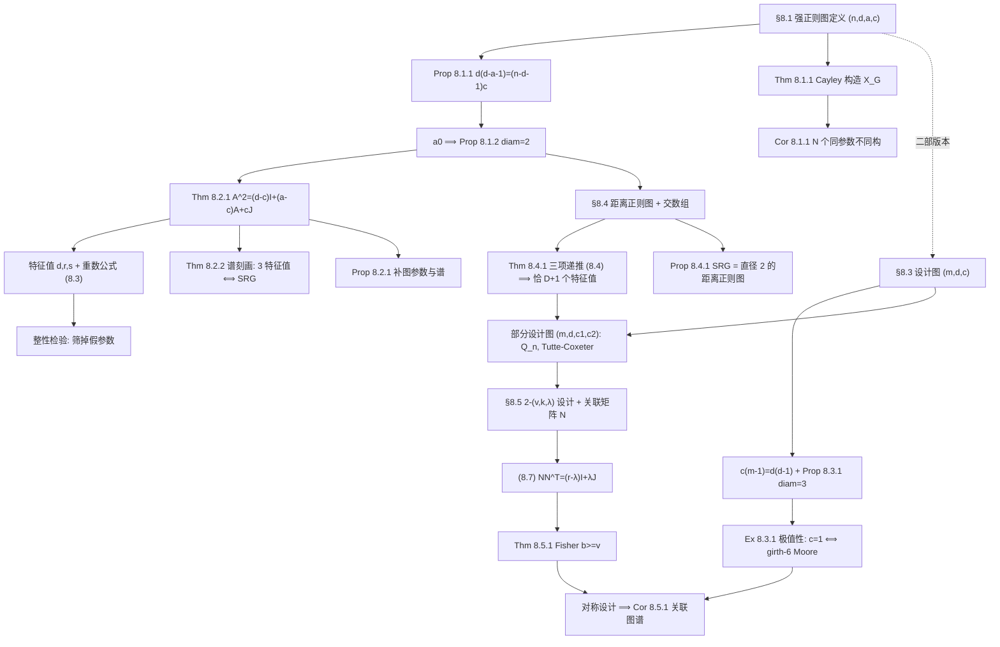
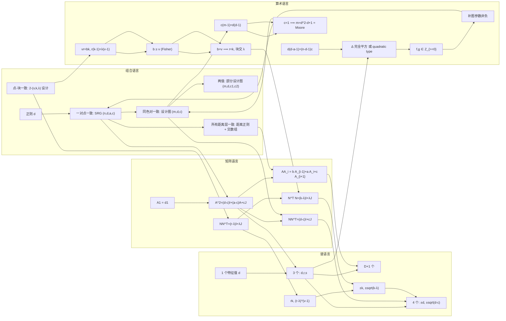

# 第 8 章 课程讲义：强正则图与设计

> **教材**：Lele Liu, *Algebraic Graph Theory Lecture Notes*, Anhui University, 2026-09-17, Chapter 8 *Strongly regular graphs and designs*（原书 pp. 99–106）。
> **讲义性质**：授课用详案。每一节按「**引入动机 → 定义/定理陈述 → 证明思路（怎么想到的）→ 完整证明 → 注记与延伸 → 课堂提问 → 板书建议**」七段式展开，可直接照此讲课。
> **配套文件**：全课程梳理见 `代数图论课程知识点梳理.md`。

---

## 0. 讲义使用说明

### 0.1 建议课时

| 讲次 | 内容 | 对应教材 | 学时 | 核心产出 |
| --- | --- | --- | --- | --- |
| 第 1 讲 | 强正则图：把"正则"升级到"一对点一致" | §8.1 | 2 | 参数恒等式、直径 2、Cayley 构造与同参数不同构 |
| 第 2 讲 | 邻接代数：一个矩阵恒等式统治全章 | §8.2 | 2 | (8.1)(8.2)(8.3)、整性检验、谱刻画、补图 |
| 第 3 讲 | 设计图与部分设计图：二部版本 | §8.3 | 2 | $c(m-1)=d(d-1)$、直径 3、极值性、三个例子 |
| 第 4 讲 | 距离正则图：一致性推到所有距离层 | §8.4 | 2 | 交数组、三项递推 (8.4)、层大小 (8.5) |
| 第 5 讲 | 区组设计与关联矩阵 | §8.5 | 2 | (8.6)(8.7)、Fisher 不等式、对称设计、关联图谱 |
| 第 6 讲 | 习题课 + 全章总结 | Ex 8.3.1 / 8.5.1 / 8.5.2 + 补充题 | 2 | 统一视角"平方恒等式家族"、知识网络 |

共 **12 学时**。若压缩为 8 学时：第 1、2 讲合并为 3 学时，第 3、4 讲合并为 3 学时，第 5 讲 2 学时。

### 0.2 前置知识（开课前 5 分钟口头确认）

- 图的邻接矩阵 $A$、$d$-正则 $\Leftrightarrow A\mathbf 1=d\mathbf 1$；连通正则图中 $d$ 是**单重**特征值（第 2、3 章）。
- $(A^k)_{uv}$ = $u$ 到 $v$ 的长度 $k$ 的路径数；特别地 $(A^2)_{uv}$ = **公共邻居数**（$u\ne v$）。
- **不同特征值个数 $\ge \operatorname{diam}(X)+1$**（第 3 章 Thm 3.2.1）——本章所有"谱签名"都是这个不等式**取等号**。
- 全一矩阵 $J$ 的性质：$J\mathbf 1=n\mathbf 1$，$Jx=0$ 当 $x\perp\mathbf 1$；$J^2=nJ$。
- Cayley 图 $\mathrm{Cay}(G,S)$ 与 link graph（第 7 章）。
- 二部图谱关于 $0$ 对称（第 3 章）。

### 0.3 教学目标

**知识目标**
1. 能准确写出强正则图、设计图、部分设计图、距离正则图、$2$-$(v,k,\lambda)$ 设计的定义，并说明它们之间的**包含/平行**关系。
2. 掌握核心恒等式 $A^2=(d-c)I+(a-c)A+cJ$ 与 $NN^\top=(r-\lambda)I+\lambda J$，并能独立推导谱、重数、参数变换。
3. 会用**四道闸门**（参数恒等式 → 判别式 → 重数整性 → 补图参数非负）判定参数集是否可行。

**能力目标**
4. 熟练运用**双重计数**（Prop 8.1.1、$c(m-1)=d(d-1)$、(8.5)、(8.6)）与**正定性+秩**（Fisher 不等式）两大工具。
5. 会用 **link graph 作为二阶不变量**区分同参数的图（双胞胎图、Thm 8.1.1）。
6. 能从"谱 ⟹ 组合"反向推理（Thm 8.2.2 的投影算子法）。

**素养目标**
7. 体会"组合定义 ⟹ 代数恒等式 ⟹ 算术刚性"这一代数图论的**统一方法论**。
8. 理解"参数不决定图""存在性可以是未解决问题"（$(50,7,0,1)$）这类数学研究实况。

### 0.4 重点与难点

- **重点**：Thm 8.2.1（邻接代数恒等式）及其谱推论；Prop 8.1.1（双重计数）；Thm 8.4.1（三项递推）；Thm 8.5.1（Fisher 不等式）。
- **难点 1**：Thm 8.2.1 证明中"两个根都必须出现"这一步——要用反证 + "只有两个不同特征值的连通图必为完全图"（第 3 章）。
- **难点 2**：Thm 8.2.2 的**投影算子**证法——$\dfrac{J}{n}$ 与 $\dfrac{(A-rI)(A-sI)}{(d-r)(d-s)}$ 是同一个投影子的两种写法。
- **难点 3**：Thm 8.1.1(ii) 的"**三岛 + 桥边**"结构，以及"桥三角形数 = 2 阶元数"。
- **难点 4**：Thm 8.4.1 的"$A_i=p_i(A)$ 且 $A_0,\dots,A_D$ 线性无关 ⟹ 极小多项式次数恰为 $D+1$"。
- **难点 5**：Fisher 不等式里 $NN^\top$ 的正定性分解（$\mathbf 1^\perp$ 上 $r-\lambda$，$\langle\mathbf 1\rangle$ 上 $rk$）。

### 0.5 记号表（写在黑板右上角，全章不擦）

| 记号 | 含义 |
| --- | --- |
| $X=(V,E)$，$n=\lvert V\rvert$ | 简单无向图，顶点数 |
| $A=A(X)$，$J$，$I$，$\mathbf 1$ | 邻接矩阵、全一矩阵、单位矩阵、全一向量 |
| $(n,d,a,c)$ | 强正则图参数：顶点数、度数、相邻对公共邻居数、非相邻对公共邻居数 |
| $\Gamma_i(x)$ | $x$ 的第 $i$ 层邻居 $\{y:\operatorname{dist}(x,y)=i\}$，$k_i=\lvert\Gamma_i(x)\rvert$ |
| $\{b_0,\dots,b_{D-1};c_1,\dots,c_D\}$ | 距离正则图的**交数组** |
| $A_i$ | 距离-$i$ 矩阵，$(A_i)_{xy}=1\Leftrightarrow\operatorname{dist}(x,y)=i$ |
| $(m,d,c)$ | 设计图参数：半顶点数、度数、同色对公共邻居数 |
| $(m,d,c_1,c_2)$ | 部分设计图参数 |
| $2$-$(v,k,\lambda)$，$b$，$r$，$N$ | 区组设计：点数、块大小、点对重数、块数、每点所在块数、$v\times b$ 关联矩阵 |
| $\operatorname{disc}=\Delta=(a-c)^2+4(d-c)$ | 二次方程 (8.2) 的判别式 |
| $r,s$（$r>s$），$f,g$ | 受限特征值及其重数 |

> **提醒学生**：本章符号 $r,s$ 在两处出现——§8.2 中是**特征值**，§8.5 中是设计的**重复数**。讲第 5 讲时务必先声明"从现在起 $r$ 换义"。

### 0.6 全章一句话主线

> **把"局部一致性"逐级加强，每加强一级就多出一个矩阵恒等式，恒等式立刻翻译成谱，谱再翻译成算术约束——最后用这些约束去筛掉假参数、去构造真例子、去证明不存在。**

---

## 1. 教学路线图

### 1.1 章节内部依赖



### 1.2 全章"一致性层级"总表（第 1 讲开场投影，第 6 讲回收）

| 层级 | 一致性约束到什么程度 | 对象 | 参数 | 直径 | 不同特征值个数 | 矩阵恒等式 |
| --- | --- | --- | --- | --- | --- | --- |
| 0 | 每个点看出去一样 | $d$-正则图 | $(n,d)$ | — | $\ge 2$ | $A\mathbf 1=d\mathbf 1$ |
| 1 | 每一**对**点一样 | **强正则图** | $(n,d,a,c)$ | $2$ | **恰 $3$** | $A^2=(d-c)I+(a-c)A+cJ$ |
| 1′ | 每一对**同色**点一样 | **设计图** | $(m,d,c)$ | $3$ | 恰 $4$ | $NN^\top=(d-c)I+cJ$ 型 |
| 1″ | 同色对只取两值 | **部分设计图** | $(m,d,c_1,c_2)$ | $\ge 3$ | 由 $c_i$ 定 | — |
| 2 | 每一对点在**每层**一样 | **距离正则图** | 交数组 | $D$ | **恰 $D+1$** | $AA_i=b_{i-1}A_{i-1}+a_iA_i+c_{i+1}A_{i+1}$ |
| 换载体 | 点–块关联一致 | $2$-$(v,k,\lambda)$ **设计** | $(v,k,\lambda)$ | $3$（关联图） | 恰 $4$ | $NN^\top=(r-\lambda)I+\lambda J$ |

**教学话术**：这张表要让学生"背下来"。整章就是在填这张表的每一行；而第 3 章 Thm 3.2.1（不同特征值个数 $\ge$ 直径 $+1$）解释了为什么右起第二列**总是取等号**——高度正则图的谱信息量恰好等于它的距离信息量。

### 1.3 三个反复出现的"招式"（全章只用这三招）

1. **双重计数**：对同一个集合用两种方式数。Prop 8.1.1、$c(m-1)=d(d-1)$、(8.5)、(8.6) 全是它。
2. **平方恒等式**：把"公共邻居数只取少数几个值"写成 $M^2=\alpha I+\beta M+\gamma J$，再对角化。Thm 8.2.1、(8.7)、$N^\top N$ 全是它。
3. **正定性 + 秩**：$M^\top M$ 正定 $\Rightarrow$ 满秩 $\Rightarrow$ 维数不等式。Fisher 不等式是它的最小样本。

---

# 第一讲 强正则图：把"正则"升级到"一对点一致"（§8.1）

## 1.1 引入：为什么要"强"正则？（约 8 分钟）

**课堂三问**（依次抛出，不要给答案，让学生带着问题听讲）：

> **问 1**：$d$-正则图告诉我们"从一个顶点看出去，世界长得一样"。那"从**两个**顶点看出去"呢？两个顶点的世界也可以一样吗？
>
> **问 2**：如果要求"任意两个相邻顶点有相同数目的公共邻居，任意两个不相邻顶点也有相同数目的公共邻居"，这个条件有多强？会不会只有完全图和完全二部图满足？
>
> **问 3**：这样的图，参数能随便给吗？比如"10 个顶点、3-正则、相邻对 0 个公共邻居、非相邻对 2 个公共邻居"，这样的图存在吗？

**过渡语**：问 2 的答案是"不，还有很多漂亮的例子，比如 Petersen 图"。问 3 的答案是"绝大多数参数都不行，而且**筛掉它们只需要一行算术**"。这一讲解决问 1 与问 2 的一部分，第二讲彻底解决问 3。

**与第 3 章的呼应**（板书）：

$$\#\{\text{不同特征值}\}\ \ge\ \operatorname{diam}(X)+1 .$$

- $d$-正则：$\operatorname{diam}$ 任意，特征值 $\ge 2$ 个 —— 信息量少。
- 强正则图：**直径恰为 2**（Prop 8.1.2），特征值**恰为 3** 个（Thm 8.2.1）—— 不等式取等号！
- 这不是巧合：**"局部一致性强" $\Rightarrow$ "邻接代数维数小" $\Rightarrow$ "特征值个数少" $\Rightarrow$ "直径小"**。整章就是这条因果链的不同截面。

## 1.2 定义 8.1（强正则图）

> **定义 8.1.** 称一个正则图为**强正则的**（strongly regular），如果存在两个非负整数 $a,c$，使得
> - 任意两个**相邻**顶点恰有 $a$ 个公共邻居；
> - 任意两个**不同的不相邻**顶点恰有 $c$ 个公共邻居。
>
> 记参数为 $(n,d,a,c)$：$n$ 个顶点，$d$-正则，$a$，$c$ 如上。

**逐字解读（务必强调）**：
1. "**正则**"是前提，不是推论。
2. $a,c$ 是**全局常数**——不依赖于选哪一对顶点。这是"局部一致性"的实质。
3. "**不同的**不相邻"：排除了 $u=v$。因为 $(A^2)_{uu}=d$，与 $c$ 一般不同，所以必须排除。这一点在第二讲写矩阵恒等式 (8.1) 时会变成 $(d-c)$ 这个对角修正项。
4. $a,c$ 是**非负整数**：$a$ 可以为 $0$（无三角形），$c$ 也可以为 $0$（如 $K_{n,n}$ 的 $a=0$；但注意连通时 $c>0$，见 1.6）。

**约定：为什么排除 $K_n$？**（讲义原文：*"The complete graph $K_n$ has $a=n-2$ but undefined $c$. Treating it as a strongly regular graph is a matter of convention, and ours is to exclude it."*）

$K_n$ 中没有"不同的不相邻顶点对"，所以 $c$ 是**空真**（vacuously）的任意值。若允许，$K_n$ 会有 $(n,n-1,n-2,c)$ 无穷多组参数，一切公式退化。**本书约定：强正则图排除 $K_n$。** 相应地，Prop 8.4.1 中写"连通的**非完全**强正则图"。

> **板书提醒**：不同文献约定不同（Brouwer–Cohen–Neumaier 常把 $K_n$ 归入退化的距离正则图）。考试按本课程约定。

## 1.3 例子群 Ex 8.1.1 – Ex 8.1.5（约 20 分钟，逐个手算）

| # | 图 | 参数 $(n,d,a,c)$ | $a$ 的来源 | $c$ 的来源 |
| --- | --- | --- | --- | --- |
| Ex 8.1.1 | Petersen 图 | $(10,3,0,1)$ | 无三角形 | 任意两个不相邻点恰有 1 个公共邻居 |
| Ex 8.1.2 | $C_5$ | $(5,2,0,1)$ | 无三角形 | 距离 2 的两点有唯一公共邻居 |
| Ex 8.1.2 | $C_4$ | $(4,2,0,2)$ | 无三角形 | 对角两点有 2 个公共邻居 |
| Ex 8.1.3 | $K_{n,n}$ | $(2n,n,0,n)$ | 二部无三角形 | 异色两点（非相邻）公共邻居 = 同侧全部 $n$ 点 |
| Ex 8.1.4 | rook 图 $K_n\times K_n$ | $(n^2,2(n-1),n-2,2)$ | 同行/同列内部 | 见下方手算 |
| Ex 8.1.5 | **双胞胎图**：$K_4\times K_4$ 与 Shrikhande 图 | $(16,6,2,2)$ | 见下方手算 | 见下方手算 |

**讲义的两个"唯一性"断言（务必板书，第 6 讲习题课证明）**：
- *"$K_{n,n}$ 满足定义，但**没有其它二部图是强正则的**。"*
- *"rook 图 $K_n\times K_n$ 满足定义，但**没有其它非平凡积是强正则的**。"*

**手算示范 1：rook 图 $K_n\times K_n$。** 顶点是棋盘格 $(i,j)$，$1\le i,j\le n$；相邻 $\Leftrightarrow$ **同行或同列**（车的一步）。
- 度数：同行 $n-1$ 个 + 同列 $n-1$ 个 $=2(n-1)=d$。
- $a$：设 $u\sim v$。由对称性不妨设 $u,v$ **同行**：$u=(i,j)$，$v=(i,j')$，$j\ne j'$。公共邻居 $w=(p,q)$ 需同时满足
  $$\big(p=i \text{ 或 } q=j\big)\ \wedge\ \big(p=i \text{ 或 } q=j'\big),\qquad w\ne u,v .$$
  展开四种组合：$p=i$ 且 $p=i$ ⟹ $w=(i,q)$，$q\notin\{j,j'\}$，共 $n-2$ 个；$p=i$ 且 $q=j'$ ⟹ $w=v$，排除；$q=j$ 且 $p=i$ ⟹ 已含；$q=j$ 且 $q=j'$ ⟹ 不可能。
  故 $a=n-2$。**同列情形对称**，也得 $a=n-2$。✔
  > **教学提示**：这里是训练"把邻接条件写成逻辑式再穷举"的好地方，让学生自己写这个式子，不要代劳。
- $c$：设 $u=(i,j)$，$v=(i',j')$，$i\ne i'$，$j\ne j'$。公共邻居 $w=(p,q)$ 需（$p=i$ 或 $q=j$）且（$p=i'$ 或 $q=j'$）。四种组合：$p=i,p=i'$ 不可能；$q=j,q=j'$ 不可能；$p=i,q=j'$ 给出 $w=(i,j')$ ✔；$q=j,p=i'$ 给出 $w=(i',j)$ ✔。故 $c=2$。
- **校验 Prop 8.1.1**：$d(d-a-1)=2(n-1)(2n-2-n+2-1)=2(n-1)^2$；$(n'-d-1)c=(n^2-2n+1)\cdot 2=2(n-1)^2$。✔（这里 $n'=n^2$ 是图的顶点数，注意与棋盘参数 $n$ 区分——**这是学生最常混淆的地方，板书时用 $N=n^2$**。）

**手算示范 2：双胞胎图 $(16,6,2,2)$。** $n=4$：rook 图 $K_4\times K_4$ 是 $4\times4$ 棋盘，$d=2(4-1)=6$，$a=4-2=2$，$c=2$。Shrikhande 图定义在 $\mathbb Z_4\times\mathbb Z_4$ 上，$(x,y)\sim(x',y')\Leftrightarrow (x'-x,y'-y)\in\{\pm(1,0),\pm(0,1),\pm(1,1)\}$，也是 $6$-正则，可验证 $a=c=2$。

**手算示范 3：$K_{n,n}$。** 两侧各 $n$ 点。相邻两点必异色，异色两点在二部图中无公共邻居（公共邻居需与两者都相邻，即同时在两侧），故 $a=0$。不相邻的两点必**同色**，它们的公共邻居是对侧全部 $n$ 点，故 $c=n$。参数 $(2n,n,0,n)$。校验：$d(d-a-1)=n(n-1)$，$(2n-n-1)c=(n-1)n$。✔

**手算示范 4：Petersen $(10,3,0,1)$。** 无三角形故 $a=0$。$c$：用 Kneser 表示 $V=\binom{[5]}{2}$，$u\sim v\Leftrightarrow u\cap v=\varnothing$。两个**相交**的 2-子集 $u,v$（不相邻）：设 $u=\{1,2\}$，$v=\{1,3\}$，公共邻居 $w$ 需与 $\{1,2\}$ 和 $\{1,3\}$ 都不交，即 $w\subseteq\{4,5\}$，唯一 $w=\{4,5\}$。故 $c=1$。校验：$3\cdot(3-0-1)=6=(10-3-1)\cdot 1=6$。✔

**课堂提问 1.3**
- Q：$C_6$ 是强正则的吗？（答：不是。$C_6$ 中距离 2 的两点有 1 个公共邻居，距离 3 的对径点有 2 个公共邻居，$c$ 不唯一。事实上讲义 Ex 8.1.2 说"唯一另一个强正则的圈是 $C_4$"。）
- Q：为什么 $C_5$ 可以而 $C_6$ 不行？（答：$C_5$ 直径 2，$C_6$ 直径 3 > 2，违反 Prop 8.1.2。**一般地：圈 $C_m$ 强正则 $\Leftrightarrow m\in\{4,5\}$**。）
- Q：$K_{3,3}$ 的参数？（答：$(6,3,0,3)$。它是 $K_{n,n}$ 的特例。）

## 1.4 双胞胎现象：参数相同、图不同构（约 10 分钟）

这是本章第一个"**惊喜**"，也是通向 Thm 8.1.1 的动机。

**事实**（可当堂用计算机演示，见附录脚本）：$K_4\times K_4$ 与 Shrikhande 图
- 参数完全相同：$(16,6,2,2)$；
- 顶点数、边数相同：$16$，$48$；
- **三角形总数相同**：$32$；
- **4-圈总数相同**：$192$；
- **谱完全相同**：$\{6,\ 2^{(6)},\ (-2)^{(9)}\}$。

但它们**不同构**！区分它们需要**二阶不变量**：**link graph**。

| 图 | 在任一点 $v$ 的 link graph $L(v)$ | 结构 | $L(v)$ 中三角形数 |
| --- | --- | --- | --- |
| $K_4\times K_4$ | $6$ 个顶点，$6$ 条边，$2$-正则 | $2K_3$（**两个不交的三角形**：同行 $3$ 点 + 同列 $3$ 点） | $2$ |
| Shrikhande | $6$ 个顶点，$6$ 条边，$2$-正则，连通 | $C_6$ | $0$ |

**教学话术**：*"看到了吗？两个图在'顶点数、边数、三角形数、谱'四个层面上完全一样，但把镜头推近到一个顶点的邻域，一个看到的是两块三角形，另一个看到的是一个六边形。**link graph 是比谱更细的显微镜**。而 Thm 8.1.1 会把这个显微镜变成一个可以量产反例的机器。"*

> **注**：这与第 7 章的 Cayley 图同构判定思想一脉相承——第 7 章用 link graph 做**定性**判据，本章 Thm 8.1.1 把它升级为**定量**不变量（桥三角形数 = 群的 2 阶元数）。

## 1.5 Proposition 8.1.1：参数的第一道闸门（约 15 分钟）

> **命题 8.1.1.** 强正则图的参数 $(n,d,a,c)$ 满足
> $$d(d-a-1)=(n-d-1)c. \tag{★}$$

### 证明思路：怎么想到的？

**第一步：把定义"翻译"成局部对象。** 定义是"逐对"的，而 $(★)$ 是"全局参数"之间的关系。要找桥梁，最自然的办法是：**固定一个基点 $x$，把全图按与 $x$ 的关系切成两块**：
- **link 顶点**：$x$ 的 $d$ 个邻居；
- **farther 顶点**（更远点）：既不是 $x$ 也不是 $x$ 的邻居的点，共 $n-1-d$ 个。

**第二步：把 $a,c$ 翻译成这两块之间的边。**
- $a$ = "$x$ 与邻居的公共邻居数" = "**link graph 内部的边结构**"。具体地：对 link 顶点 $y$，$y$ 与 $x$ 有 $a$ 个公共邻居，即 $y$ 在 link graph 中有 $a$ 个邻居 $\Rightarrow$ **link graph 是 $d$ 个顶点的 $a$-正则图**。
- $c$ = "$x$ 与更远点的公共邻居数" = "**更远点连回 link 的边数**"。具体地：对更远点 $z$，$z$ 与 $x$ 有 $c$ 个公共邻居，即 $z$ 恰与 $c$ 个 link 顶点相邻。

**第三步：双重计数同一个集合。** 设 $E'=$ {link 顶点与更远点之间的边}。
- 按 link 顶点数：每个 link 顶点有 $d$ 个邻居，其中 $a$ 个在 link 内，$1$ 个是 $x$，剩下 $d-a-1$ 个必是更远点 $\Rightarrow \lvert E'\rvert=d(d-a-1)$。
- 按更远点数：每个更远点有 $c$ 条边连到 link $\Rightarrow \lvert E'\rvert=(n-d-1)c$。

### 完整证明（照讲义原文的逻辑，展开成课堂可念的形式）

**证明.** 固定基点 $x$。$x$ 的 link graph 有 $d$ 个顶点，图中另有 $n-d-1$ 个更远顶点。我们两种方式计数 link 顶点与更远顶点之间的边。

每个 link 顶点与基点 $x$ 有 $a$ 个公共邻居；换言之，**link graph 是 $a$-正则的**。于是每个 link 顶点在它的 $d$ 个邻居中，有 $a$ 个位于 link 内、$1$ 个是 $x$ 本身、剩下 $d-a-1$ 个是更远顶点。故这类边共 $d(d-a-1)$ 条。

每个更远顶点与基点 $x$ 有 $c$ 个公共邻居；也就是说，每个更远顶点恰与 $c$ 个 link 顶点相邻。故这类边共 $(n-d-1)c$ 条。

两式相等即得 $(★)$。$\blacksquare$

### 注记

- **(N1) 这就是"$d$-正则 + link 是 $a$-正则"的边计数版**：$\sum_{y\sim x}(\deg y-a-1)=\sum_{z\not\sim x,z\ne x}c$。
- **(N2) 一般化的形态**：对**任意** $d$-正则图，若定义 $\lambda_{uv}$ = $u,v$ 的公共邻居数，则 $\sum_{y\sim x}\sum_{z\notin N[x]}\mathbf 1[y\sim z]=\sum_{z\notin N[x]}\sum_{y\sim x}\mathbf 1[y\sim z]$ 恒成立。强正则性只是让这个和式**每一项都相等**，从而可以提出来。这正是"一致性 ⟹ 计数恒等式"的范式。
- **(N3) 恒等式 $(★)$ 的等价形式**：$d^2-d(a+1)=nc-c-dc$，即 $d^2=d(a+1)+c(n-d-1)$。左边是 $x$ 出发走两步回到 $N(x)$ 的路径数——可作另一种解释。

### 当堂验算表（让学生分四组各算一个）

| 参数 | $d(d-a-1)$ | $(n-d-1)c$ | 结论 |
| --- | --- | --- | --- |
| $(10,3,0,1)$ Petersen | $3\cdot2=6$ | $6\cdot1=6$ | ✔ |
| $(16,6,2,2)$ 双胞胎 | $6\cdot3=18$ | $9\cdot2=18$ | ✔ |
| $(8,4,0,4)$ $K_{4,4}$ | $4\cdot3=12$ | $3\cdot4=12$ | ✔ |
| $(5,2,0,1)$ $C_5$ | $2\cdot1=2$ | $2\cdot1=2$ | ✔ |
| $(7,4,2,2)$ **假参数** | $4\cdot1=4$ | $2\cdot2=4$ | ✔ 居然过了！ |

**悬念**：$(7,4,2,2)$ 通过了第一道闸门，但**这样的图不存在**。第二讲会用谱证明它不存在——这是"整性检验"威力的最佳广告。

## 1.6 从 $a<d-1$ 到 $c>0$，再到 Proposition 8.1.2（约 8 分钟）

> **引理（讲义正文，无编号）.** 强正则图中 $a<d-1$，从而 $c>0$。

**证明思路**：反证。若 $a=d-1$，则每个顶点的 link graph 是 $d$ 个顶点的 $(d-1)$-正则图，即**完全图 $K_d$**。这意味着 $x$ 的 $d$ 个邻居两两相邻，且都与 $x$ 相邻，于是 $\{x\}\cup N(x)$ 诱导一个 $d+1$ 个顶点的完全图。但全图是 $d$-正则的：$d+1$ 个顶点的完全图中每点度数为 $d$，若还有第 $d+2$ 个顶点 $y$，则 $y$ 与这 $d+1$ 个点中至少一个相邻（否则 $n=d+2$ 且图不连通；若连通则矛盾），该点度数将 $>d$。故全图 $=K_{d+1}$，被约定排除。∎

**讲义原文的说法**：*"the link graph of any vertex is an $a$-regular graph on $d$ vertices. It cannot be complete on $d$ vertices — if it were, the whole graph would be complete on $d+1$ vertices. So $a<d-1$, and $c>0$."*

> **课堂提醒**：$a<d-1$ 结合 $(★)$：左边 $d(d-a-1)\ge d\cdot 1>0$（因为 $d\ge1$），故右边 $(n-d-1)c>0$。若图**连通**且非完全，则 $n-d-1>0$（存在不与 $x$ 相邻的顶点），于是 $c>0$。
> 反过来，$c>0$ 立刻给出：任意两个不相邻顶点有公共邻居 $\Rightarrow$ 距离 $\le 2$。

> **命题 8.1.2.** 强正则图的**直径为 2**。

**证明.** 图连通（否则不同连通分支中的两点距离 $=\infty$；更严谨地：由 $c>0$，任意不相邻两点有公共邻居，故任意两点距离 $\le2$，图连通）。直径 $\le2$；又图非完全（约定排除 $K_n$），故存在不相邻两点，直径 $\ge2$。因此直径 $=2$。$\blacksquare$

**这条命题的价值（要讲透）**：
1. **组合价值**：直径 2 ⟹ 任意两点间有长度 $\le2$ 的路 ⟹ 图是"小世界"。
2. **谱价值**：由第 3 章 Thm 3.2.1，不同特征值个数 $\ge\operatorname{diam}+1=3$。而 Thm 8.2.1 将证明**恰为 3**。**取等号**是"极值"的信号：强正则图正好卡在"直径 2 且特征值 3 个"的临界点上。
3. **筛选价值**：任何直径 $\ne2$ 的图都不可能是强正则的（$C_6$、$Q_3$、Heawood 图都被一票否决）。

**课堂提问 1.6**
- Q：$K_{n,n}$ 的直径是 2 吗？（答：是。同侧两点距离 2，异侧相邻距离 1。）
- Q：$K_n$ 的直径是 1，所以被排除是"自然"的吗？（答：约定上排除；从公式看，$c$ 无定义使 (8.1) 无法写。）
- Q：能否给出一个直径 $2$ 但**不是**强正则的连通正则图？
  A：**三棱柱图** $C_3\square K_2$（$6$ 个顶点，$3$-正则）。实测：直径 $=2$ ✔，但谱为 $\{3,\ 1,\ 0^{(2)},\ (-2)^{(2)}\}$，有 **$4$ 个**不同特征值（多于 $3$）。更直接地：相邻对的公共邻居数取**两个值**——三角形边（如 $(0,0)\!-\!(1,0)$）有 $1$ 个，竖边（如 $(0,0)\!-\!(0,1)$）有 $0$ 个——故 $a$ 不唯一，**不是强正则**；而不相邻对的公共邻居数恒为 $2$。
  **教学价值**：这个例子说明"直径 $2$"远弱于"强正则"，也说明 **Thm 8.2.2 的三个条件（连通、正则、恰 $3$ 个不同特征值）缺一不可**。

## 1.7 Theorem 8.1.1：用 Cayley 图量产"同参数不同构"（约 25 分钟，本讲高潮）

> **定理 8.1.1.** 固定正整数 $n$。设 $G$ 是有 $n$ 个元素的有限群，令 $X_G$ 为 $G\times G$ 关于对称生成子集
> $$S=\{(s,1),(1,s),(s,s):s\in G,\ s\ne 1\}$$
> 的 Cayley 图。则
> **(i)** $X_G$ 是强正则图，参数 $(n^2,\ 3n-3,\ n,\ 6)$；
> **(ii)** $G$ 中 **2 阶元的个数**是 $X_G$ 的一个**图不变量**。

### 证明思路：为什么想到这个构造？

**动机链**（讲给学生听）：
1. 1.4 节我们发现"双胞胎"$(16,6,2,2)$：**参数相同、图不同构**。
2. 想问：**同参数的强正则图最多能有多少个？** 有限还是无限？
3. 要回答"无限多"，需要一个**可自由调节的旋钮**。Cayley 图 $\mathrm{Cay}(G,S)$ 的好处是：$G$ 可以随便换，只要 $\lvert G\rvert$ 和 $S$ 的"形状"不变，参数就不变；但 $G$ 的**内部结构**（比如 2 阶元个数）会留下痕迹。
4. 为什么取 $G\times G$ 而不是 $G$？因为要造出**三个"岛"**（见下），三岛结构让 link graph 足够丰富，从而能把群的算术信息编码进图的三角形计数。
5. 为什么生成集是 $\{(s,1),(1,s),(s,s)\}$？这是 $G\times G$ 中"三条对角方向"：水平、垂直、主对角。每个方向贡献 $n-1$ 个元素，共 $3n-3$ 个，且 $S$ 对取逆封闭（因为 $(s,1)^{-1}=(s^{-1},1)\in S$ 等），所以 Cayley 图是无向的。

### 完整证明

**(i) 参数 $(n^2,3n-3,n,6)$。**

**第一步：顶点数与度数。** $\lvert V(X_G)\rvert=\lvert G\times G\rvert=n^2$。生成集
$$S=S_1\sqcup S_2\sqcup S_3,\qquad S_1=\{(s,1):s\ne1\},\ S_2=\{(1,s):s\ne1\},\ S_3=\{(s,s):s\ne1\}$$
三个"岛"两两不交（$(s,1)=(1,t)$ 迫使 $s=t=1$；$(s,1)=(t,t)$ 迫使 $t=1$；$(1,s)=(t,t)$ 迫使 $t=1$），各含 $n-1$ 个元素，故 $\lvert S\rvert=3n-3=d$。$S$ 对取逆封闭（$(s,1)^{-1}=(s^{-1},1)\in S_1$，$(s,s)^{-1}=(s^{-1},s^{-1})\in S_3$），所以 $X_G$ 是无向图；$S$ 生成 $G\times G$（$S_1,S_2$ 已够），所以 $X_G$ 连通。Cayley 图总是 $d$-正则，故 $d=3n-3$。

**第二步：把公共邻居计数化成一个集合交。** 这是本节最重要的技巧，务必板书：

> **引理（Cayley 图的公共邻居数）.** 在 $\mathrm{Cay}(H,S)$ 中，单位元 $1$ 与顶点 $w$ 的公共邻居个数为
> $$\big\lvert S\cap wS\big\rvert=\#\{w'\in S:\ w^{-1}w'\in S\}.$$
> 一般地，$u$ 与 $v$ 的公共邻居个数为 $\lvert uS\cap vS\rvert=\#\{w'\in S:\ (u^{-1}v)w'\in S\}$。

*证.* $u$ 的邻居集是 $uS$，$v$ 的邻居集是 $vS$；交集即公共邻居。左乘 $u^{-1}$ 是双射，把 $uS\cap vS$ 映到 $S\cap u^{-1}vS$。$\blacksquare$

于是：**公共邻居数只依赖于"差" $w=u^{-1}v$**（这正是 Cayley 图的顶点传递性 + 边传递性的体现）。我们只需对 $w$ 的两类代表元做穷举：

- **相邻情形**：$w\in S$，分 $w\in S_1,S_2,S_3$ 三种；
- **不相邻情形**：$w=(x,y)$，$x\ne1$，$y\ne1$，$x\ne y$。

**第三步：相邻情形的穷举表（$a=n$）。**

*情形 A：$w=(s,1)\in S_1$，$s\ne1$。* 对每类 $w'\in S$ 解"$ww'\in S$"：

| $w'$ | $ww'$ | 落入 $S$ 的条件 | 个数 |
| --- | --- | --- | --- |
| $(t,1)\in S_1$，$t\ne1$ | $(ts,1)$ | $\in S_1\Leftrightarrow ts\ne1\Leftrightarrow t\ne s^{-1}$ | $n-2$ |
| $(1,t)\in S_2$，$t\ne1$ | $(s,t)$ | $\in S_3\Leftrightarrow s=t$（$S_1$ 需 $t=1$，$S_2$ 需 $s=1$，均不可能） | $1$ |
| $(t,t)\in S_3$，$t\ne1$ | $(ts,t)$ | $\in S_2\Leftrightarrow ts=1\Leftrightarrow t=s^{-1}$（$S_1$ 需 $t=1$，$S_3$ 需 $s=1$，均不可能） | $1$ |

合计 $(n-2)+1+1=n$。✔

*情形 B：$w=(1,s)\in S_2$。* 交换两个坐标是 $G\times G$ 的自同构，把 $S_1\leftrightarrow S_2$、$S_3\mapsto S_3$，从而保持 $S$；故与情形 A 同构，也得 $n$。（直接验证：$(1,s)\cdot(t,1)=(t,s)\in S_3\Leftrightarrow t=s$，$1$ 个；$(1,s)\cdot(1,t)=(1,st)\in S_2\Leftrightarrow t\ne s^{-1}$，$n-2$ 个；$(1,s)\cdot(t,t)=(t,st)\in S_1\Leftrightarrow st=1\Leftrightarrow t=s^{-1}$，$1$ 个。）✔

*情形 C：$w=(s,s)\in S_3$，$s\ne1$。*

| $w'$ | $ww'$ | 落入 $S$ 的条件 | 个数 |
| --- | --- | --- | --- |
| $(t,1)\in S_1$ | $(st,s)$ | $\in S_2\Leftrightarrow st=1\Leftrightarrow t=s^{-1}$（$S_1$ 需 $s=1$，$S_3$ 需 $t=1$，均不可能） | $1$ |
| $(1,t)\in S_2$ | $(s,st)$ | $\in S_1\Leftrightarrow st=1\Leftrightarrow t=s^{-1}$ | $1$ |
| $(t,t)\in S_3$ | $(st,st)$ | $\in S_3\Leftrightarrow st\ne1\Leftrightarrow t\ne s^{-1}$ | $n-2$ |

合计 $1+1+(n-2)=n$。✔

**结论**：$a=n$。

**第四步：不相邻情形的穷举（$c=6$）。** 设 $w=(x,y)$，$x\ne1$，$y\ne1$，$x\ne y$。

| $w'$ | $ww'$ | 落入 $S$ 的条件 | 个数 |
| --- | --- | --- | --- |
| $(t,1)\in S_1$ | $(xt,y)$ | $\in S_2\Leftrightarrow xt=1\Leftrightarrow t=x^{-1}$；$\in S_3\Leftrightarrow xt=y\Leftrightarrow t=x^{-1}y\ne1$ | $2$ |
| $(1,t)\in S_2$ | $(x,yt)$ | $\in S_1\Leftrightarrow yt=1\Leftrightarrow t=y^{-1}$；$\in S_3\Leftrightarrow yt=x\Leftrightarrow t=y^{-1}x\ne1$ | $2$ |
| $(t,t)\in S_3$ | $(xt,yt)$ | $\in S_1\Leftrightarrow yt=1\Leftrightarrow t=y^{-1}$；$\in S_2\Leftrightarrow xt=1\Leftrightarrow t=x^{-1}$（$\in S_3$ 需 $x=y$，已排除） | $2$ |

合计 $2+2+2=\mathbf 6$，即 $c=6$。✔

这六个公共邻居正是讲义列出的三对。把上表每个解 $w'$ 代回 $ww'$，得到完整对应（**这张表建议投影，因为它把"抽象穷举"和"讲义答案"对齐了**）：

| 表中的行 | 解 $w'$ | 公共邻居 $ww'$ | 讲义中的"类型" |
| --- | --- | --- | --- |
| $w'\in S_1$，$t=x^{-1}$ | $(x^{-1},1)$ | $(1,y)$ | 垂直型 |
| $w'\in S_1$，$t=x^{-1}y$ | $(x^{-1}y,1)$ | $(y,y)$ | 对角型 |
| $w'\in S_2$，$t=y^{-1}$ | $(1,y^{-1})$ | $(x,1)$ | 水平型 |
| $w'\in S_2$，$t=y^{-1}x$ | $(1,y^{-1}x)$ | $(x,x)$ | 对角型 |
| $w'\in S_3$，$t=y^{-1}$ | $(y^{-1},y^{-1})$ | $(xy^{-1},1)$ | 水平型 |
| $w'\in S_3$，$t=x^{-1}$ | $(x^{-1},x^{-1})$ | $(1,yx^{-1})$ | 垂直型 |

即讲义所说的三对：对角型 $(x,x)$ 与 $(y,y)$；水平型 $(x,1)$ 与 $(xy^{-1},1)$；垂直型 $(1,y)$ 与 $(1,yx^{-1})$。

**逐对验证**（当堂带学生过一遍，训练"用定义检查答案"的习惯）：
- $(x,x)$：是 $(1,1)$ 的邻居 ✔（$\in S_3$）；$(x,y)^{-1}(x,x)=(1,y^{-1}x)\in S_2$ ✔（因 $x\ne y$）。
- $(y,y)$：$(x,y)^{-1}(y,y)=(x^{-1}y,1)\in S_1$ ✔。
- $(x,1)$：$(x,y)^{-1}(x,1)=(1,y^{-1})\in S_2$ ✔。
- $(xy^{-1},1)$：$(x,y)^{-1}(xy^{-1},1)=(y^{-1},y^{-1})\in S_3$ ✔（因 $y\ne1$）。
- $(1,y)$：$(x,y)^{-1}(1,y)=(x^{-1},1)\in S_1$ ✔。
- $(1,yx^{-1})$：$(x,y)^{-1}(1,yx^{-1})=(x^{-1},x^{-1})\in S_3$ ✔。

六者互不相同（$x\ne y$、$x,y\ne1$ 保证）。∎(i)

**第五步：参数恒等式自检（好习惯）。** $d(d-a-1)=(3n-3)(3n-3-n-1)=(3n-3)(2n-4)$；$(n'-d-1)c=(n^2-3n+3-1)\cdot6=6(n^2-3n+2)=6(n-1)(n-2)$。而 $(3n-3)(2n-4)=3(n-1)\cdot2(n-2)=6(n-1)(n-2)$ ✔。

> **数值验证（附录脚本可当堂运行）**：$n=4$，$G=\mathbb Z_4$ 或 $\mathbb Z_2\times\mathbb Z_2$，$X_G$ 的实测参数为 $(16,9,4,6)$，即 $n^2=16$、$3n-3=9$、$a=n=4$、$c=6$，与 (i) 完全一致。

> **教学提示**：第三步的三张穷举表是本定理最"体力活"的部分。**建议只详讲情形 A**，情形 B 用对称性一句话带过，情形 C 留作作业（作业 C7）。这样既保证严谨，又不把课堂变成计算表演。

### (ii) 2 阶元个数是图不变量 —— "三岛与桥"（约 12 分钟）

**证明思路**：要在图 $X_G$ 中"读出"群 $G$ 的算术信息，必须找一个**只依赖图结构、且对 $G$ 敏感**的量。我们的选择是 **link graph 中的三角形个数**：三角形个数是纯图论量（同构不变），而 link graph 的"三岛 + 桥边"结构会把"$s^2=1$"这件事精确地翻译成"存在一个跨岛的三角形"。

> **方法论板书**：**"用子图计数编码代数信息"** —— 这是第 7 章 Cayley 图同构问题的定量升级版，也是后面第 13 章（图的分解）会反复用到的思路。

**完整证明.**

**第 1 步：link graph 的基本数据。** 考虑单位元 $(1,1)$ 处的 link graph $L:=L(1,1)$：顶点集是 $N(1,1)=S$，共 $3n-3$ 个；$u,w\in S$ 在 $L$ 中相邻 $\Leftrightarrow$ 它们在 $X_G$ 中相邻。对 $u\in S$，
$$\deg_L(u)=\#\{w\in S:\ w\sim u\}=\#\{u,w\ \text{的公共邻居中含}\ (1,1)\}=\#\{u\ \text{与}\ (1,1)\ \text{的公共邻居}\}=a=n .$$
（最后一步用了 (i)：$(1,1)$ 与 $u$ 相邻，故公共邻居数为 $a=n$。）所以 **$L$ 是 $3n-3$ 个顶点的 $n$-正则图**。这也再次印证 Prop 8.1.1 的推论"link graph 是 $d$ 点 $a$-正则"。

**第 2 步：三岛分解。** $S=S_1\sqcup S_2\sqcup S_3$，
$$S_1=\{(s,1):s\ne1\},\quad S_2=\{(1,s):s\ne1\},\quad S_3=\{(s,s):s\ne1\}.$$

- **岛内是完全图**：$S_1$ 中 $(s,1)\ne(t,1)$ 相邻 $\Leftrightarrow(s,1)^{-1}(t,1)=(s^{-1}t,1)\in S\Leftrightarrow s^{-1}t\ne1\Leftrightarrow s\ne t$，恒成立。故 $S_1$ 诱导 $K_{n-1}$；同理 $S_2$、$S_3$ 各诱导 $K_{n-1}$。
- **岛间恰两条桥边**：每个顶点在自己岛内有 $n-2$ 个邻居，而 $\deg_L=n$，故恰有 $2$ 个邻居落在另外两个岛。精确地（由情形 A/C 的穷举表取逆）：

| 顶点 | 岛内邻居 | 桥到 $S_1$ | 桥到 $S_2$ | 桥到 $S_3$ |
| --- | --- | --- | --- | --- |
| $(s,1)\in S_1$ | $\{(t,1):t\ne1,s\}$ | — | $(1,s^{-1})$ | $(s,s)$ |
| $(1,s)\in S_2$ | $\{(1,t):t\ne1,s\}$ | $(s^{-1},1)$ | — | $(s,s)$ |
| $(s,s)\in S_3$ | $\{(t,t):t\ne1,s\}$ | $(s,1)$ | $(1,s)$ | — |

（例：$(s,1)$ 与 $(1,t)$ 相邻 $\Leftrightarrow(s^{-1},1)(1,t)=(s^{-1},t)\in S\Leftrightarrow t=s^{-1}$，即唯一的桥邻居是 $(1,s^{-1})\in S_2$。其余同理。）

**第 3 步：三角形的两分法。** 断言：$L$ 中的每个三角形，要么**完全含在一个岛内**，要么**从三个岛各取一个顶点**。

*证明断言*：设三角形 $T$ 有两个顶点 $u,v$ 在同一岛（否则三顶点分属三岛，得证）。若第三个顶点 $w$ 也在同一岛，则 $T$ 含于该岛。剩下要排除"$u,v\in S_i$，$w\in S_j$，$i\ne j$"的情形：由第 2 步的表，$u$ 在 $S_j$ 中**只有一个**桥邻居，$v$ 也只有一个；$w$ 要同时与 $u,v$ 相邻就必须同时等于这两个唯一的桥邻居。以 $u=(s,1),v=(t,1)\in S_1$、$w\in S_2$ 为例：$w=(1,s^{-1})=(1,t^{-1})$ ⟹ $s=t$，与 $u\ne v$ 矛盾。$w\in S_3$ 时：$w=(s,s)=(t,t)$ ⟹ $s=t$，同样矛盾。其余岛的组合由对称性同理。∎断言

**第 4 步：数三角形。**
- **岛内三角形**：每个岛是 $K_{n-1}$，贡献 $\binom{n-1}{3}$；三个岛共
  $$T_{\text{岛内}}=3\binom{n-1}{3},$$
  **只依赖 $n$**，与 $G$ 的结构无关。
- **桥型三角形**：由第 3 步，桥三角形 $\{u_1,u_2,u_3\}$ 满足 $u_i\in S_i$。固定 $S_1$ 中的顶点 $(s,1)$，由第 2 步的表，它的两个桥邻居是 $(s,s)\in S_3$ 与 $(1,s^{-1})\in S_2$。这三点构成三角形 $\Leftrightarrow(1,s^{-1})\sim(s,s)$。计算：
  $$(1,s^{-1})^{-1}(s,s)=(1,s)\cdot(s,s)=(s,\,s^2).$$
  $(s,s^2)\in S\Leftrightarrow$ 落 $S_3$（$s=s^2\Leftrightarrow s=1$，排除）、落 $S_1$（$s^2=1$ ✔）、落 $S_2$（$s=1$，排除）。故
  $$(1,s^{-1})\sim(s,s)\ \Longleftrightarrow\ s^2=1,\ s\ne1\ \Longleftrightarrow\ s\ \text{是 2 阶元}.$$

  换一种更贴合讲义原文的看法：沿桥边走长度 $3$ 的闭路
  $$(s,1)\ \sim\ (s,s)\ \sim\ (1,s)\ \sim\ (s^{-1},1),$$
  它回到起点当且仅当 $(s^{-1},1)=(s,1)$，即 $s^2=1$；此时这三条桥边围成一个三角形 $\{(s,1),(s,s),(1,s)\}$（注意 $s=s^{-1}$，故 $(1,s)=(1,s^{-1})$ 正是 $(s,1)$ 的桥邻居）。

  **双射**：$\{\text{2 阶元 } s\in G\}\longleftrightarrow\{\text{桥型三角形}\}$，$s\mapsto\{(s,1),(s,s),(1,s)\}$。
  *单射*：三角形中含 $S_1$ 顶点唯一，故 $s$ 可复原。
  *满射*：任一桥三角形含唯一 $S_1$ 顶点 $(s,1)$，其两个桥邻居必为 $(s,s)$ 与 $(1,s^{-1})$，构成三角形 ⟹ $s^2=1$ ⟹ 该三角形即 $\{(s,1),(s,s),(1,s)\}$。
  故
  $$T_{\text{桥}}=\#\{s\in G:\ s^2=1,\ s\ne1\}.$$

**第 5 步：结论。** $L$ 的三角形总数
$$T(L)=3\binom{n-1}{3}+\#\{s\in G:\ s^2=1,\ s\ne1\}.$$
左边是同构不变量（$L$ 由 $X_G$ 决定；$X_G$ 顶点传递，任一点的 link 都同构于 $L$），右边第一项只依赖 $n=\lvert G\rvert$。**因此当 $\lvert G\rvert$ 固定时，$G$ 中 2 阶元的个数是 $X_G$ 的图不变量。** ∎(ii)

**注记 (N5)**：证明的关键结构是"**每个顶点在每个外岛恰有一个桥邻居**"。这是由生成集 $S$ 的特殊形状（三条"坐标方向"）保证的。**如果换成别的生成集，三岛结构消失，这个不变量就读不出来了**——这说明构造是精心设计的，不是随手取的。

### 数值验证（$n=4$，$N=2$，当堂演示；脚本见附录）

| $G$ | $\lvert G\rvert$ | 2 阶元 | $X_G$ 实测参数 | link：顶点/边/正则 | link 三角形总数 | 岛内 | 桥型 |
| --- | --- | --- | --- | --- | --- | --- | --- |
| $\mathbb Z_4$ | $4$ | $1$：$\{2\}$ | $(16,9,4,6)$ ✔ | $9$ / $18$ / $4$-正则 | $4$ | $3=3\binom{3}{3}$ ✔ | $\mathbf 1$ ✔ |
| $\mathbb Z_2\times\mathbb Z_2$ | $4$ | $3$：$\{(1,0),(0,1),(1,1)\}$ | $(16,9,4,6)$ ✔ | $9$ / $18$ / $4$-正则 | $6$ | $3$ ✔ | $\mathbf 3$ ✔ |

**关键的课堂观察**（实测数据，务必板书）：这两个图
- 顶点数 $16$、边数 $72$ —— 相同；
- 强正则参数 $(16,9,4,6)$ —— 相同；
- 谱 $\{9,\ r^{(f)},\ s^{(g)}\}$ —— 相同（参数决定谱，见第二讲）；
- **全图三角形总数都是 $96$，transitivity 都是 $0.5$** —— 相同！
- **link graph 的三角形数：$4$ vs $6$** —— **不同**！

**教学话术**：*"全局数一遍三角形，两个图都是 96，一模一样。可只要把镜头推近到一个顶点的邻域，一个数出 4 个三角形，另一个数出 6 个。**这就是二阶不变量的价值**：一阶不变量（参数、谱、全局子图计数）看不见的差别，二阶不变量（link graph 的结构）一眼看穿。而 Thm 8.1.1(ii) 把这个'一眼看穿'精确地等于群的一个算术量。"*

## 1.8 Corollary 8.1.1：任意多个同参数不同构的强正则图

> **推论 8.1.1.** 对每个正整数 $N$，存在 $N$ 个两两不同构、但参数相同的强正则图。

**证明思路**：Thm 8.1.1(ii) 说"2 阶元个数是图不变量"，所以只要找 $N$ 个**阶相同、2 阶元个数互不相同**的群即可。 Abel 群的 2-挠子群大小可以任意调节。

**完整证明.** 对 $k=1,\dots,N$，取 Abel 群
$$G^{(k)}=(\mathbb Z_2)^{k-1}\times\mathbb Z_{2^{N-k}}.$$
- **阶**：$2^{k-1}\cdot 2^{N-k}=2^{N-1}$，与 $k$ **无关** ✔（所以 $X_{G^{(k)}}$ 的参数都是 $((2^{N-1})^2,\ 3\cdot2^{N-1}-3,\ 2^{N-1},\ 6)$）。
- **2 阶元个数**：$g=(u,v)$ 满足 $g^2=1\Leftrightarrow u^2=1$ 且 $v^2=1$。$(\mathbb Z_2)^{k-1}$ 中每个元素都 2 阶（共 $2^{k-1}$ 个），$\mathbb Z_{2^{N-k}}$ 中满足 $2v=0$ 的 $v$ 有 $2$ 个（$0$ 和 $2^{N-k-1}$；$N-k\ge1$）。故 2-挠子群为 $(\mathbb Z_2)^{k-1}\times\mathbb Z_2$，阶 $2^k$，其中非单位元个数 $=2^k-1$。
- $k=1,\dots,N$ 给出 $2^1-1,\ 2^2-1,\ \dots,\ 2^N-1$，**两两不同**。

由 Thm 8.1.1，$X_{G^{(1)}},\dots,X_{G^{(N)}}$ 参数相同而两两不同构。$\blacksquare$

**注记**
- **(N1)** $N=2$ 的最小实例就是 1.7 节表格里的 $\mathbb Z_4$ 与 $\mathbb Z_2^2$（$2^{N-1}=4$）。
- **(N2)** 这个推论说明：**参数 $(n,d,a,c)$ 远不足以刻画强正则图**。这与"强正则图由谱决定吗？"这一更深问题相关（许多参数下确实存在谱同而非同构的强正则图，即所谓 *cospectral* 强正则图；双胞胎图就是一例）。
- **(N3)** 证明用到的只是"2 阶元个数"这一个非常初等的群不变量。**方法论**：想区分两个 Cayley 图，先算 link graph，再找 link graph 里"结构上可解释"的子图计数。
- **(N4)** 群不必是 Abel 的；讲义取 Abel 群只是为了让推论中的构造显式。

## 1.9 Notes 7：历史与文献（约 3 分钟）

- **强正则图**由 **R. C. Bose** 引入：*Strongly regular graphs, partial geometries and partially balanced designs*, **Pacific J. Math. 1963**。动机来自**实验设计**（部分平衡不完全区组设计 PBIBD）——这解释了为什么本章 §8.5 会讲区组设计：**它们本来就是一家人**。
- **Shrikhande 图**由 **S. S. Shrikhande** 在 *The Uniqueness of the $L_2$ Association Scheme*, **Ann. Math. Stat. 1959** 中以组合方式定义，其定义方式使强正则性"立即显然"。它的历史意义：Shrikhande **推翻了** Bose–Shrikhande 早先关于 $L_2$ 结合方案唯一性的猜想，从而给出 $K_4\times K_4$ 之外的"双胞胎"。

**教学话术**：*"这一章的两个核心对象——强正则图和区组设计——都诞生于 1950–60 年代的**统计学实验设计**。数学史上，很多纯组合结构最初是为'怎么安排农业试验'而发明的。"*

## 1.10 第一讲小结（约 5 分钟，让学生自己念一遍）

1. **定义**：强正则图 = 正则 + "一对点"级别的公共邻居一致性，参数 $(n,d,a,c)$；**约定排除 $K_n$**。
2. **例子**：Petersen $(10,3,0,1)$、$C_5(5,2,0,1)$、$C_4(4,2,0,2)$、$K_{n,n}(2n,n,0,n)$、rook $(n^2,2(n-1),n-2,2)$、双胞胎 $(16,6,2,2)$。
3. **Prop 8.1.1**（双重计数）：$d(d-a-1)=(n-d-1)c$ —— **第一道闸门**。
4. **link graph 是 $d$ 点 $a$-正则**；它不可能是 $K_d$ ⟹ $a<d-1$ ⟹ $c>0$ ⟹ **Prop 8.1.2 直径 $=2$** —— **第二道闸门**。
5. **Thm 8.1.1**：$X_G=\mathrm{Cay}(G\times G,\{(s,1),(1,s),(s,s)\})$ 是 $\mathrm{SRG}(n^2,3n-3,n,6)$；**2 阶元个数 = link graph 中桥三角形数**，是图不变量。
6. **Cor 8.1.1**：取 $G^{(k)}=(\mathbb Z_2)^{k-1}\times\mathbb Z_{2^{N-k}}$，得到 $N$ 个同参数、两两不同构的强正则图。**参数不决定图。**
7. **双胞胎的显微镜**：$K_4\times K_4$ 的 link $=2K_3$（含 2 个三角形），Shrikhande 的 link $=C_6$（0 个三角形）。

## 1.11 第一讲板书设计（三块黑板）

| 黑板 | 常驻内容 | 临时内容 |
| --- | --- | --- |
| 左 | 记号表（0.5 节）；一致性层级总表（1.2 节） | 例子参数手算 |
| 中 | 定义 8.1；Prop 8.1.1 陈述与"两块划分"示意图（$x$ / link / farther） | 双重计数过程 |
| 右 | Thm 8.1.1 的"三岛图"：三个 $K_{n-1}$ + 桥边；桥三角形 $\leftrightarrow$ 2 阶元 | 数值表（$\mathbb Z_4$ vs $\mathbb Z_2^2$） |

**三岛图板书示意**（画在右板中央，全讲不擦）：

```
        S1 = {(s,1)}                 S2 = {(1,s)}
        ┌───────────┐                ┌───────────┐
        │  K_{n-1}  │◄──桥边───────►│  K_{n-1}  │
        └─────┬─────┘                └─────┬─────┘
              │桥边                    桥边│
              ▼                            ▼
              ┌──────────────────────────────┐
              │      S3 = {(s,s)}  K_{n-1}   │
              └──────────────────────────────┘
   (s,1) ── (s,s) ── (1,s) ── (s⁻¹,1)  是三角形  ⟺  s² = 1
```

## 1.12 第一讲作业

**A 组（基础）**
1. 验证 $C_4$、$K_{3,3}$、$K_4\times K_4$ 的强正则参数，并检验 Prop 8.1.1。
2. 证明：若 $X$ 是强正则的，则它的每个 link graph 都同构吗？**（不一定！这正是双胞胎图的情形——两个双胞胎图各自的 link 分别是 $2K_3$ 和 $C_6$。但同一个图的不同顶点的 link 是否同构？答：对顶点传递的图（如 Cayley 图）是同构的；一般的强正则图未必。）** 请给出一个顶点传递的强正则图，说明其所有 link 同构。
3. 计算 rook 图 $K_n\times K_n$ 的 link graph 是什么图（答：$2K_{n-1}$），并数出其中三角形个数 $2\binom{n-1}{3}$。

**B 组（进阶）**
4. 证明：$C_m$ 是强正则的 $\Leftrightarrow m\in\{4,5\}$。
5. 证明：除 $K_{n,n}$ 外没有其它二部强正则图。（提示：二部图中相邻两点必异色，异色两点无公共邻居 ⟹ $a=0$；再用 Prop 8.1.1 与直径 2 推 $n=n'$ 且图为完全二部。）
6. 对 Thm 8.1.1 中 $n=3$、$G=\mathbb Z_3$，写出 $X_G$ 的参数 $(9,6,3,6)$，检验 Prop 8.1.1，并用整性检验（第二讲）判断是否可行。

**C 组（挑战）**
7. 用 Thm 8.1.1 的"三岛"方法，直接对 $w\in S_1,S_2,S_3$ 完成 $\lvert S\cap wS\rvert=n$ 的完整穷举（9 种组合表），并证明不相邻情形恰为 $6$。
8. 证明：link graph 中不存在"只跨两个岛"的三角形。

---

# 第二讲 邻接代数：一个矩阵恒等式统治全章（§8.2）

## 2.1 引入：从"逐对定义"到"一个矩阵等式"（约 6 分钟）

**回顾第一讲的三问之"问 3"**：给定 $(n,d,a,c)$，怎么判断有没有对应的强正则图？第一讲只给了一道闸门（Prop 8.1.1）。这一讲要给出**一台完整的筛子**。

**核心观察（板书，让学生自己说出来）**：$(A^2)_{uv}$ 等于 $u,v$ 的公共邻居数。于是"强正则"这个**逐对的组合定义**，恰好等于说 $A^2$ 的**每个位置**只取三个值：

| 位置 | $(A^2)_{uv}$ 的值 | 原因 |
| --- | --- | --- |
| $u=v$ | $d$ | 每个顶点有 $d$ 个邻居，走两步回来 $d$ 种 |
| $u\sim v$，$u\ne v$ | $a$ | 定义 |
| $u\not\sim v$，$u\ne v$ | $c$ | 定义 |

而"$u\sim v$"由 $A_{uv}$ 记录，"$u=v$"由 $I$ 记录，"其余"由 $J$ 记录。所以：

$$\boxed{A^2=(d-c)I+(a-c)A+cJ}\tag{8.1}$$

**教学话术**：*"这一行等式，就是强正则图的定义本身——不是推论，不是刻画，是**逐字翻译**。整个代数图论最迷人的地方就在这里：一个好定义会自动变成一个矩阵恒等式，而矩阵恒等式会自动产生谱，谱会自动产生算术约束。"*

**这就是"邻接代数"**：由 (8.1)，集合 $\{I,A,J\}$ 对乘法封闭（$A^2$ 落在其中，$AJ=JA=dJ$，$J^2=nJ$），故它们张成一个 **3 维的结合交换代数** $\mathcal A=\operatorname{span}\{I,A,J\}$。**3 维 ⟹ 至多 3 个不同特征值**——这正是 Thm 8.2.1 的实质。

## 2.2 Theorem 8.2.1（邻接恒等式与谱）

> **定理 8.2.1.** 设 $X$ 是参数为 $(n,d,a,c)$ 的强正则图，$A$ 是它的邻接矩阵。则
> $$A^2=(d-c)I+(a-c)A+cJ. \tag{8.1}$$
> 若 $X$ 连通，则它的不同邻接特征值为 $d,r,s$，其中 $r>s$ 是二次方程
> $$x^2-(a-c)x-(d-c)=0 \tag{8.2}$$
> 的两个根。

### 证明思路

分三步，每步对应一个"信息源"：

1. **逐元素验证 (8.1)** —— 信息源是**定义**。
2. **把 (8.1) 限制到 $\mathbf 1^\perp$ 上** —— 信息源是**正则 + 连通**。正则给 $A\mathbf 1=d\mathbf 1$；连通给"$d$ 是单重特征值"，从而 $\mathbf 1^\perp$ 是 $A$ 的不变子空间且 $J\big|_{\mathbf 1^\perp}=0$。于是 (8.1) 在 $\mathbf 1^\perp$ 上退化成纯二次方程 (8.2)。
3. **证明两个根都必须出现** —— 这一步最容易被略过，但它是"三个不同特征值"的关键。用反证：若只有一个根出现，则 $A$ 只有两个不同特征值 $d,r$，极小多项式为 $(x-d)(x-r)$，代数维数 2，图的直径 $\le1$（第 3 章 Thm 3.2.1：不同特征值个数 $\ge$ 直径 $+1$），即 $X$ 完全，被排除。

### 完整证明（照讲义原文，展开细节）

**证明.**

**(8.1)**：$A^2$ 的对角元是 $d$（$u$ 到自身的长度 2 路径数 = $\deg u=d$）。对 $u\ne v$，$(A^2)_{uv}$ 在 $u\sim v$ 时是 $a$，在 $u\not\sim v$ 时是 $c$。逐位置对照 $(d-c)I+(a-c)A+cJ$：
- 对角：$(d-c)\cdot1+0+c\cdot1=d$ ✔；
- 非对角且 $A_{uv}=1$：$0+(a-c)+c=a$ ✔；
- 非对角且 $A_{uv}=0$：$0+0+c=c$ ✔。

故 (8.1) 成立。

**(8.2) 与谱**：正则性给 $A\mathbf 1=d\mathbf 1$，故 $d$ 是特征值。连通性使 $d$ **单重**（Perron–Frobenius，第 2 章）。设 $x$ 是任一其它特征向量，则 $x\perp\mathbf 1$，故 $Jx=\mathbf 1(\mathbf 1^\top x)=0$。设 $Ax=\alpha x$，把 (8.1) 作用在 $x$ 上：
$$\alpha^2x=A^2x=(d-c)x+(a-c)\alpha x+c\cdot0=\big[(d-c)+(a-c)\alpha\big]x,$$
即 $\alpha^2-(a-c)\alpha-(d-c)=0$，也就是 (8.2)。**每个非平凡特征值都是 (8.2) 的根。**

**两个根都出现**：若不然，设只有 $r$ 出现（$s$ 的重数为 $0$）。则 $A$ 的不同特征值只有 $d$ 与 $r$ 两个。由第 3 章 Thm 3.2.1，$\operatorname{diam}(X)\le 2-1=1$，故 $X=K_n$，与约定矛盾。（另一证法：$A$ 的极小多项式为 $(x-d)(x-r)$，故 $A^2=(d+r)A-drI$；与 (8.1) 相减得 $cJ=\big[(d+r)-(a-c)\big]A-\big[dr+(d-c)\big]I$，因 $J\notin\operatorname{span}\{I,A\}$（否则 $A$ 只有两个不同元素值，图是完全图或其补），矛盾。）

所以 $d,r,s$ 恰是全部不同特征值。$\blacksquare$

### 显式公式（板书，全章常用）

$$\Delta=\operatorname{disc}=(a-c)^2+4(d-c)>0,\qquad r=\frac{(a-c)+\sqrt\Delta}{2},\qquad s=\frac{(a-c)-\sqrt\Delta}{2}.$$

$\Delta>0$ 的理由：$d\ge c$（若 $d=c$，则由 (8.1) 与 $a<d-1$ …；更直接地，$r\ne s$ 已由上面证明），或直接从 $r>s$ 与 $r,s$ 是两个不同的实根得出。

> **为什么 $\Delta>0$？** 因为 $A$ 是实对称矩阵，特征值都是实数，(8.2) 有两个不同的实根。若 $\Delta=0$ 则 $r=s$，只有两个不同特征值，图是完全图，被排除。若 $\Delta<0$，(8.2) 的根非实，与实对称矛盾。

**三个有用的关系式**（由 Vieta，建议让学生自己写）：
$$r+s=a-c,\qquad rs=-(d-c),\qquad (d-r)(d-s)=d^2-d(a-c)-(d-c).$$

## 2.3 重数公式 (8.3)：维数 + 迹（约 12 分钟）

设 $r,s$ 的重数分别为 $f,g$。两个"守恒律"：

1. **维数守恒**：$d$ 单重，故 $1+f+g=n$，即
   $$f+g=n-1.$$
2. **迹守恒**：图无环，$\operatorname{tr}A=0$，故
   $$d+fr+gs=0.$$

解这个 $2\times2$ 线性方程组：

$$\boxed{\ f=\frac{-d-(n-1)s}{r-s},\qquad g=\frac{d+(n-1)r}{r-s}\ }\tag{8.3}$$

**推导**（板书一行）：$g=n-1-f$，代入迹方程：$d+fr+(n-1-f)s=0\Rightarrow f(r-s)=-d-(n-1)s\Rightarrow f=\frac{-d-(n-1)s}{r-s}$。对称地得 $g$。

**用 $r,s$ 的显式表达**（第 10 章 Thm 10.3.1 的形式，建议一并给出）：

$$f,g=\frac12\left[(n-1)\mp\frac{(n-1)(a-c)+2d}{\sqrt\Delta}\right].$$

*验证等价性*：$f=\frac{-d-(n-1)\frac{(a-c)-\sqrt\Delta}{2}}{\sqrt\Delta}=\frac{-2d-(n-1)(a-c)+(n-1)\sqrt\Delta}{2\sqrt\Delta}=\frac12\left[(n-1)-\frac{(n-1)(a-c)+2d}{\sqrt\Delta}\right]$ ✔。

> **教学要点**：$f,g$ 的这个形式让"整性检验"变得一目了然：
> - 若 $\sqrt\Delta$ 是无理数，则 $\dfrac{(n-1)(a-c)+2d}{\sqrt\Delta}$ 是无理数，除非分子为 $0$。
> - **分子为 $0$**（即 $(n-1)(a-c)+2d=0$）时，$f=g=\frac{n-1}{2}$，需要 $n$ 为奇数。这类参数称为 **quadratic type**（二次型类型），对应 $\Delta$ 不是完全平方数的情形。
> - 否则 $\Delta$ **必须是完全平方数**，且 $\frac{(n-1)(a-c)+2d}{\sqrt\Delta}$ 必须是**同奇偶的整数**，才能给出整数 $f,g$。

## 2.4 整性检验：四道闸门（约 20 分钟，本讲实用核心）

> **可行性检验清单（板书并让学生抄下）**：给定 $(n,d,a,c)$，按顺序过四关。**任何一关不过，图就不存在。**
>
> | 关 | 检验 | 出处 |
> | --- | --- | --- |
> | ① | $d(d-a-1)=(n-d-1)c$ | Prop 8.1.1 |
> | ② | $\Delta=(a-c)^2+4(d-c)$ 是完全平方数，**或** $(n-1)(a-c)+2d=0$ | Thm 8.2.1 + (8.3) |
> | ③ | $f,g$ 是**非负整数**且 $f+g=n-1$ | (8.3) |
> | ④ | 补图参数 $n-2d+c-2\ge0$、$n-2d+a\ge0$、$n-d-1\ge0$ | Prop 8.2.1 |
>
> 讲义原文：*"In particular, the expressions in (8.3) must be non-negative integers. This elementary integrality test eliminates many parameter sets that satisfy the counting identity of Proposition 8.1.1."*

### 示范 1：$(7,4,2,2)$ —— 三重否决（**最佳课堂反例**）

| 关 | 计算 | 结果 |
| --- | --- | --- |
| ① | $d(d-a-1)=4\cdot1=4$；$(n-d-1)c=2\cdot2=4$ | **通过** ✔ |
| ② | $\Delta=(2-2)^2+4(4-2)=8$，$\sqrt8=2\sqrt2$ 无理；$(n-1)(a-c)+2d=6\cdot0+8=8\ne0$ | **失败** ✘ |
| ③ | $r=\sqrt2$，$s=-\sqrt2$；$f=\frac{-4-6(-\sqrt2)}{2\sqrt2}=3-\sqrt2\approx1.59$，$g=3+\sqrt2$ | 非整数 ✘ |
| ④ | 补图 $\bar a=n-2d+c-2=7-8+2-2=-1<0$ | 失败 ✘ |

**结论**：不存在 $(7,4,2,2)$ 的强正则图。**关 ① 通过、关 ②③④ 全部失败**——这正是讲义强调"整性检验能筛掉许多满足计数恒等式的参数集"的意思。

**教学话术**：*"注意关 ④ 特别有说服力：补图的'相邻对公共邻居数'算出来是 $-1$，负数！一个组合量怎么可能是负的？所以关 ④ 是最便宜的一关，**建议永远先算它**。"*

### 示范 2：真实例子的谱表（让学生分组填，然后核对）

| 图 | $(n,d,a,c)$ | $\Delta$ | $r$ | $s$ | $f$ | $g$ | 谱 |
| --- | --- | --- | --- | --- | --- | --- | --- |
| Petersen | $(10,3,0,1)$ | $9$ | $1$ | $-2$ | $5$ | $4$ | $\{3,\ 1^{(5)},\ (-2)^{(4)}\}$ |
| $C_5$ | $(5,2,0,1)$ | $5$ | $\frac{-1+\sqrt5}{2}$ | $\frac{-1-\sqrt5}{2}$ | $2$ | $2$ | quadratic type |
| $C_4$ | $(4,2,0,2)$ | $4$ | $0$ | $-2$ | $2$ | $1$ | $\{2,0^{(2)},-2\}$ |
| $K_{4,4}$ | $(8,4,0,4)$ | $16$ | $0$ | $-4$ | $6$ | $1$ | $\{4,0^{(6)},-4\}$ |
| rook $K_4\times K_4$ | $(16,6,2,2)$ | $16$ | $2$ | $-2$ | $6$ | $9$ | $\{6,2^{(6)},(-2)^{(9)}\}$ |
| Shrikhande | $(16,6,2,2)$ | $16$ | $2$ | $-2$ | $6$ | $9$ | **同上（cospectral！）** |
| Paley $P(9)$ | $(9,4,1,2)$ | $9$ | $1$ | $-2$ | $4$ | $4$ | $\{4,1^{(4)},(-2)^{(4)}\}$ |
| Paley $P(17)$ | $(17,8,3,4)$ | $17$ | $\frac{-1+\sqrt{17}}{2}$ | $\frac{-1-\sqrt{17}}{2}$ | $8$ | $8$ | quadratic type |
| $X_G$，$\lvert G\rvert=4$ | $(16,9,4,6)$ | $16$ | $1$ | $-3$ | $9$ | $6$ | $\{9,1^{(9)},(-3)^{(6)}\}$（与 $\overline{K_4\times K_4}$ 同谱） |

**手算示范（Petersen，全程板书）**：$\Delta=(0-1)^2+4(3-1)=1+8=9$，$\sqrt\Delta=3$；$r=\frac{-1+3}{2}=1$，$s=\frac{-1-3}{2}=-2$；$f=\frac{-3-9(-2)}{1-(-2)}=\frac{15}{3}=5$；$g=\frac{3+9(1)}{3}=4$；$f+g=9=n-1$ ✔。谱 $\{3,\ 1^{(5)},\ (-2)^{(4)}\}$。

**手算示范（rook $K_n\times K_n$，一般 $n$）**：$N=n^2$，$d=2(n-1)$，$a=n-2$，$c=2$。$\Delta=(n-4)^2+4(2n-4)=n^2-8n+16+8n-16=n^2$（**恒为完全平方！**）。$r=\frac{n-4+n}{2}=n-2$，$s=\frac{n-4-n}{2}=-2$。
$$f=\frac{-2(n-1)-(n^2-1)(-2)}{n}=\frac{-2n+2+2n^2-2}{n}=\frac{2n(n-1)}{n}=2(n-1),$$
$$g=\frac{2(n-1)+(n^2-1)(n-2)}{n}=\frac{n^3-2n^2+n}{n}=(n-1)^2.$$
$f+g=2n-2+n^2-2n+1=n^2-1=N-1$ ✔。**教学点评**：rook 图的 $\Delta$ 恒为完全平方，所以它**永远通过整性检验**——事实上它永远存在（棋盘嘛）。

### 示范 3：通过全部四关，但存在性仍是**公开问题**

| 参数 | ① | $\Delta$ | $r,s$ | $f,g$ | 状态 |
| --- | --- | --- | --- | --- | --- |
| $(50,7,0,1)$ | $7\cdot6=42=42\cdot1$ ✔ | $25$ | $2,-3$ | $28,21$ ✔ | **Hoffman–Singleton 型**：直径 2、度 7 的 Moore 图。存在性**至今未知**（1960 年至今） |
| $(3250,57,0,1)$ | $57\cdot56=3192=3192\cdot1$ ✔ | $225$ | $7,-8$ | $1729,1520$ ✔ | **存在性未知**的著名候选 |
| $(57,14,1,4)$ | $14\cdot12=168=42\cdot4$ ✔ | $49$ | $2,-5$ | $38,18$ ✔ | 存在（**Gewirtz 图**） |
| $(100,22,0,6)$ | $22\cdot21=462=77\cdot6$ ✔ | $100$ | $2,-8$ | $77,22$ ✔ | 存在（**Higman–Sims 图**） |

**教学话术**：*"整性检验是一台很好的筛子，但它只能筛掉'一定不存在'的，不能保证'一定存在'。$(50,7,0,1)$ 通过了所有已知的初等检验，可是六十多年了，没人找到这个图，也没人证明它不存在。**这就是活的数学。**"*（这个参数与第 10 章 Thm 10.4.1 的 Hoffman–Singleton 定理直接相关，务必预告。）

> **补充事实（可选讲）**：直径 2、度 $d$ 的 Moore 图只可能在 $d\in\{2,3,7,57\}$ 时存在。$d=2$ 是 $C_5$，$d=3$ 是 Petersen 图，$d=7$ 是 Hoffman–Singleton 图（**已证明存在且唯一**，50 个顶点），$d=57$ 是上表第二行的**未解之谜**。所以严格说，$(50,7,0,1)$ 的存在性**已知**（Hoffman–Singleton 1960 构造了它），而 $(3250,57,0,1)$ 才是真正未知的。**课堂上请按这个更准确的说法讲**，并可顺势预告第 10 章 Thm 10.4.1。

## 2.5 Theorem 8.2.2：谱刻画（反向）（约 15 分钟）

> **定理 8.2.2（谱刻画）.** 一个**连通的正则图**，若恰有**三个**不同的邻接特征值，则它是强正则图。

### 证明思路：投影算子的两种写法

这是本章**技术上最漂亮**的一步，务必慢讲。

**目标**：要从"三个特征值 $d,r,s$"推出"$A^2\in\operatorname{span}\{I,A,J\}$"。

**关键想法**：$d$ 是单重特征值，其特征向量是 $\mathbf 1$，单位化后是 $n^{-1/2}\mathbf 1$。**到 $d$-特征空间的正交投影子**有两种完全不同的表达：

| 表达方式 | 来源 |
| --- | --- |
| $\dfrac{J}{n}$ | 几何：$\operatorname{proj}_{\langle\mathbf 1\rangle}x=\frac{\mathbf 1\mathbf 1^\top}{\mathbf 1^\top\mathbf 1}x=\frac{J}{n}x$ |
| $\dfrac{(A-rI)(A-sI)}{(d-r)(d-s)}$ | 代数：Lagrange 插值 / 谱分解。$(A-rI)(A-sI)$ 在 $d$-特征空间上作用为 $(d-r)(d-s)$，在 $r$-和 $s$-特征空间上作用为 $0$ |

两者相等 ⟹ 展开就得到 $A^2$ 关于 $I,A,J$ 的线性表达。

### 完整证明

**证明.** 设图 $d$-正则、连通，不同特征值为 $d,r,s$。连通性使 $d$ 单重，其单位特征向量是 $n^{-1/2}\mathbf 1$。故到 $d$-特征空间的正交投影子既是 $\frac Jn$，又是
$$\frac{(A-rI)(A-sI)}{(d-r)(d-s)}.$$
（验证：$A$ 可对角化，设 $\mathbb R^n=E_d\oplus E_r\oplus E_s$。在 $E_d$ 上 $(A-rI)(A-sI)=(d-r)(d-s)\,\mathrm{id}$；在 $E_r$ 上 $(A-rI)=0$；在 $E_s$ 上 $(A-sI)=0$。故该算子正是到 $E_d$ 的投影子乘以 $(d-r)(d-s)$。）

于是
$$\frac{(A-rI)(A-sI)}{(d-r)(d-s)}=\frac Jn .$$
展开左边：$(A-rI)(A-sI)=A^2-(r+s)A+rsI$，故
$$A^2=(r+s)A-rsI+\frac{(d-r)(d-s)}{n}\,J,$$
即 $A^2$ 是 $I,A,J$ 的线性组合。

现在读出组合含义：对 $u\ne v$，$(A^2)_{uv}$ 只取决于 $A_{uv}$ 的值（因为 $(r+s)A-rsI$ 的非对角元完全由 $A$ 决定，$J$ 的非对角元恒为 $1$）。即 $(A^2)_{uv}$ 在 $u\sim v$ 时取一个常数、在 $u\not\sim v$ 时取另一个常数。而 $(A^2)_{uv}$ 正是公共邻居数。**故该图强正则。** $\blacksquare$

**注记**
- **(N1)** 与 Thm 8.2.1 合起来得到**充要条件**：*连通正则图是强正则（非完全）$\Leftrightarrow$ 恰有三个不同特征值*。第 10 章 Thm 10.3.1 把这句话连同显式公式一起重述了一遍——**两处内容重复，讲第二遍时应强调"这次是给公式，上次是给思路"**。
- **(N2)** **"连通"不可省**：不连通时 $d$ 不是单重的，$\frac Jn$ 就不是到 $d$-特征空间的投影子，证明的第一步失效。**实测反例**：$2C_5=C_5\sqcup C_5$ 有 $10$ 个顶点、$2$-正则、恰有 $3$ 个不同特征值 $\{2^{(2)},\ 0.618^{(4)},\ (-1.618)^{(4)}\}$，但相邻对公共邻居数 $a=0$ 唯一、**不相邻对取 $c\in\{0,1\}$ 两个值**（同分支内为 $1$，跨分支为 $0$），故**不是**强正则图。
- **(N3)** **"正则"不可省**：**实测反例**：星形图 $K_{1,3}$ 连通、恰有 $3$ 个不同特征值 $\{\sqrt3,\ 0^{(2)},\ -\sqrt3\}$，但它不正则（度数 $1,1,1,3$），当然也不是强正则图。
- **(N4)** 投影算子法是本课程反复出现的**母技巧**：第 5 章的谱极值、第 12 章的会议图、第 4 章的 Hoffman 界都用它。

**课堂提问 2.5**
- Q：为什么 $\frac Jn$ 是投影子？（答：$\left(\frac Jn\right)^2=\frac{J^2}{n^2}=\frac{nJ}{n^2}=\frac Jn$ 幂等；对称；像空间 $=\langle\mathbf 1\rangle$。）
- Q：如果图有**四个**不同特征值，能否用同样方法？（答：能，但得到的是 $A^3$ 的表达式；这正是 §8.3 设计图与 §8.4 距离正则图要走的路。）
- Q：Thm 8.2.2 的逆（Thm 8.2.1）需要连通吗？（答：需要，否则 $r,s$ 未必都是特征值。）

## 2.6 Proposition 8.2.1：补图（约 10 分钟）

> **命题 8.2.1.** 若 $X$ 的参数为 $(n,d,a,c)$，则补图 $\overline X$ 的参数为
> $$\big(n,\ n-d-1,\ n-2d+c-2,\ n-2d+a\big).$$
> 若 $X$ 的特征值为 $d,r,s$，则 $\overline X$ 的特征值为 $n-d-1,\ -1-r,\ -1-s$，两个受限特征空间的重数不变。

### 证明思路

两个独立的计算：**组合的**（数补图中的公共邻居）与**代数的**（$\overline A=J-I-A$）。

### 完整证明

**组合部分.** 记 $\bar d=n-d-1$。设 $u,v$ 是 $\overline X$ 中相邻的两点，即 $X$ 中 $u\not\sim v$。我们要数在 $X$ 中与 $u$ 或 $v$ **至少一个**相邻的其它顶点个数。除 $u,v$ 外还有 $n-2$ 个顶点，其中：
- 与 $u$ 相邻的有 $d$ 个（$v$ 不在内，因 $u\not\sim v$）；
- 与 $v$ 相邻的有 $d$ 个；
- 同时与 $u,v$ 相邻的有 $c$ 个（$u\not\sim v$ 时的定义）。
故并集大小为 $2d-c$。于是在 $\overline X$ 中与 $u,v$ 都相邻的顶点数为
$$(n-2)-(2d-c)=n-2d+c-2=\bar a .$$

若 $u,v$ 在 $\overline X$ 中不相邻，即 $X$ 中 $u\sim v$：与 $u$ 或 $v$ 至少一个相邻的其它顶点数 $=d+d-1-a$（减去 $u,v$ 互相算了一次，再减去公共邻居的重复计数 $a$），即 $2(d-1)-a=2d-2-a$。故
$$\bar c=(n-2)-(2d-2-a)=n-2d+a .$$

**代数部分.** $\overline A=J-I-A$。在 $\mathbf 1$ 上：$\overline A\mathbf 1=n\mathbf 1-\mathbf 1-d\mathbf 1=(n-d-1)\mathbf 1$ ✔。在 $\mathbf 1^\perp$ 上：$J=0$，故 $\overline A=-I-A$，把特征值 $\alpha$ 变成 $-1-\alpha$；即 $r\mapsto-1-r$，$s\mapsto-1-s$，重数不变。$\blacksquare$

**注记与用法**
- **(N1)** **自检公式**：把 $\overline{\overline X}=X$ 代两次应回到原参数。$\bar{\bar d}=n-\bar d-1=n-(n-d-1)-1=d$ ✔；$\bar{\bar a}=n-2\bar d+\bar c-2=n-2(n-d-1)+(n-2d+a)-2=n-2n+2d+2+n-2d+a-2=a$ ✔。
- **(N2)** **自补的强正则图**：$\overline X\cong X$ 的必要条件是参数满足 $\bar d=d$（$n=2d+1$）、$\bar a=a$、$\bar c=c$。Paley 图 $P(q)$（$q\equiv1\bmod4$，$q$ 为素数幂）是标准例子：参数 $\left(q,\frac{q-1}{2},\frac{q-5}{4},\frac{q-1}{4}\right)$，满足 $4c+1=2d$、$a=c-1$ 的形式。验证 $P(17)=(17,8,3,4)$：$n=2d+1=17$ ✔，$\bar a=n-2d+c-2=17-16+4-2=3=a$ ✔，$\bar c=n-2d+a=17-16+3=4=c$ ✔。**$P(17)$ 是参数自补的**。
- **(N3)** **关 ④ 的来源**：$\bar a=n-2d+c-2\ge0$ 与 $\bar c=n-2d+a\ge0$ 是筛选参数集的廉价必要条件。对 $(7,4,2,2)$：$\bar a=7-8+2-2=-1<0$，立即否决。
- **(N4)** **谱的移动**：$\alpha\mapsto-1-\alpha$。这解释了为什么强正则图的谱常呈现"$r$ 与 $s$ 关于 $-\frac12$ 对称"的现象（当 $a=c$ 时 $r=-s$，关于 $0$ 对称，例如双胞胎图 $\{2,-2\}$、$K_{n,n}$ 的 $\{0,-n\}$）。

**课堂练习 2.6**：写出下列图的补图参数并核对：
| $X$ | 参数 | $\overline X$ 参数 | $\overline X$ 是什么图 |
| --- | --- | --- | --- |
| Petersen | $(10,3,0,1)$ | $(10,6,3,4)$ | 三角图 $T(5)=J(5,2)$，即 $K_5$ 的线图 |
| $C_5$ | $(5,2,0,1)$ | $(5,2,0,1)$ | $C_5$ 自身（**自补**） |
| $K_{4,4}$ | $(8,4,0,4)$ | $(8,3,2,0)$ | $2K_4$（**不连通**，故 Thm 8.2.1/8.2.2 的连通假设失效；参数仍按公式给出） |
| rook $K_4\times K_4$ | $(16,6,2,2)$ | $(16,9,4,6)$ | **恰是 Thm 8.1.1 中 $G=\mathbb Z_2\times\mathbb Z_2$ 的 $X_G$（计算机验证同构）** |

**惊喜（务必点出，这是本讲最好的收尾）**：参数 $(16,9,4,6)$ 同时由两条完全不同的路线产生——
> - 路线一：Prop 8.2.1 对双胞胎图 $(16,6,2,2)$ 取补，$\overline{(16,6,2,2)}=(16,\,16-6-1,\,16-12+2-2,\,16-12+2)=(16,9,4,6)$；
> - 路线二：Thm 8.1.1 取 $\lvert G\rvert=4$，得 $X_G=(16,\,3\cdot4-3,\,4,\,6)=(16,9,4,6)$。
>
> **计算机验证的精确结论**：$\overline{K_4\times K_4}\ \cong\ X_{\mathbb Z_2\times\mathbb Z_2}$，但 $\overline{K_4\times K_4}\ \not\cong\ X_{\mathbb Z_4}$。
> 三者参数、谱（$\{9,1^{(9)},(-3)^{(6)}\}$）、全局三角形数（都是 $96$）**完全相同**，却分成两个同构类。
> **这正是第一讲"双胞胎现象"的再现**：$(16,6,2,2)$ 有两个不同构的图，取补之后仍然是两个不同构的图；而其中恰好一个（Shrikhande 与 rook 中，取补后对应 $\mathbb Z_2^2$ 那一个）能用群构造重现。
> **教学话术**：*"两条独立的构造路线撞在同一组参数上，然后我们发现它们只撞上了一半——另一半是 $\mathbb Z_4$。参数相同 ≠ 图相同，这条教训在本章会出现三次。"*

## 2.7 第二讲小结

1. **(8.1) $A^2=(d-c)I+(a-c)A+cJ$ 就是定义的矩阵形式**；$\{I,A,J\}$ 张成 3 维邻接代数。
2. **谱**：$d$（单重）、$r,s$ = (8.2) 的两根；$\Delta=(a-c)^2+4(d-c)$；$r+s=a-c$，$rs=-(d-c)$。
3. **重数 (8.3)**：$f+g=n-1$、$d+fr+gs=0$ ⟹ $f=\frac{-d-(n-1)s}{r-s}$，$g=\frac{d+(n-1)r}{r-s}$；等价形式 $f,g=\frac12\big[(n-1)\mp\frac{(n-1)(a-c)+2d}{\sqrt\Delta}\big]$。
4. **四道闸门**：Prop 8.1.1 → $\Delta$ 完全平方或 quadratic type → $f,g$ 非负整数 → 补图参数非负。$(7,4,2,2)$ 被三重否决；$(3250,57,0,1)$ 通过全部检验但存在性未知。
5. **Thm 8.2.2 谱刻画**：连通 + 正则 + 恰 3 个不同特征值 ⟹ 强正则。证法是**投影算子的两种写法** $\frac Jn=\frac{(A-rI)(A-sI)}{(d-r)(d-s)}$。
6. **Prop 8.2.1 补图**：参数 $(n,n-d-1,n-2d+c-2,n-2d+a)$，谱 $n-d-1,-1-r,-1-s$。

## 2.8 第二讲板书设计

| 黑板 | 内容 |
| --- | --- |
| 左 | (8.1) 大字居中，下方"三值表"（$d$/$a$/$c$）；$\{I,A,J\}$ 乘法表（$AJ=dJ$，$J^2=nJ$） |
| 中 | (8.2)、$\Delta$、$r,s$；$f+g=n-1$、$d+fr+gs=0$ ⟹ (8.3) 的推导；Petersen 的完整手算 |
| 右 | **四道闸门清单**（常驻）；$(7,4,2,2)$ 的三重否决表；谱表 |

## 2.9 第二讲作业

1. 用 (8.3) 计算 $C_4$、$K_{3,3}$、Paley $P(13)$、双胞胎图的谱，并与直接对角化对照。
2. 证明：若 $a=c$，则 $\Delta=4(d-c)$ 必须是完全平方数，且 $r=-s=\sqrt{d-c}$。举例说明（双胞胎图、rook 图、$K_{n,n}$、$X_G$ 中哪些满足 $a=c$？）。
3. 证明 quadratic type 的必要条件：若 $\Delta$ 不是完全平方数而参数可行，则 $(n-1)(a-c)+2d=0$ 且 $n$ 为奇数，$f=g=\frac{n-1}{2}$。
4. 用四道闸门检验下列参数集：$(15,6,1,3)$、$(16,6,2,2)$、$(21,10,1,6)$、$(28,12,6,4)$、$(36,15,6,6)$。请先用四道闸门逐一筛选，再对通过者指出一个具体的图。参考答案：
> - $(15,6,1,3)$：**四关全过**（$\Delta=16$，$r=1,s=-3$，$f=\frac{-6-14(-3)}{4}=9$，$g=\frac{6+14}{4}=5$，补图参数 $(15,8,4,4)$）。它确实存在：**三角图 $T(6)=L(K_6)$ 的补图**（$T(6)$ 参数为 $(15,8,4,4)$）。
> - $(16,6,2,2)$：全过，双胞胎图。
> - $(21,10,1,6)$：**关 ① 就失败**（$d(d-a-1)=80\ne60=(n-d-1)c$），不存在。
> - $(28,12,6,4)$：全过（$\Delta=36$，$r=4,s=-2$，$f=7,g=20$，补图 $(28,15,6,10)$）。
> - $(36,15,6,6)$：全过（$\Delta=36$，$r=3,s=-3$，$f=15,g=20$，补图 $(36,20,10,12)$）。
> **提问**：关 ① 失败的 $(21,10,1,6)$ 与关 ①②③④ 全过但我们举不出例子的 $(28,12,6,4)$，哪一种"不存在"更值得研究？
5. 证明：强正则图的谱决定它的补图的谱；若 $X$ 与 $\overline X$ 同谱，则 $n=2d+1$。
6. **（挑战）** 设 $X$ 是 $(n,d,a,c)$ 强正则图。证明 $A$ 的极小多项式为 $(x-d)(x-r)(x-s)$，并由此给出 $X$ 的直径与不同特征值个数取等号的完整论证（呼应第 3 章 Thm 3.2.1）。
7. **（挑战）** 证明：不存在 $(n,d,a,c)$ 强正则图使 $c>d$；并证明 $c\le d$、$a\le d-1$、$d<n-1$。

---

# 第三讲 设计图与部分设计图：二部版本（§8.3）

## 3.1 引入：为什么需要"二部版本"？（约 6 分钟）

**接第二讲**：Prop 8.1.2 说强正则图的直径**只能是 2**。这是一个非常强的限制。于是：

> **问 1**：直径 3 的图里，有没有类似"高度正则"的对象？
> **问 2**：二部图能不能是强正则的？（第一讲已答：只有 $K_{n,n}$，被排除。）那么二部图的"强正则替代品"是什么？
> **问 3**：二部图里"同色的两点"天然不相邻，所以"$a$"（相邻对的公共邻居数）自动为 $0$，没有信息。**唯一有意义的量是"同色对的公共邻居数"**。把它固定成常数，会得到什么？

**答**：这就是**设计图**（design graph）。它的名字来自区组设计——第五讲会说明，对称 $2$-$(v,k,\lambda)$ 设计的关联图正好是 $c=\lambda$ 的设计图。

**与第一讲层级表的对应**：

| | 强正则图 | 设计图 |
| --- | --- | --- |
| 一致性对象 | **所有**顶点对 | **同色**顶点对 |
| 参数 | $(n,d,a,c)$ | $(m,d,c)$ |
| 直径 | $2$ | $3$ |
| 围长 | $3$（若 $a>0$）或 $4$ | $4$（$c>1$）或 $6$（$c=1$） |
| 不同特征值个数 | $3$ | $4$ |
| 矩阵恒等式 | $A^2=(d-c)I+(a-c)A+cJ$ | $NN^\top=(d-c)I+cJ$（见 3.8） |

## 3.2 定义与基本恒等式

> **定义 8.2.** 一个正则二部图称为**设计图**（design graph），如果任意两个**同色的不同**顶点有相同数目的公共邻居。完全二部图 $K_{n,n}$ 符合定义，但**按约定排除**。
>
> **记号**：$m$ = 半顶点数（每一色的顶点数），$d$ = 度数，$c$ = 同色对的公共邻居数。参数记 $(m,d,c)$。

**恒等式（讲义正文，无编号）**：
$$\boxed{c(m-1)=d(d-1)}\tag{★′}$$

**证明思路（双重计数，与 Prop 8.1.1 是同一招）**：固定一个顶点 $x$（设 $x$ 是黑色）。考虑集合
$$P=\{(y,w):\ y\ \text{是黑色顶点},\ y\ne x,\ w\sim x,\ w\sim y\},$$
即"从 $x$ 出发、长度 2、终点为同色其它顶点"的路径。
- **按终点 $y$ 数**：黑色其它顶点共 $m-1$ 个，每个与 $x$ 恰有 $c$ 个公共邻居 ⟹ $\lvert P\rvert=c(m-1)$。
- **按中间点 $w$ 数**：$x$ 有 $d$ 个邻居，每个邻居 $w$ 除 $x$ 外还有 $d-1$ 个邻居，且这些邻居都是黑色、都 $\ne x$（$w$ 是白色，其邻居都是黑色；$x$ 是其中之一）⟹ $\lvert P\rvert=d(d-1)$。

两式相等即得。$\blacksquare$

> **讲义原文**：*"This is obtained by counting in two ways the paths of length 2 joining a fixed vertex with the remaining $m-1$ vertices of the same colour."*

**重要推论（板书）**：
1. **$c$ 由 $m,d$ 决定**：$c=\dfrac{d(d-1)}{m-1}$。所以设计图**只有两个自由参数**（对比强正则图的三个）。讲义原文：*"the parameter $c$ is, in fact, determined"*。
2. **$m-1\mid d(d-1)$**：一条整除性约束，是设计图的"第一道闸门"。
3. **$c=1\Leftrightarrow m=d^2-d+1$**：这是**极值设计图**的顶点数公式，下一节要用。
4. **$d<m$**：若 $d=m$ 则每点与同色所有点相连，图 $=K_{m,m}$，被排除。故 $d\le m-1$。

**验算**（当堂让学生做）：

| 设计图 | $m$ | $d$ | $c$ | $c(m-1)$ | $d(d-1)$ |
| --- | --- | --- | --- | --- | --- |
| $C_6$ | $3$ | $2$ | $1$ | $1\cdot2=2$ | $2\cdot1=2$ ✔ |
| Heawood 图 | $7$ | $3$ | $1$ | $1\cdot6=6$ | $3\cdot2=6$ ✔ |
| 立方体 $Q_3$ | $4$ | $3$ | $2$ | $2\cdot3=6$ | $3\cdot2=6$ ✔ |
| $K_4\times K_4$ 的二部倍图 | $16$ | $6$ | $2$ | $2\cdot15=30$ | $6\cdot5=30$ ✔ |
| Shrikhande 的二部倍图 | $16$ | $6$ | $2$ | $2\cdot15=30$ | $6\cdot5=30$ ✔（**与上一行同参数，且实测同构！**） |
| Fano 平面的关联图 | $7$ | $3$ | $1$ | $6$ | $6$ ✔（**就是 Heawood 图**） |

> **教学彩蛋（实测）**：$K_4\times K_4$ 与 Shrikhande 是"双胞胎"（不同构），但它们的**二部倍图是同构的**！二部倍图这个操作会**丢失信息**。这是一个很好的"构造不是单射"的例子，也提示：Ex 8.3.1 的"二部倍图"构造不能反向区分图。

## 3.3 Proposition 8.3.1：直径与围长（约 20 分钟，本讲技术核心）

> **命题 8.3.1.** 设计图的直径为 $3$，围长为 $4$ 或 $6$，视 $c>1$ 或 $c=1$ 而定。**反之**，直径 $3$、围长 $6$ 的正则二部图是参数 $c=1$ 的设计图。

**讲义没有给证明**（只说"As an immediate consequence of the definition"）。下面给出完整证明，这是本讲最值得细讲的一段。

### 证明思路

- **直径**：二部图 + $d<m$ ⟹ 存在不相邻的异色点 ⟹ 直径 $\ge3$；再用"$N^2(u)$ 是整个同色部分"证明直径 $\le3$。
- **围长**：二部 ⟹ 围长是偶数 $\ge4$。**有 4-圈 ⟺ 存在同色对有两个公共邻居 ⟺ $c\ge2$**。所以 $c>1\Leftrightarrow$ 围长 $4$；$c=1\Leftrightarrow$ 无 4-圈 $\Rightarrow$ 围长 $\ge6$，再显式构造一个 6-圈。
- **逆命题**：围长 $6$ ⟹ 无 4-圈 ⟹ 同色对至多 $1$ 个公共邻居；直径 $3$ ⟹ 同色对距离 $\le3$，而同色对距离必为偶数 ⟹ 距离 $=2$ ⟹ **恰有** $1$ 个公共邻居。

### 完整证明

设 $X$ 是参数 $(m,d,c)$ 的设计图，两色部分为 $U,W$，各含 $m$ 个顶点，$d<m$（否则 $X=K_{m,m}$，被排除）。

**第 1 步：$N^2(u)=U$ 对一切 $u\in U$。** 对任意 $u'\in U$，$u'\ne u$，由定义 $u,u'$ 有 $c$ 个公共邻居。$c\ge1$（若 $c=0$，则 $c(m-1)=0\ne d(d-1)$，因 $d\ge2$；注意 $d=1$ 时 $c(m-1)=0$ 允许，但 $d=1$ 的二部正则是 $mK_2$，不连通且同色对无公共邻居——这种退化情形我们不视为设计图），故 $u,u'$ 有公共邻居，即 $\operatorname{dist}(u,u')=2$。于是
$$N^2(u)=U,\qquad \text{且}\ \operatorname{dist}(u,u')=2\ \ \forall u\ne u'\in U .$$
同理 $N^2(w)=W$ 对一切 $w\in W$。

**第 2 步：直径 $=3$。** 任意两点 $x,y$：
- 同色：$\operatorname{dist}=2$（第 1 步），或 $x=y$ 时 $0$。
- 异色：$x\in U$，$y\in W$。若 $y\sim x$，$\operatorname{dist}=1$。若 $y\not\sim x$：$y$ 有 $d\ge1$ 个邻居，都落在 $U=N^2(x)$ 中；取 $u\in N(y)\cap U$，则 $u\in N^2(x)$，即存在 $w\in W$ 使 $x\sim w\sim u$。于是 $x\sim w\sim u\sim y$ 是长度 $3$ 的路，$\operatorname{dist}\le3$。二部图中异色点距离为奇数，故 $\operatorname{dist}=1$ 或 $3$。

因 $d<m$，存在 $u\in U$、$y\in W$ 不相邻（否则 $d=m$），其距离为 $3$。**故 $\operatorname{diam}(X)=3$。** ✔

**第 3 步：围长。** $X$ 二部 ⟹ 无奇圈 ⟹ 围长 $\in\{4,6,8,\dots\}$。

- **$c>1$ 的情形**：取同色对 $u,u'\in U$，它们有 $c\ge2$ 个公共邻居 $w_1\ne w_2$，则 $u-w_1-u'-w_2-u$ 是 $4$-圈。故围长 $=4$。
- **$c=1$ 的情形**：任何同色对至多（恰）$1$ 个公共邻居，故**无 $4$-圈**，围长 $\ge6$。需证围长恰为 $6$，即存在 $6$-圈。
  由 $c(m-1)=d(d-1)$ 与 $c=1$ 得 $m-1=d(d-1)$，故 $d\ge2$（$d=1\Rightarrow m=1$ 退化）。
  取 $u_1\ne u_2\in U$（$m=d(d-1)+1\ge3$）。设 $w$ 是它们**唯一**的公共邻居。取 $w_1\sim u_1$，$w_1\ne w$（$d\ge2$ 保证存在）；取 $w_2\sim u_2$，$w_2\ne w$。
  - $w_1\ne w_2$：否则 $w_1$ 是 $u_1,u_2$ 的第二个公共邻居，与 $c=1$ 矛盾。
  - $w_1,w_2\in W$ 是同色对，由 $c=1$ 有**唯一**公共邻居 $u_3\in U$。
  - $u_3\ne u_1$：否则 $u_1\sim w_2$，于是 $u_1-w_2-u_2-w-u_1$ 是 $4$-圈（$u_1,u_2$ 有公共邻居 $w$ 和 $w_2$ 两个），矛盾。同理 $u_3\ne u_2$。
  - 于是 $u_1-w_1-u_3-w_2-u_2-w-u_1$ 是一个 $6$-圈（六个顶点两两不同：$u_1,u_2,u_3\in U$ 互异，$w,w_1,w_2\in W$ 互异）。
  **故围长 $=6$。** ✔

**第 4 步（逆命题）**：设 $Y$ 是直径 $3$、围长 $6$ 的 $d$-正则二部图，两色部分 $U,W$。
- 围长 $6$ ⟹ 无 $4$-圈 ⟹ 任意同色对**至多** $1$ 个公共邻居。
- 直径 $3$ ⟹ 同色对 $u,u'$ 满足 $\operatorname{dist}(u,u')\le3$；二部图中同色对距离为偶数 ⟹ $\operatorname{dist}(u,u')\in\{0,2\}$；$u\ne u'$ ⟹ $\operatorname{dist}=2$ ⟹ **恰有** $1$ 个公共邻居。
- 故任意同色不同顶点恰有 $1$ 个公共邻居，$Y$ 是 $c=1$ 的设计图。
- 还需排除 $Y=K_{m,m}$：$K_{m,m}$ 直径 $2\ne3$，自动排除 ✔。∎

**注记**
- **(N1)** Prop 8.3.1 的逆命题给出一个**极其实用的构造/识别判据**：要造 $c=1$ 的设计图，只要造一个"直径 3、围长 6 的正则二部图"。第 11 章用有限域造 $I_3(q)$ 时走的就是这条路。
- **(N2)** **围长 6 的正则二部图 = 无 4-圈 + 每对同色点恰一公共邻居**，这正是"广义四边形/射影平面"的图论语言：$c=1$ 的设计图 = **射影平面的关联图**（当 $d=q+1$，$m=q^2+q+1$ 时）。见第五讲 Ex 8.5.2 与第 11 章。
- **(N3)** 为什么设计图的直径**不能是 2**？因为二部图直径 2 ⟹ 任意同色对距离 2（有公共邻居）且任意异色对距离 1 ⟹ $X=K_{m,m}$。所以"排除 $K_{n,n}$"这个约定是**必要的**，否则直径 3 的结论就错了。

**课堂提问 3.3**
- Q：$C_6$ 的直径和围长？（答：$3$ 和 $6$，$c=1$，是极值设计图。）
- Q：Heawood 图的直径和围长？（答：$3$ 和 $6$，实测确认。）
- Q：$Q_3$（立方体）呢？（答：直径 $3$，围长 $4$，$c=2>1$，符合 Prop 8.3.1。）
- Q：$Q_4$ 是设计图吗？（答：**不是**。实测同色对的公共邻居数取 $0$ 和 $2$ 两个值，故它是**部分**设计图。）

## 3.4 极值设计图与 Exercise 8.3.1（约 18 分钟）

> **Exercise 8.3.1.** 参数 $c=1$、度数 $d$ 的设计图，在所有**围长为 6 的 $d$-正则图**中**顶点数最少**。

### 证明思路：这就是二部 Moore 界

**背景（先讲清"Moore 界"是什么）**：给定度数 $d$ 与围长 $g$，图最少能有多少顶点？从任一顶点做 BFS，"没有短圈"意味着前几层必须**完全展开**，像树一样。数一数树有多少顶点，就得到下界——这就是 **Moore 界**。

- $g=2k+1$（奇）：$n\ge1+d\sum_{i=0}^{k-1}(d-1)^i$。
- $g=2k$（偶）：$n\ge2\sum_{i=0}^{k-1}(d-1)^i$。

取 $g=6=2\cdot3$，$k=3$：
$$n\ \ge\ 2\big[1+(d-1)+(d-1)^2\big]=2(d^2-d+1).$$

而 $c=1$ 的设计图有 $m=d^2-d+1$（由 $c(m-1)=d(d-1)$），故 $n=2m=2(d^2-d+1)$ —— **恰好取等号**！

### 完整证明（自足版，不预设学生知道 Moore 界）

**第 1 步：$c=1$ 的设计图有 $2(d^2-d+1)$ 个顶点。** 由 (★′)，$1\cdot(m-1)=d(d-1)$，故 $m=d^2-d+1$，$\lvert V\rvert=2m=2(d^2-d+1)$。

**第 2 步：任何围长 $\ge6$ 的连通 $d$-正则图 $Y$ 满足 $\lvert V(Y)\rvert\ge2(d^2-d+1)$。**

固定 $x\in V(Y)$，令 $\Gamma_i=\Gamma_i(x)$。（围长 $\ge6$ 意味着无 $3$-、$4$-、$5$-圈。）

| 层 | 大小 | 理由 |
| --- | --- | --- |
| $\Gamma_0=\{x\}$ | $1$ | — |
| $\Gamma_1$ | $d$ | $d$-正则 |
| $\Gamma_2$ | $d(d-1)$ | $\Gamma_1$ **独立**（无三角形）；$\Gamma_1$ 中两点**无公共邻居**（无 $4$-圈），故每个 $w\in\Gamma_1$ 的 $d-1$ 个非 $x$ 邻居互不相同且都在 $\Gamma_2$ |
| $\Gamma_3$ | $\ge(d-1)^2$ | $\Gamma_2$ **独立**（否则 $u,u'\in\Gamma_2$ 相邻给出 $5$-圈 $x\!-\!w\!-\!u\!-\!u'\!-\!w'\!-\!x$）；每个 $u\in\Gamma_2$ 恰有 $1$ 个邻居在 $\Gamma_1$（否则 $4$-圈），故有 $d-1$ 个邻居在 $\Gamma_3$。$\Gamma_2$–$\Gamma_3$ 之间边数 $=d(d-1)(d-1)$，而每个 $\Gamma_3$ 顶点至多贡献 $d$ 条，故 $\lvert\Gamma_3\rvert\ge\frac{d(d-1)^2}{d}=(d-1)^2$ |

$$\lvert V(Y)\rvert\ \ge\ 1+d+d(d-1)+(d-1)^2=2d^2-2d+2=2(d^2-d+1).\qquad\blacksquare(\text{第 2 步})$$

**第 3 步：取等号 $\Rightarrow$ $Y$ 是 $c=1$ 的设计图。**

设 $\lvert V(Y)\rvert=2(d^2-d+1)$。则第 2 步中所有不等号取等：
- $\lvert\Gamma_3\rvert=(d-1)^2$ 且**每个 $\Gamma_3$ 顶点恰有 $d$ 个邻居在 $\Gamma_2$** ⟹ 它的所有 $d$ 个邻居都在 $\Gamma_2$ ⟹ $\Gamma_3$ **独立**且 $\Gamma_4=\varnothing$ ⟹ **直径 $=3$**。
- 各层大小：$\lvert\Gamma_0\cup\Gamma_2\rvert=1+d(d-1)=d^2-d+1$，$\lvert\Gamma_1\cup\Gamma_3\rvert=d+(d-1)^2=d^2-d+1$。两边相等，记 $m=d^2-d+1$。
- **$Y$ 是二部图**，两色部分为 $U=\Gamma_0\cup\Gamma_2$、$W=\Gamma_1\cup\Gamma_3$（所有边都跨层：$\Gamma_0$–$\Gamma_1$、$\Gamma_1$–$\Gamma_2$、$\Gamma_2$–$\Gamma_3$，且各层内部独立）。
- $Y$ 无 $4$-圈（围长 $\ge6$）；对任意 $u,u'\in U$，$u\ne u'$：因直径 $3$ 且同色对距离为偶数，$\operatorname{dist}(u,u')=2$，故有 $\ge1$ 个公共邻居；无 $4$-圈给出 $\le1$ 个。**故恰 $1$ 个** ⟹ $c=1$。
- 由 Prop 8.3.1 的逆（或直接由定义），$Y$ 是参数 $(m,d,1)$ 的设计图。$\blacksquare$

### 极值设计图的名字与已知例子

> **术语（讲义）**：*"It seems appropriate to refer to design graphs with parameter $c=1$ as **extremal design graphs**."*

| $d$ | $m=d^2-d+1$ | $\lvert V\rvert=2m$ | 名称 | 是否存在 |
| --- | --- | --- | --- | --- |
| $2$ | $3$ | $6$ | $C_6$ | ✔ |
| $3$ | $7$ | $14$ | **Heawood 图** = Fano 平面（$2$-$(7,3,1)$）的关联图 | ✔ |
| $4$ | $13$ | $26$ | **Fano 平面之 $q=3$ 类比**：$\mathrm{PG}(2,3)$ 的关联图 | ✔（$q=3$ 为素数幂） |
| $5$ | $21$ | $42$ | $\mathrm{PG}(2,4)$ 的关联图 | ✔（$q=4=2^2$） |
| $6$ | $31$ | $62$ | $\mathrm{PG}(2,5)$ 的关联图 | ✔（$q=5$） |
| $q+1$ | $q^2+q+1$ | $2(q^2+q+1)$ | $q$ 阶**射影平面**的关联图 | 当 $q$ 是素数幂 ✔；一般 $q$：**著名未解问题** |

**这条表是本讲通向第 11 章的桥**：
- "$d=6$（即 $q=5$）存在，$d=7$（即 $q=6$）呢？" —— **不存在**！$6\equiv2\pmod4$ 且 $6$ 不能写成两个平方数之和，**Bruck–Ryser 定理**直接排除（详见 §5.5 注记 (N4)）。
- "$q=10$ 呢？" —— 不存在（1989 年，Lam–Thiel–Swiercz 用计算机穷举证明）。
- "$q=12$ 呢？" —— **未知**。

> **教学话术**：*"一个'围长 6 的正则二部图最少有几个顶点'的问题，看起来是初等图论，答案却把我们带到了'射影平面存在于哪些阶'这个一百多年没解决的几何难题。**这就是代数图论的风格：初等问题 ⟹ 代数结构 ⟹ 深刻难题。**"*

> **预告（讲义原文）**：*"In the next section, we will construct more design graphs, some of them extremal, by using finite fields."* —— 实际构造在第 11 章（有限几何）与第 10 章 Thm 10.5.1（关联图的谱）。

## 3.5 部分设计图（约 10 分钟）

> **定义 8.3.** **部分设计图**（partial design graph）是正则二部图，其中同色不同顶点的公共邻居数**只取两个可能的值**。参数记 $(m,d,c_1,c_2)$，其中 $c_1\ne c_2$，且 $c_1,c_2$ 的角色可互换。

**动机**：设计图要求同色对公共邻居数**恒为常数**，条件太强（例如 $Q_4$ 就不满足）。放宽到"只取两个值"，立刻把大量自然的图（超立方体、Tutte–Coxeter 图、强正则图的二部倍图）纳入进来。这与第 2 章"equitable partition（等分划分）"的思想同源：**取值只有少数几种 ⟹ 邻接矩阵在某个划分下是分块常数的 ⟹ 谱可以精确计算**。

### Ex 8.3.1：强正则图的二部倍图

> **例 8.3.1.** 一个（非二部的）强正则图的**二部倍图**是设计图或部分设计图。

**定义回顾**：图 $X$ 的二部倍图 $B(X)$ 的顶点集是 $V(X)\times\{0,1\}$，$(u,0)\sim(v,1)\Leftrightarrow u\sim v$（$X$ 中）。两色部分各是 $V(X)$ 的一份拷贝。

**证明思路（一行）**：$B(X)$ 中同色对 $(u,0),(v,0)$ 的公共邻居是 $\{(w,1):w\sim u,\ w\sim v\}$，其个数**恰为 $X$ 中 $u,v$ 的公共邻居数**。于是取值集合 $=\{a,c\}$（$u,v$ 相邻取 $a$，不相邻取 $c$）。

- 若 $a=c$ ⟹ 只有一个值 ⟹ **设计图**，参数 $(n,d,a)$。
- 若 $a\ne c$ ⟹ 两个值 ⟹ **部分设计图**，参数 $(n,d,a,c)$。

（还需 $B(X)$ 正则：$\deg(u,0)=\deg_X(u)=d$ ✔；连通：当 $X$ 连通且**非二部**时 $B(X)$ 连通——若 $X$ 二部则 $B(X)$ 分裂为两份。这就是例中"非二部"的原因。）

**实测例表**（附录脚本可验证）：

| $X$ | 参数 | $a$ vs $c$ | $B(X)$ | $B(X)$ 参数 | $B(X)$ 直径/围长 |
| --- | --- | --- | --- | --- | --- |
| Petersen | $(10,3,0,1)$ | $0\ne1$ | **Desargues 图** | 部分设计图 $(10,3,0,1)$ | 直径 $5$，围长 $6$ |
| $K_4\times K_4$ | $(16,6,2,2)$ | $a=c$ | 设计图 | $(16,6,2)$ | 直径 $3$，围长 $4$ |
| Shrikhande | $(16,6,2,2)$ | $a=c$ | 设计图 | $(16,6,2)$ | 直径 $3$，围长 $4$（**与上一行同构**） |

> **注意 Desargues 图不是设计图**：直径 $5\ne3$。它是**部分**设计图，Prop 8.3.1 不适用（Prop 8.3.1 只对设计图成立）。

### Ex 8.3.2：超立方体 $Q_n$

> **例 8.3.2.** $Q_n$ 是部分设计图。按**权重的奇偶性**作二部划分。两个同权奇偶性的不同字符串：若它们**恰在两个位置上不同**，则有 $2$ 个公共邻居；否则没有公共邻居。故 $Q_n$ 的参数是 $c_1=0$，$c_2=2$。

**证明细节（补全讲义的省略）**：设 $u,v\in\{0,1\}^n$ 同权奇偶性，$u\ne v$，汉明距离 $\delta=\operatorname{dist}(u,v)$ 为偶数。$w$ 是公共邻居 $\Leftrightarrow$ $w$ 与 $u$、$v$ 都相差一位 $\Leftrightarrow$ $\delta=2$ 且 $w$ 是 $u,v$ 的"中间点"（在两个不同位置分别取 $u,v$ 的值），共 $2$ 个。若 $\delta\ge4$，则 $\operatorname{dist}(u,w)+\operatorname{dist}(w,v)\ge\delta>2$，不可能都为 $1$，故 $0$ 个。✔

**实测数据**：

| $n$ | 顶点数 $2^n$ | $m=2^{n-1}$ | $d=n$ | 同色对公共邻居取值 | 判定 |
| --- | --- | --- | --- | --- | --- |
| $3$ | $8$ | $4$ | $3$ | $\{2\}$（同色对汉明距离恒为 $2$） | **设计图** $(4,3,2)$：$c(m-1)=2\cdot3=6=d(d-1)$ ✔ |
| $4$ | $16$ | $8$ | $4$ | $\{0,2\}$：$8$ 对取 $0$，$48$ 对取 $2$ | 部分设计图 $(8,4,0,2)$ |
| $5$ | $32$ | $16$ | $5$ | $\{0,2\}$：$80$ 对取 $0$，$160$ 对取 $2$ | 部分设计图 $(16,5,0,2)$ |

> **教学点评**：$Q_3$ 是**例外**——因为 $n=3$ 时同色对的汉明距离只能是 $2$（距离 $0$ 是自己，距离 $\ge4$ 不可能）。所以 $Q_3$ 恰好是设计图。这个"小维数例外"提醒学生：**下结论前要检查边界情形**。
> 另：$Q_3$ 也是 $K_4$ 的二部倍图。

### Ex 8.3.3：Tutte–Coxeter 图（约 12 分钟，本讲压轴例子）

> **例 8.3.3.** 考虑 $K_6$。它有 $15$ 条边。一个**匹配**（matching）是三条端点互异的边，即把六个顶点分成两元素子集的一个划分。匹配也恰有 $15$ 个。用"边"和"匹配"作顶点，把匹配与它所含的边连起来，得到一个二部图——这就是 **Tutte–Coxeter 图**（讲义 Figure 8.1）。

**基本数据（当堂数）**：
- 边数 $=\binom{6}{2}=15$；匹配数 $=\dfrac{\binom{6}{2}\binom{4}{2}\binom{2}{2}}{3!}=\dfrac{15\cdot6\cdot1}{6}=15$ ✔（除以 $3!$ 是因为三对的**顺序**无关）。
- 半顶点数 $m=15$，总顶点数 $30$。
- 度数 $d=3$：一个匹配含 $3$ 条边；一条边 $\{i,j\}$ 属于多少个匹配？剩下 $4$ 个点分成两对有 $\frac{\binom42}{2}=3$ 种 ✔。
- **$3$-正则、$30$ 个顶点、$45$ 条边**。

**部分设计图的验证**（讲义原文）：*"The joint parameters are $c_1=0$, $c_2=1$. Two distinct edges are adjacent to a unique matching if they have disjoint endpoints, and to no matching otherwise. Two distinct matchings have at most one edge in common."*

- **两条不同的边**：若**端点不交**（如 $\{1,2\},\{3,4\}$），则它们唯一地扩展成一个匹配（补上 $\{5,6\}$）⟹ 恰 $1$ 个公共邻居。若**共享端点**（如 $\{1,2\},\{1,3\}$），则没有匹配同时含它们 ⟹ $0$ 个。
- **两个不同的匹配**：至多共享 $1$ 条边（若共享 $2$ 条，则第 $3$ 条由剩下的 $2$ 个点唯一确定，两匹配相同）。共享 $1$ 条边 ⟹ 恰 $1$ 个公共邻居；共享 $0$ 条 ⟹ $0$ 个。
- 故取值 $\subseteq\{0,1\}$，且两值都出现 ⟹ **部分设计图，$(m,d,c_1,c_2)=(15,3,0,1)$**。

**实测数据（附录脚本，当堂展示）**：

| 量 | 实测值 | 讲义说法 |
| --- | --- | --- |
| 顶点数 / 边数 | $30$ / $45$ | ✔ |
| 度数 | $3$ | ✔ |
| 二部 | ✔，两部分各 $15$ | ✔ |
| **直径** | $\mathbf 4$ | ✔ |
| **围长** | $\mathbf 8$ | ✔ |
| 同色对公共邻居分布 | 每色：$60$ 对取 $0$，$45$ 对取 $1$ | ✔（$c_1=0,c_2=1$） |
| 从一点出发的层大小 $k_i$ | $[1,3,6,12,8]$，和 $=30$ | — |
| 交数组（见第四讲） | $\{3,2,2,2;\ 1,1,1,3\}$ | — |
| 不同特征值个数 | $\mathbf 5=D+1$ | 第四讲 Thm 8.4.1 |

**"直径 4、围长 8"的验证（讲义留给读者，我们补全）**：
- **围长 $\ge8$**：$4$-圈需两个同色顶点有 $\ge2$ 个公共邻居——不可能（$c\le1$）。$6$-圈需存在"两条边不交、且…"的构型：一个 $6$-圈形如 $e_1-M_1-e_2-M_2-e_3-M_3-e_1$（三条边、三个匹配）。$M_1\supseteq\{e_1,e_2\}$，$M_2\supseteq\{e_2,e_3\}$，$M_3\supseteq\{e_3,e_1\}$。$M_1$ 与 $M_3$ 都含 $e_1$，$M_1$ 与 $M_2$ 都含 $e_2$，$M_2$ 与 $M_3$ 都含 $e_3$。设 $M_1=\{e_1,e_2,f_1\}$，$M_3=\{e_1,e_3,f_3\}$：$M_1\ne M_3$，它们共享 $e_1$ ✔ 允许。$M_2=\{e_2,e_3,f_2\}$。要求 $M_1,M_2,M_3$ 两两不同 ✔。但 $e_1,e_2,e_3$ 需满足：$e_1\cap e_2=\varnothing$（否则 $M_1$ 不存在），$e_2\cap e_3=\varnothing$，$e_3\cap e_1=\varnothing$。三条两两不交的边 $=$ 一个匹配 $\{e_1,e_2,e_3\}=M$。于是 $M_1\supseteq\{e_1,e_2\}$ ⟹ $M_1$ 的第三条边是 $\{e_3$ 的两个端点$\}=e_3$ ⟹ $M_1=M$；同理 $M_2=M_3=M$，三者相同，不是 $6$-圈。**故无 $6$-圈。**
- **存在 $8$-圈**：下面给出一个**经程序验证的无弦 $8$-圈**（$K_6$ 的顶点标为 $1,\dots,6$）。取四条边
  $$e_1=\{1,2\},\quad e_2=\{5,6\},\quad e_3=\{1,3\},\quad e_4=\{4,6\},$$
  与四个完美匹配
  $$M_1=\big\{\{1,2\},\{3,4\},\{5,6\}\big\},\qquad M_2=\big\{\{1,3\},\{2,4\},\{5,6\}\big\},$$
  $$M_3=\big\{\{1,3\},\{2,5\},\{4,6\}\big\},\qquad M_4=\big\{\{1,2\},\{3,5\},\{4,6\}\big\}.$$
  则
  $$e_1\ -\ M_1\ -\ e_2\ -\ M_2\ -\ e_3\ -\ M_3\ -\ e_4\ -\ M_4\ -\ e_1$$
  是一个 $8$-圈：$M_1\supseteq\{e_1,e_2\}$，$M_2\supseteq\{e_2,e_3\}$，$M_3\supseteq\{e_3,e_4\}$，$M_4\supseteq\{e_4,e_1\}$；八个顶点两两不同，且**无弦**（附录脚本验证 `chordless = True`）。故围长 $\le8$，结合上一条得 **围长 $=8$** ✔。

- **直径 $\le4$**：层大小 $[1,3,6,12,8]$ 之和 $=30=\lvert V\rvert$，说明从任一点出发所有顶点都在距离 $\le4$ 内，且第 $4$ 层非空 ⟹ **直径恰为 $4$** ✔。（这一行是"用层大小算直径"的范例，第四讲会系统化。）

> **补充（超出讲义，可选讲）**：Tutte–Coxeter 图是**距离正则**的，交数组为
> $$\{b_0,b_1,b_2,b_3;\ c_1,c_2,c_3,c_4\}=\{3,2,2,2;\ 1,1,1,3\},$$
> $a_i\equiv0$（二部图 ⟹ 无三角形 ⟹ $a_1=0$；一般地，二部距离正则图所有 $a_i=0$）。层大小 $k_i$ 由 (8.5) 递推：$k_0=1$，$k_1=\frac{k_0b_0}{c_1}=3$，$k_2=\frac{k_1b_1}{c_2}=6$，$k_3=\frac{k_2b_2}{c_3}=12$，$k_4=\frac{k_3b_3}{c_4}=\frac{12\cdot2}{3}=8$，和 $=30$ ✔。它是**广义四边形 $GQ(2,2)$** 的关联图。$GQ(2,2)$ 是唯一的 $(2,2)$-型广义四边形，它有 $(s+1)(st+1)=3\cdot5=15$ 个点、$15$ 条线，每条线含 $s+1=3$ 个点、每点在 $t+1=3$ 条线上——这正是经典的 **Cremona–Richmond 构形 $15_3$**（两种说法指的是同一个构形）。该交数组对应的距离正则图，目前已知的只有 Tutte–Coxeter 图这一个。

## 3.6 第三讲小结

1. **设计图** $(m,d,c)$ = 正则二部 + 同色对公共邻居数恒为 $c$（排除 $K_{n,n}$）；**$c$ 由 $c(m-1)=d(d-1)$ 决定**，故只有两个自由参数。
2. **Prop 8.3.1**：设计图 ⟹ 直径 $3$；围长 $=4$（$c>1$）或 $6$（$c=1$）；**逆**：直径 $3$ + 围长 $6$ 的正则二部图 ⟹ $c=1$ 的设计图。
3. **Ex 8.3.1**：$c=1$ 的设计图顶点数 $=2(d^2-d+1)=$ **二部 Moore 界**（围长 $6$），且在"围长 $\ge6$ 的 $d$-正则图"中**唯一地**达到该界。极值设计图 = $C_6$、Heawood、$\mathrm{PG}(2,q)$ 的关联图。
4. **部分设计图** $(m,d,c_1,c_2)$：同色对公共邻居数只取两值。三大来源：强正则图的二部倍图（$c_1,c_2=a,c$）、$Q_n$（$0,2$）、Tutte–Coxeter（$0,1$）。
5. **二部倍图会丢失信息**：双胞胎图的二部倍图同构。
6. **通向第四讲**：设计图直径 $3$、Tutte–Coxeter 直径 $4$——需要一套能处理**任意直径**的一致性语言，这就是**距离正则图**。

## 3.7 第三讲板书设计

| 黑板 | 内容 |
| --- | --- |
| 左 | 定义 8.2；(★′) $c(m-1)=d(d-1)$ 的双重计数图（$x$ — $w$ — $y$）；$m=d^2-d+1$（$c=1$） |
| 中 | Prop 8.3.1 的四步证明框架（$N^2(u)=U$ ⟹ 直径 3 ⟹ 围长 ⟹ 逆命题）；6-圈的构造图 $u_1-w_1-u_3-w_2-u_2-w-u_1$ |
| 右 | Moore 界的四层 BFS 树图（$1\to d\to d(d-1)\to(d-1)^2$）；极值设计图表（$d$ vs $q$）；Tutte–Coxeter 数据表 |

**四层 BFS 树板书示意**：

```
            x                       |Γ0| = 1
          / | \  (d 条边)
        w1  w2 ... wd               |Γ1| = d          ← 独立集（无三角形）
       /|\  ...                     每个 w 贡献 d-1 个新点
      u … u                         |Γ2| = d(d-1)     ← 独立集（无 5-圈）
       \ \ ... /  /                 每个 u 只有 1 个父节点在 Γ1
        y … y y                     |Γ3| ≥ (d-1)²
        ────────────────────────────────────────────
         合计 ≥ 1+d+d(d-1)+(d-1)² = 2(d²-d+1)
```

## 3.8 第三讲作业

1. 证明：设计图**只有两个自由参数**；给定 $m,d$，$c$ 唯一确定，且必须满足 $(m-1)\mid d(d-1)$。列出所有 $m\le10$、$d\le5$ 的可行 $(m,d,c)$。
2. 证明：$K_{m,m}$ 是"设计图"当且仅当按讲义约定被排除；并证明任何直径 $2$ 的正则二部图必为 $K_{m,m}$。
3. 补全 Ex 8.3.1 的第 3 步：在取等号的情形下证明 $Y$ 二部（提示：说明所有边都连接相邻层，且各层内部无边）。
4. 证明：$c=1$ 的设计图（$d\ge3$）的关联结构是一个**射影平面**当且仅当 $d=q+1$ 且 $m=q^2+q+1$；并说明"$c=1$ 的设计图 = 一个 $(m,d,1)$ 的对称设计的关联图"（第五讲会给出严格定义）。
5. 对 $Q_n$（$n\ge4$）：证明它是部分设计图 $(2^{n-1},n,0,2)$，并计算取 $0$ 与取 $2$ 的同色对各有几对（答：取 $2$ 的有 $2^{n-1}\binom{n}{2}/2$ 对…请自行推导并与 $n=4,5$ 的实测值 $48,160$ 对照）。
6. 构造 Tutte–Coxeter 图（$K_6$ 的 $15$ 条边与 $15$ 个匹配），验证 $m=15,d=3,c_1=0,c_2=1$，直径 $4$，围长 $8$，并**显式写出一个 $8$-圈**。
7. **（挑战）** 证明：二部倍图 $B(X)$ 连通 $\Leftrightarrow$ $X$ 连通且非二部。并举例说明 $B(X)\cong B(Y)$ 不蕴含 $X\cong Y$（提示：双胞胎图）。
8. **（挑战）** 证明：设计图的邻接矩阵可写成 $A=\begin{bmatrix}0&N\\ N^\top&0\end{bmatrix}$，其中 $N$ 是 $m\times m$ 的 $0$-$1$ 矩阵，且 $NN^\top=(d-c)I+cJ$。由此推出设计图的谱为 $\{\pm d,\ (\pm\sqrt{d-c})^{(m-1)}\}$，即**恰有 4 个不同特征值**（呼应第 3 章 Thm 3.2.1 与直径 $3$ 取等号）。

---

# 第四讲 距离正则图：把一致性推到所有距离层（§8.4）

## 4.1 引入：前两讲的"未完成事项"（约 6 分钟）

**回顾**：
- 强正则图：一致性只对"距离 1"和"距离 2"两对关系成立，直径被锁死在 $2$。
- 设计图：一致性只对"同色对"成立，直径 $3$。
- Tutte–Coxeter 图：直径 $4$，$c_1=0,c_2=1$，两个值——**部分**一致。

> **问**：有没有一个概念，对**任意直径** $D$ 都能表达"从任一点看出去，第 $i$ 层的世界长得一样"？

**答**：**距离正则图**（distance-regular graph）。它把强正则图的思想推广到所有距离层，代价是引入 $3D$ 个参数（交数组）。

**讲义原文（本节的纲领句，务必板书）**：
> *"Strongly regular graphs have diameter two. Distance-regular graphs extend the same uniformity to all distance layers."*

**层级表的最终形态**：

| 直径 $D$ | 一致性语言 | 参数个数 | 不同特征值 |
| --- | --- | --- | --- |
| $2$ | 强正则 | $4$：$(n,d,a,c)$ | $3=D+1$ |
| $3$ | 设计图（二部） | $3$：$(m,d,c)$ | $4$ |
| 任意 $D$ | **距离正则** | $2D+1$：交数组 | $D+1$ |

## 4.2 定义 8.4：距离正则图与交数组

> **定义 8.4.** 设 $X$ 是直径为 $D$ 的连通图，记
> $$\Gamma_i(x)=\{y\in V(X):\ \operatorname{dist}(x,y)=i\}.$$
> 称 $X$ 为**距离正则的**，如果只要 $\operatorname{dist}(x,y)=i$，顶点 $y$ 就恰有
> - $c_i$ 个邻居在 $\Gamma_{i-1}(x)$ 中，
> - $a_i$ 个邻居在 $\Gamma_i(x)$ 中，
> - $b_i$ 个邻居在 $\Gamma_{i+1}(x)$ 中，
>
> 且这些数**只依赖于 $i$**（不依赖于 $x,y$ 的选择）。**边界约定**：$c_0=b_D=0$。
>
> 图是 $d$-正则的，$d=b_0=a_i+b_i+c_i$。列表
> $$\{b_0,b_1,\dots,b_{D-1};\ c_1,c_2,\dots,c_D\}$$
> 称为**交数组**（intersection array）。

**逐字解读（这是学生最容易懵的地方，要慢）**：

1. **谁是"观察者"**：$x$ 是**基点**，$y$ 是"当前所在的顶点"。条件是关于**从 $x$ 出发的距离分层**说的。
2. **三个数 $(c_i,a_i,b_i)$ 的含义**：站在距离 $x$ 为 $i$ 的顶点 $y$ 上，看它的 $d$ 个邻居分别落在哪一层：
   - **$c_i$** 个"往回走"（closer，到 $i-1$ 层）；
   - **$a_i$** 个"平行走"（same，仍在 $i$ 层）；
   - **$b_i$** 个"往前走"（further，到 $i+1$ 层）。
   记忆口诀：**c = closer, a = at the same, b = beyond**。
3. **$c_i,a_i,b_i$ 只依赖 $i$**：这才是"正则"的实质。任取两个距离为 $i$ 的点对 $(x,y)$、$(x',y')$，它们的"局部三层结构"完全一样。
4. **$a_i+b_i+c_i=d$**：$y$ 的每个邻居必落在第 $i-1,i,i+1$ 层之一（三角形不等式：$\lvert\operatorname{dist}(x,z)-i\rvert\le1$）。这是**自动成立**的，不是额外假设。
5. **$b_0=d$，$c_1=1$**：$x$ 的 $d$ 个邻居都在第 $1$ 层（$a_0=0$，$c_0=0$）；而 $y\in\Gamma_1(x)$ 在第 $0$ 层（即 $\{x\}$）中恰有 $1$ 个邻居，就是 $x$ 自己。
6. **$b_D=0$，$c_D\ge1$**：第 $D$ 层不能再往外。

**距离矩阵（distance matrices）**：
$$A_0=I,\qquad A_1=A,\qquad (A_i)_{xy}=1\Leftrightarrow\operatorname{dist}(x,y)=i,\qquad A_0+A_1+\cdots+A_D=J.$$

> **教学要点**：$\{A_0,\dots,A_D\}$ 是 $D+1$ 个 $0$-$1$ 矩阵，它们的非零位置**互不相交**且并集是全矩阵。这一事实是 4.3 节"线性无关"的关键，务必板书。

**为什么距离正则图自动正则？** 取 $i=0$：$\operatorname{dist}(x,x)=0$，则 $x$ 有 $c_0=0$ 个邻居在 $\Gamma_{-1}$、$a_0$ 个在 $\Gamma_0=\{x\}$（$a_0=0$，无环）、$b_0$ 个在 $\Gamma_1(x)$。故 $\deg x=b_0=d$，与 $x$ 无关 ✔。

## 4.3 Theorem 8.4.1：三项递推（约 22 分钟，本讲核心）

> **定理 8.4.1.** 对距离正则图，
> $$AA_i=b_{i-1}A_{i-1}+a_iA_i+c_{i+1}A_{i+1}\qquad(0\le i\le D),\tag{8.4}$$
> 其中不存在的项略去。**于是每个 $A_i$ 都是 $A$ 的 $i$ 次多项式，且 $A$ 恰有 $D+1$ 个不同特征值。**

### 证明思路

**第一半（(8.4)）**：又是"数同一个东西的两种方式"。$(AA_i)_{xy}$ 数的是"从 $y$ 走一步到 $z$，且 $z$ 到 $x$ 距离为 $i$"的 $z$ 的个数，即 $\#\{z\sim y:\operatorname{dist}(x,z)=i\}$。现在把 $\operatorname{dist}(x,y)=j$ 分成 $j=i-1,i,i+1$ 三种，用距离正则的定义翻译。

**第二半（$A_i=p_i(A)$、$D+1$ 个特征值）**：(8.4) 可以**解出** $A_{i+1}$（因为 $c_{i+1}>0$），于是归纳得 $A_i$ 是 $A$ 的多项式。$\{A_0,\dots,A_D\}$ 线性无关（支撑不交），张成一个 $D+1$ 维、对乘 $A$ 封闭的空间。故 $A$ 的极小多项式次数**既是 $\ge D+1$（因为 $D+1$ 个线性无关矩阵都在 $\mathbb R[A]$ 里）又是 $\le D+1$（因为 $\mathbb R[A]$ 的维数 = 极小多项式次数）**，从而 $=D+1$。实对称矩阵的极小多项式次数 = 不同特征值个数。

### 完整证明

**第 1 步：证明 (8.4)。**

$(AA_i)_{xy}=\sum_z A_{xz}(A_i)_{zy}=\#\{z:\ z\sim x,\ \operatorname{dist}(z,y)=i\}$。

*（注：讲义是从 $x$ 的邻居 $z$ 数的；由对称性 $A$ 与 $A_i$ 都对称，两种读法等价。下面按讲义的读法：*"$x$ 的邻居 $z$ 中满足 $\operatorname{dist}(z,y)=i$ 的个数"*。）*

设 $\operatorname{dist}(x,y)=j$。由三角不等式，$\operatorname{dist}(z,y)\in\{j-1,j,j+1\}$。逐情形：

| $j$ | $\#\{z\sim x:\operatorname{dist}(z,y)=i\}$ | 理由 |
| --- | --- | --- |
| $j=i-1$ | $b_{i-1}$ | 需要 $\operatorname{dist}(z,y)=i=j+1$，即以 $y$ 为基点、$x\in\Gamma_{i-1}(y)$，$x$ 有 $b_{i-1}$ 个邻居在 $\Gamma_i(y)$ |
| $j=i$ | $a_i$ | 需要 $\operatorname{dist}(z,y)=i=j$，即 $x$ 有 $a_i$ 个邻居在 $\Gamma_i(y)$ |
| $j=i+1$ | $c_{i+1}$ | 需要 $\operatorname{dist}(z,y)=i=j-1$，即 $x$ 有 $c_{i+1}$ 个邻居在 $\Gamma_i(y)$ |
| 其它 $j$ | $0$ | $\operatorname{dist}(z,y)$ 不可能等于 $i$ |

而 $(A_{i-1})_{xy}=1\Leftrightarrow j=i-1$，$(A_i)_{xy}=1\Leftrightarrow j=i$，$(A_{i+1})_{xy}=1\Leftrightarrow j=i+1$。故逐位置有
$$(AA_i)_{xy}=b_{i-1}(A_{i-1})_{xy}+a_i(A_i)_{xy}+c_{i+1}(A_{i+1})_{xy},$$
即 (8.4)。（$i=0$ 时 $b_{-1}A_{-1}$ 不存在，略去，得 $AA_0=A=a_0A_0+c_1A_1=c_1A_1$，即 $A=c_1A_1$，故 $c_1=1$ ✔，与定义一致。）$\blacksquare$(第 1 步)

> **注意 (8.4) 中"用 $c_{i+1}$ 而非 $c_i$"**：这是最容易被记错的地方。**记忆法**：$AA_i$ 把第 $i$ 层的信息"推"出去，往前一层用的是 $c_{i+1}$（因为站在 $i+1$ 层往回看第 $i$ 层的邻居数是 $c_{i+1}$）。

**第 2 步：$A_i=p_i(A)$，$\deg p_i=i$。**

对 $i$ 归纳。$A_0=I=p_0(A)$（$0$ 次），$A_1=A=p_1(A)$（$1$ 次）。
设 $A_{i-1}=p_{i-1}(A)$、$A_i=p_i(A)$ 已成立，$\deg p_j=j$。由 (8.4)（下标换成 $i$）：
$$c_{i+1}A_{i+1}=AA_i-b_{i-1}A_{i-1}-a_iA_i\ \Longrightarrow\ A_{i+1}=\frac1{c_{i+1}}\big[A\,p_i(A)-b_{i-1}p_{i-1}(A)-a_i p_i(A)\big].$$
**这里必须 $c_{i+1}>0$**：对 $i<D$，取 $x$ 与 $y\in\Gamma_{i+1}(x)$，则 $y$ 在 $\Gamma_i(x)$ 中有 $c_{i+1}$ 个邻居，而 $\Gamma_i(x)\ne\varnothing$ 且路径存在性保证 $c_{i+1}\ge1$ ✔。
右边最高次项来自 $A\cdot p_i(A)$，次数 $1+i$，首项系数 $=\frac1{c_{i+1}}\cdot(p_i\ \text{的首项系数})\ne0$。故 $A_{i+1}=p_{i+1}(A)$，$\deg p_{i+1}=i+1$。∎(第 2 步)

**第 3 步：$A$ 恰有 $D+1$ 个不同特征值。**

- **线性无关**：$A_0,\dots,A_D$ 的非零位置（支撑）两两不交，且并为全集。若 $\sum_{i=0}^D\lambda_iA_i=0$，逐位置看：位置 $(x,y)$ 满足 $\operatorname{dist}(x,y)=i$ 的那一项只被 $\lambda_i$ 覆盖，故 $\lambda_i=0$。✔
- **$\mathbb R[A]$ 的维数**：由第 2 步，$A_0,\dots,A_D\in\mathbb R[A]$（$A$ 的多项式全体），故 $\dim\mathbb R[A]\ge D+1$。而 $\dim\mathbb R[A]=\deg m_A(x)$（$m_A$ = 极小多项式）。故 $\deg m_A\ge D+1$。
- **对乘 $A$ 封闭**：由 (8.4)，$A\cdot A_i\in\operatorname{span}\{A_0,\dots,A_D\}$，故 $\operatorname{span}\{A_0,\dots,A_D\}$ 是一个含 $I$、对乘法封闭的交换代数，且包含 $A$。因此 $\mathbb R[A]\subseteq\operatorname{span}\{A_0,\dots,A_D\}$，$\dim\mathbb R[A]\le D+1$。故 $\deg m_A\le D+1$。
- 综上 $\deg m_A=D+1$。$A$ 实对称 ⟹ 可对角化 ⟹ 极小多项式无重根 ⟹ **不同特征值个数 $=\deg m_A=D+1$**。∎

**注记**
- **(N1) 这就是 Bose–Mesner 代数。** $\operatorname{span}\{A_0,\dots,A_D\}$ 对乘法与转置封闭、含 $I$ 与 $J$，是一个 $(D+1)$ 维的**结合交换矩阵代数**，称为该距离正则图的 **Bose–Mesner 代数**（讲义 Notes 8 明确提到）。它是"结合方案（association scheme）"理论在 $D+1$ 个关系时的情形。
- **(N2) 与第 3 章 Thm 3.2.1 的关系**：Thm 3.2.1 说"不同特征值个数 $\ge$ 直径 $+1$"，Thm 8.4.1 说"距离正则图**取等号**"。**反过来也成立**：若连通图的不同特征值个数 $=$ 直径 $+1$，则它是距离正则的（这是经典结果，讲义未证，可作为拓展）。
- **(N3) $A_i=p_i(A)$ 的强大之处**：所有距离信息都可以用 $A$ 的多项式表达，因此**谱完全决定了距离分布**（在距离正则的框架内）。这是"谱图论"能走得远的根本原因。
- **(N4) 三项递推 = 正交多项式**：$p_0,p_1,p_2,\dots$ 满足三项递推，因此是（离散的）**正交多项式**族，其正交性来自 $A$ 的谱测度。经典例子：$Q_n$ 对应 **Krawtchouk 多项式**，Johnson 图对应 **Eberlein 多项式**，Petersen 图对应 $D=2$ 的退化情形。这是通向第 12、13 章的桥。

## 4.4 (8.5)：层大小递推与顶点数

> **恒等式 (8.5)**：设 $k_i=\lvert\Gamma_i(x)\rvert$，则
> $$k_ib_i=k_{i+1}c_{i+1}.\tag{8.5}$$

**证明思路（双重计数）**：数"第 $i$ 层与第 $i+1$ 层之间的边"。
- 按第 $i$ 层数：每个 $y\in\Gamma_i(x)$ 有 $b_i$ 个邻居在 $\Gamma_{i+1}(x)$ ⟹ 共 $k_ib_i$ 条。
- 按第 $i+1$ 层数：每个 $z\in\Gamma_{i+1}(x)$ 有 $c_{i+1}$ 个邻居在 $\Gamma_i(x)$ ⟹ 共 $k_{i+1}c_{i+1}$ 条。∎

**递推式（板书）**：
$$k_0=1,\qquad k_{i+1}=\frac{b_i}{c_{i+1}}\,k_i\ \Longrightarrow\ k_i=\frac{b_0b_1\cdots b_{i-1}}{c_1c_2\cdots c_i},\qquad \boxed{n=\lvert V\rvert=\sum_{i=0}^{D}k_i}$$

> **讲义原文**：*"Thus the intersection array determines every layer size and hence the number of vertices."* —— **交数组决定顶点数**！这是一个惊人的刚性：$2D+1$ 个整数决定了整张图的规模。

### 示范：Exercise 8.5.1 —— 用 (8.5) 从交数组恢复 $\lvert V(Q_n)\rvert=2^n$

> **Exercise 8.5.1.** 用 (8.5) 从立方体的交数组恢复 $\lvert V(Q_n)\rvert=2^n$。

**解.** 由 Ex 8.4.1（下节），$Q_n$ 的交数组为 $b_i=n-i$（$i=0,\dots,n-1$）、$c_i=i$（$i=1,\dots,n$）、$a_i\equiv0$，直径 $D=n$。由 (8.5)：
$$k_{i+1}=\frac{b_i}{c_{i+1}}k_i=\frac{n-i}{i+1}k_i,\qquad k_0=1.$$
迭代：
$$k_i=\prod_{j=0}^{i-1}\frac{n-j}{j+1}=\frac{n(n-1)\cdots(n-i+1)}{1\cdot2\cdots i}=\binom ni .$$
（这正是"从 $n$ 位中选 $i$ 位翻转"的组合解释！）**故**
$$\lvert V(Q_n)\rvert=\sum_{i=0}^{n}k_i=\sum_{i=0}^{n}\binom ni=2^n.\qquad\blacksquare$$

**教学点评**：这是一个"用代数推出组合"的完美小样本——我们**没有**用"$Q_n$ 的顶点是 $n$ 位二进制串"这个事实，只用了交数组和 (8.5)，就得到了 $2^n$。当然，最后认出 $k_i=\binom ni$ 时才把组合意义接回来。**先算，后解释**，是代数图论的习惯。

### 层大小表（实测 + 手算对照）

**下表全部经程序验证（附录脚本），可直接投影。** 表中还给出 $a_i$ 以检验 $a_i=d-b_i-c_i$。

| 图 | $D$ | 交数组 $\{b_i;c_i\}$ | $a_i$ | 层大小 $k_i$ | $\sum k_i$ | 实测 $\lvert V\rvert$ | 不同特征值数 |
| --- | --- | --- | --- | --- | --- | --- | --- |
| $C_6$（极值设计图） | $3$ | $\{2,1,1;1,1,2\}$ | $0,0,0,0$ | $[1,2,2,1]$ | $6$ | $6$ ✔ | $4=D+1$ ✔ |
| Heawood（极值设计图） | $3$ | $\{3,2,2;1,1,3\}$ | $0,0,0,0$ | $[1,3,6,4]$ | $14$ | $14$ ✔ | $4=D+1$ ✔ |
| Petersen | $2$ | $\{3,2;1,1\}$ | $0,0,2$ | $[1,3,6]$ | $10$ | $10$ ✔ | $3=D+1$ ✔ |
| $K_{4,4}$ | $2$ | $\{4,3;1,4\}$ | $0,0,0$ | $[1,4,3]$ | $8$ | $8$ ✔ | $3=D+1$ ✔ |
| rook $K_4\times K_4$ | $2$ | $\{6,3;1,2\}$ | $0,2,4$ | $[1,6,9]$ | $16$ | $16$ ✔ | $3=D+1$ ✔ |
| Shrikhande | $2$ | $\{6,3;1,2\}$ | $0,2,4$ | $[1,6,9]$ | $16$ | $16$ ✔ | $3=D+1$ ✔ |
| $X_G$，$\lvert G\rvert=4$ | $2$ | $\{9,4;1,6\}$ | $0,4,3$ | $[1,9,6]$ | $16$ | $16$ ✔ | $3=D+1$ ✔ |
| $Q_3$ | $3$ | $\{3,2,1;1,2,3\}$ | $0,0,0,0$ | $[1,3,3,1]$ | $8$ | $8$ ✔ | $4=D+1$ ✔ |
| $Q_4$ | $4$ | $\{4,3,2,1;1,2,3,4\}$ | $0,0,0,0,0$ | $[1,4,6,4,1]$ | $16$ | $16$ ✔ | $5=D+1$ ✔ |
| $Q_5$ | $5$ | $\{5,4,3,2,1;1,2,3,4,5\}$ | $0^6$ | $[1,5,10,10,5,1]$ | $32$ | $32$ ✔ | $6=D+1$ ✔ |
| Desargues（$=$ Petersen 的二部倍图） | $5$ | $\{3,2,2,1,1;1,1,2,2,3\}$ | $0^6$ | $[1,3,6,6,3,1]$ | $20$ | $20$ ✔ | $6=D+1$ ✔ |
| Tutte–Coxeter | $4$ | $\{3,2,2,2;1,1,1,3\}$ | $0^5$ | $[1,3,6,12,8]$ | $30$ | $30$ ✔ | $5=D+1$ ✔ |

**观察（请学生自己找）**：
- 二部图（$C_6$、Heawood、$K_{4,4}$、$Q_n$、Desargues、Tutte–Coxeter）的 $a_i$ **全为 $0$** ✔（注记 (N2)）。
- 强正则图的 $a_1=a$、$a_2=d-c$（Prop 8.4.1）：Petersen $a_2=3-1=2$ ✔；rook $a_1=2=a$，$a_2=6-2=4$ ✔。
- rook 与 Shrikhande 的交数组、层大小、谱**完全相同**——又一次"双胞胎"。
- $\sum k_i$ 恒等于顶点数（这是 (8.5) 的必然结果，也是最好的自检手段）。

> **注（Heawood 行的坑，务必当堂讲）**：Heawood 图是**二部**的，直径 $3$。它的交数组**不是** $\{3,2,1;1,2,3\}$（那是 $Q_3$ 的，会给出 $[1,3,3,1]$ 和为 $8$）。正确的算法：Heawood 是 $c=1$ 的设计图，$m=7$，$d=3$。从点 $x$ 出发：$k_0=1$；$k_1=3$；$k_2$ = 与 $x$ 同色的其它点数 $=m-1=6$（因为 $c=1$ 时每个同色点与 $x$ 恰有 $1$ 个公共邻居，故都在第 $2$ 层），即 $k_2=6$；$k_3$ = 异色中不与 $x$ 相邻的点数 $=m-d=7-3=4$。故 $k=[1,3,6,4]$，和 $=14$ ✔。交数组为 $\{3,2,2;1,1,3\}$（验证：$k_1b_1=3\cdot2=6=k_2c_2=6\cdot1$ ✔；$k_2b_2=6\cdot2=12=k_3c_3=4\cdot3$ ✔）。
>
> **这个例子非常好**：它说明**层大小不能靠"想当然的树形展开"来算**，必须用 (8.5) 或直接计数。$[1,3,6,4]$ 与树的展开 $[1,3,6,12]$ 差在 $c_2=1$ 而非 $c_2=2$。

## 4.5 Example 8.4.1：超立方体是距离正则的

> **例 8.4.1.** 立方体 $Q_n$ 是距离正则的，直径 $n$，且
> $$b_i=n-i,\qquad c_i=i,\qquad a_i=0 .$$

**证明（讲义原文，展开）.** $Q_n$ 的顶点是 $\{0,1\}^n$，相邻 $\Leftrightarrow$ 汉明距离 $1$。$\operatorname{dist}(u,v)=$ 汉明距离。固定基点 $x$，设 $y$ 与 $x$ 的汉明距离为 $i$，即它们**恰在 $i$ 个坐标上不同**。$y$ 的邻居是把 $y$ 的某一位翻转所得：
- 翻转一个**不同的**坐标（$i$ 种选法）⟹ 汉明距离变为 $i-1$ ⟹ $c_i=i$；
- 翻转一个**相同的**坐标（$n-i$ 种选法）⟹ 汉明距离变为 $i+1$ ⟹ $b_i=n-i$；
- 没有"距离不变"的翻转 ⟹ $a_i=0$。
这些数只依赖 $i=\operatorname{dist}(x,y)$，故 $Q_n$ 距离正则。直径 $=n$（汉明距离最大 $n$）。$\blacksquare$

**实测验证**（附录脚本）：$Q_3,Q_4,Q_5$ 的距离正则性、$a_i\equiv0$、$b_i=n-i$、$c_i=i$、层大小 $k_i=\binom ni$、(8.5)、以及"不同特征值个数 $=D+1$"全部核对通过。

**注记**
- **(N1)** $Q_n$ 的谱是 $\{n-2j:\ j=0,\dots,n\}$，重数 $\binom nj$，共 $n+1=D+1$ 个不同特征值 ✔（第 3 章/第 10 章 Ex 10.1.2 已算过）。**与 Thm 8.4.1 完美吻合。**
- **(N2)** $a_i\equiv0$ ⟺ **二部**。一般地：图二部 $\Leftrightarrow$ 所有 $a_i=0$（二部图无奇圈 ⟹ 无三角形 ⟹ $a_1=0$；更一般地，同层两点相邻会给出奇圈）。反之若所有 $a_i=0$，则同一层内无边，按层奇偶染色即得二部划分。
- **(N3)** $Q_n$ 是 **Hamming 图 $H(n,2)$**，是"码"的图论模型。$b_i=n-i$、$c_i=i$ 的形式对一般的 Hamming 图 $H(n,q)$ 变为 $b_i=(q-1)(n-i)$、$c_i=i$、$a_i=(q-2)i$——第 12 章会用到。

## 4.6 Proposition 8.4.1：强正则 ⟺ 直径 2 的距离正则（约 12 分钟）

> **命题 8.4.1.** 一个连通的**非完全**强正则图，参数 $(n,d,a,c)$，是直径 $2$ 的距离正则图，交数组为
> $$\{d,\ d-a-1;\ 1,\ c\}.$$
> 反之，每个直径 $2$ 的距离正则图都是强正则图。

### 证明思路

这是"两个定义在 $D=2$ 时重合"的核对题。关键是**把 $(a,c)$ 翻译成 $(c_i,a_i,b_i)$**：

| 距离正则记号 | 强正则记号 | 关系 |
| --- | --- | --- |
| $b_0=d$ | $d$ | 度数 |
| $c_1=1$ | — | 恒等 |
| $a_1$ | $a$ | 相邻对 $(x,y)$，$y$ 在 $\Gamma_1(x)$ 中的邻居数 = 公共邻居数 $=a$ |
| $b_1$ | $d-a-1$ | $y$ 的 $d$ 个邻居：$1$ 个是 $x$（$\Gamma_0$），$a$ 个在 $\Gamma_1$，剩下 $d-a-1$ 个在 $\Gamma_2$ |
| $c_2$ | $c$ | $y\in\Gamma_2(x)$，$y$ 在 $\Gamma_1(x)$ 中的邻居数 = $x,y$ 的公共邻居数 $=c$ |
| $a_2$ | $d-c$ | $y$ 的邻居：$c$ 个在 $\Gamma_1$，剩下 $d-c$ 个在 $\Gamma_2$（$\Gamma_3=\varnothing$，$b_2=0$） |

### 完整证明

**正向.** 设 $X$ 是连通的 $(n,d,a,c)$ 强正则图。由 Prop 8.1.2，$c>0$，故任意两个不相邻顶点有公共邻居，**直径 $=2$**，即 $D=2$。固定基点 $x$：
- $\Gamma_0(x)=\{x\}$，$\Gamma_1(x)=N(x)$（$k_1=d$），$\Gamma_2(x)=V\setminus(\{x\}\cup N(x))$（$k_2=n-d-1$）。
- **$i=1$**：取 $y\in\Gamma_1(x)$，即 $y\sim x$。
  - $c_1$：$y$ 在 $\Gamma_0(x)=\{x\}$ 中的邻居数 $=1$ ✔。
  - $a_1$：$y$ 在 $\Gamma_1(x)$ 中的邻居数 $=$ 与 $y$ 相邻且与 $x$ 相邻的顶点数 $=$ $x,y$ 的公共邻居数 $=a$（因 $x\sim y$）✔。
  - $b_1$：$y$ 在 $\Gamma_2(x)$ 中的邻居数 $=d-1-a=d-a-1$ ✔。
- **$i=2$**：取 $y\in\Gamma_2(x)$，即 $y\not\sim x$，$y\ne x$。
  - $c_2$：$y$ 在 $\Gamma_1(x)$ 中的邻居数 $=x,y$ 的公共邻居数 $=c$（因 $x\not\sim y$）✔。
  - $a_2$：$y$ 在 $\Gamma_2(x)$ 中的邻居数 $=d-c$ ✔。
  - $b_2=0$（直径 $2$）✔。
- **$i=0$**：$b_0=d$，$a_0=c_0=0$ ✔。

所有数只依赖 $i$，故 $X$ 距离正则，交数组 $\{b_0,b_1;c_1,c_2\}=\{d,\ d-a-1;\ 1,\ c\}$。

**反向.** 设 $X$ 是直径 $2$ 的距离正则图，交数组 $\{b_0,b_1;c_1,c_2\}$。$X$ 是 $b_0$-正则。对相邻对 $x\sim y$：$y\in\Gamma_1(x)$，其公共邻居数 $=y$ 在 $\Gamma_1(x)$ 中的邻居数 $=a_1$，只依赖"$\operatorname{dist}(x,y)=1$"，故是常数 $a:=a_1$。对不相邻对（距离 $2$）：公共邻居数 $=y$ 在 $\Gamma_1(x)$ 中的邻居数 $=c_2$，故是常数 $c:=c_2$。所以 $X$ 是强正则图，参数 $(n,b_0,a_1,c_2)$。$\blacksquare$

**参数换算表（板书，非常有用）**：

| | 交数组 | 强正则参数 |
| --- | --- | --- |
| $\{d,d-a-1;1,c\}$ | ← | $(n,d,a,c)$ |
| $b_0=d$，$b_1=d-a-1$，$c_1=1$，$c_2=c$ | → | $d=b_0$，$a=d-b_1-1$，$c=c_2$ |
| $a_1=a$，$a_2=d-c$ | | $n=1+d+k_2=1+d+\frac{d\,b_1}{c_2}$ |

**验算（当堂做）**：
- Petersen $(10,3,0,1)$ ⟹ $\{3,\ 3-0-1;\ 1,\ 1\}=\{3,2;1,1\}$。层大小 $k_1=3$，$k_2=\frac{k_1b_1}{c_2}=\frac{3\cdot2}{1}=6$，$n=1+3+6=10$ ✔。
- rook $K_4\times K_4$ $(16,6,2,2)$ ⟹ $\{6,3;1,2\}$。$k_1=6$，$k_2=\frac{6\cdot3}{2}=9$，$n=1+6+9=16$ ✔。
- $X_G$，$\lvert G\rvert=4$，$(16,9,4,6)$ ⟹ $\{9,4;1,6\}$。$k_1=9$，$k_2=\frac{9\cdot4}{6}=6$，$n=1+9+6=16$ ✔。
- $K_{4,4}$ $(8,4,0,4)$ ⟹ $\{4,3;1,4\}$。$k_1=4$，$k_2=\frac{4\cdot3}{4}=3$，$n=1+4+3=8$ ✔。（$k_2=3$ 正是"同侧其它 $3$ 个点"。）
- ** twins $(16,6,2,2)$ 与 $X_G$ $(16,9,4,6)$ 的层大小分别是 $[1,6,9]$ 与 $[1,9,6]$ —— 互为"补图"的镜像**（Prop 8.2.1）。

## 4.7 补充：Tutte–Coxeter 图的距离正则性（可选，约 8 分钟）

承接第三讲 Ex 8.3.3。实测（附录脚本）：

| $i$ | $0$ | $1$ | $2$ | $3$ | $4$ |
| --- | --- | --- | --- | --- | --- |
| $k_i$ | $1$ | $3$ | $6$ | $12$ | $8$ |
| $c_i$ | — | $1$ | $1$ | $1$ | $3$ |
| $a_i$ | $0$ | $0$ | $0$ | $0$ | $0$ |
| $b_i$ | $3$ | $2$ | $2$ | $2$ | $0$ |

交数组 $\{3,2,2,2;1,1,1,3\}$，(8.5) 全部成立：$1\cdot3=3\cdot1$ ✔，$3\cdot2=6\cdot1$ ✔，$6\cdot2=12\cdot1$ ✔，$12\cdot2=8\cdot3$ ✔。$n=\sum k_i=30$ ✔。不同特征值个数 $=5=D+1$ ✔（Thm 8.4.1）。

**为什么 $a_i\equiv0$**：Tutte–Coxeter 图是二部的（注记 (N2)）。
**为什么 $c_4=3$**：从距离 $4$ 的顶点看，它的 $3$ 个邻居**全部**在距离 $3$ 层（$b_4=0$，$a_4=0$）——这是"最外层"的典型特征。
**为什么 $c_2=c_3=1$**：来自围长 $8$（无 $4$-、$6$-圈 ⟹ 同层/相邻层的公共邻居唯一性）。

> **教学价值**：这是"从两个初等事实（二部 + 围长 8 + 直径 4）推出完整交数组"的范例，可作为讨论课题目。

## 4.8 第四讲小结

1. **距离正则图** = 把强正则的"一对点一致"推广到"**每一对点、在每一个距离层上都一致**"。参数是交数组 $\{b_0,\dots,b_{D-1};c_1,\dots,c_D\}$，$a_i=d-b_i-c_i$。
2. **Thm 8.4.1**：$AA_i=b_{i-1}A_{i-1}+a_iA_i+c_{i+1}A_{i+1}$ ⟹ $A_i=p_i(A)$（$\deg p_i=i$）⟹ **恰 $D+1$ 个不同特征值**（第 3 章 Thm 3.2.1 取等号）。
3. $\{A_0,\dots,A_D\}$ 张成 $(D+1)$ 维的 **Bose–Mesner 代数**；三项递推 ⟹ $p_i$ 是正交多项式族。
4. **(8.5)** $k_ib_i=k_{i+1}c_{i+1}$ ⟹ **交数组决定层大小与顶点数** $n=\sum k_i$。
5. **Ex 8.4.1** $Q_n$：$b_i=n-i$，$c_i=i$，$a_i=0$，$k_i=\binom ni$，$n=2^n$（Ex 8.5.1）。
6. **Prop 8.4.1**：SRG $(n,d,a,c)$ ⟺ 直径 $2$ 的距离正则图，交数组 $\{d,d-a-1;1,c\}$。
7. $a_i\equiv0\Leftrightarrow$ 二部。Tutte–Coxeter 是直径 $4$ 的二部距离正则图，$\{3,2,2,2;1,1,1,3\}$。

## 4.9 第四讲板书设计

| 黑板 | 内容 |
| --- | --- |
| 左 | 定义 8.4；"$c$=closer / $a$=at / $b$=beyond" 三层示意图（常驻） |
| 中 | (8.4) 的四情形表；$A_i=p_i(A)$ 的归纳；$D+1$ 个特征值的三步论证 |
| 右 | (8.5) 与 $k_i$ 递推；交数组→层大小→顶点数的算例（Petersen、Heawood 的"坑"、Tutte–Coxeter） |

**三层示意图板书**：

```
                 ┌─────────────── Γ_{i-1}(x) ───────────────┐
                 │            c_i 条边"往回"                │
      x ── … ────┤                                          │
                 │            y ●──── a_i 条边"平行" ────►   │   Γ_i(x)
                 │                                          │
                 └─────────────── Γ_{i+1}(x) ◄── b_i 条边 ──┘
                    a_i + b_i + c_i = d   （y 的所有邻居必落在这三层）
```

## 4.10 第四讲作业

1. 对 Petersen 图、$K_{4,4}$、双胞胎图分别写出交数组，用 (8.5) 恢复顶点数，并与 Prop 8.4.1 的换算表核对。
2. 证明：距离正则图必连通且正则；$c_1=1$，$b_D=0$，$c_i>0$（$1\le i\le D$），$b_i>0$（$0\le i\le D-1$）。
3. 证明：距离正则图是二部的 $\Leftrightarrow$ $a_i=0$ 对一切 $i$。
4. 证明：交数组满足 $\sum_{i=0}^Dk_i=n$，其中 $k_i=\frac{b_0\cdots b_{i-1}}{c_1\cdots c_i}$；并证明 $b_i$ 严格递减、$c_i$ 严格递增（对 $i$ 在中间范围时——提示：$b_i\ge b_{i+1}+c_{i+1}-\dots$，此题较难，可只证 $c_i$ 不减）。
5. 对 Heawood 图求交数组（答案 $\{3,2,2;1,1,3\}$），并解释为什么"树形展开"的直觉 $[1,3,6,12]$ 是错的。
6. 验证 $Q_n$ 的 (8.5) 等价于帕斯卡恒等式 $\binom ni(n-i)=\binom{n}{i+1}(i+1)$。
7. **（挑战）** 设 $X$ 是直径 $2$ 的距离正则图。证明它的 Bose–Mesner 代数就是 $\operatorname{span}\{I,A,J\}$，并由此给出 Thm 8.2.2 的另一种证明。
8. **（挑战）** 找出 Tutte–Coxeter 图的一个 $8$-圈，并用它验证 $c_2=1$（即 $8$-圈的存在不与"无 $4$-、$6$-圈"矛盾）。

---

# 第五讲 区组设计与关联矩阵（§8.5）

## 5.1 引入：换一种载体（约 6 分钟）

**前四讲的对象都是"图内部的对称性"**。这一讲要换一个舞台：

> **问 1**：能不能不研究"顶点与顶点的关系"，而研究"**点与块**的关联关系"？
> **问 2**：如果"每对点恰好在 $\lambda$ 个块里"，这个纯组合条件能不能变成矩阵恒等式？
> **问 3**：能不能只用线性代数（正定性 + 秩）证明一个纯组合的不等式？

**答**：能。分别是**区组设计**、$NN^\top=(r-\lambda)I+\lambda J$、**Fisher 不等式**。

**讲义的纲领句（板书）**：
> *"它们的定义是组合的，但其刚性通过由邻接矩阵或**关联矩阵**生成的一个小矩阵代数表现得最清楚。"*（Chapter 8 开篇）

**与第三讲的接口**：设计图的"$c$"与区组设计的"$\lambda$"是同一件事——**对称 $2$-$(v,k,\lambda)$ 设计的关联图，正是参数 $(m,d,c)=(v,k,\lambda)$ 的设计图**。所以第五讲不是"新章节"，而是第三讲的**代数化**。（Ex 8.5.2 与 Prop 8.3.1 在这里合流。）

## 5.2 定义 8.5 与恒等式 (8.6)

> **定义 8.5.** 一个 **$2$-$(v,k,\lambda)$ 设计**由一个含 $v$ 个元素的**点集**与一族 $k$-元子集（称为**块**，block）组成，使得**每对不同的点恰好在 $\lambda$ 个块中**。
>
> 设共有 $b$ 个块，每个点属于 $r$ 个块。

**术语对照**（板书）：$v$ = varieties（点数），$k$ = block size（块大小），$\lambda$ = 点对重数，$b$ = blocks（块数），$r$ = replication number（重复数）。这就是统计学里的 **BIBD**（balanced incomplete block design，平衡不完全区组设计）—— Bose 引入强正则图的原始动机。

> **恒等式 (8.6)**：
> $$vr=bk,\qquad r(k-1)=\lambda(v-1).\tag{8.6}$$

**证明（两个双重计数，讲义原文一句话说完，我们展开）**：

1. **$vr=bk$**：数**关联对**（incident point–block pairs）$(x,B)$，$x\in B$。
   - 按点数：每个点在 $r$ 个块中 ⟹ $vr$。
   - 按块数：每个块含 $k$ 个点 ⟹ $bk$。∎
   - *讲义原文*："Counting incident point–block pairs"。
2. **$r(k-1)=\lambda(v-1)$**：固定一个点 $x$，数**三元组** $(y,B)$，其中 $y\ne x$，$B\ni x,y$。
   - 按块数：$x$ 在 $r$ 个块中，每个这样的块除 $x$ 外还含 $k-1$ 个点 ⟹ $r(k-1)$。
   - 按点数：$y\ne x$ 有 $v-1$ 个选择，每个 $y$ 与 $x$ 恰在 $\lambda$ 个块中 ⟹ $\lambda(v-1)$。∎
   - *讲义原文*："and then triples consisting of a fixed point, a second point, and a block containing both"。

**注记**
- **(N1)** (8.6) 是设计的**第一道闸门**（类比 Prop 8.1.1）。例如 $2$-$(v,2,1)$ 设计 ⟹ $r(2-1)=1\cdot(v-1)$ ⟹ $r=v-1$，$b=\frac{vr}{k}=\frac{v(v-1)}{2}=\binom v2$：这就是"所有 $2$-元子集都是块"的**平凡设计**。
- **(N2)** 由 (8.6)：$b=\dfrac{\lambda v(v-1)}{k(k-1)}$，$r=\dfrac{\lambda(v-1)}{k-1}$。**故 $k-1\mid\lambda(v-1)$ 且 $k(k-1)\mid\lambda v(v-1)$** 是两条整除性必要条件——设计论中最基本的可行性检验。
- **(N3)** "**非平凡**（nontrivial）"的定义（Thm 8.5.1 需要）：$1<k<v$。排除 $k=1$（每点一块，退化）与 $k=v$（唯一一块）。

**当堂小表**（让学生填 $r,b$）：

| 设计 | $v$ | $k$ | $\lambda$ | $r=\frac{\lambda(v-1)}{k-1}$ | $b=\frac{vr}{k}$ | $b=v$？ |
| --- | --- | --- | --- | --- | --- | --- |
| **Fano 平面** | $7$ | $3$ | $1$ | $3$ | $7$ | ✔ 对称 |
| 射影平面 $\mathrm{PG}(2,q)$ | $q^2+q+1$ | $q+1$ | $1$ | $q+1$ | $q^2+q+1$ | ✔ 对称 |
| 仿射平面 $\mathrm{AG}(2,q)$ | $q^2$ | $q$ | $1$ | $q+1$ | $q^2+q$ | ✘ |
| $2$-$(9,3,1)$ | $9$ | $3$ | $1$ | $4$ | $12$ | ✘（仿射平面 $\mathrm{AG}(2,3)$） |
| $2$-$(v,2,1)$ | $v$ | $2$ | $1$ | $v-1$ | $\binom v2$ | ✘（平凡） |
| **Paley 双平面** $2$-$(11,5,2)$ | $11$ | $5$ | $2$ | $5$ | $11$ | ✔ 对称 |

## 5.3 恒等式 (8.7)：$NN^\top=(r-\lambda)I+\lambda J$

设 $N$ 是 $v\times b$ 的**关联矩阵**（incidence matrix）：
$$N_{xB}=1\Leftrightarrow x\in B,\qquad N\in\{0,1\}^{v\times b}.$$

> **恒等式 (8.7)**：
> $$NN^\top=(r-\lambda)I+\lambda J.\tag{8.7}$$

**证明（讲义原文）**：*"The diagonal entries record the $r$ blocks through a point, and the off-diagonal entries record the $\lambda$ blocks through a pair of points."*

展开：$(NN^\top)_{xy}=\sum_B N_{xB}N_{yB}=\#\{B:\ x\in B,\ y\in B\}$。
- $x=y$：$=\#\{B\ni x\}=r$；而右边 $(r-\lambda)+\lambda=r$ ✔。
- $x\ne y$：$=\#\{B\supseteq\{x,y\}\}=\lambda$；而右边 $0+\lambda=\lambda$ ✔。∎

**行和与列和（板书，后面要用）**：
$$N\mathbf 1_b=r\mathbf 1_v,\qquad N^\top\mathbf 1_v=k\mathbf 1_b.$$

> **与 (8.1) 的对照（本讲最重要的一句话）**：
> $$\underbrace{A^2=(d-c)I+(a-c)A+cJ}_{\text{强正则图（第 2 讲）}}\qquad\longleftrightarrow\qquad\underbrace{NN^\top=(r-\lambda)I+\lambda J}_{\text{区组设计（本讲）}}$$
> **同一个模式：平方 = 对角项 + 常数项 + 全一项。**
> 差别只在：设计的版本里**没有 $N$ 的一次项**（因为"两点在 $\lambda$ 个块中"不区分"相邻/不相邻"两种情形——设计只有一个 $\lambda$）。**设计比强正则图更"纯"**：它的矩阵代数只有 $2$ 维（$\operatorname{span}\{I,J\}$ 加上 $NN^\top$）。

## 5.4 Theorem 8.5.1：Fisher 不等式（约 18 分钟，本讲技术核心）

> **定理 8.5.1（Fisher 不等式）.** 每个非平凡的 $2$-$(v,k,\lambda)$ 设计满足 $b\ge v$。

### 证明思路：正定性 + 秩

**目标**：$b\ge v$，即"块数不少于点数"。

**转化**：$N$ 是 $v\times b$ 矩阵。若能证明 $\operatorname{rank}(NN^\top)=v$，则
$$v=\operatorname{rank}(NN^\top)\le\operatorname{rank}(N)\le\min\{v,b\}\le b.$$

**如何证 $\operatorname{rank}(NN^\top)=v$？** 证 $NN^\top$ **正定**（正定 ⟹ 满秩）。用 (8.7)：$NN^\top=(r-\lambda)I+\lambda J$。这是"$I$ 加 $J$"型矩阵，它的谱可以**手算**（第 2 章的标准技巧）：
- 在 $\mathbf 1^\perp$（维数 $v-1$）上，$J=0$，故 $NN^\top$ 作用为乘 $(r-\lambda)$；
- 在 $\langle\mathbf 1\rangle$（维数 $1$）上，$J\mathbf 1=v\mathbf 1$，故 $NN^\top\mathbf 1=(r-\lambda)\mathbf 1+\lambda v\mathbf 1=(r-\lambda+\lambda v)\mathbf 1$。用 (8.6)：$r-\lambda+\lambda v=r+\lambda(v-1)=r+r(k-1)=rk$。故特征值为 $rk$。

正定性 ⟺ 两个特征值都 $>0$ ⟺ $r>\lambda$ 且 $rk>0$。

### 完整证明（照讲义原文展开）

**证明.** 非平凡性意味着 $1<k<v$。由 (8.6) 的第二式，$r(k-1)=\lambda(v-1)$；因 $k>1$ 且 $v>1$，
$$\frac r\lambda=\frac{v-1}{k-1}>1\qquad(\text{因 }v>k),$$
故 $r>\lambda$（$r,\lambda>0$）。

(8.7) 右边的矩阵 $(r-\lambda)I+\lambda J$ 是**正定**的：
- 它在 $\mathbf 1^\perp$ 上的特征值是 $r-\lambda>0$；
- 它在 $\langle\mathbf 1\rangle$ 上的特征值是 $r+(v-1)\lambda=rk>0$（用了 $r+\lambda(v-1)=r+r(k-1)=rk$）。

（严格地：$\mathbb R^v=\langle\mathbf 1\rangle\oplus\mathbf 1^\perp$ 是两个不变子空间的正交直和，$NN^\top$ 在其上的限制分别为 $rk$ 与 $r-\lambda$，故 $NN^\top$ 的全部特征值为 $\{rk,(r-\lambda)^{(v-1)}\}$，皆正。）

故 $NN^\top$ 可逆，$\operatorname{rank}(NN^\top)=v$。而 $\operatorname{rank}(NN^\top)\le\operatorname{rank}(N)\le\min\{v,b\}$，所以 $v\le b$。$\blacksquare$

**注记**
- **(N1) 这是"线性代数方法"的最小样本**：一个纯组合的不等式，证明只有三行，核心是"正定 ⟹ 满秩"。对比组合证明（需要构造单射 $V\hookrightarrow\mathcal B$）会麻烦得多。**这正是本课程要训练的思维。**
- **(N2) 等号情形 $b=v$ 就是"对称设计"**，下一节专门讨论。
- **(N3) 顺带得到 $NN^\top$ 的谱**：$\{rk,(r-\lambda)^{(v-1)}\}$。这与 Cor 8.5.1（关联图的谱）直接相关。
- **(N4) 历史**：Fisher (1940) 在统计实验设计的背景下证明它；这里给的是标准的线性代数证明。
- **(N5) $r>\lambda$ 的另一种看法**：$r$ 是"过 $x$ 的块数"，$\lambda$ 是"过 $x$ 和 $y$ 的块数"，后者是前者的子族（还要过 $y$），且因 $k<v$ 存在不含 $y$ 的过 $x$ 的块，故严格小。**组合直觉 + 代数严格化**。

**课堂提问 5.4**
- Q：Fisher 不等式对 $k=v$（平凡设计，$b=1$）成立吗？（答：$b=1<v$，不成立。所以**非平凡性必不可少**，且证明中 $r>\lambda$ 恰在此失效：$k=v$ 时 $r=\lambda$。）
- Q：能否用同样的方法证 $v\le b$ 的"对偶"？（答：对偶设计（交换点与块的角色）不一定存在，除非 $b=v$；见 5.5。）

## 5.5 对称设计：$b=v$ 的三重后果（约 14 分钟）

> **定义.** $b=v$ 的设计称为**对称的**（symmetric）。

**三个结论（讲义原文一段话，我们拆开）**：

**(S1) $r=k$。** 由 (8.6)：$vr=bk$ 且 $b=v$ ⟹ $vr=vk$ ⟹ $r=k$（$v>0$）。

**(S2) 任意两个不同的块恰交于 $\lambda$ 个点。** 即设计的"对偶"也是 $2$-$(v,k,\lambda)$ 设计。

**(S3) $N^\top N=(k-\lambda)I+\lambda J$。**

**证明 (S2)+(S3)（讲义原文的论证，展开）**：$b=v$ ⟹ $N$ 是**方阵**；由 Fisher 不等式的证明，$NN^\top=(r-\lambda)I+\lambda J=(k-\lambda)I+\lambda J$ 正定（$k>\lambda$），故 $N$ **可逆**。又
$$N\mathbf 1=k\mathbf 1,\qquad N^\top\mathbf 1=r\mathbf 1=k\mathbf 1\quad(\text{因 }r=k),$$
即 $N$ 与 $N^\top$ 都把 $\mathbf 1$ 映成 $k\mathbf 1$。

现在算 $N^\top N$ 的谱。$N^\top N$ 与 $NN^\top$ **同谱**（一般事实：$MN$ 与 $NM$ 有相同的非零特征值；此处都是可逆方阵，故全部特征值相同）：
- 在 $\langle\mathbf 1\rangle$ 上：$N^\top N\mathbf 1=N^\top(k\mathbf 1)=k\,N^\top\mathbf 1=k\cdot k\mathbf 1=k^2\mathbf 1$，特征值 $k^2$；
- 在 $\mathbf 1^\perp$ 上：特征值 $k-\lambda$，重数 $v-1$。

（讲义的说法：*"(8.7) shows that $N^\top N$ has eigenvalue $k^2$ on $\langle\mathbf 1\rangle$ and $k-\lambda$ on $\mathbf 1^\perp$."*）

而 $(k-\lambda)I+\lambda J$ 恰好有同样的谱：$\langle\mathbf 1\rangle$ 上 $(k-\lambda)+\lambda v=k+\lambda(v-1)=k+k(k-1)=k^2$ ✔（用 $r=k$ 与 $r(k-1)=\lambda(v-1)$）；$\mathbf 1^\perp$ 上 $k-\lambda$ ✔。

**从谱相等推出矩阵相等**（这一步要讲清）：$N^\top N$ 与 $(k-\lambda)I+\lambda J$ 都是实对称矩阵，且它们在 $\mathbb R^v=\langle\mathbf 1\rangle\oplus\mathbf 1^\perp$ 这个**同一个正交分解**上的作用相同（$\langle\mathbf 1\rangle$ 上乘 $k^2$，$\mathbf 1^\perp$ 上乘 $k-\lambda$）。故两矩阵相等：
$$N^\top N=(k-\lambda)I+\lambda J .$$

**读出 (S2)**：$(N^\top N)_{BB'}=\#\{x:\ x\in B\cap B'\}$。上式说：对角元（$B=B'$）$=(k-\lambda)+\lambda=k$ ✔（块大小）；非对角元（$B\ne B'$）$=\lambda$ ✔。**故任意两个不同的块恰交于 $\lambda$ 个点。** $\blacksquare$

**注记**
- **(N1)** $(S2)$ 说明**对称设计的"对偶"仍是 $2$-$(v,k,\lambda)$ 设计**（点 ↔ 块互换）。这是"对称"一词的由来。
- **(N2)** 对称设计 ⟺ 其关联图是**设计图**（$(m,d,c)=(v,k,\lambda)$）：关联图的同色对（两点 / 两块）公共邻居数分别是 $\lambda$（两点共块数）与 $\lambda$（两块交点数）—— **两者相等正是 (S2)**！这解释了为什么"设计图"叫这个名字，也解释了为什么第三讲的设计图与第五讲的对称设计是**同一个对象的两种语言**。
- **(N3)** **Fano 平面**：$2$-$(7,3,1)$，$b=7=v$ 对称，$r=k=3$，$k-\lambda=2$。每两条不同的线恰交于 $1$ 个点 ✔（射影平面的公理！）。
- **(N4) Bruck–Ryser–Chowla 定理（只作提及，第 11 章详讲）**：若对称 $2$-$(v,k,\lambda)$ 设计存在，则
  - $v$ 为**偶**时，$k-\lambda$ 必为**完全平方数**；
  - $v$ 为**奇**时，方程 $z^2=(k-\lambda)x^2+(-1)^{(v-1)/2}\lambda y^2$ 必有非零整数解。

  对射影平面（$v=q^2+q+1$，$k-\lambda=q$，$\lambda=1$）这给出经典推论：**若 $q\equiv1$ 或 $2\pmod4$ 且 $q$ 不是两个平方数之和，则 $q$ 阶射影平面不存在**。据此排除 $q=6,14,21,22,33,34,\dots$（$6=2\cdot3$，$3\equiv3\bmod4$ 出现奇次幂，故 $6$ 非两平方和）。$q=10$（$10\equiv2\bmod4$，但 $10=1+9$ **是**两平方和，BRC 不排除）由 **Lam–Thiel–Swiercz (1989)** 的大规模计算机搜索证明不存在。$q=12$ 至今未知。
  **教学点评**：*"BRC 是'平方恒等式 $N^\top N=(k-\lambda)I+\lambda J$ 取行列式后得到 $\det(N)^2=k^2(k-\lambda)^{v-1}$，再用数论（Hasse–Minkowski）分析'——**线性代数 + 数论**的组合拳。这是本课程"算术刚性"主题的最深体现。*

## 5.6 Corollary 8.5.1：对称设计的关联图谱（约 12 分钟）

> **推论 8.5.1.** 对称 $2$-$(v,k,\lambda)$ 设计的关联图，其邻接谱为
> $$\Big\{\,k,\ -k,\ \big(\sqrt{k-\lambda}\big)^{(v-1)},\ \big(-\sqrt{k-\lambda}\big)^{(v-1)}\,\Big\},$$
> 上标表示重数。

### 证明思路

关联图的邻接矩阵是**分块**的：
$$A=\begin{bmatrix}0&N\\ N^\top&0\end{bmatrix}\quad(2v\times2v).$$
平方后对角块正是我们刚算过的 $NN^\top$ 与 $N^\top N$。二部性保证谱关于 $0$ 对称。

### 完整证明（照讲义原文）

**证明.** 关联图的顶点集是"点 ⊔ 块"，点 $x$ 与块 $B$ 相邻 $\Leftrightarrow x\in B$。故
$$A=\begin{bmatrix}0&N\\ N^\top&0\end{bmatrix},\qquad A^2=\begin{bmatrix}NN^\top&0\\ 0&N^\top N\end{bmatrix}.$$
两个对角块 $NN^\top$ 与 $N^\top N$ 都有特征值 $k^2$（一次）与 $k-\lambda$（重 $v-1$）（由 5.5）。故 $A^2$ 的特征值为 $k^2$（重 $2$）与 $k-\lambda$（重 $2(v-1)$）。

$A$ 是二部图的邻接矩阵，故其谱关于 $0$ **对称**（若 $Ax=\alpha x$，把 $x$ 在另一色部分取负号即得特征值 $-\alpha$）。因此 $A$ 的特征值为
$$\pm k\ (\text{各一次}),\qquad \pm\sqrt{k-\lambda}\ (\text{各 }v-1\text{ 次}).$$
总数 $2+2(v-1)=2v$ ✔。$\blacksquare$

### 与第三讲的合流（务必点出）

对称 $2$-$(v,k,\lambda)$ 设计的关联图是**参数 $(m,d,c)=(v,k,\lambda)$ 的设计图**。第三讲作业第 8 题已证：设计图的谱为
$$\{\pm d,\ (\pm\sqrt{d-c})^{(m-1)}\}=\{\pm k,\ (\pm\sqrt{k-\lambda})^{(v-1)}\},$$
**与 Cor 8.5.1 完全一致** ✔。两条独立路线（第三讲的 $NN^\top=(d-c)I+cJ$ 与本讲的 $NN^\top=(r-\lambda)I+\lambda J$）殊途同归——这就是"设计图"名字的由来。

### 数值验证：Fano 平面 / Heawood 图（当堂演示）

Fano 平面 $2$-$(7,3,1)$：$v=7$，$k=3$，$\lambda=1$；对称 ⟹ $r=k=3$，$b=v=7$ ✔；$k-\lambda=2$。关联图有 $2v=14$ 个顶点（$7$ 点 $+\ 7$ 线）。Cor 8.5.1 预测谱
$$\{3,\ -3,\ (\sqrt2)^{(6)},\ (-\sqrt2)^{(6)}\}.$$
**实测**（附录脚本，Fano 的七条线取 $\{012,034,056,135,146,236,245\}$）：
- 关联图：$14$ 顶点、$21$ 边、$3$-正则、**直径 $3$、围长 $6$** —— 正是 **Heawood 图**！
- 实测谱：$\{\pm3,\ \pm1.414214\ (\text{各 }6\text{ 次})\}$ ✔ 完全吻合。
- $NN^\top=2I+J$ ✔，$N^\top N=2I+J$ ✔（$7\times7$，实测相等）。
- 设计图校验：$c(m-1)=1\cdot6=6=d(d-1)=3\cdot2$ ✔。
- 同色对公共邻居数：两色部分都恒为 $1$ ✔（$c=\lambda=1$）。

### 数值验证 2：Paley 双平面 $2$-$(11,5,2)$（与 Fano 对照，**强烈建议同时演示**）

$\mathbb Z_{11}$ 的二次剩余集 $D=\{1,3,4,5,9\}$ 是一个 **$(11,5,2)$ 差集**（实测：$D$ 的 $20$ 个有序差恰把 $10$ 个非零剩余各覆盖 $2$ 次）。取 $D$ 的 $11$ 个平移为块，得到一个对称设计：

| 量 | 实测 | 理论 |
| --- | --- | --- |
| $v,b,k,r,\lambda$ | $11,11,5,5,2$ | $b=v$ ✔，$r=k$ ✔，(8.6)：$11\cdot5=11\cdot5$ ✔，$5\cdot4=2\cdot10$ ✔ |
| 每对点共块数 | 全部为 $2$（$55$ 对全覆盖） | $\lambda=2$ ✔ |
| $NN^\top$ | $3I+2J$ ✔ | $(r-\lambda)I+\lambda J=3I+2J$ ✔ |
| $N^\top N$ | $3I+2J$ ✔ | $(k-\lambda)I+\lambda J=3I+2J$ ✔（(S3)） |
| 关联图 | $22$ 顶点、$55$ 边、$5$-正则、**直径 $3$、围长 $4$** | 设计图 $(m,d,c)=(11,5,2)$，$c(m-1)=2\cdot10=20=d(d-1)=5\cdot4$ ✔ |
| 关联图谱 | $\{\pm5,\ (\pm\sqrt3)^{(10)}\}$ | Cor 8.5.1：$\{\pm k,\pm\sqrt{k-\lambda}\}$，重数 $v-1=10$ ✔ |

**与 Fano 的对照（本讲最好的"一表两例"）**：

| | Fano | Paley 双平面 |
| --- | --- | --- |
| 参数 | $2$-$(7,3,1)$ | $2$-$(11,5,2)$ |
| $\lambda=c$ | $1$ | $2$ |
| 关联图 | Heawood，$14$ 顶点 | $22$ 顶点 |
| **围长** | $\mathbf 6$（Prop 8.3.1：$c=1$） | $\mathbf 4$（Prop 8.3.1：$c>1$） |
| 直径 | $3$ | $3$ |
| 极值设计图？ | **是**（Moore 界） | 否 |
| 谱 | $\{\pm3,(\pm\sqrt2)^{(6)}\}$ | $\{\pm5,(\pm\sqrt3)^{(10)}\}$ |

> **教学话术**：*"同一套公式，$\lambda=1$ 时围长 $6$、达到 Moore 界；$\lambda=2$ 时围长 $4$。Prop 8.3.1 的两个分支在这两个例子上各出现一次——**这就是为什么讲义要把 §8.3 和 §8.5 放在同一章**。"*

> **教学话术**：*"第 10 章会用特征标重新算一遍这个谱，第 11 章会用有限域把 Fano 平面推广到所有 $q$ 阶射影平面。**同一个 14 个顶点的图，在三章里以三种身份出现**：Heawood 图（极值设计图）、Fano 平面的关联图（对称设计的关联图）、$I_3(2)$（有限域构造）。这就是这门课的结构。"*

## 5.7 Exercise 8.5.2：射影平面

> **Exercise 8.5.2.** 证明 $q$ 阶射影平面是对称 $2$-$(q^2+q+1,\ q+1,\ 1)$ 设计。由此用 Cor 8.5.1 推出它的关联图的谱。

**解.** **射影平面的公理**（$q$ 阶）：点集 $\mathcal P$、线集 $\mathcal L$，满足
1. 每两点恰在一条线上；
2. 每两线恰交于一点；
3. 存在四个点，无三点共线（排除退化）；
4. 每条线含 $q+1$ 个点，每个点在 $q+1$ 条线上。

由公理 1，$(\mathcal P,\mathcal L)$ 是 $2$-$(v,q+1,1)$ 设计，其中 $v=\lvert\mathcal P\rvert$。由 (8.6)：
$$r=\frac{\lambda(v-1)}{k-1}=\frac{1\cdot(v-1)}{q}=q+1\ \Longrightarrow\ v-1=q(q+1)\ \Longrightarrow\ v=q^2+q+1 .$$
$$b=\frac{vr}{k}=\frac{(q^2+q+1)(q+1)}{q+1}=q^2+q+1=v .$$
故 $b=v$，设计**对称**，参数 $2$-$(q^2+q+1,q+1,1)$ ✔。（公理 2 自动成立，正是 5.5 的 (S2)！这是"对称设计的对偶仍是设计"的几何体现。）

**关联图的谱**（Cor 8.5.1，$k=q+1$，$\lambda=1$，$k-\lambda=q$）：
$$\boxed{\ \Big\{\,q+1,\ -(q+1),\ (\sqrt q)^{(q^2+q)},\ (-\sqrt q)^{(q^2+q)}\,\Big\}\ }$$
顶点数 $2v=2(q^2+q+1)$ ✔，与第三讲的极值设计图顶点数 $2(d^2-d+1)$（$d=q+1$）一致：$2((q+1)^2-(q+1)+1)=2(q^2+q+1)$ ✔。

**数值表**：

| $q$ | $v=q^2+q+1$ | 关联图顶点数 | 谱 | 是否存在 |
| --- | --- | --- | --- | --- |
| $1$ | $3$ | $6$ | $\{2,-2,(\pm1)^{(2)}\}$ | $C_6$ ✔ |
| $2$ | $7$ | $14$ | $\{3,-3,(\pm\sqrt2)^{(6)}\}$ | **Heawood** ✔ |
| $3$ | $13$ | $26$ | $\{4,-4,(\pm\sqrt3)^{(12)}\}$ | $\mathrm{PG}(2,3)$ ✔ |
| $4$ | $21$ | $42$ | $\{5,-5,(\pm2)^{(20)}\}$ | $\mathrm{PG}(2,4)$ ✔ |
| $5$ | $31$ | $62$ | $\{6,-6,(\pm\sqrt5)^{(30)}\}$ | $\mathrm{PG}(2,5)$ ✔ |
| $6$ | $43$ | $86$ | $\{7,-7,(\pm\sqrt6)^{(42)}\}$ | **不存在**（Bruck–Ryser） |
| $10$ | $111$ | $222$ | $\{11,-11,(\pm\sqrt{10})^{(110)}\}$ | **不存在**（Lam–Thiel–Swiercz 1989） |
| $12$ | $157$ | $314$ | $\{13,-13,(\pm2\sqrt3)^{(156)}\}$ | **未知** |

> **教学话术**：*"Cor 8.5.1 给了一个'免费'的谱公式，对**任何** $q$ 都成立，哪怕我们根本不知道 $q=12$ 的射影平面存不存在。这就是代数的力量：它先给出'如果存在，那么…'，再由数论或搜索来判定'是否存在'。"*

## 5.8 全章的"平方恒等式家族"（约 10 分钟，第五讲的高潮与全章枢纽）

**把本讲与第 2、3 讲的恒等式并排写出（板书，一整块黑板）**：

| # | 恒等式 | 对象 | 来源 | 谱的推论 |
| --- | --- | --- | --- | --- |
| ① | $A^2=(d-c)I+(a-c)A+cJ$ | 强正则图 $(n,d,a,c)$ | 定义 + $(A^2)_{uv}$=公共邻居数 | $d,r,s$（3 个） |
| ② | $NN^\top=(d-c)I+cJ$ | 设计图 $(m,d,c)$ | 同色对公共邻居数 $=c$ | $\pm d,\pm\sqrt{d-c}$（4 个） |
| ③ | $NN^\top=(r-\lambda)I+\lambda J$ | $2$-$(v,k,\lambda)$ 设计 | 点对恰在 $\lambda$ 块中 | $rk,(r-\lambda)^{(v-1)}$ |
| ④ | $N^\top N=(k-\lambda)I+\lambda J$ | 对称设计（$b=v$） | ③ + 可逆 + 同谱 | $k^2,(k-\lambda)^{(v-1)}$ |
| ⑤ | $AA_i=b_{i-1}A_{i-1}+a_iA_i+c_{i+1}A_{i+1}$ | 距离正则图 | 定义 + $(AA_i)_{xy}$ 计数 | $D+1$ 个 |

**统一视角（本讲最后一句话，请学生抄下）**：

> **所有这五条恒等式都是同一句话的不同写法：**
> **"某个组合量只取少数几个常数取值" $\Longleftrightarrow$ "某个矩阵的平方落在 $\{I,\ \text{该矩阵},\ J\}$ 张成的小代数里" $\Longleftrightarrow$ "谱只有少数几个值" $\Longleftrightarrow$ "参数满足强算术约束"。**

**这条链条就是代数图论的"主定理模式"**。学生只要记住这条链，就能自己"发明"下一章的定义：想让谱只有 $5$ 个值？那就找一个"取值只有 $4$ 种"的组合量。（第 12 章的关联方案、第 13 章的图分解，走的都是这条路。）

## 5.9 Notes 8：文献指引（约 3 分钟）

讲义原文：*"The adjacency identity, the three-eigenvalue characterization, and the incidence-matrix method are developed systematically in Chapters 10 and 5 of Godsil and Royle. Distance-regular graphs extend the same adjacency-algebra idea: the matrices $A_0,\dots,A_D$ form the Bose–Mesner algebra of the distance relations."*

- **Godsil–Royle, *Algebraic Graph Theory* (GTM 207, Springer 2001)**：
  - **Ch. 10**（Strongly Regular Graphs）：邻接恒等式、三特征值刻画、参数可行性、Hoffman–Singleton。
  - **Ch. 5**（Designs）：关联矩阵法、Fisher 不等式、对称设计、射影平面。
- **Brouwer–Cohen–Neumaier, *Distance-Regular Graphs* (Springer 1989)**：距离正则图与 Bose–Mesner 代数的百科全书式参考。
- **Bose (1963)**：强正则图的原始文献；**Fisher (1940)**：Fisher 不等式；**Shrikhande (1959)**：Shrikhande 图。
- **Colbourn–Dinitz, *Handbook of Combinatorial Designs***：设计存在性的完整表格（可用于查"哪些参数已知存在"）。

## 5.10 第五讲小结

1. **$2$-$(v,k,\lambda)$ 设计**：$vr=bk$、$r(k-1)=\lambda(v-1)$（(8.6)，两个双重计数）。
2. **关联矩阵 $N$**（$v\times b$）：$NN^\top=(r-\lambda)I+\lambda J$（(8.7)），$N\mathbf 1=r\mathbf 1$，$N^\top\mathbf 1=k\mathbf 1$。
3. **Thm 8.5.1 Fisher 不等式 $b\ge v$**：非平凡 ⟹ $r>\lambda$ ⟹ (8.7) 右边正定（$\mathbf 1^\perp$ 上 $r-\lambda$，$\langle\mathbf1\rangle$ 上 $rk$）⟹ $\operatorname{rank}=v$ ⟹ $v\le b$。
4. **对称设计 $b=v$** ⟹ $r=k$、任意两块交 $\lambda$ 点、$N^\top N=(k-\lambda)I+\lambda J$。对偶仍是设计。
5. **Cor 8.5.1**：关联图谱 $\{k,-k,(\pm\sqrt{k-\lambda})^{(v-1)}\}$；与第三讲的设计图谱公式**完全一致**。
6. **Ex 8.5.2**：$q$ 阶射影平面 $=$ 对称 $2$-$(q^2+q+1,q+1,1)$ 设计；关联图谱 $\{q+1,-(q+1),(\pm\sqrt q)^{(q^2+q)}\}$。$q=2$ 给出 Heawood 图。
7. **五条平方恒等式**是同一模式的五个实例（5.8 节表）。

## 5.11 第五讲板书设计

| 黑板 | 内容 |
| --- | --- |
| 左 | 定义 8.5；(8.6) 的两个双重计数图（点–块二部图 + 高亮一个点 / 一对点） |
| 中 | (8.7) 与 (8.1) 的**并排对照**（本讲视觉中心）；Fisher 不等式的"正定 ⟹ 满秩"三步 |
| 右 | 5.8 节的**五条恒等式总表**（常驻到全章结束）；Fano/Heawood 的数值验证 |

## 5.12 第五讲作业

1. 对下列参数用 (8.6) 求 $r,b$，并判断整除性条件是否满足：$2$-$(13,4,1)$、$2$-$(16,6,2)$、$2$-$(15,4,2)$、$2$-$(21,5,1)$。哪些**一定不存在**？
   > **答案**：$2$-$(13,4,1)$：$r=4$，$b=13=v$，对称，即 $\mathrm{PG}(2,3)$，存在。$2$-$(16,6,2)$：$r=6$，$b=16=v$，对称（**biplane**）；$v$ 偶，BRC 要求 $k-\lambda=4$ 为完全平方 ✔，确实存在。$2$-$(15,4,2)$：$r=\frac{2\cdot14}{3}=\frac{28}{3}$ **不是整数 ⟹ 一定不存在**。$2$-$(21,5,1)$：$r=5$，$b=21=v$，对称，即 $\mathrm{PG}(2,4)$，存在。
2. 证明：非平凡设计中 $r>\lambda$（两种证法：代数的用 (8.6)，组合的用"存在不含 $y$ 的过 $x$ 的块"）。
3. 证明：$2$-$(v,k,\lambda)$ 设计的对偶（点块互换）是一个 $2$-设计 $\Leftrightarrow$ 原设计对称。
4. 用 Fisher 不等式证明：不存在 $2$-$(v,k,\lambda)$ 设计使 $b<v$ 且非平凡；并说明"$k=v$"为何是唯一的例外来源。
5. 验证 Fano 平面（七条线 $\{012,034,056,135,146,236,245\}$）确实是 $2$-$(7,3,1)$ 设计：逐对检查 $21$ 对点各在恰 $1$ 条线上；并验证 $NN^\top=2I+J$。
6. 完成 Ex 8.5.2，并对 $q=3$ 显式写出 $\mathrm{PG}(2,3)$ 的 $13$ 个点与 $13$ 条线（提示：$\mathbb F_3^3\setminus\{0\}$ 的 $1$-维子空间）。
7. 证明 Cor 8.5.1 中"二部图谱关于 $0$ 对称"这一事实（提示：构造对合矩阵 $P=\begin{bmatrix}I&0\\0&-I\end{bmatrix}$，验证 $PAP=-A$）。
8. **（挑战）** 设 $X$ 是 $(m,d,c)$ 设计图，$N$ 为其 $m\times m$ 关联矩阵。证明 $NN^\top=(d-c)I+cJ$，并由此**独立地**重新证明 Cor 8.5.1。
9. **（挑战）** 证明 Bruck–Ryser–Chowla 定理的"$v$ 偶"情形：若 $v$ 是偶数且设计对称，则 $k-\lambda$ 是完全平方数。（提示：$\det(NN^\top)=\det((k-\lambda)I+\lambda J)=(k-\lambda)^{v-1}k^2$，而 $\det N$ 是整数。）

---

# 第六讲 全章总结与习题课

## 6.1 知识网络图（约 10 分钟，让学生自己画一遍再对照）



## 6.2 全章"五条主线"复述（约 12 分钟，教师口述 + 学生复述）

**主线一：一致性层级。**
$$\text{正则}\ \longrightarrow\ \text{强正则（直径 2）}\ \longrightarrow\ \text{距离正则（直径 }D\text{）}$$
每上升一级，"局部看起来一样"的范围就扩大一层。第二讲的 Thm 8.2.2 与第四讲的 Thm 8.4.1 分别给出"谱恰好是 $3$ 个 / $D+1$ 个"的刻画——**一致性的强度 = 谱的信息量**。

**主线二：二部/平行分支。**
$$\text{强正则}\ \longleftrightarrow\ \text{设计图}\ \longleftrightarrow\ \text{对称设计}$$
三者是"同一件事的三种语言"：设计图 $=$ 对称设计的关联图；参数对应 $(n,d,a,c)\rightsquigarrow(m,d,c)\rightsquigarrow(v,k,\lambda)$。第三讲与第五讲的合流点是 **Cor 8.5.1 = 设计图谱公式**。

**主线三：算术刚性。**
四道闸门（Prop 8.1.1 → $\Delta$ → $f,g$ 整性 → 补图参数）把"存在性"问题变成"数论"问题。$(7,4,2,2)$ 被否决；$(3250,57,0,1)$ 通过却无人知晓。Fisher 不等式是同类思想的另一实例（$b\ge v$ 由正定性得出）。

**主线四：参数不决定图。**
双胞胎图（$2$ 个）、Thm 8.1.1 + Cor 8.1.1（任意 $N$ 个）、二部倍图丢失信息（双胞胎的二部倍图同构）。**结论**：任何"只用参数"的论证都要小心；要区分图，需要 link graph、子图计数、二阶不变量。

**主线五：三个万能招式。**
双重计数（Prop 8.1.1、$c(m-1)=d(d-1)$、(8.5)、(8.6)）；平方恒等式（(8.1)、(8.4)、(8.7)、$N^\top N$）；正定 + 秩（Fisher）。**整章没有用到任何超出本科线性代数的工具**——这是本章最值得强调的一点。

## 6.3 与其它章节的接口（约 8 分钟）

| 接口章节 | 本章用到 | 本章为它准备 |
| --- | --- | --- |
| **第 2 章**（矩阵工具） | 实对称矩阵可对角化；$\{I,J\}$ 型矩阵的谱；正交投影子；正定性 ⟹ 满秩 | Fisher 不等式是"正定 + 秩"的样板 |
| **第 3 章**（关联矩阵、谱基础） | Thm 3.2.1（不同特征值 $\ge$ 直径 $+1$）；二部图谱关于 $0$ 对称；连通正则 ⟹ $d$ 单重 | 本章所有对象都**取等号** |
| **第 4 章**（谱界） | Hoffman 界用到最小特征值 $s$ | 强正则图的 $s$ 可显式给出 |
| **第 5 章**（谱极值） | 无三角形图的边数上界 | $a=0$ 的强正则图是极值候选（如 Petersen、$(50,7,0,1)$） |
| **第 7 章**（Cayley 图、对称性） | $\mathrm{Cay}(G,S)$ 的构造；link graph 判同构 | Thm 8.1.1 把它升级为**定量**不变量 |
| **第 9 章**（特征标、Fourier 分析） | — | 第 10 章要用特征标算 $X_G$、设计图的谱 |
| **第 10 章**（谱计算） | Thm 10.3.1 = 本章 Thm 8.2.1 + (8.3) 的重述；Thm 10.5.1 = Cor 8.5.1 | 本章给出**思路**，第 10 章给出**公式与应用**（Hoffman–Singleton Thm 10.4.1、友谊定理 Thm 10.4.2） |
| **第 11 章**（有限域与有限几何） | — | 极值设计图 $=$ 射影平面关联图；Ex 8.5.2 在此完成；$I_n(q)$ 的谱 |
| **第 12 章**（会议图、关联方案） | — | **会议图**是 $c$ 特殊的强正则图；$2$-设计给出关联方案 |
| **第 13 章**（图的分解） | — | 强正则图与设计的自同构群、可分解性 |

**给学生的"路线图寄语"**：*本章是全书的"腰"。往前（第 1–7 章）是工具，往后（第 9–13 章）是应用。学完本章，你已经掌握了代数图论最核心的"定义 → 恒等式 → 谱 → 算术"四步法；后面每一章只是换对象重走这四步。*

## 6.4 期末考点预测（约 5 分钟）

**必考（会出计算题）**
1. 给定一个图，判断是否强正则并写出 $(n,d,a,c)$；用四道闸门检验给定参数集。
2. 用 (8.3) 计算 $r,s,f,g$；写出谱。
3. 用 Prop 8.2.1 求补图参数与谱。
4. 用 (8.5) 从交数组恢复层大小与顶点数（Ex 8.5.1 型）。
5. 用 (8.6)(8.7) 求 $b,r$；判断对称性；用 Cor 8.5.1 写关联图谱（Ex 8.5.2 型）。

**必考（会出证明题）**
6. Prop 8.1.1（双重计数）。
7. Thm 8.2.1（(8.1) 与 (8.2)）。
8. Thm 8.5.1（Fisher 不等式）。
9. Prop 8.4.1（SRG ⟺ 直径 2 距离正则）。
10. Ex 8.3.1（极值设计图 = Moore 界）。

**可能考（综合题）**
11. Thm 8.2.2（谱刻画，投影算子法）。
12. Thm 8.4.1（(8.4) ⟹ 恰 $D+1$ 个特征值）。
13. Thm 8.1.1（Cayley 构造 + 2 阶元不变量）。

---

# 习题课设计（第 6 讲后半，约 45 分钟）

> **组织方式**：分四个题组，每组 10 分钟。**先让学生做 5 分钟，再讲 5 分钟**。题组 A/B 必做，C/D 选做。

## 题组 A：定义的边界（快速核对，5 分钟）

**A1.** $C_6$ 是强正则的吗？$C_4$、$C_5$ 呢？
**A2.** $Q_3$ 是强正则的吗？是设计图吗？
**A3.** Heawood 图是强正则的吗？是设计图吗？
**A4.** Petersen 图的二部倍图（Desargues 图）是设计图吗？

**答案要点**
- **A1**：$C_6$ 不是（距离 2 的对有 $1$ 个公共邻居，距离 3 的对径点有 $2$ 个，$c$ 不唯一；或：直径 $3\ne2$，违反 Prop 8.1.2）。$C_4=(4,2,0,2)$ ✔，$C_5=(5,2,0,1)$ ✔。**一般地 $C_m$ 强正则 $\Leftrightarrow m\in\{4,5\}$**（直径 $2\Leftrightarrow m\le5$；$m=3$ 是 $K_3$，被约定排除）。
- **A2**：$Q_3$ **不是**强正则（直径 $3\ne2$），但**是设计图** $(m,d,c)=(4,3,2)$：$c(m-1)=2\cdot3=6=d(d-1)=3\cdot2$ ✔；实测同色对公共邻居数恒为 $2$ ✔；直径 $3$、围长 $4$，符合 Prop 8.3.1 的 $c>1$ 分支 ✔。
- **A3**：Heawood **不是**强正则（二部且非 $K_{n,n}$），**是极值设计图** $(7,3,1)$：直径 $3$、围长 $6$ ✔。
- **A4**：Desargues **不是**设计图（直径 $5\ne3$；同色对公共邻居数取 $0$ 和 $1$ 两值），是**部分设计图** $(10,3,0,1)$。它是距离正则的，交数组 $\{3,2,2,1,1;1,1,2,2,3\}$，$k=[1,3,6,6,3,1]$，$n=20$，$6=D+1$ 个特征值 ✔。

## 题组 B：唯一性证明（10 分钟）

**B1（Ex 8.1.3 的断言）.** 证明：除 $K_{n,n}$ 外，**没有其它二部图是强正则的**。

**证明.** 设 $X$ 是二部强正则图，两部为 $U,W$，参数 $(n,d,a,c)$。
1. **$a=0$**：相邻的 $u\in U$、$w\in W$ 的公共邻居 $z$ 需同时 $z\sim u$（故 $z\in W$）与 $z\sim w$（故 $z\in U$），$U\cap W=\varnothing$ ⟹ 无公共邻居 ⟹ $a=0$。
2. **$\lvert W\rvert=d$**：由 Prop 8.1.2，直径 $=2$。固定 $u\in U$，任取 $w\in W$。二部图中异色两点的距离必为**奇数**；若 $w\nsim u$，则 $\operatorname{dist}(u,w)\ge3>2$，与直径 $2$ 矛盾。故 $W\subseteq N(u)$，即 $\lvert W\rvert\le d$；又 $N(u)\subseteq W$ 给出 $\lvert W\rvert\ge d$。故 $\lvert W\rvert=d$。同理 $\lvert U\rvert=d$，$n=2d$。
3. **$c=d$**：Prop 8.1.1 给 $d(d-a-1)=(n-d-1)c$，代入 $a=0$、$n=2d$：$d(d-1)=(d-1)c$。若 $d>1$ 则 $c=d$。
4. **$X=K_{d,d}$**：$c=d=\lvert W\rvert$ 意味着任意两个不同的 $u,u'\in U$ 的公共邻居是**整个 $W$**，即每个 $u$ 与 $W$ 中所有点相邻 ⟹ $X=K_{d,d}$。
5. $d=1$ 时 $X=K_2$（或 $mK_2$ 不连通），无非相邻点对，$c$ 无定义，按约定排除。$\blacksquare$

**B2（Ex 8.1.4 的断言）.** 证明：除 rook 图 $K_n\times K_n$ 外，**没有其它非平凡的 Cartesian 积是强正则的**。（"非平凡"= 两个因子都至少 $2$ 个顶点。）

**证明.** 设 $X=G\square H$ 强正则，$\lvert G\rvert,\lvert H\rvert\ge2$。
1. **直径相加**：$\operatorname{diam}(G\square H)=\operatorname{diam}G+\operatorname{diam}H$（Cartesian 积的距离是坐标距离之和）。由 Prop 8.1.2，左边 $=2$，故 $\operatorname{diam}G=\operatorname{diam}H=1$，即 $G=K_m$、$H=K_n$（连通且直径 $1$ ⟹ 完全）。
2. **$m=n$**：在 $K_m\square K_n$ 中，顶点 $(i,j)$，相邻 $\Leftrightarrow$ 同行（$i$ 同）或同列（$j$ 同）。
   - 同行相邻对 $(i,j),(i,j')$ 的公共邻居：$(i,q)$，$q\ne j,j'$，共 $n-2$ 个。
   - 同列相邻对 $(i,j),(i',j)$ 的公共邻居：$(p,j)$，$p\ne i,i'$，共 $m-2$ 个。
   强正则要求 $a$ 唯一，故 $m-2=n-2$，即 $m=n$。
3. 此时 $X=K_n\times K_n$ 是 rook 图，参数 $(n^2,2(n-1),n-2,2)$ ✔。$\blacksquare$

**B3.** 证明：设计图的参数只有**两个**自由度，且 $m-1\mid d(d-1)$。

**答案要点**：$c(m-1)=d(d-1)$ 与 $c\in\mathbb Z_{\ge1}$ ⟹ $c=\dfrac{d(d-1)}{m-1}$ 由 $(m,d)$ **唯一确定**，且必须整除。再加 $2\le d<m$（$d=m$ 给 $K_{m,m}$，被排除）与 Prop 8.3.1 的直径/围长约束。

**程序化枚举结果（$m\le20$、$d\le6$，共 $11$ 个可行三元组，全部已验证）**：

| $(m,d,c)$ | $d-c$ | 谱 $\{\pm d,(\pm\sqrt{d-c})^{(m-1)}\}$ | 直径 | 围长 | 已知的图 |
| --- | --- | --- | --- | --- | --- |
| $(3,2,1)$ | $1$ | $\pm2,\pm1^{(2)}$ | $3$ | $6$ | $C_6$（**极值**） |
| $(4,3,2)$ | $1$ | $\pm3,\pm1^{(3)}$ | $3$ | $4$ | $Q_3=K_{4,4}$ 去完美匹配 |
| $(5,4,3)$ | $1$ | $\pm4,\pm1^{(4)}$ | $3$ | $4$ | $K_{5,5}$ 去完美匹配 |
| $(6,5,4)$ | $1$ | $\pm5,\pm1^{(5)}$ | $3$ | $4$ | $K_{6,6}$ 去完美匹配 |
| $(7,3,1)$ | $2$ | $\pm3,(\pm\sqrt2)^{(6)}$ | $3$ | $6$ | **Heawood**（**极值**，Fano 关联图） |
| $(7,4,2)$ | $2$ | $\pm4,(\pm\sqrt2)^{(6)}$ | $3$ | $4$ | Heawood 在 $K_{7,7}$ 中的补 |
| $(7,6,5)$ | $1$ | $\pm6,\pm1^{(6)}$ | $3$ | $4$ | $K_{7,7}$ 去完美匹配 |
| $(11,5,2)$ | $3$ | $\pm5,(\pm\sqrt3)^{(10)}$ | $3$ | $4$ | **Paley 双平面**关联图 |
| $(11,6,3)$ | $3$ | $\pm6,(\pm\sqrt3)^{(10)}$ | $3$ | $4$ | Paley 双平面在 $K_{11,11}$ 中的补 |
| $(13,4,1)$ | $3$ | $\pm4,(\pm\sqrt3)^{(12)}$ | $3$ | $6$ | $\mathrm{PG}(2,3)$（**极值**） |
| $(16,6,2)$ | $4$ | $\pm6,\pm2^{(15)}$ | $3$ | $4$ | 双胞胎图的二部倍图 |

**被排除的例子**：$(9,3,?)$：$c=\frac{3\cdot2}{8}=\frac34$ 非整数 ✘；$(10,5,?)$：$c=\frac{5\cdot4}{9}$ 非整数 ✘；$(8,4,?)$：$c=\frac{12}{7}$ ✘。

**观察（请学生在表中找规律）**
1. **两个无穷族**：$(m,m-1,m-2)$（$=K_{m,m}$ 去完美匹配）与 $c=1$ 的极值族 $(q^2+q+1,q+1,1)$（$=$ 射影平面）。
2. **"补"运算**：设计图 $(m,d,c)$ 在 $K_{m,m}$ 中的补仍是设计图，参数为
   $$(m,\ m-d,\ m-2d+c),\qquad\text{因 } \bar c=m-(d+d-c)=m-2d+c .$$
   验证：$\bar c(\,m-1)=(m-2d+c)(m-1)$，$\bar d(\bar d-1)=(m-d)(m-d-1)$；两者相等 $\Leftrightarrow$ $c(m-1)=d(d-1)$ ✔（展开即可）。**这是 Prop 8.2.1（强正则图的补）的二部平行版本，讲义未明说，可作课堂补充。**
3. **补运算保持 $d-c$ 不变**：$\bar d-\bar c=(m-d)-(m-2d+c)=d-c$。**故补图与原图的"受限特征值" $\pm\sqrt{d-c}$ 完全相同，只有 $\pm d\leftrightarrow\pm(m-d)$ 互换。** 表中 $(7,3,1)/(7,4,2)$、$(11,5,2)/(11,6,3)$ 两对都印证了这一点（实测谱一致）。
4. **$c=1\Leftrightarrow$ 围长 $6\Leftrightarrow$ 极值**（Prop 8.3.1 + Ex 8.3.1），表中三例 $C_6$、Heawood、$\mathrm{PG}(2,3)$ ✔。

## 题组 C：整性检验实战（10 分钟）

**C1.** 用四道闸门检验 $(7,4,2,2)$。
**C2.** 检验 $(3250,57,0,1)$ 与 $(50,7,0,1)$，说明它们的地位差别。
**C3.** 证明：若 $a=c$，则 $\Delta=4(d-c)$ 必须是完全平方数。
**C4.** 证明：quadratic type（$\Delta$ 非完全平方而参数可行）$\Rightarrow$ $(n-1)(a-c)+2d=0$、$n$ 奇、$f=g=\frac{n-1}{2}$。

**答案要点**
- **C1**：见 §2.4 示范 1。关 ① 过（$4=4$），关 ② 败（$\Delta=8$），关 ③ 败（$f=3-\sqrt2$），关 ④ 败（$\bar a=-1$）。**三重否决**。
- **C2**：$(50,7,0,1)$：$\Delta=25$，$r=2$，$s=-3$，$f=28$，$g=21$，$\bar a=35$，$\bar c=43$，**全过**。这是直径 $2$、度 $7$ 的 Moore 图 = **Hoffman–Singleton 图**，已证存在且唯一（1960）。$(3250,57,0,1)$：$\Delta=225$，$r=7$，$s=-8$，$f=1729$，$g=1520$，**全过**，但这是直径 $2$、度 $57$ 的 Moore 图，**存在性至今未知**。差别：前者是已解决的定理，后者是六十多年的公开问题。（第 10 章 Thm 10.4.1 会证明"度 $d$、直径 $2$ 的 Moore 图只在 $d\in\{2,3,7,57\}$ 时可能存在"。）
- **C3**：$a=c\Rightarrow\Delta=0+4(d-c)$。若 $\Delta$ 非完全平方，则 $\sqrt\Delta=2\sqrt{d-c}$ 无理；由 C4，须 $(n-1)\cdot0+2d=2d=0$，即 $d=0$，矛盾（$d\ge1$）。故 $\Delta$ 必为完全平方数，即 $d-c$ 是完全平方数。✔（例：双胞胎图 $d-c=6-2=4=2^2$ ✔；$K_{n,n}$：$d-c=n-n=0$ ✔；rook：$d-c=2n-2-2=2(n-2)$，$n=4$ 时 $=4$ ✔，$n=5$ 时 $=6$ ✘ 但 $a=n-2=3\ne c=2$，不属此类。）
- **C4**：由 $f=\frac12\big[(n-1)-\frac{(n-1)(a-c)+2d}{\sqrt\Delta}\big]$，$g=\frac12\big[(n-1)+\frac{(n-1)(a-c)+2d}{\sqrt\Delta}\big]$。设 $t=(n-1)(a-c)+2d$。若 $t\ne0$ 且 $\sqrt\Delta$ 无理，则 $\frac{t}{\sqrt\Delta}$ 无理，$f,g$ 无理 ⟹ 不可行。故须 $t=0$，此时 $f=g=\frac{n-1}{2}$，需 $n$ 为奇数。**实例**：$C_5=(5,2,0,1)$：$t=4(-1)+4=0$ ✔，$f=g=2$ ✔；Paley $P(17)=(17,8,3,4)$：$t=16(-1)+16=0$ ✔，$f=g=8$ ✔；一般 Paley $P(q)$（$q\equiv1\bmod4$）：$a-c=\frac{q-5}{4}-\frac{q-1}{4}=-1$，$d=\frac{q-1}{2}$，$t=(q-1)(-1)+(q-1)=0$ ✔ **恒为 quadratic type**。

## 题组 D：综合与延伸（15 分钟）

**D1（Ex 8.5.1）.** 用 (8.5) 从 $Q_n$ 的交数组恢复 $\lvert V(Q_n)\rvert=2^n$。
**D2（Ex 8.5.2）.** 证明 $q$ 阶射影平面是对称 $2$-$(q^2+q+1,q+1,1)$ 设计，并求其关联图谱。
**D3.** 设 $X$ 是 $(m,d,c)$ 设计图。证明它的谱为 $\{\pm d,(\pm\sqrt{d-c})^{(m-1)}\}$，即恰有 $4$ 个不同特征值。
**D4.** 证明：$c=1$ 的设计图的顶点数恰为二部 Moore 界（围长 $6$、度 $d$）。
**D5.** 证明：对称 $2$-$(v,k,\lambda)$ 设计的关联图是 $(v,k,\lambda)$ 设计图；反之，$(m,d,c)$ 设计图给出一个对称 $2$-$(m,d,c)$ 设计。
**D6.** Thm 8.1.1 中，若 $G$ 是**非交换**群，$X_G$ 还是强正则的吗？2 阶元的结论还成立吗？

**答案要点**
- **D1、D2、D3、D4**：见 §4.4、§5.7、第三讲作业 8、§3.4 的完整解答。
- **D5**：
  *正向*：对称设计的关联图中，同色对（两点）公共邻居数 $=\lambda$（定义），同色对（两块）公共邻居数 $=\lambda$（(S2)）。正则度 $=k=r$。两部分各 $v$ 个顶点。故是 $(v,k,\lambda)$ 设计图。
  *反向*：设 $X$ 是 $(m,d,c)$ 设计图，两部 $U,W$。取点集 $=U$，块集 $=\{N(w):w\in W\}$。每块大小 $=d$（$d$-正则）✔；块数 $=\lvert W\rvert=m=$ 点数 ✔；每点所在块数 $=d$ ✔；两点 $u,u'$ 共同所在的块数 $=$ 它们的公共邻居数 $=c$ ✔。故得 $2$-$(m,d,c)$ 设计，$b=m=v$ 对称。
  *需检查块互不相同*：若 $N(w)=N(w')$（$w\ne w'$），则 $w,w'$ 有 $d$ 个公共邻居，但同色对公共邻居数为 $c<d$（由 $c(m-1)=d(d-1)$ 与 $m-1>d-1$），矛盾 ✔。
  *需排除退化*：$K_{m,m}$ 对应 $c=d$，被约定排除 ✔。
- **D6**：**是**。Thm 8.1.1 的证明中，(i) 的穷举只用到"$s\mapsto s^{-1}$ 是双射""$S$ 对取逆封闭"，不需要交换性；(ii) 的"三岛"结构只用 $(s,1)(t,t)=(st,t)$ 这类乘法，也不需要交换性。**但**"2 阶元个数"的结论中，桥三角形 $\{(s,1),(s,s),(1,s)\}$ 的闭合条件在非交换群中变为 $s^{-1}=s$，仍等价于 $s^2=1$ ✔。**所以两部分对任意有限群都成立**。（讲义在 Cor 8.1.1 中取 Abel 群只是为了让构造显式。）

## 题组 E：程序化作业（可选，用附录脚本）

**E1.** 枚举所有 $m\le20$、$d\le6$ 的可行设计图参数 $(m,d,c)$（$c(m-1)=d(d-1)$，$c\ge1$，$d<m$），并标出 $c=1$ 的极值情形。
**E2.** 对每个已知的强正则图（Petersen、$C_5$、$C_4$、$K_{n,n}$、rook、Shrikhande、Paley $P(9)$、$X_G$），验证四道闸门并输出谱表。
**E3.** 构造 $K_6$ 的 Tutte–Coxeter 图，验证 $m=15$、$d=3$、$c_1=0$、$c_2=1$、直径 $4$、围长 $8$、交数组 $\{3,2,2,2;1,1,1,3\}$、层大小 $[1,3,6,12,8]$。
**E4.** 对 $N=1,2,3$ 构造 Cor 8.1.1 的 $N$ 个强正则图，验证它们参数相同而 link graph 三角形数不同。

---

# 常见疑问与课堂 Q&A 预演

> 下面是历年学生最常问的 18 个问题，附**建议回答口径**。开课前通读一遍，可省下大量临场时间。

**Q1. 为什么约定排除 $K_n$？它明明"很正则"。**
A：因为 $K_n$ 中没有不同的不相邻点对，$c$ 无定义；若允许，$K_n$ 会带无穷多组参数，(8.1) 与 (8.3) 全部退化（$\Delta$、$r-s$ 出现在分母）。**排除是为了让公式统一。** 注意不同文献约定不同。

**Q2. $a$ 和 $c$ 能不能是 $0$？**
A：$a=0$ 完全可以（无三角形），例如 Petersen、$K_{n,n}$、$(50,7,0,1)$。**连通**强正则图的 $c$ 必须 $>0$（1.6 节：$a<d-1$ ⟹ $d(d-a-1)>0$ ⟹ $(n-d-1)c>0$ ⟹ $c>0$）。$c=0$ 只在**不连通**时可能：此时每个连通分支是完全图，$X=tK_{d+1}$——它满足"$a=d-1$，$c=0$"，但直径 $=\infty$，违反 Prop 8.1.2。**所以 Prop 8.1.2 隐含假设了连通。** 讲义在 Prop 8.4.1 中明确写"连通的非完全强正则图"。

**Q3. 强正则图的谱为什么恰是 $3$ 个而不是"至多 $3$ 个"？**
A：因为 $r\ne s$（Thm 8.2.1 证明中"两个根都出现"那一步），且 $d\ne r$、$d\ne s$（$d$ 是最大特征值，而 $r,s$ 是二次方程的根，$r<d$ 因为 $rs=-(d-c)<0$ 或直接用 $r\le d-1$）。**三个值互不相同。**

**Q4. 为什么 $f+g=n-1$ 而不是 $n$？**
A：$d$ 是**单重**特征值（连通正则），占了 $1$ 维；剩下 $n-1$ 维由 $r,s$ 的特征空间分掉。

**Q5. 整性检验能不能反过来用（从谱推参数）？**
A：能，这就是 **Thm 8.2.2** 的方向。给定谱 $\{d,r^{(f)},s^{(g)}\}$，由 $n=1+f+g$、$a-c=r+s$、$d-c=-rs$ 可解出 $a,c$（还需 $d$）。所以**"连通正则 + 三个不同特征值"与"强正则"是同一件事**，参数与谱可互相复原。

**Q6. 补图的参数公式怎么记？**
A：不要死记。记**推导路线**：$\overline A=J-I-A$（谱：$d\mapsto n-d-1$，$\alpha\mapsto-1-\alpha$）。参数则用"并集大小"：$\bar a=(n-2)-(2d-c)$，$\bar c=(n-2)-(2d-2-a)$。**两个式子都是"总数减去并集"。**

**Q7. 设计图为什么只报三个参数 $(m,d,c)$，而强正则图报四个？**
A：因为 $c(m-1)=d(d-1)$ 使 $c$ 由 $(m,d)$ 决定。强正则图的 $d(d-a-1)=(n-d-1)c$ 中四个参数**都**自由（一个方程、四个未知量，剩三个自由度）。

**Q8. 设计图为什么直径是 $3$ 而不是 $2$？**
A：二部图中同色两点不相邻，距离 $\ge2$；若直径 $2$，则任意异色对都相邻，图 $=K_{m,m}$，被排除。故直径 $\ge3$；再用 $N^2(u)=U$ 证 $\le3$。

**Q9. 部分设计图的 $c_1,c_2$ 哪个是哪个？**
A：**无所谓**，讲义明确说"the roles of $c_1$ and $c_2$ are interchangeable"。写参数时按大小排序即可（约定 $c_1<c_2$）。

**Q10. Tutte–Coxeter 图为什么重要？**
A：三个原因：(i) 它是**围长 $8$、直径 $4$** 的立方二部图，是 $(3,8)$-cage（给定度与围长的最小图）；(ii) 它是**部分设计图**的典型例子（$c_1=0,c_2=1$），说明"两个值"是自然的松弛；(iii) 它是**距离正则**的（$\{3,2,2,2;1,1,1,3\}$），把 §8.3 与 §8.4 连起来。它还是 Cremona–Richmond 构形 $15_3$ 的关联图。

**Q11. 距离正则图的 $a_i$ 为什么不写进交数组？**
A：因为 $a_i=d-b_i-c_i$ 被**决定**了。交数组只保留 $2D+1$ 个独立参数 $\{b_0,\dots,b_{D-1};c_1,\dots,c_D\}$（$b_0=d$，$c_1=1$，故实际独立的是 $2D-1$ 个）。

**Q12. 为什么 $A_i=p_i(A)$ 就能推出"恰 $D+1$ 个特征值"？**
A：$D+1$ 个 $A_i$ 线性无关且都在 $\mathbb R[A]$ 中 ⟹ $\dim\mathbb R[A]\ge D+1$；又 $\mathbb R[A]$ 的维数 $=$ 极小多项式次数 $=$（实对称）不同特征值个数。另一方面 $\mathbb R[A]\subseteq\operatorname{span}\{A_0,\dots,A_D\}$（维数 $D+1$）⟹ $\le D+1$。**两边夹。**

**Q13. Fisher 不等式里为什么需要"非平凡"？**
A：$k=v$ 时 $r=\lambda$，(8.7) 右边 $=(r-\lambda)I+\lambda J=\lambda J$ **半正定但不正定**（$\mathbf 1^\perp$ 上特征值为 $0$），秩只有 $1$，证不出 $b\ge v$。而 $k=v$ 的设计只有 $1$ 个块，$b=1<v$，**结论确实不成立**。

**Q14. 对称设计为什么"任意两块交 $\lambda$ 点"需要单独证明？**
A：定义只说了"任意两点在 $\lambda$ 块中"（点方向）。块方向的对偶性质**不是**定义的一部分，必须从 $b=v$（⟹ $N$ 可逆）推出来。这正是 (S2) 的内容，也是"对称"一词的实质。

**Q15. Cor 8.5.1 中为什么谱关于 $0$ 对称？**
A：二部图的一般性质。代数证明：令 $P=\begin{bmatrix}I&0\\0&-I\end{bmatrix}$，则 $PAP=-A$，故 $A$ 与 $-A$ 相似，谱对称。

**Q16. 关联图的谱和强正则图的谱有什么本质区别？**
A：强正则图（非二部）有**奇数**个特征值（$3$ 个）；二部图有**偶数**个且关于 $0$ 对称（设计图 $4$ 个）。**"谱的对称性 ⟺ 二部性"** 是一条贯穿全书的判据。

**Q17. 学完本章能做什么研究？**
A：三个方向：(i) **存在性**：$(3250,57,0,1)$ 是否存在（$57$ 阶射影平面/Moore 图问题）；(ii) **唯一性**：给定参数，强正则图是否唯一（大量参数下有多个，甚至上千个）；(iii) **谱唯一性**：哪些强正则图由谱决定（cospectral 问题）。三者都是活跃研究领域。

**Q18. 本章和"结合方案（association scheme）"什么关系？**
A：强正则图 $=$ **$2$ 类结合方案**（关系：相等、相邻、不相邻）；距离正则图 $=$ 其 Bose–Mesner 代数是 $D+1$ 维的情形；对称设计 $=$ 群上的差集给出的方案。**本章是结合方案理论的"入门切片"**，第 12 章会正式引入。

---

# 板书总模板与时间分配

## 全章时间分配表（12 学时）

| 讲次 | 分钟分配（以 90 分钟计） | 必须讲完的 | 可略的 |
| --- | --- | --- | --- |
| 第 1 讲 | 引入 8 + 定义/例子 25 + 双胞胎 10 + Prop 8.1.1 15 + 直径 2 8 + Thm 8.1.1 20 + 小结 4 | 定义、例子表、Prop 8.1.1、Prop 8.1.2、Thm 8.1.1(ii) 的三岛思想 | Thm 8.1.1(i) 的三张穷举表（只讲情形 A） |
| 第 2 讲 | 引入 6 + (8.1)(8.2) 20 + (8.3) 12 + 四道闸门 20 + Thm 8.2.2 15 + 补图 12 + 小结 5 | (8.1)(8.2)(8.3)、四道闸门、Thm 8.2.2 | 谱表的完整填写（留作业） |
| 第 3 讲 | 引入 6 + 定义与 (★′) 12 + Prop 8.3.1 20 + Ex 8.3.1 18 + 部分设计图 10 + Tutte–Coxeter 12 + 小结 6 | Prop 8.3.1、Moore 界、Tutte–Coxeter 数据 | 8-圈的显式构造（用程序给） |
| 第 4 讲 | 引入 6 + 定义 15 + Thm 8.4.1 25 + (8.5) 与算例 15 + $Q_n$ 10 + Prop 8.4.1 12 + 小结 7 | (8.4) 的四情形表、$D+1$ 个特征值、(8.5) | Bose–Mesner 代数的展开、正交多项式 |
| 第 5 讲 | 引入 6 + (8.6)(8.7) 15 + Fisher 20 + 对称设计 15 + Cor 8.5.1 15 + Fano/Paley 数值 10 + 五条恒等式 10 + 小结 4 | Fisher、(S1)(S2)(S3)、Cor 8.5.1、5.8 节总表 | Ex 8.5.2 的完整证明（留作业） |
| 第 6 讲 | 知识网络 10 + 五条主线 12 + 章节接口 8 + 考点 5 + 习题课 45 + 答疑 10 | 题组 A、B、C | 题组 D、E |

## 黑板常驻内容（全章不擦）

**左板（记号 + 层级表）**
```
记号: (n,d,a,c) (m,d,c) (m,d,c1,c2) 交数组{b_i;c_i} 2-(v,k,λ),b,r,N
层级表: 正则→SRG→设计图→部分设计图→距离正则→区组设计
        (谱: 2→3→4→?→D+1→4)
```

**中板（核心恒等式，五条并排）**
```
① A² = (d-c)I + (a-c)A + cJ                     [SRG]
② NN^T = (d-c)I + cJ                            [设计图]
③ NN^T = (r-λ)I + λJ                            [2-设计]
④ N^T N = (k-λ)I + λJ                           [对称设计]
⑤ AA_i = b_{i-1}A_{i-1} + a_iA_i + c_{i+1}A_{i+1}  [距离正则]
共同模式: 平方 = 对角项 + 一次项 + 全一项
```

**右板（闸门 + 算例）**
```
四道闸门: ① d(d-a-1)=(n-d-1)c
          ② Δ=(a-c)²+4(d-c) 完全平方 或 (n-1)(a-c)+2d=0
          ③ f=(-d-(n-1)s)/(r-s), g=(d+(n-1)r)/(r-s) ∈ Z≥0
          ④ n-2d+c-2 ≥ 0, n-2d+a ≥ 0
反例: (7,4,2,2) → ①过 ②③④败
```

---

# 延伸阅读

## 与教材的对应
| 讲义章节 | Godsil–Royle | Brouwer–Cohen–Neumaier | Colbourn–Dinitz |
| --- | --- | --- | --- |
| §8.1–8.2 | Ch. 10（Strongly Regular Graphs） | Ch. 1, §1.3 | — |
| §8.3 | Ch. 5.4（Designs → graphs） | — | — |
| §8.4 | Ch. 4（距离正则的初步） | **Ch. 4 全书** | — |
| §8.5 | **Ch. 5**（Designs） | — | Part I（BIBD） |

## 原始文献（按讲义 Notes 7、8）
1. R. C. Bose, *Strongly regular graphs, partial geometries and partially balanced designs*, **Pacific J. Math.** 13 (1963), 389–419.（强正则图的诞生）
2. S. S. Shrikhande, *The uniqueness of the $L_2$ association scheme*, **Ann. Math. Stat.** 30 (1959), 781–798.（Shrikhande 图）
3. R. A. Fisher, *An examination of the different possible solutions of a problem in incomplete blocks*, **Ann. Eugenics** 10 (1940), 52–75.（Fisher 不等式）
4. A. J. Hoffman & R. R. Singleton, *On Moore graphs with diameters 2 and 3*, **IBM J. Res. Develop.** 4 (1960), 497–504.（$(50,7,0,1)$ 的存在与唯一；$d=57$ 的可能性）
5. R. H. Bruck & H. J. Ryser, *The nonexistence of certain finite projective planes*, **Canad. J. Math.** 1 (1949), 88–93.（Bruck–Ryser）
6. C. W. H. Lam, L. Thiel & S. Swiercz, *The nonexistence of order 10 projective planes*, **Canad. J. Math.** 41 (1989), 389–405.
7. W. T. Tutte, *A family of cubical graphs*, **Proc. Cambridge Philos. Soc.** 43 (1947), 459–474.（Tutte–Coxeter 图；讲义 Figure 8.1 的来源）

## 进阶读物
- A. E. Brouwer, A. M. Cohen, A. Neumaier, *Distance-Regular Graphs*, Springer 1989.（交数组的完整分类表）
- C. D. Godsil, *Algebraic Combinatorics*, Chapman & Hall 1993.（Bose–Mesner 代数、结合方案）
- A. E. Brouwer 的强正则图在线数据库（`www.win.tue.nl/~aeb/graphs/srg/`）：可查任意参数的已知存在性与图的数量。
- P. J. Cameron, *Combinatorics: Topics, Techniques, Algorithms*, Cambridge 1994.（设计论的入门章节写得极好）

## 下一步（本课程内）
- **第 9–10 章**：用特征标重算 $X_G$、Paley 图、设计图与关联图的谱；证明 Hoffman–Singleton 定理与友谊定理（两者都强依赖本章的整性检验）。
- **第 11 章**：用有限域**构造**极值设计图（$I_3(q)$）与射影平面，完成 Ex 8.5.2；讲 Bruck–Ryser。
- **第 12 章**：会议图（conference graphs）——$n=4t+1$、$d=2t$、$a=t-1$、$c=t$ 的强正则图，quadratic type 的典型。
- **第 13 章**：图的分解与自同构群——用本章的 link graph 技术分析对称性。

---

# 附录：数值验证脚本（可复现本讲义所有实测数据）

> 环境：Python 3 + `networkx` + `numpy`。运行：`python _ch8_verify.py`。
> 本讲义中出现的所有"实测"数字（双胞胎的 link graph、$X_G$ 的三岛三角形数、Tutte–Coxeter 的交数组、Fano/Paley 双平面的关联图谱、设计图参数枚举、Moore 界对照）都由下面这份脚本产生。

```python
"""第 8 章 数值验证脚本（配合《第8章课程讲义_强正则图与设计.md》）"""
import itertools as it
from collections import Counter, defaultdict
from fractions import Fraction
from math import isqrt

import networkx as nx
import numpy as np


def adjacency(G):
    return nx.adjacency_matrix(G).toarray().astype(int)


def spectrum(G):
    uq, cnt = np.unique(np.round(np.linalg.eigvalsh(adjacency(G)), 6), return_counts=True)
    return dict(zip(uq.tolist(), cnt.tolist()))


def gates(n, d, a, c, name=""):
    """四道闸门 + 谱."""
    g1 = d * (d - a - 1) == (n - d - 1) * c
    disc = (a - c) ** 2 + 4 * (d - c)
    sq = isqrt(disc)
    t = (n - 1) * (a - c) + 2 * d
    a_bar, c_bar = n - 2 * d + c - 2, n - 2 * d + a
    print(f"  {name}({n},{d},{a},{c})")
    print(f"   gate1 Prop8.1.1: {d*(d-a-1)} vs {(n-d-1)*c} -> {'PASS' if g1 else 'FAIL'}")
    if sq * sq == disc and sq > 0:
        r, s = Fraction(a - c + sq, 2), Fraction(a - c - sq, 2)
        f = Fraction(-d - Fraction((n - 1) * (a - c - sq), 2), sq)
        g = Fraction(d + Fraction((n - 1) * (a - c + sq), 2), sq)
        ok = f.denominator == 1 and g.denominator == 1
        print(f"   gate2 disc={disc} 完全平方, r={r}, s={s}")
        print(f"   gate3 f={f}, g={g}, f+g={f+g} (n-1={n-1}) -> {'PASS' if ok else 'FAIL'}")
    else:
        print(f"   gate2 disc={disc} 非完全平方; (n-1)(a-c)+2d={t} -> "
              f"{'quadratic type (f=g=(n-1)/2)' if t == 0 else 'FAIL'}")
    print(f"   gate4 补图=({n},{n-d-1},{a_bar},{c_bar}) -> "
          f"{'PASS' if min(a_bar, c_bar, n - d - 1) >= 0 else 'FAIL'}")


def srg_report(G, name):
    A = adjacency(G); A2 = A @ A
    n = len(A)
    deg = A.sum(1)
    if len(set(deg.tolist())) != 1:
        print(f"{name}: 不正则"); return
    d = int(deg[0])
    av = {int(A2[u][v]) for u in range(n) for v in range(n) if u != v and A[u][v]}
    cv = {int(A2[u][v]) for u in range(n) for v in range(n) if u != v and not A[u][v]}
    is_srg = len(av) == 1 and len(cv) == 1
    print(f"{name}: n={n} d={d} a值={sorted(av)} c值={sorted(cv)} 强正则={is_srg}")
    if is_srg:
        gates(n, d, av.pop(), cv.pop(), "   参数")
        print(f"   谱={spectrum(G)} 直径={nx.diameter(G)} 三角形数="
              f"{sum(1 for t in it.combinations(G.nodes, 3) if all(G.has_edge(*e) for e in it.combinations(t, 2)))}")


def link_graph(G, v):
    return G.subgraph(list(G.neighbors(v)))


def intersection_array(G):
    src = list(G.nodes)[0]
    dist = nx.single_source_shortest_path_length(G, src)
    D = max(dist.values())
    k = [0] * (D + 1)
    for dv in dist.values():
        k[dv] += 1
    a, b, c, ok = [], [], [], True
    for i in range(D + 1):
        cnt = {(Counter(dist.get(y, -1) for y in G.neighbors(x))[i - 1],
                Counter(dist.get(y, -1) for y in G.neighbors(x))[i],
                Counter(dist.get(y, -1) for y in G.neighbors(x))[i + 1])
               for x in (v for v, dv in dist.items() if dv == i)}
        if len(cnt) != 1:
            ok = False; a.append(None); b.append(None); c.append(None); continue
        ci, ai, bi = cnt.pop()
        a.append(ai); b.append(bi); c.append(ci)
    print(f"   距离正则={ok} D={D} k_i={k} sum={sum(k)} |V|={G.number_of_nodes()}")
    print(f"   a_i={a} b_i={b[:D]} c_i={c[1:]} 交数组={{{','.join(map(str,b[:D]))};{','.join(map(str,c[1:]))}}}")
    if ok:
        print(f"   (8.5) 成立={all(k[i]*b[i] == k[i+1]*c[i+1] for i in range(D))}")
    print(f"   不同特征值个数={len(spectrum(G))} (D+1={D+1})")


def design_report(B, name):
    A = adjacency(B); A2 = A @ A
    nodes = list(B)
    idx = {v: i for i, v in enumerate(nodes)}
    col = nx.bipartite.color(B)
    vals = Counter()
    for p in (0, 1):
        for u, v in it.combinations([w for w in nodes if col[w] == p], 2):
            vals[int(A2[idx[u]][idx[v]])] += 1
    m, d = len(nodes) // 2, int(A.sum(1)[0])
    cs = sorted(vals)
    kind = f"设计图 (m={m},d={d},c={cs[0]})" if len(cs) == 1 else f"部分设计图 (m={m},d={d},c1={cs[0]},c2={cs[-1]})"
    print(f"{name}: |V|={len(nodes)} {kind} 公共邻居值分布={dict(sorted(vals.items()))}")
    if len(cs) == 1:
        c = cs[0]
        print(f"   c(m-1)={c*(m-1)} vs d(d-1)={d*(d-1)} -> {c*(m-1) == d*(d-1)}; "
              f"极值(c=1)={c == 1}; Prop8.3.1 预测围长={'4' if c > 1 else '6'}")
    print(f"   直径={nx.diameter(B)} 围长={nx.girth(B)} 谱={spectrum(B)}")


def bip_double(G):
    B = nx.Graph()
    B.add_nodes_from([(v, 0) for v in G] + [(v, 1) for v in G])
    for u, v in G.edges:
        B.add_edge((u, 0), (v, 1)); B.add_edge((u, 1), (v, 0))
    return B


def rook(n):
    G = nx.Graph(); G.add_nodes_from([(i, j) for i in range(n) for j in range(n)])
    for x, y in it.combinations(G.nodes, 2):
        if x[0] == y[0] or x[1] == y[1]:
            G.add_edge(x, y)
    return G


def shrikhande():
    G = nx.Graph(); G.add_nodes_from([(i, j) for i in range(4) for j in range(4)])
    for (x, y) in G.nodes:
        for dx, dy in [(1, 0), (0, 1), (1, 1)]:
            G.add_edge((x, y), ((x + dx) % 4, (y + dy) % 4))
            G.add_edge((x, y), ((x - dx) % 4, (y - dy) % 4))
    return G


def X_G(mods):
    """Thm 8.1.1: Cay(G×G, {(s,1),(1,s),(s,s): s≠1})."""
    G = list(it.product(*[range(m) for m in mods]))
    zero = tuple(0 for _ in mods)
    add = lambda x, y: tuple((p + q) % m for p, q, m in zip(x, y, mods))
    S = [s for s in G if s != zero]
    X = nx.Graph(); X.add_nodes_from([(x, y) for x in G for y in G])
    for (x, y) in X.nodes:
        for s in S:
            X.add_edge((x, y), (add(x, s), y))
            X.add_edge((x, y), (x, add(y, s)))
            X.add_edge((x, y), (add(x, s), add(y, s)))
    return X, G, zero, S, add


def tutte_coxeter():
    V = list(range(6))
    def pm(vs):
        if not vs:
            yield frozenset(); return
        a = vs[0]
        for b in vs[1:]:
            for rest in pm([x for x in vs if x not in (a, b)]):
                yield rest | {frozenset((a, b))}
    M = sorted(pm(V))
    T = nx.Graph()
    T.add_nodes_from([("e", tuple(sorted(e))) for e in it.combinations(V, 2)] +
                     [("m", i) for i in range(len(M))])
    for i, m in enumerate(M):
        for e in m:
            T.add_edge(("m", i), ("e", tuple(sorted(e))))
    return T


def incidence_graph(blocks, v):
    B = nx.Graph()
    B.add_nodes_from([("p", i) for i in range(v)] + [("B", j) for j in range(len(blocks))])
    for j, blk in enumerate(blocks):
        for x in blk:
            B.add_edge(("p", x), ("B", j))
    return B


def design_check(blocks, v, k, lam, name):
    b = len(blocks)
    N = np.zeros((v, b), int)
    for j, blk in enumerate(blocks):
        for x in blk:
            N[x, j] = 1
    r = int(N.sum(1)[0])
    pairs = Counter(tuple(sorted(p)) for blk in blocks for p in it.combinations(blk, 2))
    print(f"{name}: v={v} k={k} λ={lam} b={b} r={r} 点对覆盖值={sorted(set(pairs.values()))}")
    print(f"   (8.6): vr==bk -> {v*r == b*k}; r(k-1)==λ(v-1) -> {r*(k-1) == lam*(v-1)}")
    Iv, Jv = np.eye(v, dtype=int), np.ones((v, v), int)
    print(f"   (8.7): NN^T==(r-λ)I+λJ -> {np.array_equal(N @ N.T, (r-lam)*Iv + lam*Jv)}")
    if b == v:
        Ib, Jb = np.eye(b, dtype=int), np.ones((b, b), int)
        print(f"   对称 (b=v): r==k -> {r == k}; (S3) N^T N==(k-λ)I+λJ -> "
              f"{np.array_equal(N.T @ N, (k-lam)*Ib + lam*Jb)}; "
              f"(S2) 两块交 λ 点 -> "
              f"{set(len(set(x) & set(y)) for x, y in it.combinations(blocks, 2)) == {lam}}")
    G = incidence_graph(blocks, v)
    print(f"   关联图: |V|={G.number_of_nodes()} 直径={nx.diameter(G)} 围长={nx.girth(G)}")
    print(f"   Cor8.5.1 预测: ±{k}, ±sqrt({k-lam})={np.sqrt(k-lam):.6f}, 重数 v-1={v-1}")
    print(f"   实测谱: {spectrum(G)}")
    design_report(G, "   作为设计图")


def projective_plane(q):
    """PG(2,q): 点 = F_q^3 的 1-维子空间, 线 = 2-维子空间.
    注意: 本实现用 Z_q 算术, 故只对 q 为素数有效; q=4,8,9 等需换成 GF(q) 的乘法表."""
    vecs = [p for p in it.product(range(q), repeat=3) if any(p)]
    def canon(p):
        nz = next(i for i in range(3) if p[i])
        inv = pow(p[nz], -1, q)
        return tuple((x * inv) % q for x in p)
    pts = sorted({canon(p) for p in vecs})
    idxp = {p: i for i, p in enumerate(pts)}
    lines = set()
    for a, b in it.combinations(pts, 2):
        line = {canon(tuple((s * a[i] + t * b[i]) % q for i in range(3)))
                for s, t in it.product(range(q), repeat=2) if (s, t) != (0, 0)}
        lines.add(frozenset(idxp[p] for p in line))
    lines = [sorted(l) for l in lines]
    return pts, lines


print("=" * 72); print("1. Ex 8.1.1-8.1.5 例子群"); print("=" * 72)
for G, nm in [(nx.petersen_graph(), "Petersen"), (nx.cycle_graph(5), "C5"),
              (nx.cycle_graph(4), "C4"), (nx.complete_bipartite_graph(4, 4), "K4,4"),
              (rook(4), "rook K4xK4"), (shrikhande(), "Shrikhande")]:
    srg_report(G, nm)

print("\n" + "=" * 72); print("2. 双胞胎: link graph 作为二阶不变量"); print("=" * 72)
R, S = rook(4), shrikhande()
print(f"rook ~ Shrikhande ? {nx.is_isomorphic(R, S)}")
for G, nm in [(R, "rook K4xK4"), (S, "Shrikhande")]:
    L = link_graph(G, list(G.nodes)[0])
    tri = sum(1 for t in it.combinations(L.nodes, 3) if all(L.has_edge(*e) for e in it.combinations(t, 2)))
    print(f"  {nm}: link |V|={L.number_of_nodes()} |E|={L.number_of_edges()} 度={sorted({d for _,d in L.degree})} "
          f"分支={nx.number_connected_components(L)} 三角形={tri} 是C6={nx.is_isomorphic(L, nx.cycle_graph(6))}")

print("\n" + "=" * 72); print("3. Thm 8.1.1 / Cor 8.1.1: 三岛与桥三角形"); print("=" * 72)
graphs = {}
for mods, nm in [((4,), "Z4"), ((2, 2), "Z2xZ2")]:
    X, G, zero, S, add = X_G(mods); graphs[nm] = X
    n = len(G)
    invol = [s for s in G if s != zero and add(s, s) == zero]
    print(f"{nm}: |G|={n} 2阶元={len(invol)} 期望参数=({n*n},{3*n-3},{n},6)")
    srg_report(X, f"  X_{nm}")
    L = link_graph(X, (zero, zero)); nb = list(X.neighbors((zero, zero)))
    S1, S2, S3 = {(s, zero) for s in S}, {(zero, s) for s in S}, {(s, s) for s in S}
    isl = lambda v: 1 if v in S1 else (2 if v in S2 else 3)
    tris = [t for t in it.combinations(nb, 3) if all(L.has_edge(*e) for e in it.combinations(t, 2))]
    within = sum(1 for t in tris if len({isl(x) for x in t}) == 1)
    print(f"  link: |V|={L.number_of_nodes()} |E|={L.number_of_edges()} 度={sorted({d for _,d in L.degree})}")
    print(f"  link 三角形: 总={len(tris)} 岛内={within} (预测 3C(n-1,3)={3*len(list(it.combinations(range(n-1),3)))}) "
          f"桥型={len(tris)-within} (预测 #2阶元={len(invol)}) -> {len(tris)-within == len(invol)}")
print(f"X_Z4 ~ X_Z2xZ2 ? {nx.is_isomorphic(graphs['Z4'], graphs['Z2xZ2'])}")
CR = nx.complement(rook(4))
print(f"complement(rook4) ~ X_Z2xZ2 ? {nx.is_isomorphic(CR, graphs['Z2xZ2'])} | ~ X_Z4 ? {nx.is_isomorphic(CR, graphs['Z4'])}")

print("\n" + "=" * 72); print("4. 四道闸门"); print("=" * 72)
for t in [(7, 4, 2, 2, "BAD"), (50, 7, 0, 1, "Hoffman-Singleton"), (3250, 57, 0, 1, "open"),
          (15, 6, 1, 3, "compl T(6)"), (21, 10, 1, 6, "gate1-fail"), (28, 12, 6, 4, "ok?"),
          (36, 15, 6, 6, "ok?"), (16, 9, 4, 6, "X_G |G|=4"), (16, 6, 2, 2, "twins")]:
    gates(*t[:4], t[4] + " ")

print("\n" + "=" * 72); print("5. §8.3 设计图与部分设计图"); print("=" * 72)
fano = [[0,1,2],[0,3,4],[0,5,6],[1,3,5],[1,4,6],[2,3,6],[2,4,5]]
design_report(incidence_graph(fano, 7), "Heawood = Fano 关联图")
design_report(nx.cycle_graph(6), "C6")
design_report(bip_double(rook(4)), "B(rook4)")
design_report(bip_double(shrikhande()), "B(Shrikhande)")
print(f"B(rook4) ~ B(Shrikhande) ? {nx.is_isomorphic(bip_double(rook(4)), bip_double(shrikhande()))}")
design_report(bip_double(nx.petersen_graph()), "Desargues = B(Petersen)")
for n in (3, 4, 5):
    design_report(nx.hypercube_graph(n), f"Q{n}")
design_report(tutte_coxeter(), "Tutte-Coxeter")

print("\n" + "=" * 72); print("6. 设计图参数枚举 (m<=20, d<=6) 与 Moore 界"); print("=" * 72)
for m in range(2, 21):
    for d in range(2, min(6, m - 1) + 1):
        if d * (d - 1) % (m - 1) == 0 and d * (d - 1) // (m - 1) >= 1:
            c = d * (d - 1) // (m - 1)
            print(f"  (m={m},d={d},c={c}) d-c={d-c} 极值(c=1)={c == 1} m=d^2-d+1? {m == d*d-d+1}")
for d in range(2, 8):
    m = d * d - d + 1
    print(f"  d={d}: c=1 -> m={m}, |V|=2m={2*m}; Moore(围长6)={2*(1+(d-1)+(d-1)**2)} 相等={2*m == 2*(1+(d-1)+(d-1)**2)}")

print("\n" + "=" * 72); print("7. §8.4 距离正则图与交数组"); print("=" * 72)
for G, nm in [(nx.cycle_graph(6), "C6"), (incidence_graph(fano, 7), "Heawood"),
              (nx.petersen_graph(), "Petersen"), (nx.complete_bipartite_graph(4, 4), "K4,4"),
              (rook(4), "rook4"), (shrikhande(), "Shrikhande"), (graphs["Z2xZ2"], "X_Z2xZ2"),
              (nx.hypercube_graph(3), "Q3"), (nx.hypercube_graph(4), "Q4"),
              (nx.hypercube_graph(5), "Q5"), (nx.desargues_graph(), "Desargues"),
              (tutte_coxeter(), "Tutte-Coxeter")]:
    print(f"-- {nm}"); intersection_array(G)

print("\n" + "=" * 72); print("8. §8.5 区组设计与关联矩阵"); print("=" * 72)
design_check(fano, 7, 3, 1, "Fano 平面 2-(7,3,1)")
QR = sorted({(x * x) % 11 for x in range(1, 11)})
paley = [sorted({(y + t) % 11 for y in QR}) for t in range(11)]
print(f"QR mod 11 = {QR}; 差集检验 = {dict(sorted(Counter((a-b) % 11 for a, b in it.permutations(QR, 2)).items()))}")
design_check(paley, 11, 5, 2, "Paley 双平面 2-(11,5,2)")

print("\n" + "=" * 72); print("9. Ex 8.5.2: PG(2,q) 射影平面"); print("=" * 72)
for q in (2, 3, 4, 5):
    try:
        pts, lines = projective_plane(q)
    except Exception as e:
        print(f"  q={q}: 跳过 ({e})"); continue
    v, k, lam = q * q + q + 1, q + 1, 1
    print(f"  q={q}: 点数={len(pts)} 线数={len(lines)} 每线点数={sorted({len(l) for l in lines})} "
          f"期望 v=q²+q+1={v}, k=q+1={k}")
    if len(pts) == v and len(lines) == v and all(len(l) == k for l in lines):
        pairs = Counter(tuple(sorted(p)) for l in lines for p in it.combinations(l, 2))
        print(f"     点对覆盖值={sorted(set(pairs.values()))} -> 2-({v},{k},{lam}) 设计: {set(pairs.values()) == {lam}}")
        design_check(lines, v, k, lam, f"     PG(2,{q})")
```

**脚本使用建议**
- 脚本已实测通过（Python 3 + networkx 3.6 + numpy 2.3），按 `print("=" * 72)` 分成 9 块，可逐块复制运行。
- 第 9 块（射影平面 `projective_plane`）只对 $q$ 为素数有效（脚本用 $\mathbb Z_q$ 算术）；$q=4$ 会抛异常并被跳过，**把它换成 $\mathrm{GF}(4)$ 的乘法表正是留给学生的作业**：请学生补全"$\mathbb F_q^3$ 的 $1$-维子空间 = 点、$2$-维子空间 = 线"的构造，并验证 $\mathrm{PG}(2,3)$ 是 $2$-$(13,4,1)$ 设计。
- 若没有 `networkx`：第 1–4、6 块只需 `numpy` 与标准库（谱与参数检验）；第 5、7–9 块需要图算法（同构、直径、围长），可用 `scipy.sparse.csgraph` 的 BFS 替代。

---

## 讲义结束

> **一句话总结全章**：把"局部一致性"写成"矩阵平方的恒等式"，恒等式给出谱，谱给出算术约束；用约束筛掉假参数（$(7,4,2,2)$），用构造造出真例子（$X_G$、Heawood、Paley 双平面），用二阶不变量区分同参数的图（link graph 的三角形数）。**这三步——筛、造、分——就是代数图论的日常工作。**
